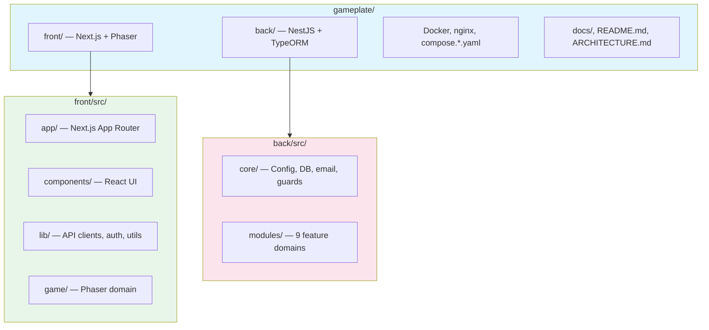

# AGENTS Governance

This document defines how AI agents collaborate on this repository. It establishes boundaries, responsibilities, and workflows for human-AI cooperation.

## Purpose

AI agents accelerate development by handling scaffolding, configuration, and repetitive tasks. They do not replace human judgment for architecture decisions, security reviews, or product direction.

## First Steps for Agents

Before making any changes, read these documents in order:

1. **[CONTRIBUTING.md](./docs/en/CONTRIBUTING.md)** — Development workflow, branch strategy, commit conventions, and code standards. This is the primary guide for how work is done in this repository.
2. **[ARCHITECTURE.md](./docs/en/ARCHITECTURE.md)** — System architecture, domain model, and API contracts. Understand the structure before modifying code.
3. **Nearest `AGENTS.md`** — If working in `/front/` or `/back/`, read the respective `AGENTS.md` for package-specific conventions.

Always follow the conventions in CONTRIBUTING.md unless the nearest AGENTS.md explicitly overrides them.

## Repository Scope

This is an **active game development project** being built by a squad. We are developing a 2D browser-based game using Next.js, NestJS, and Phaser.

### Project Status

The game is currently in active development. Core infrastructure is in place, and the squad is implementing game features and mechanics.

### Development Focus

- **Frontend**: Game scenes, UI components, and player interactions
- **Backend**: Game state management, APIs, and database operations
- **Infrastructure**: Deployment, monitoring, and tooling
- **Documentation**: Keeping docs updated as the project evolves

## Commands

These are the exact commands agents must use. Do not guess alternatives.

| Task | Command |
|------|---------|
| Start dev environment (Docker) | `make up` |
| Start dev environment (Turbo) | `make local-all` |
| Run linting | `make lint` |
| Fix linting | `npm run lint:fix` |
| Run tests | `make test` |
| Run typecheck | `npm run typecheck` |
| Run migrations | `make db-migrate` |
| Stop containers | `make down` |
| Full cleanup | `make deep-clean` |

## Project Structure



## Safe Zones vs Ask-First Zones

### Safe Zones — Edit Autonomously

- `/front/src/components/` — React UI components
- `/front/src/lib/` — Utility functions, API clients, auth logic
- `/front/src/game/` — Phaser game objects, scenes, mechanics
- `/back/src/modules/*/services/` — Business logic services
- `/back/src/modules/*/controllers/` — HTTP controllers
- `/back/src/modules/*/dto/` — Data transfer objects
- `/docs/` — Documentation updates

### Ask-First Zones — Stop and Escalate

- `/back/src/core/database/migrations/` — Database migrations affect production data
- `/back/src/modules/*/entities/` — Entity changes require migration planning
- `/.github/workflows/` — CI/CD changes affect all deployments
- `/nginx/` — Reverse proxy config changes
- `/compose.*.yaml` — Docker orchestration changes
- `/.env.example` — Environment variable changes
- `/package.json`, `/front/package.json`, `/back/package.json` — Dependency changes

## Agent Responsibilities

### What Agents Can Do

| Category | Examples |
|----------|----------|
| **Scaffolding** | Generate boilerplate components, modules, tests |
| **Configuration** | Update Docker, CI/CD, linting configs |
| **Refactoring** | Rename variables, extract functions, simplify code |
| **Documentation** | Update README, add JSDoc, write guides |
| **Automation** | Scripts, Makefile targets, GitHub Actions |
| **Formatting** | Apply Biome fixes, organize imports |

### What Agents Cannot Do

| Category | Examples |
|----------|----------|
| **Architecture** | Change project structure, add new services |
| **Security** | Modify auth flows, JWT handling, secrets management |
| **Business Logic** | Implement game mechanics, user workflows |
| **Dependencies** | Add new major dependencies without approval |
| **Destructive Ops** | Database migrations, production data changes |

## Workflow Guidelines

### Branch Strategy

1. Create short-lived branches from `master`:

   ```bash
   git checkout -b docs/readme-improvements
   git checkout -b chore/update-dependencies
   git checkout -b fix/lint-errors
   ```

2. Keep changes atomic and focused

3. Open PR with clear description of what and why

### Commit Standards

All commits must follow [Conventional Commits](https://www.conventionalcommits.org/):

```
<type>(<scope>): <description>

[optional body]

[optional footer]
```

Types: `feat`, `fix`, `docs`, `style`, `refactor`, `test`, `chore`

Scopes: `front`, `back`, `infra`, `docs`, `ci`

Examples:

```
feat(front): add phaser game scene
fix(back): correct database connection string
docs(readme): update quickstart instructions
chore(ci): add test coverage reporting
```

### Communication

When working with agents:

1. **Be specific** - "Update README" → "Add troubleshooting section for Docker port conflicts"
2. **Provide context** - Reference related issues, PRs, or documentation
3. **Iterate** - Review agent output and provide feedback
4. **Verify** - Test changes before merging

## Security & Compliance

### Secrets Management

- **Never** commit secrets, tokens, or credentials
- Use environment variables (`.env` files, not committed)
- Store production secrets in GitHub/Coolify secret managers
- Rotate credentials if accidentally exposed

### Code Quality

- All code must pass `make lint`
- All code must pass `make test`
- PRs require green CI before merge
- No force pushes to `master`

## Escalation Paths

When agents encounter:

| Situation | Action |
|-----------|--------|
| Unclear requirements | Ask human for clarification |
| Security implications | Stop and escalate to human |
| Breaking changes | Flag in PR description |
| Test failures | Attempt fix once, then escalate |
| Conflicting instructions | Ask human to resolve |

## Quality Checks

When working with AI-generated code, always verify:

### Before Committing

- [ ] Code follows existing patterns and conventions
- [ ] No hardcoded values or magic numbers
- [ ] Proper error handling is in place
- [ ] TypeScript types are correct (no `any`)
- [ ] No secrets or credentials in code
- [ ] Biome linting passes (`make lint`)
- [ ] Tests pass (`make test`)

### Code Review Checklist

- [ ] Logic is correct and handles edge cases
- [ ] No unnecessary complexity or over-engineering
- [ ] Performance implications considered
- [ ] Security best practices followed
- [ ] Documentation updated if needed

## AI Code Review

When reviewing AI-assisted code:

### What to Look For

1. **Correctness**: Does the code actually solve the problem?
2. **Completeness**: Are all edge cases handled?
3. **Idiomatic**: Does it follow language/framework conventions?
4. **Efficiency**: Are there unnecessary computations or API calls?
5. **Security**: Any injection risks, XSS vulnerabilities, or data leaks?

### Review Process

1. **Read the PR description** - Understand what changed and why
2. **Check the diff** - Look for suspicious patterns or obvious issues
3. **Test locally** - Run the code to verify it works
4. **Ask questions** - If something is unclear, ask the author
5. **Approve or request changes** - Be specific about what needs fixing

### Red Flags

- Large PRs with many unrelated changes
- Code that "looks right" but hasn't been tested
- Missing error handling
- Copy-paste without adaptation
- Generated comments that don't match the code

## Hierarchical Agent Guidelines

This repository uses nested `AGENTS.md` files for monorepo-specific rules:

- `front/AGENTS.md` — Frontend-specific conventions (Next.js, Phaser, MUI)
- `back/AGENTS.md` — Backend-specific conventions (NestJS, TypeORM)

The nearest `AGENTS.md` in the directory tree takes precedence for context-specific decisions.

## References

- [Conventional Commits](https://www.conventionalcommits.org/)
- [README.md](./README.md) - Project overview
- [CONTRIBUTING.md](./docs/en/CONTRIBUTING.md) - Development workflow and standards
- [ARCHITECTURE.md](./docs/en/ARCHITECTURE.md) - System architecture and API contracts
- [GitHub Issues](https://github.com/Labs-de-Games/gameplate/issues) - Issue tracker and project board
