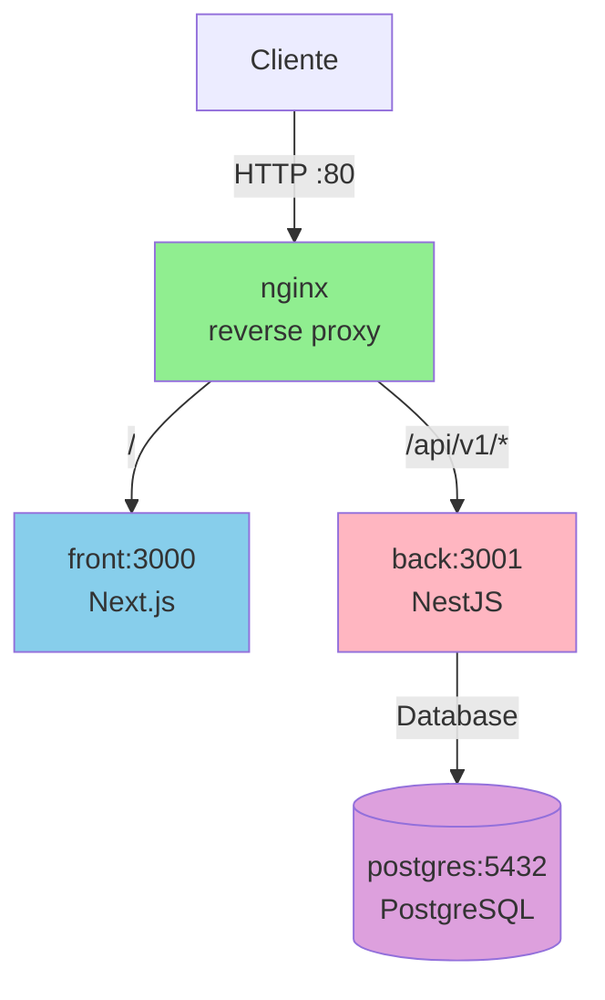

# Gameplate

A starter template for building 2D web games with Next.js, NestJS, and Phaser.

## Overview

This repository provides a complete development environment for 2D browser-based games, featuring:

- **Frontend**: Next.js with React and Phaser 3 for game rendering
- **Backend**: NestJS API with PostgreSQL database
- **Tooling**: Bun runtime, Biome for linting/formatting, Docker for local development
- **CI/CD**: GitHub Actions for automated testing and deployment

- `front`: aplicação Next.js
- `back`: API NestJS
- `nginx`: reverse proxy configuration
- `compose.base.yaml`: shared service definitions
- `compose.development.yaml`: stack local
- `compose.production.yaml`: stack de produção
- `.github/workflows/ci.yml`: pipeline de PR
- `.github/workflows/cd.yml`: deploy em `main`

## Arquitetura



## Roteamento

| Caminho | Destino | Descrição |
|---------|---------|-----------|
| `/` | front:3000 | Aplicação Next.js |
| `/api/v1/*` | back:3001 | API NestJS (prefixo global) |
| `/api/v1/health` | back:3001 | Health check do backend |
| `/_next/webpack-hmr` | front:3000 | WebSocket HMR (dev only) |
| `/health` | nginx | Health check do nginx (prod only) |

## Quickstart

## Project Structure

```
.
├── front/                      # Next.js application
│   ├── app/                    # App router
│   └── package.json            # Frontend dependencies
├── back/                       # NestJS API
│   ├── src/                    # Source code
│   └── package.json            # Backend dependencies
├── .github/workflows/           # CI/CD pipelines
│   ├── ci.yml                  # PR validation
│   └── cd.yml                  # Deployment
├── compose.development.yaml    # Local development stack
├── compose.production.yaml     # Production stack
├── Makefile                    # Common commands
├── AGENTS.md                   # AI agent collaboration guidelines
├── CONTRIBUTING.md             # Development workflow guide
└── docs/
    └── SPEC.md                 # Technical specification
```

## Quick Start

### Prerequisites

- [Bun](https://bun.sh/) (latest version)
- [Docker](https://docs.docker.com/get-docker/) and Docker Compose

### Setup

```bash
# Install dependencies
bun install

# Start development environment
make dev
```

The application will be available at:

- Frontend: <http://localhost:3000>
- Backend API: <http://localhost:3001>
- Database: localhost:5432

## Available Commands

| Command | Description |
|---------|-------------|
| `make dev` | Start local development environment with hot reload |
| `make lint` | Run Biome linting and formatting checks |
| `make test` | Run test suites |
| `make build-prod` | Build production images for validation |
| `make down` | Stop development containers |
| `make clean` | Stop containers and remove volumes |
| `make fclean` | Full cleanup including images |

## Development Workflow

1. **Create a branch** from `master`:

   ```bash
   git checkout -b feat/42-game-scene
   ```

2. **Make changes** following the code standards

3. **Commit** using [Conventional Commits](https://www.conventionalcommits.org/):

   ```bash
   git commit -m "feat(front): add player movement system"
   ```

4. **Push and open PR** to `master`

5. **Merge** after CI passes and review approval

See [CONTRIBUTING.md](./CONTRIBUTING.md) for detailed guidelines.

## CI/CD

### Continuous Integration

Every Pull Request triggers:

- Lint checks (`make lint`)
- Build validation (`bun run build`)
- Test execution (`make test`)

### Continuous Deployment

Merges to `master` automatically trigger deployment via Coolify webhook.

## Environment Variables

Development environment variables are pre-configured in `compose.development.yaml`.

For production, configure these in your deployment platform:

| Variable | Description | Required |
|----------|-------------|----------|
| `DATABASE_URL` | PostgreSQL connection string | Yes |
| `JWT_SECRET` | Secret for JWT signing | Yes |
| `POSTGRES_USER` | Database username | Yes |
| `POSTGRES_PASSWORD` | Database password | Yes |
| `POSTGRES_DB` | Database name | Yes |

## Documentation

- [CONTRIBUTING.md](./CONTRIBUTING.md) — Development workflow and standards
- [AGENTS.md](./AGENTS.md) — AI agent collaboration guidelines
- [docs/SPEC.md](./docs/SPEC.md) — Technical specification and architecture

## License

Private - All rights reserved.
