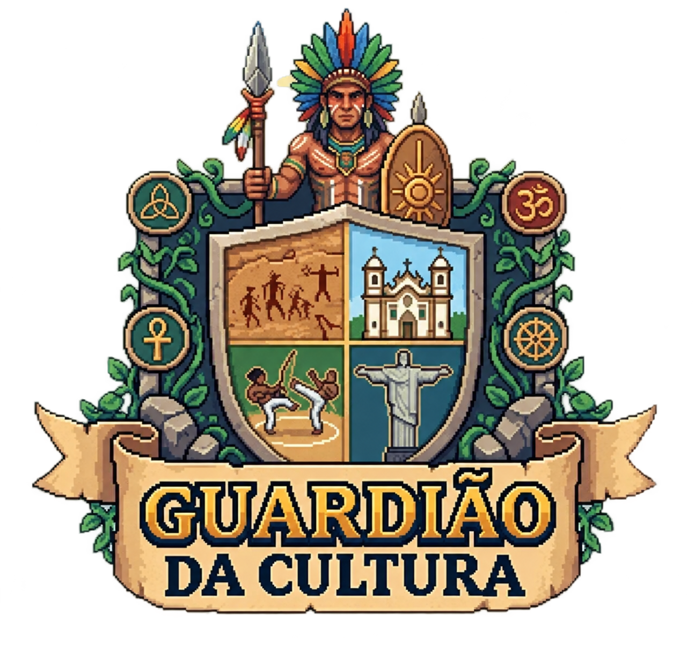
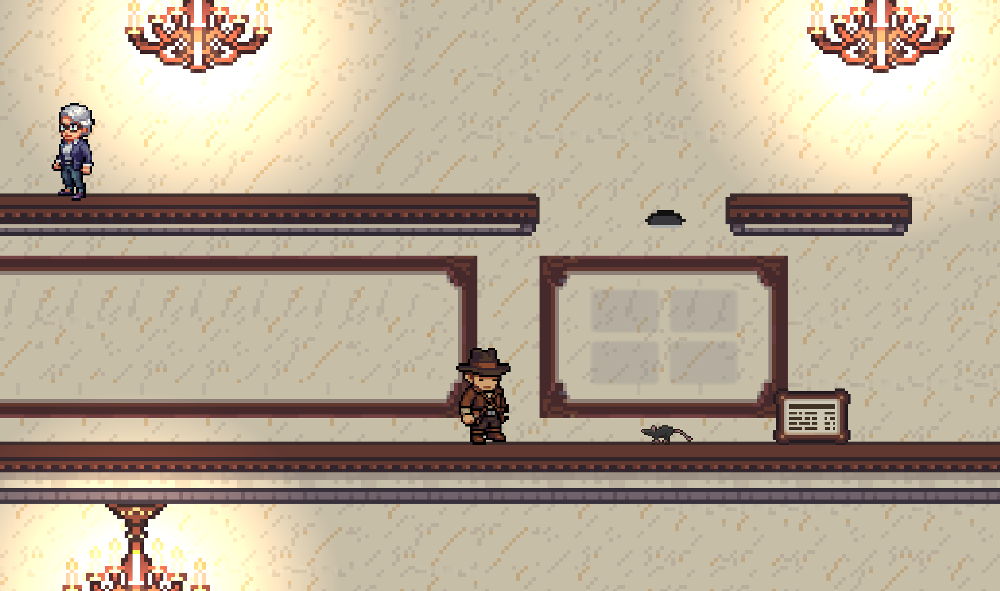
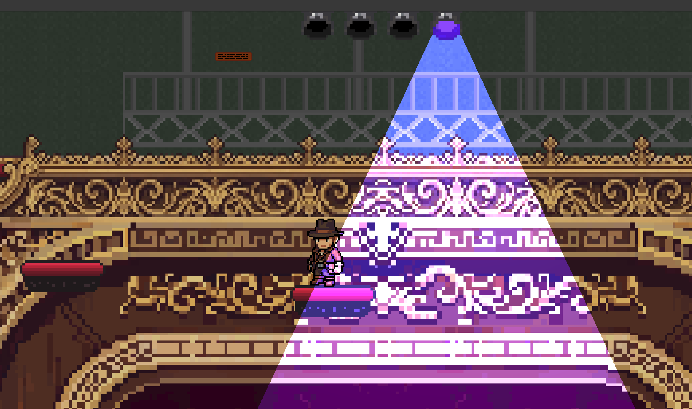
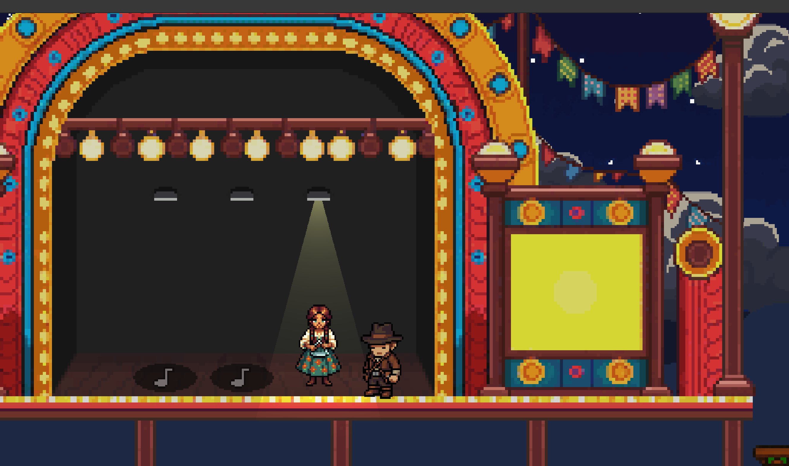
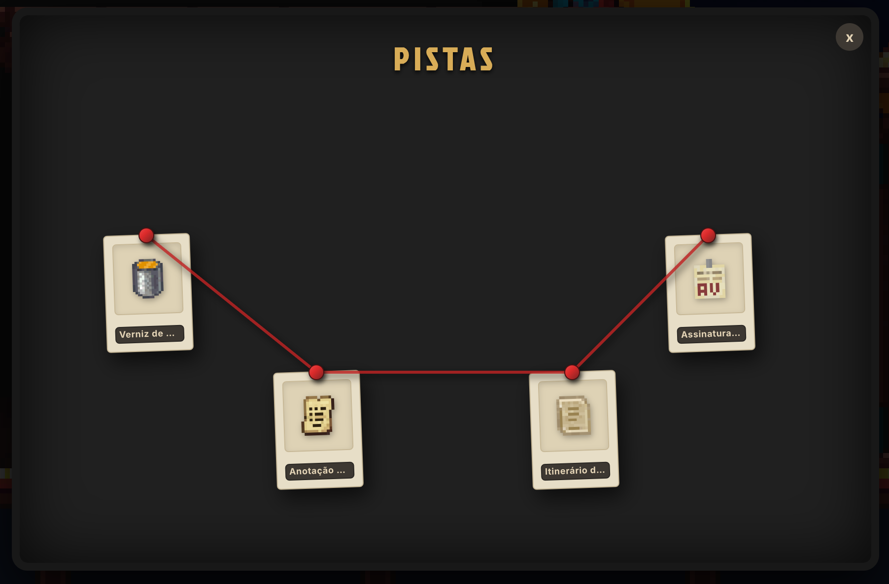

<p align="center">
  
</p>

# Guardião da Cultura


A 2D browser game about Brazilian art and culture. You play an investigator who
walks through cultural spaces — Inhotim, the Teatro Amazonas, the São João
festival in Campina Grande — restoring works that have been damaged or
misplaced, talking to the people who work there, and answering quizzes about
what you find.

It was produced with public incentive funding under the Brazilian **Lei
Rouanet**, and it is published as open source so developers and educators can
run it, study it, adapt it and reuse its content.

| Inhotim | Teatro Amazonas | São João de Campina Grande |
|:---:|:---:|:---:|
|  |  |  |

## Play it

Play it in your browser at **[Guardião da Cultura](https://guardiaodacultura.42.rio/)**. It works on a computer with a
keyboard.

## What's inside

**Three places, three missions, one culprit.**

- **Inhotim — the restoration room.** Someone has moved the sculptures and
  paintings and torn up a photograph. Put each work back where it belongs, find
  the pieces of the photo and put it back together.
- **Teatro Amazonas — the poster gallery.** Dress the costumes, hang the
  posters, rearrange the statues on stage and light the right spotlight.
- **São João de Campina Grande — the festival.** Rebuild the steps of the
  quadrilha dance, fix the stage lights, bring the forró band together and tune
  the accordion.

Each place ends with a quiz about the art and culture you found along the way.

- **The investigation.** Once the festival is saved, it is time to name who was
  behind it all. The fewer wrong accusations you make, the more stars you earn.


**Inspetora Cremilda Jarbas** is your chief. She sends you on each case, keeps
you on track with a dry sense of humour, and talks the way people talk in each
place she visits. In Minas Gerais: *"Tá um trem doido aqui, tiraram os quadros
do lugar, rasgaram as fotografias… Nó! Um crime!"*

<br clear="left">

**An evidence board.** Every clue you pick up is pinned to the board, and the
threads between them tell you what happened.

<p align="center">
  
</p>

**Made for everyone.** Dialogue can be read aloud, the text follows
plain-language guidelines and gender-neutral wording, and if you get stuck for a
while the game points you in the right direction.

**Stars and badges** mark your progress through each place.

## Who made it and why

Guardião da Cultura was produced by Labs de Games at 42 Rio, with funding from
the Brazilian **Lei Rouanet** and the support of the Governo Federal, the
Ministério da Cultura, Galp and Bemobi. The artworks come from artists and
cultural spaces who agreed to have them shown in the game. Everyone involved is
listed in [`CREDITS.md`](./CREDITS.md), which mirrors the credits screen in the
game.

**Maintainer:** [@anacarla-42](https://github.com/anacarla-42) reviews and merges
contributions, and is the responder for security reports.

> ### Using the game's assets? You must keep the credits.
>
> If you reuse any of the game's artworks, images or sounds, you must credit the
> artists and the team who made them.
>
> The source code is MIT. The **assets are not**. The artworks reproduced in this
> game — works by Abdias Nascimento, Claudia Andujar, Edgard de Souza and others
> — were cleared for publication on the binding condition that **credit is
> always given**, and the original assets produced by the team are CC BY 4.0,
> which carries the same obligation.
>
> If your fork, build or extraction includes anything from
> `front/public/assets/`, carry the credits from [`CREDITS.md`](./CREDITS.md)
> somewhere your users can reach. Shipping `LICENSE` alone does not satisfy it.
> The full terms are in [`ASSETS-LICENSE.md`](./ASSETS-LICENSE.md), and the
> sponsor logos are not licensed at all — see [`NOTICE`](./NOTICE).

## For educators

The quizzes, dialogue and works on display are kept apart from the game itself,
so you can rewrite a quiz or retell a museum's story for your own students
without programming. [`docs/en/CONTENT-REUSE.md`](./docs/en/CONTENT-REUSE.md) walks
through each part and how to change it — including the one part that is not
optional: an adapted version must keep the credits.

Schools and cultural institutions also get a dashboard that shows how their
players are progressing through the game.

## Known limitations

- **Portuguese only.** All the stories, quizzes and menus are in Brazilian
  Portuguese.
- **Computer and keyboard only.** There are no touch controls for phones or
  tablets yet.
- **The narration voice depends on your browser.** How the read-aloud voice
  sounds, and whether one is available, varies between browsers and computers.

## For developers

You need Node.js 24+, Docker and Git. Nothing needs an API key, an email account
or a paid service.

```bash
git clone https://github.com/Labs-de-Games/gameplate.git
cd gameplate
cp .env.example .env
make setup
make development-up
make db-migrate
```

Then open <http://localhost:3000>.

- [`docs/en/CONTRIBUTING.md`](./docs/en/CONTRIBUTING.md) — setup, commands, logging in, troubleshooting and the contribution flow
- [`docs/en/ARCHITECTURE.md`](./docs/en/ARCHITECTURE.md) — tech stack, system design, optional integrations and API contracts
- [`docs/en/CONTENT-REUSE.md`](./docs/en/CONTENT-REUSE.md) — adapting the levels, quizzes and narrative
- [`SECURITY.md`](./SECURITY.md) — reporting a vulnerability
- [`AGENTS.md`](./AGENTS.md) — how AI agents are used in development
- [`CREDITS.md`](./CREDITS.md), [`ASSETS-LICENSE.md`](./ASSETS-LICENSE.md), [`NOTICE`](./NOTICE) — credits, asset terms and trademarks

## Contributing

Contributions are welcome. Branch from `develop`, open your pull request against
`develop`, and follow [`docs/en/CONTRIBUTING.md`](./docs/en/CONTRIBUTING.md).

## Security

Report vulnerabilities privately through GitHub, not in a public issue. See
[`SECURITY.md`](./SECURITY.md).

## License

**Source code: [MIT](./LICENSE).**

**Assets: not MIT.** Everything under `front/public/assets/` is governed by
[`ASSETS-LICENSE.md`](./ASSETS-LICENSE.md). Most of it requires attribution; a
few files are not free for commercial use. The institutional names and logos
(Governo Federal, Lei Rouanet, Ministério da Cultura, Galp, Bemobi, 42 Rio) are
trademarks and are not licensed — a fork must remove them. See
[`NOTICE`](./NOTICE).
