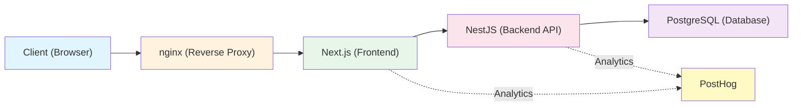

# Gameplate

> **Note:** "Gameplate" is a placeholder name (gameplay + template) until the game is officially named.

A 2D web game built with Next.js, NestJS, and Phaser.

## Table of Contents

- [Overview](#overview)
- [Tech Stack](#tech-stack)
- [Quick Start](#quick-start)
  - [Prerequisites](#prerequisites)
  - [Docker Setup](#docker-setup)
  - [Database Setup](#database-setup)
- [Available Commands](#available-commands)
- [Architecture](#architecture)
- [Development Workflow](#development-workflow)
- [CI/CD](#cicd)
- [Environment Variables](#environment-variables)
- [Contributing](#contributing)
- [Working with AI Agents](#working-with-ai-agents)
- [Documentation](#documentation)
- [License](#license)

## Overview

This repository contains the complete development environment for our browser-based game, featuring:

- **Frontend**: Next.js with React and Phaser 3 for game rendering
- **Backend**: NestJS API with PostgreSQL database
- **Tooling**: Node.js runtime, Biome for linting/formatting, Docker for local development
- **CI/CD**: GitHub Actions for automated testing and deployment

## Tech Stack

| Layer | Technology | Version | Documentation |
|-------|------------|---------|---------------|
| Runtime | [Node.js](https://nodejs.org/) | 24+ | [Node.js Docs](https://nodejs.org/docs/) |
| Frontend | [Next.js](https://nextjs.org/) | 14+ | [Next.js Docs](https://nextjs.org/docs) |
| Frontend | [React](https://react.dev/) | 18+ | [React Docs](https://react.dev/) |
| Game Engine | [Phaser 3](https://phaser.io/) | 3.70+ | [Phaser Docs](https://phaser.io/docs/) |
| Backend | [NestJS](https://nestjs.com/) | 10+ | [NestJS Docs](https://docs.nestjs.com/) |
| Database | [PostgreSQL](https://www.postgresql.org/) | 16 | [PostgreSQL Docs](https://www.postgresql.org/docs/) |
| Linting | [Biome](https://biomejs.dev/) | latest | [Biome Docs](https://biomejs.dev/) |
| Registry | [GHCR](https://docs.github.com/en/packages/working-with-a-github-packages-registry/working-with-the-container-registry) | - | - |
| CI/CD | [GitHub Actions](https://github.com/features/actions) | - | [Actions Docs](https://docs.github.com/en/actions) |
| Deployment | [Coolify](https://coolify.io/) | - | [Coolify Docs](https://coolify.io/docs/) |

## Quick Start

### Prerequisites

- [Node.js](https://nodejs.org/) (v24+)
- [Docker](https://docs.docker.com/get-docker/) and Docker Compose
- Git

### Docker Setup

The fastest way to get the full stack running locally is via Docker Compose:

```bash
# Clone the repository
git clone <repository-url>
cd gameplate

# Install dependencies
npm ci

# Set up environment variables
cp .env.example .env
# Edit .env with your local configuration (optional for first run)

# Set up developer tooling
npm run prepare  # Installs pre-commit hooks

# Start the full development stack
make up
```

This starts all services in detached mode:

- **Frontend** (Next.js): <http://localhost:3000>
- **Backend** (NestJS): <http://localhost:3001>
- **PostgreSQL**: localhost:5432
- **nginx** (reverse proxy): <http://localhost:80>

View logs:

```bash
make development-logs
```

Stop the stack:

```bash
make down
```

### Database Setup

```bash
# Run pending TypeORM migrations
make db-migrate

# Generate a new migration (run inside Docker back container)
make db-migrate-generate NAME=MigrationName
```

## Available Commands

### Development

| Command | Description |
|---------|-------------|
| `make up` | Start local development environment with hot reload (Docker) |
| `make local-all` | Start front and back locally via Turbo (no Docker) |
| `make down` | Stop development containers |
| `make clean` | Stop containers and remove volumes |
| `make deep-clean` | Full cleanup including images |

### Code Quality

| Command | Description |
|---------|-------------|
| `make lint` | Run Biome linting and formatting checks |
| `make test` | Run test suites |
| `npm run lint:fix` | Fix auto-fixable linting issues |

### Build

| Command | Description |
|---------|-------------|
| `make development-build` | Build all development Docker images |
| `make production-build` | Build production nginx image |

### Database

| Command | Description |
|---------|-------------|
| `make db-migrate` | Run pending TypeORM migrations |
| `make db-migrate-generate` | Generate a new migration (`NAME=MigrationName`) |

### Debug

| Command | Description |
|---------|-------------|
| `make logs` | View container logs |
| `make development-logs` | View development container logs |
| `make development-shell-front` | Shell into front container |
| `make development-shell-back` | Shell into back container |

## Architecture

### System Overview



### Frontend Architecture

- **Next.js App Router**: File-based routing with React Server Components
- **Phaser Integration**: Game scenes rendered via Phaser 3 canvas, encapsulated in `src/game/`
- **UI Overlay Layer**: HUD and modal panels rendered in React over the canvas, synchronized via shared EventBus
- **State Management**: React hooks plus Zustand for game UI state (sidebar and modal panels)
- **Styling**: Material UI (MUI) v9 with Emotion for CSS-in-JS
- **Analytics**: PostHog for product analytics and session replay

### Backend Architecture

- **NestJS Modules**: Feature-based module organization (9 domains)
- **API Design**: RESTful endpoints with DTO validation using `class-validator`
- **Database**: TypeORM with PostgreSQL; migrations managed via TypeORM CLI
- **Authentication**: Passwordless magic-link authentication with JWT access tokens and opaque refresh tokens
- **Observability**: PostHog for backend event tracking and error monitoring

## Development Workflow

1. **Create a branch** from `master`:

   ```bash
   git checkout -b feat/42-game-scene
   ```

2. **Make changes** following the code standards

3. **Commit** using [Conventional Commits](https://www.conventionalcommits.org/):

   ```bash
   git commit -m "feat(front): add player movement system"
   ```

4. **Push and open PR** to `master`

5. **Merge** after CI passes and review approval

See [CONTRIBUTING.md](./docs/CONTRIBUTING.md) for detailed guidelines.

## CI/CD

This project uses GitHub Actions for continuous integration and Coolify for deployment.

- **CI**: Every Pull Request triggers typecheck, lint, build, and test checks via `.github/workflows/ci.yml`
- **CD Staging**: Pushes to the `develop` branch automatically build and push images to GitHub Container Registry (GHCR), then trigger staging deployment via Coolify webhook (`.github/workflows/cd-staging.yml`)
- **CD Production**: Production deployment is **manual** via `workflow_dispatch` on `.github/workflows/cd-production.yml`. Images are built from `master` and deployed to production Coolify.

See [CONTRIBUTING.md](./docs/CONTRIBUTING.md) for detailed CI/CD pipeline information.

## Environment Variables

### Development

Development environment variables are pre-configured in `compose.development.yaml`. Copy `.env.example` to `.env` for any local overrides.

### Production

Configure these in your deployment platform:

| Variable | Description | Required |
|----------|-------------|----------|
| `DATABASE_URL` | PostgreSQL connection string | Yes |
| `JWT_SECRET` | Secret for JWT signing | Yes |
| `POSTGRES_USER` | Database username | Yes |
| `POSTGRES_PASSWORD` | Database password | Yes |
| `POSTGRES_DB` | Database name | Yes |

## Contributing

We welcome contributions from all squad members! Please read our [Contributing Guide](./docs/CONTRIBUTING.md) for:

- Detailed setup instructions
- Branch naming conventions
- Commit message standards
- Code review process
- Troubleshooting common issues

## Working with AI Agents

This project uses AI agents to accelerate development. See [AGENTS.md](./AGENTS.md) for:

- What agents can and cannot do
- Guidelines for AI-assisted development
- Quality checks for AI-generated code
- Escalation paths

## Documentation

- [CONTRIBUTING.md](./docs/CONTRIBUTING.md) — Development workflow and standards
- [AGENTS.md](./AGENTS.md) — AI agent collaboration guidelines
- [ARCHITECTURE.md](./docs/ARCHITECTURE.md) — System architecture, domain model, and API contracts

## License

Private - All rights reserved.
