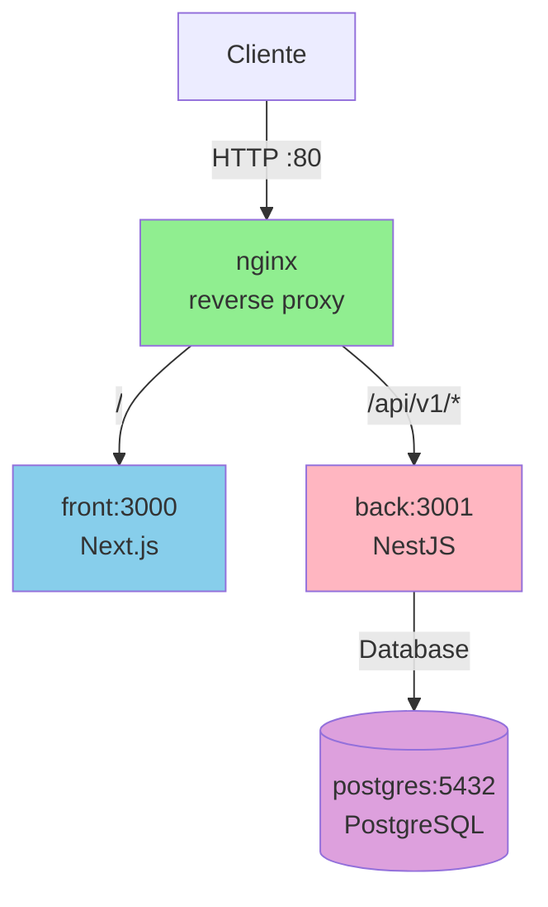

# Template Clone MVP

Bootstrap monorepo para MVP com `front` (Next.js) e `back` (NestJS), usando Bun.

## Requisitos

- Bun
- Docker e Docker Compose

## Estrutura

- `front`: aplicação Next.js
- `back`: API NestJS
- `nginx`: reverse proxy configuration
- `compose.base.yaml`: shared service definitions
- `compose.development.yaml`: stack local
- `compose.production.yaml`: stack de produção
- `.github/workflows/ci.yml`: pipeline de PR
- `.github/workflows/cd.yml`: deploy em `main`

## Arquitetura

## Roteamento

| Caminho | Destino | Descrição |
|---------|---------|-----------|
| `/` | front:3000 | Aplicação Next.js |
| `/api/v1/*` | back:3001 | API NestJS (prefixo global) |
| `/api/v1/health` | back:3001 | Health check do backend |
| `/_next/webpack-hmr` | front:3000 | WebSocket HMR (dev only) |
| `/health` | nginx | Health check do nginx (prod only) |

## Quickstart

1. Copie o arquivo de ambiente:
   - `cp .env.example .env`
2. Instale dependências:
   - `bun install`
3. Rode local:
   - `make dev`

## Comandos úteis

- `make lint`
- `make test`
- `make build-prod`

## Fluxo de contribuição

- Crie branch curta a partir de `main`
- Use commits convencionais (`feat(scope): ...`)
- Abra PR para `main`
- CI valida lint/build/test
- Merge em `main` dispara CD
