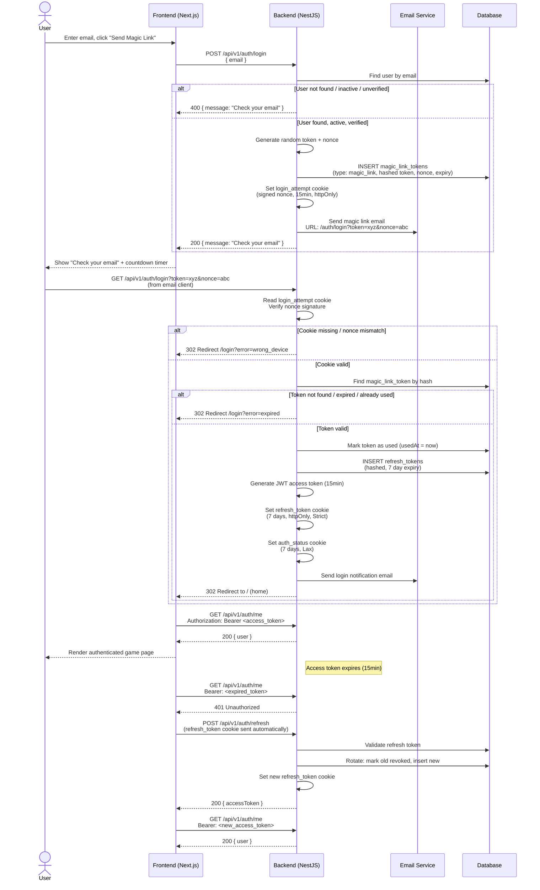
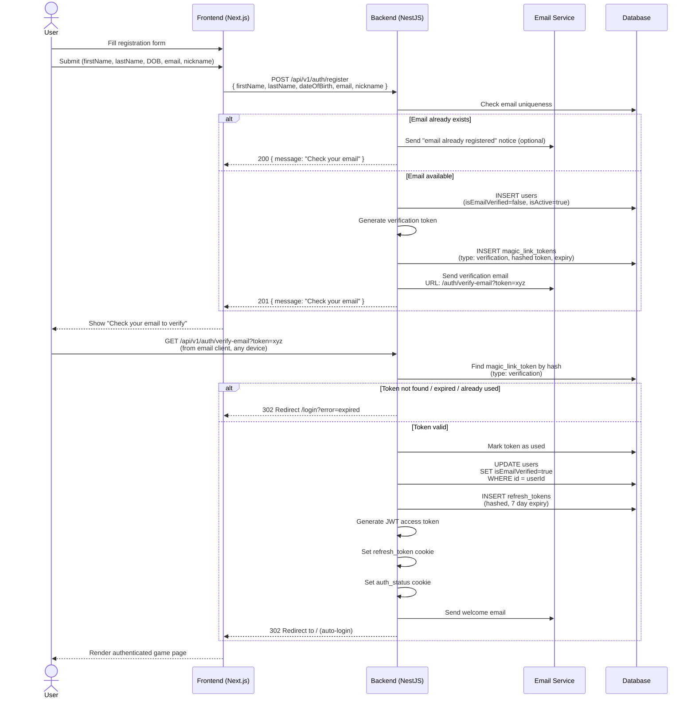
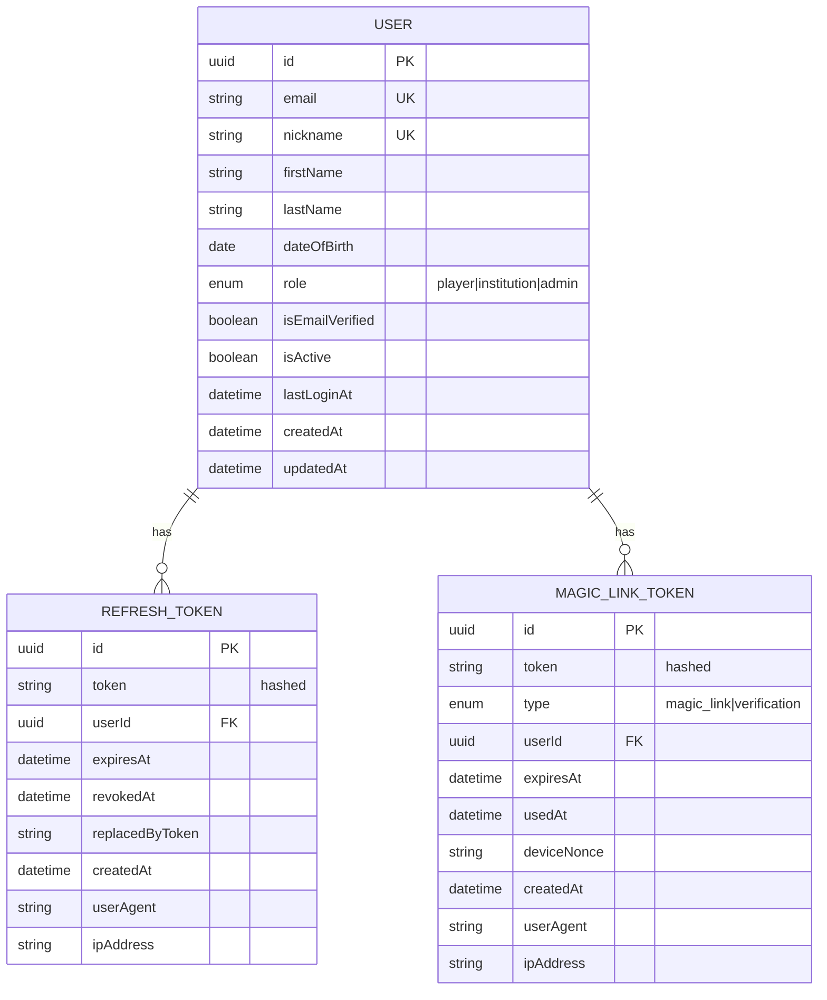
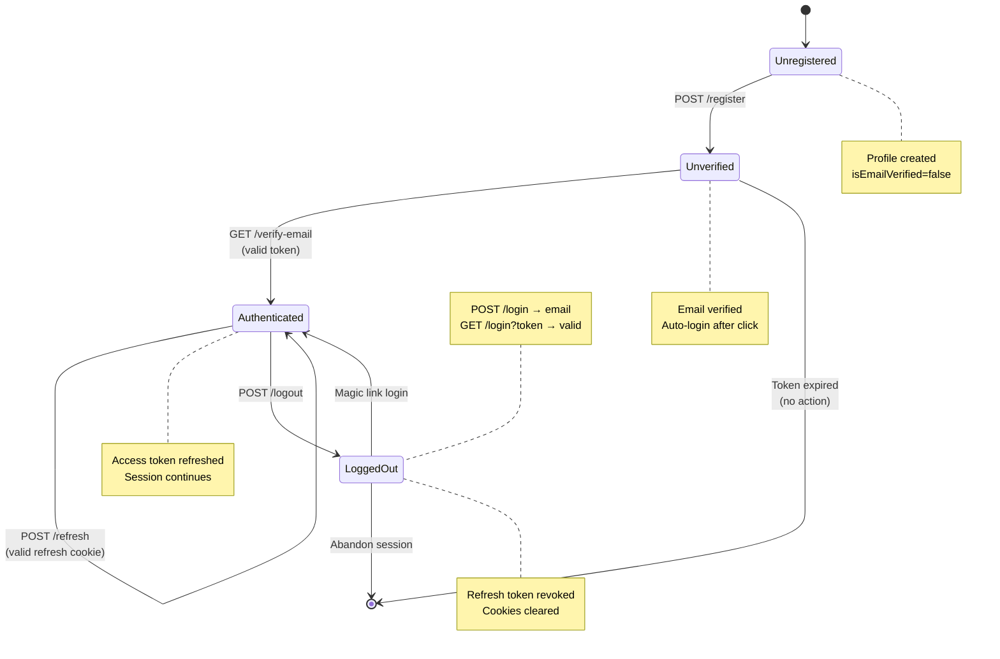
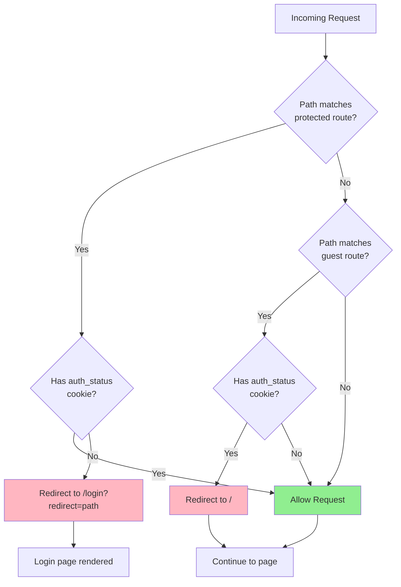

# Authentication & Authorization Implementation Plan

## Architecture Overview

**Token Strategy:** Access token (JWT, 15min) stored in JS memory + Refresh token (7d) stored in httpOnly/Secure/SameSite=Strict cookie with rotation on each use. A lightweight `auth_status` cookie (non-httpOnly, SameSite=Lax) enables Next.js middleware route protection.

**Auth Flow (Magic Link):**
1. User enters email on login page → frontend calls `POST /auth/login`
2. Backend generates a single-use magic link token (15min expiry), stores it hashed in `magic_link_tokens`, and sends it via email
3. Backend sets a short-lived `login_attempt` cookie (15min, httpOnly, Secure, SameSite=Strict) containing a signed nonce
4. The magic link URL includes the token and the nonce: `GET /auth/login?token=xyz&nonce=abc`
5. User clicks the link from email → backend validates the token, verifies the nonce matches the `login_attempt` cookie, sets `refresh_token` & `auth_status` cookies, issues a new access token, and redirects to `/`
6. On token failure (expired, wrong device, already used, unverified) → redirect to `/login?error=<reason>`
7. Axios interceptor attaches Bearer token to all API requests
8. On 401 → interceptor calls `POST /auth/refresh` (cookie sent automatically) → new access token
9. On refresh failure → clear state, remove `auth_status` cookie, redirect to `/login`
10. Next.js middleware reads `auth_status` cookie for route protection (no sensitive data in this cookie)

**Registration Flow:**
1. User fills registration form (firstName, lastName, dateOfBirth, email, nickname) → `POST /auth/register`
2. Backend creates user with `isEmailVerified = false`, generates verification token, stores in `magic_link_tokens`
3. Backend sends verification email with link: `GET /auth/verify-email?token=xyz`
4. User clicks verification link (works from any device) → backend marks email verified, activates account, sets auth cookies, sends welcome email, redirects to `/`
5. If email already exists → return generic error to prevent enumeration

---

## Diagrams

### 1. Magic Link Login Flow (Sequence)



### 2. Registration Flow (Sequence)



### 3. Database Schema (ER Diagram)



### 4. User Authentication State Machine



### 5. Next.js Middleware Route Protection (Flowchart)



---

**Page Load / Session Restore:**
1. AuthProvider mounts → checks for `auth_status` cookie
2. If present → calls `GET /auth/me` with any stored access token
3. If `/me` returns 401 → tries `POST /auth/refresh` (cookie sent automatically)
4. If refresh succeeds → store new access token, set user state
5. If refresh fails → clear all state, remove `auth_status` cookie

**Game Auth:** Phaser game communicates with backend through the React shell. The React shell's Axios interceptor handles auth headers. Phaser dispatches events → React shell makes API calls → returns data to Phaser.

---

## Phase 1: Backend — Dependencies & Config

### Install dependencies
```bash
cd back && bun add @nestjs/passport @nestjs/jwt @nestjs/throttler passport passport-jwt cookie-parser && bun add -D @types/passport-jwt
```

> Note: `bcryptjs` and `@types/bcryptjs` are **removed** — passwordless auth does not need password hashing.

### Files to create/modify

| File | Purpose |
|------|---------|
| `back/src/core/config/config.service.ts` | Add to Zod schema: `JWT_SECRET`, `JWT_EXPIRATION` (default "15m"), `JWT_ISSUER` (default "gameplate"), `REFRESH_SECRET`, `REFRESH_EXPIRATION` (default "7d"), `MAGIC_LINK_EXPIRATION_MIN` (default 15), `MAGIC_LINK_SECRET` (for signing cookie nonce) |
| `back/.env.example` | Add all new env vars with defaults |
| `back/src/core/email/email.module.ts` | Email module with mock provider |
| `back/src/core/email/interfaces/email-service.interface.ts` | `IEmailService` interface: `sendMagicLinkEmail()`, `sendVerificationEmail()`, `sendWelcomeEmail()`, `sendLoginNotificationEmail()` |
| `back/src/core/email/services/mock-email.service.ts` | Console.log implementation of IEmailService |
| `back/src/core/email/email.constants.ts` | DI token `EMAIL_SERVICE` |

### Environment variables to add
```
JWT_SECRET=change-me-in-production
JWT_EXPIRATION=15m
JWT_ISSUER=gameplate
REFRESH_SECRET=change-me-in-production
REFRESH_EXPIRATION=7d
MAGIC_LINK_SECRET=change-me-in-production
MAGIC_LINK_EXPIRATION_MIN=15
```

---

## Phase 2: Backend — Database Schema & Migrations

### TypeORM CLI Setup

| File | Purpose |
|------|---------|
| `back/src/database/data-source.ts` | TypeORM DataSource config for CLI (used by migration commands) |
| `back/package.json` | Add scripts: `migration:generate`, `migration:run`, `migration:revert` |

### Entities

| File | Purpose |
|------|---------|
| `back/src/modules/users/enums/role.enum.ts` | `Role` enum: `Player = 'player'`, `Institution = 'institution'`, `Admin = 'admin'` |
| `back/src/modules/auth/enums/token-type.enum.ts` | `TokenType` enum: `MagicLink = 'magic_link'`, `Refresh = 'refresh'`, `Verification = 'verification'` |
| `back/src/modules/users/user.entity.ts` | **MODIFY EXISTING.** Add columns: `firstName` (string), `lastName` (string), `nickname` (string, unique), `dateOfBirth` (Date), `role` (Role enum, default Player), `isEmailVerified` (boolean, default false), `isActive` (boolean, default true), `lastLoginAt` (Date, nullable). **Remove columns:** `password`, `emailVerificationToken`, `emailVerificationTokenExpires`, `passwordResetToken`, `passwordResetTokenExpires`, `failedLoginAttempts`, `lockedUntil` |
| `back/src/modules/auth/entities/refresh-token.entity.ts` | New entity: `id` (uuid), `token` (string, hashed), `user` (ManyToOne → User), `expiresAt` (Date), `revokedAt` (Date, nullable), `replacedByToken` (string, nullable), `createdAt` (Date), `userAgent` (string, nullable), `ipAddress` (string, nullable) |
| `back/src/modules/auth/entities/magic-link-token.entity.ts` | New entity: `id` (uuid), `token` (string, hashed), `type` (TokenType enum), `user` (ManyToOne → User), `expiresAt` (Date), `usedAt` (Date, nullable), `deviceNonce` (string, nullable), `createdAt` (Date), `userAgent` (string, nullable), `ipAddress` (string, nullable) |

### Migrations

| File | Purpose |
|------|---------|
| `back/src/database/migrations/<timestamp>_AddProfileFieldsToUser.ts` | Add `firstName`, `lastName`, `nickname` (unique), `dateOfBirth`, `role`, `isEmailVerified`, `isActive`, `lastLoginAt`. Remove password-related columns. Backfill existing users with `role='player'`, `isActive=true` |
| `back/src/database/migrations/<timestamp>_CreateRefreshTokensTable.ts` | Create `refresh_tokens` table with FK to `users` |
| `back/src/database/migrations/<timestamp>_CreateMagicLinkTokensTable.ts` | Create `magic_link_tokens` table with FK to `users`, index on `token` and `type` |

### Module update

| File | Purpose |
|------|---------|
| `back/src/modules/users/users.module.ts` | **MODIFY EXISTING.** Add `UserService` provider, export it along with User repository |

---

## Phase 3: Backend — Auth Module

### DTOs

| File | Purpose |
|------|---------|
| `back/src/modules/auth/dto/register.dto.ts` | `firstName` (string), `lastName` (string), `dateOfBirth` (ISO date), `email` (email format), `nickname` (string, 3-30 chars, alphanumeric + underscore) |
| `back/src/modules/auth/dto/login.dto.ts` | `email` (email format) |
| `back/src/modules/auth/dto/verify-email.dto.ts` | `token` (string) — used by `GET /auth/verify-email?token=xyz` query param |
| `back/src/modules/auth/dto/resend-verification.dto.ts` | `email` (email format) |
| `back/src/modules/auth/dto/auth-response.dto.ts` | `accessToken` (string), `user` ({ id, email, nickname, firstName, lastName, role, isEmailVerified }) |

> **Removed DTOs:** `forgot-password.dto.ts`, `reset-password.dto.ts` — not needed for passwordless auth.

### Interfaces

| File | Purpose |
|------|---------|
| `back/src/modules/auth/interfaces/jwt-payload.interface.ts` | `sub` (userId), `email`, `role` (Role), `type` ('access' \| 'refresh'), `iss`, `iat`, `exp` |
| `back/src/modules/auth/interfaces/request-with-user.interface.ts` | Express Request + `user` property |

### Services

| File | Purpose |
|------|---------|
| `back/src/modules/auth/services/auth.service.ts` | `register()` → create user with `isEmailVerified=false`, generate verification token, send verification email. `login()` → validate email exists & is active & verified, generate magic link token, set `login_attempt` cookie with nonce, send magic link email. `verifyEmail()` → validate verification token, mark `isEmailVerified=true`, set auth cookies, send welcome email, redirect to `/`. `logout()` → revoke refresh token + blacklist access token + clear cookies. `resendVerificationEmail()` → regenerate verification token + send email. `handleMagicLinkLogin()` → validate magic link token, check `login_attempt` cookie nonce matches, mark token used, set auth cookies, send login notification email, redirect to `/` |
| `back/src/modules/auth/services/token.service.ts` | `generateAccessToken()` → JWT with {sub, email, role, type:'access', iss, iat, exp}, `generateRefreshToken()` → create RefreshToken entity (hashed), `generateMagicLinkToken()` → create MagicLinkToken entity (hashed, with type and nonce), `verifyAccessToken()` → validate + check blocklist, `rotateRefreshToken()` → invalidate old + issue new, `revokeRefreshToken()` → mark revoked, `revokeAllUserTokens()` → revoke all for a user, `addToBlacklist()` → add to in-memory Map with TTL, `isTokenBlacklisted()` → check Map |
| `back/src/modules/auth/services/magic-link.service.ts` | `createMagicLink()` → generate random secure string (64 bytes URL-safe base64), hash it, store in `magic_link_tokens` with type and nonce. `validateMagicLink()` → find by hash, check not expired, check not used, check type matches. `markAsUsed()` → set `usedAt`. `revokeToken()` → mark used (prevents replay). `cleanupExpired()` → remove old expired tokens (scheduled job or on-demand) |

> **Removed services:** `password.service.ts` (no passwords), `lockout.service.ts` (no password brute-force risk).

### Strategies & Guards

| File | Purpose |
|------|---------|
| `back/src/modules/auth/strategies/jwt-access.strategy.ts` | Passport JWT strategy: extract from Authorization header, validate payload, check blocklist |
| `back/src/modules/auth/strategies/jwt-refresh.strategy.ts` | Passport JWT strategy: extract from `refresh_token` cookie, validate payload |
| `back/src/modules/auth/guards/jwt-auth.guard.ts` | Guard using jwt-access strategy |
| `back/src/modules/auth/guards/jwt-refresh.guard.ts` | Guard using jwt-refresh strategy |
| `back/src/modules/auth/guards/roles.guard.ts` | RBAC guard: check `@Roles()` metadata against `user.role` |
| `back/src/modules/auth/guards/verified-email.guard.ts` | Check `user.isEmailVerified`. **Exists but NOT applied globally — available for selective use later** |

### Decorators

| File | Purpose |
|------|---------|
| `back/src/modules/auth/decorators/current-user.decorator.ts` | `@CurrentUser()` — extract user from request |
| `back/src/modules/auth/decorators/roles.decorator.ts` | `@Roles(...roles: Role[])` — set required roles metadata |
| `back/src/modules/auth/decorators/public.decorator.ts` | `@Public()` — skip JWT guard |
| `back/src/modules/auth/decorators/verified-email.decorator.ts` | `@RequireVerifiedEmail()` — require email verification on specific routes |

### Controller

| File | Purpose |
|------|---------|
| `back/src/modules/auth/controllers/auth.controller.ts` | All auth endpoints (see API contract below) |

### Module

| File | Purpose |
|------|---------|
| `back/src/modules/auth/auth.module.ts` | Wire up all providers, controllers, imports (PassportModule, JwtModule, UsersModule, EmailModule, ThrottlerModule) |

### API Endpoints (all prefixed `/api/v1/auth`)

| Method | Path | Auth | Rate Limit | Purpose |
|--------|------|------|------------|---------|
| POST | /register | Public | 3/min | Register new user, send verification email |
| POST | /login | Public | 5/min | Request magic link login email, set `login_attempt` cookie |
| GET | /login | Public | — | Validate magic link token & nonce, set cookies, redirect to `/` |
| POST | /logout | JWT | — | Clear cookies, revoke tokens |
| POST | /refresh | Cookie | 20/min | Rotate refresh token |
| GET | /me | JWT | — | Get current user |
| GET | /verify-email | Public | — | Validate verification token, activate account, set cookies, redirect to `/` |
| POST | /resend-verification | Public | 3/min | Resend verification email |

> **Removed endpoints:** `/forgot-password`, `/reset-password` — not needed for passwordless auth.

### Cookie Configuration

| Cookie | httpOnly | Secure | SameSite | Path | Max-Age | Purpose |
|--------|----------|--------|----------|------|---------|---------|
| `refresh_token` | Yes | Yes | Strict | `/api/v1/auth` | 7 days | Refresh token (sent to /refresh, /logout) |
| `auth_status` | No | Yes | Lax | `/` | 7 days | Boolean flag for middleware route protection |
| `login_attempt` | Yes | Yes | Strict | `/api/v1/auth` | 15 min | Signed nonce for magic link device binding |

**auth_status cookie value:** `authenticated` (simple string, not JSON — no PII)

**login_attempt cookie value:** Signed JWT or HMAC containing `{ nonce: string, email: string, iat, exp }`

### JWT Access Token Payload

```json
{
  "sub": "uuid",
  "email": "user@example.com",
  "role": "player",
  "type": "access",
  "iss": "gameplate",
  "iat": 1234567890,
  "exp": 1234568790
}
```

---

## Phase 4: Backend — Admin Module

| File | Purpose |
|------|---------|
| `back/src/modules/admin/dto/list-users-query.dto.ts` | `page` (default 1), `limit` (default 20, max 100), `search` (optional), `role` (optional Role filter), `isActive` (optional boolean) |
| `back/src/modules/admin/dto/update-role.dto.ts` | `role`: Role enum |
| `back/src/modules/admin/dto/toggle-user-status.dto.ts` | `isActive`: boolean |
| `back/src/modules/admin/services/admin.service.ts` | `listUsers()`, `getUserById()`, `updateUserRole()`, `toggleUserStatus()` |
| `back/src/modules/admin/controllers/admin.controller.ts` | Admin CRUD endpoints, guarded with `@Roles(Role.Admin)` |
| `back/src/modules/admin/admin.module.ts` | Module assembly |

### Admin Endpoints (prefixed `/api/v1/admin`)

| Method | Path | Auth | Purpose |
|--------|------|------|---------|
| GET | /users | Admin | List users with pagination |
| GET | /users/:id | Admin | Get user details |
| PATCH | /users/:id/role | Admin | Change user role |
| PATCH | /users/:id/status | Admin | Activate/deactivate |

---

## Phase 5: Backend — Integration

| File | Purpose |
|------|---------|
| `back/src/core/guards/global-jwt.guard.ts` | Global JWT guard with `@Public()` bypass support |
| `back/src/core/filters/auth-exception.filter.ts` | Format auth errors (401, 403) using NestJS default format |
| `back/src/modules/auth/config/cookie.config.ts` | Centralized cookie options factory (different configs for dev vs prod) |
| `back/src/app.module.ts` | **MODIFY.** Import AuthModule, AdminModule, ThrottlerModule |
| `back/src/main.ts` | **MODIFY.** Register cookie-parser middleware, bind global guards/filters, configure ThrottlerModule |

### CORS Update

The existing CORS config in `main.ts` already has `credentials: true`. No changes needed for cookie-based auth — the `credentials: true` allows cookies to be sent cross-origin.

### Rate Limiting Configuration

Using `@nestjs/throttler`:
- Global default: 100 req/min
- Auth endpoints override: see rate limits in API table above
- Admin endpoints: 30 req/min
- Magic link requests: 3 per email per hour (custom throttle decorator)
- Verification resend: 3 per email per hour

---

## Phase 6: Frontend — Dependencies & Config

### Install dependencies
```bash
cd front && bun add @mui/material @emotion/react @emotion/styled @mui/icons-material axios js-cookie react-hook-form @hookform/resolvers && bun add -D @types/js-cookie
```

### Files to create/modify

| File | Purpose |
|------|---------|
| `front/src/lib/env.ts` | **MODIFY.** Add `NEXT_PUBLIC_AUTH_STATUS_COOKIE_NAME` (default `"auth_status"`) |
| `front/src/lib/theme.ts` | MUI theme configuration with game-appropriate colors |

---

## Phase 7: Frontend — Auth Types & Validation

| File | Purpose |
|------|---------|
| `front/src/lib/auth/types.ts` | `User` ({ id, email, nickname, firstName, lastName, role, isEmailVerified }), `AuthState`, `LoginCredentials`, `RegisterCredentials`, `ResendVerificationData` |
| `front/src/lib/auth/validation.ts` | Zod schemas: `loginSchema` (email only), `registerSchema` (firstName, lastName, dateOfBirth, email, nickname, nickname 3-30 chars alphanumeric + underscore), `resendVerificationSchema` |

> **Removed:** `password-validation.ts`, `forgotPasswordSchema`, `resetPasswordSchema` — no passwords.

---

## Phase 8: Frontend — API Client & Auth Context

| File | Purpose |
|------|---------|
| `front/src/lib/api/client.ts` | Axios instance: baseURL from env, `withCredentials: true`. Request interceptor: attach Bearer token from memory. Response interceptor: on 401 → queue requests, call `/auth/refresh`, retry all queued. On refresh failure → clear state, redirect to `/login`. |
| `front/src/lib/api/auth.ts` | `login(email)` → request magic link, `register(data)` → create account, `logout()`, `refreshToken()`, `resendVerification(email)`, `me()`, `verifyEmail(token)` |
| `front/src/lib/api/errors.ts` | `AuthError` base class, `InvalidCredentialsError`, `TokenExpiredError`, `AccountNotVerifiedError`, `EmailExistsError` |
| `front/src/lib/auth/AuthContext.tsx` | `AuthProvider` + `useAuth` hook. State: user, isAuthenticated, isLoading, accessToken (in memory). On mount: check auth_status cookie → call `/me`. Methods: login, register, logout. Integrates cross-tab sync. |
| `front/src/lib/auth/cookies.ts` | `setAuthStatusCookie()`, `clearAuthStatusCookie()`, `hasAuthStatusCookie()`. Uses `js-cookie` library. |
| `front/src/lib/auth/useAuth.ts` | Re-export of `useAuth` from context with runtime safety check (throws if used outside provider) |
| `front/src/lib/auth/useRedirectIfAuth.ts` | Hook for guest routes: redirect to `/` if already authenticated |
| `front/src/lib/auth/sync.ts` | `BroadcastChannel`-based cross-tab auth sync. Events: LOGIN, LOGOUT. Fallback: `localStorage` event for older browsers. |

### Axios Interceptor Detail

The interceptor must handle concurrent 401s:
1. First 401 → start refresh, queue all other 401s
2. Refresh succeeds → retry all queued requests with new token
3. Refresh fails → reject all queued requests, clear auth state, redirect to `/login`
4. Use a `Promise` variable to prevent duplicate refresh calls

---

## Phase 9: Frontend — Auth Pages (MUI)

| File | Purpose |
|------|---------|
| `front/src/app/(auth)/layout.tsx` | Shared auth layout: centered card with game logo/branding, MUI `Container` + `Paper` |
| `front/src/app/(auth)/login/page.tsx` | Login page with `useRedirectIfAuth()`. Shows email input + submit. After submit → "Check your email" state with countdown timer. |
| `front/src/components/auth/LoginForm.tsx` | MUI form: email, submit button, loading state, error alert, links to register. No password field. After successful submit → show "Check your email for a magic link" with 60-second countdown before allowing resend. |
| `front/src/app/(auth)/register/page.tsx` | Register page with `useRedirectIfAuth()` |
| `front/src/components/auth/RegisterForm.tsx` | MUI form: firstName, lastName, dateOfBirth (date picker), email, nickname (with uniqueness check), submit button, loading state, error alert. After submit → "Check your email to verify your account." |
| `front/src/app/(auth)/verify-email/page.tsx` | Optional: handle verification redirect errors (`?error=expired`, `?error=already_used`). Most verification is handled server-side via redirect. |
| `front/src/components/auth/AuthGuard.tsx` | Client-side guard: show `LoadingScreen` while loading, render children if authenticated, redirect if not |
| `front/src/components/LoadingScreen.tsx` | MUI `CircularProgress` centered full-screen |
| `front/src/components/ToastProvider.tsx` | MUI `Snackbar` + `Alert` provider for success/error notifications |

> **Removed pages/components:** `forgot-password/page.tsx`, `reset-password/page.tsx`, `ForgotPasswordForm.tsx`, `ResetPasswordForm.tsx`, `PasswordStrengthIndicator.tsx` — no passwords.

### Root Layout Update

| File | Purpose |
|------|---------|
| `front/src/app/layout.tsx` | **MODIFY.** Wrap children with: `AppRouterCacheProvider` (MUI Next.js), `ThemeProvider`, `CssBaseline`, `AuthProvider`, `ToastProvider` |

### Game Page Update

| File | Purpose |
|------|---------|
| `front/src/app/page.tsx` | **MODIFY.** Wrap `PhaserGame` in `AuthGuard`. Pass user info to game via props/callbacks. |

---

## Phase 10: Frontend — Middleware & Route Protection

| File | Purpose |
|------|---------|
| `front/src/middleware.ts` | Next.js middleware for route protection |

**Middleware logic:**
```
1. Check if request path matches protected route pattern (/ and future game routes)
2. If protected AND no auth_status cookie → redirect to /login?redirect=<original_path>
3. Check if request path matches guest route (/login, /register, /verify-email)
4. If guest AND has auth_status cookie → redirect to /
5. All other routes (including /api/v1/*) → pass through
```

**Important:** The `auth_status` cookie is NOT httpOnly, so Next.js middleware (Edge runtime) can read it via `request.cookies.get('auth_status')`. It contains no PII — just the string `"authenticated"`.

---

## Phase 11: Testing

### Backend Tests

| File | Scope |
|------|-------|
| `back/src/modules/auth/services/auth.service.spec.ts` | Register (send verification), login (request magic link, check active/verified), verify email (activate + auto-login), logout, resend verification, handle magic link login (device binding, nonce check) |
| `back/src/modules/auth/services/token.service.spec.ts` | Generate, verify, rotate, revoke, blacklist access/refresh tokens |
| `back/src/modules/auth/services/magic-link.service.spec.ts` | Create, validate, mark used, revoke, cleanup expired tokens |
| `back/src/modules/admin/services/admin.service.spec.ts` | List users, role updates, status toggle |
| `back/test/auth.e2e-spec.ts` | Full flow: register → verify email → auto-login → access protected → refresh → logout → token reuse fails → magic link device binding fails on wrong device |
| `back/test/admin.e2e-spec.ts` | Admin access allowed, non-admin rejected, user CRUD |
| `back/test/utils/test-database.ts` | Test DB setup/teardown with TypeORM |
| `back/test/utils/auth-test-utils.ts` | `createTestUser()`, `getAccessToken()`, `getRefreshToken()`, `getMagicLinkToken()` |
| `back/test/factories/user.factory.ts` | Test user data factory |

> **Removed tests:** `password.service.spec.ts`, `lockout.service.spec.ts` — no passwords or lockout.

### Frontend Tests

| File | Scope |
|------|-------|
| `front/src/lib/auth/AuthContext.test.tsx` | Auth state, login/logout, session restore, token refresh |
| `front/src/lib/api/client.test.ts` | Axios interceptors, 401 refresh queue, concurrent requests |
| `front/src/lib/auth/validation.test.ts` | Register schema (nickname rules, DOB format), login schema |
| `front/src/components/auth/LoginForm.test.tsx` | Email validation, submission, "check your email" state, countdown |
| `front/src/components/auth/RegisterForm.test.tsx` | Field validation, nickname format, submission, success state |
| `front/src/middleware.test.ts` | Route protection: protected without cookie → redirect, guest with cookie → redirect |

---

## Implementation Order

| Step | Phase | Description |
|------|-------|-------------|
| 1 | Backend P1 | Install deps, update ConfigService, create email module |
| 2 | Backend P2 | Update User entity (remove password, add profile fields), create RefreshToken & MagicLinkToken entities, set up TypeORM CLI, generate migrations |
| 3 | Backend P3 | Create all auth DTOs, interfaces, services (auth, token, magic-link), strategies, guards, decorators, controller, module |
| 4 | Backend P4 | Create admin module |
| 5 | Backend P5 | Wire up global guards, filters, throttler, update app.module and main.ts |
| 6 | Backend P11 | Write backend unit tests |
| 7 | Backend P11 | Write backend E2E tests |
| 8 | Frontend P6 | Install deps, update env, create MUI theme |
| 9 | Frontend P7 | Create types, validation schemas |
| 10 | Frontend P8 | Create API client, auth context, hooks |
| 11 | Frontend P9 | Create auth pages and components (login, register — no password forms) |
| 12 | Frontend P10 | Create middleware |
| 13 | Frontend P11 | Write frontend tests |

---

## Verification

1. **Backend:** `cd back && bun test` — all unit and E2E tests pass
2. **Frontend:** `cd front && bun test` — all component and unit tests pass
3. **Lint:** `make lint` — no errors
4. **Typecheck:** `make typecheck` — no errors
5. **Manual auth flow:** Register → verify email → auto-login → access protected route → refresh token → logout → verify token revoked
6. **Manual magic link flow:** Enter email → receive link → click from same device → logged in. Click from different device → error.
7. **Manual admin flow:** Login as admin → list users → change role → deactivate user
8. **Security checks:** Verify httpOnly cookie is set, access token never in localStorage, middleware blocks unauthenticated access, rate limiting works, magic link single-use enforced, device binding works
9. **Edge cases:** Verify concurrent 401s result in single refresh call, verify cross-tab logout works, verify page refresh restores session, verify expired magic link redirects with error

---

## Architecture & Trade-offs

This section documents the significant architectural decisions, the context in which they were made, the alternatives considered, and the consequences of each choice.

### 1. Passwordless Magic Link vs. Password-Based Authentication

**Context:** The original plan used traditional email/password authentication with bcrypt hashing, password strength validation, account lockout, and forgot/reset password flows.

**Decision:** Replace passwords entirely with magic link authentication.

**Why:**
- Eliminates password breaches, credential stuffing, and brute-force attacks
- Removes the need for password reset flows, reducing UI complexity
- Users cannot forget passwords they do not have
- Aligns with modern security best practices (FIDO Alliance, NIST SP 800-63B discourages knowledge-based auth)

**Trade-offs:**

| Pros | Cons |
|------|------|
| No password database to breach | Hard dependency on email deliverability |
| No forgot-password UI/flow | Slower login (requires opening email client) |
| No account lockout needed | Users without email access are locked out |
| Reduced attack surface | Magic links can be intercepted if email is compromised |
| Better UX for casual gamers | Higher email infrastructure cost |

**Mitigations for cons:**
- Device binding prevents forwarded magic links from working
- Rate limiting prevents email spam abuse
- Login notification emails alert users to unauthorized access
- Short expiry (15min) limits the attack window

**Alternative considered:** One-time passcodes (OTP) sent via email. Rejected because magic links are one-click login vs. copy-paste friction, and the link format naturally supports our device-binding security model.

---

### 2. Device-Bound Magic Links vs. Universal Magic Links

**Context:** Magic links sent via email could theoretically be clicked from any device. If a user forwards their email or their inbox is compromised, an attacker could log in.

**Decision:** Bind magic link login tokens to the requesting device via a `login_attempt` cookie containing a signed nonce. The magic link URL includes this nonce, and the backend verifies it matches the cookie on click.

**Trade-offs:**

| Pros | Cons |
|------|------|
| Prevents email forwarding attacks | User cannot request on mobile and click on desktop |
| Prevents inbox compromise from leading to account takeover | Slightly more complex implementation |
| Adds defense-in-depth without user friction | Cookie must be present (browser must accept cookies) |

**Mitigation for cons:**
- Verification links (registration) are intentionally NOT device-bound, since users often register on one device and check email on another. The verification link auto-logs the user in on the clicking device, which then establishes its own session.
- Clear error messaging: "Please request a new link from this device."

**Alternative considered:** IP address binding. Rejected because mobile users frequently change IPs (cellular/WiFi switching), causing false positives.

---

### 3. Verification Link Auto-Login vs. Redirect to Login Page

**Context:** After a user clicks their email verification link, they could be redirected to the login page to manually request a magic link, or they could be automatically logged in.

**Decision:** Auto-login upon successful verification. The backend sets auth cookies and redirects to `/`.

**Trade-offs:**

| Pros | Cons |
|------|------|
| Frictionless onboarding — one click from email to game | User may not realize they are logged in |
| Reduces drop-off between registration and first session | If verification link is leaked, attacker gains session |

**Mitigation for cons:**
- Verification links are single-use and short-lived (15min)
- Welcome email sent after verification confirms account activation
- No sensitive actions (like admin functions) are available to newly registered users by default

**Alternative considered:** Redirect to `/login` after verification. Rejected because it adds an unnecessary step to the user journey for a game where quick onboarding is critical.

---

### 4. Access Token in Memory vs. localStorage

**Context:** JWT access tokens must be stored somewhere accessible to the frontend for attaching to API requests.

**Decision:** Store access tokens in React state (JavaScript memory) only. Never use localStorage or sessionStorage.

**Trade-offs:**

| Pros | Cons |
|------|------|
| Immune to XSS token theft | Token lost on page refresh (requires refresh token round-trip) |
| Follows OWASP recommendations for SPAs | Cannot persist across browser sessions without refresh cookie |

**Mitigation for cons:**
- Refresh token (httpOnly cookie) silently restores the session on page load
- `auth_status` cookie enables middleware to know a session *might* exist before the refresh call completes

**Alternative considered:** localStorage for access token. Rejected because any XSS vulnerability would expose the token indefinitely. The game uses Phaser which may load third-party assets; memory-only storage is a critical defense.

---

### 5. `auth_status` Cookie vs. Access Token in Middleware

**Context:** Next.js middleware runs in the Edge runtime, which cannot access JavaScript memory where the access token lives.

**Decision:** Use a separate non-httpOnly `auth_status` cookie containing only the string `"authenticated"`.

**Trade-offs:**

| Pros | Cons |
|------|------|
| Enables server-side route protection | Cookie can be read by JavaScript (XSS could tamper with it) |
| No PII or tokens in the cookie | Middleware only knows "probably authenticated," not definitively |
| Simple boolean check is fast in Edge runtime | False positive: cookie exists but refresh token is expired/revoked |

**Mitigation for cons:**
- `auth_status` contains NO token or user data — tampering only causes a harmless redirect
- Client-side `AuthGuard` performs the definitive auth check via `/me` API call
- Cookie is SameSite=Lax (not Strict) so it is sent on top-level navigations, enabling middleware to work on direct URL access

**Alternative considered:** Encode a JWT in the `auth_status` cookie. Rejected because it increases cookie size, exposes claims to JavaScript, and the Edge runtime cannot verify signatures without crypto overhead.

---

### 6. In-Memory Token Blocklist vs. Redis

**Context:** When a user logs out, their access token is still valid until its natural expiry (15min). A blocklist is needed to reject revoked tokens immediately.

**Decision:** Use an in-memory `Map` with TTL for the MVP. Plan for Redis in production.

**Trade-offs:**

| Pros | Cons |
|------|------|
| Zero infrastructure dependency | Blocklist lost on server restart |
| Extremely fast lookups (nanoseconds) | Not shared across multiple server instances |
| Simple to implement and test | Memory usage grows with concurrent users |

**Mitigation for cons:**
- Access tokens expire in 15min, so a server restart only exposes a small window
- For production scale, Redis is the planned upgrade path (the `addToBlacklist` and `isTokenBlacklisted` interfaces are abstracted to support this)

**Alternative considered:** No blocklist, rely solely on refresh token rotation. Rejected because immediate logout is a user expectation and a security requirement (e.g., "log out all devices" feature).

---

### 7. Separate `magic_link_tokens` Table vs. Extending `refresh_tokens`

**Context:** Both magic link tokens and refresh tokens are hashed, time-bound secrets associated with users.

**Decision:** Create a dedicated `magic_link_tokens` table separate from `refresh_tokens`.

**Trade-offs:**

| Pros | Cons |
|------|------|
| Clean separation of concerns (session tokens vs. one-time auth tokens) | One extra table to maintain |
| Different lifecycle: magic links are 15min/single-use; refresh tokens are 7 days/rotated | Slightly more complex queries |
| Supports multiple token types (magic_link, verification) without overloading refresh token semantics | |
| Easier to audit and debug token issues | |

**Alternative considered:** Add a `type` column to `refresh_tokens` and store everything there. Rejected because refresh tokens have properties (rotation, replacement chains) that do not apply to magic links, leading to nullable columns and confusing semantics.

---

### 8. JWT Access + Refresh Cookie vs. Session Cookies

**Context:** Session management can be implemented via server-side sessions (session ID in cookie, state stored server-side) or token-based auth (JWT access + refresh cookie).

**Decision:** JWT access token (15min, memory) + httpOnly refresh cookie (7 days, rotated).

**Trade-offs:**

| Pros | Cons |
|------|------|
| Stateless access token validation (no DB hit per request) | Cannot revoke access tokens instantly without blocklist |
| Refresh token rotation provides theft detection | JWTs are larger than session IDs |
| Works naturally with Next.js API routes and external APIs | Clock skew can cause validation issues |

**Mitigation for cons:**
- Blocklist handles immediate revocation for logout
- Short expiry (15min) limits the window of an unrevoked stolen token

**Alternative considered:** Server-side sessions with Redis. Rejected because it adds infrastructure dependency for the MVP and NestJS JWT support is more mature for our stack.

---

### 9. Email-Based Rate Limiting Only (No IP Limit)

**Context:** Rate limiting can be applied per-IP, per-email, or both.

**Decision:** Rate limit magic link requests at 3 per email per hour. No global IP-based limit.

**Trade-offs:**

| Pros | Cons |
|------|------|
| Prevents abuse of a single email address | Attackers can probe many different emails from one IP |
| No false positives for shared NAT/corporate networks | No protection against distributed enumeration |
| Simpler to implement and explain to users | |

**Mitigation for cons:**
- Generic error messages prevent enumeration feedback
- Magic links are device-bound, so even if an attacker probes an email, they cannot use the link
- `@nestjs/throttler` global default (100 req/min) still applies as a backstop

**Alternative considered:** 3 per email + 10 per IP per hour. Rejected because shared IPs (offices, universities) would cause legitimate users to be blocked.

---

### 10. Profile Immutability vs. Editable Profiles

**Context:** Users may want to change their nickname, date of birth, or name after registration.

**Decision:** Profile fields (firstName, lastName, dateOfBirth, nickname) are immutable after registration.

**Trade-offs:**

| Pros | Cons |
|------|------|
| Simpler data model — no update endpoints needed | Users cannot fix typos or update names |
| Nickname uniqueness is guaranteed at creation time | Poor UX if user regrets their nickname |
| Prevents age manipulation (DOB cannot be changed to bypass restrictions) | Support burden for "I made a mistake" requests |

**Mitigation for cons:**
- Clear messaging during registration: "This information cannot be changed later."
- Admin can manually update fields if necessary (admin module provides this capability)

**Alternative considered:** Allow edits with uniqueness validation. Rejected to keep the MVP simple and because nickname/DOB are foundational identity attributes for a gaming platform.

---

### 11. No Password Reset Flow

**Context:** Traditional password-based systems require forgot-password and reset-password flows. Since we are passwordless, these do not apply.

**Decision:** Remove forgot-password and reset-password entirely.

**Trade-offs:**

| Pros | Cons |
|------|------|
| Reduced UI complexity (2 fewer pages, 2 fewer forms) | If email is compromised, attacker can request magic links |
| Reduced backend complexity (no reset tokens) | No self-service account recovery if email is lost |

**Mitigation for cons:**
- Device binding prevents magic links from working on attacker's device
- Login notification emails alert the legitimate user to unauthorized access
- Account can be deactivated by admin if compromised

**Alternative considered:** Keep password reset as a fallback. Rejected because it reintroduces the exact attack surface we are eliminating by going passwordless.

---

### 12. Cookie SameSite Strategy

**Context:** Cookies can have `SameSite=Strict`, `Lax`, or `None`. This affects when cookies are sent in cross-site contexts.

**Decision:**
- `refresh_token`: `SameSite=Strict`, path `/api/v1/auth`
- `auth_status`: `SameSite=Lax`, path `/`
- `login_attempt`: `SameSite=Strict`, path `/api/v1/auth`

**Rationale:**
- `refresh_token` is Strict because it should only be sent when the user is actively on our domain. It never needs to be sent on cross-site navigation.
- `auth_status` is Lax because Next.js middleware must read it when the user navigates directly to a protected URL (e.g., bookmark or external link). A Strict cookie would not be sent on that first navigation.
- `login_attempt` is Strict because it is only needed for the magic link callback, which is always a top-level GET request initiated from our domain.

**Trade-off:** Lax `auth_status` is slightly more vulnerable to CSRF-style attacks where a malicious site redirects to ours. However, the cookie contains no token or actionable data — it only causes middleware to let the request through to the client-side `AuthGuard`, which performs the real auth check.

---

### 13. Email as Immutable Identifier

**Context:** Email is used as the sole login identifier and is stored in the JWT payload.

**Decision:** Email cannot be changed after registration (implied by profile immutability and lack of email update endpoint).

**Trade-offs:**

| Pros | Cons |
|------|------|
| Simple and stable identifier | Users cannot update their email if they lose access |
| All tokens reference a stable `sub` (user ID), not email | Users with changed emails must create new accounts |

**Mitigation for cons:**
- Admin module can update email if necessary (future feature)
- OAuth login (future) can link multiple emails to one account

**Alternative considered:** Allow email changes with token invalidation. Rejected for MVP complexity.

---

### 14. Threat Model Summary

The following attacks are considered and mitigated:

| Threat | Mitigation |
|--------|------------|
| **Credential stuffing** | Eliminated — no passwords exist |
| **Brute force** | Rate limiting on all auth endpoints |
| **Magic link interception** | Device binding via `login_attempt` cookie |
| **Token replay** | Single-use tokens marked `usedAt` on first access |
| **XSS token theft** | Access token in memory only; refresh token httpOnly |
| **CSRF** | `SameSite=Strict` on sensitive cookies; JWT in Authorization header |
| **Email enumeration** | Generic error messages on registration/login |
| **Session hijacking** | Refresh token rotation; IP/userAgent logging for audit |
| **Token forgery** | Cryptographically random 64-byte tokens, stored hashed |
| **Account takeover via email compromise** | Login notification emails; device binding |

---

## Key Design Decisions

The following is a concise reference list of all architectural decisions. For rationale and trade-offs, see the **Architecture & Trade-offs** section above.

1. **Magic link authentication** — Passwordless. User enters email, receives a one-time link, clicks to log in. No passwords to forget or breach.
2. **Device-bound magic links** — The `login_attempt` cookie (15min, httpOnly, SameSite=Strict) contains a signed nonce. The magic link URL includes this nonce. Clicking from a different device fails. Prevents email forwarding attacks.
3. **Permissive verification links** — Registration verification links work from any device. Their purpose is to prove email ownership, not bind to a session. Upon click, the user is auto-logged in.
4. **auth_status cookie** — Non-httpOnly, SameSite=Lax, value=`"authenticated"`. Contains no PII or tokens. Enables Next.js middleware route protection since the access token is in JS memory (inaccessible to Edge runtime).
5. **Refresh cookie path** — Set to `/api/v1/auth` so it's sent to both `/auth/refresh` and `/auth/logout` (and any future auth endpoints).
6. **Registration does not auto-login immediately** — User must verify their email first. After clicking the verification link, they are automatically logged in.
7. **Email enumeration protection** — On registration with existing email, return generic message: "If this email is not registered, check your inbox for a verification link."
8. **Magic link token rotation** — Each magic link is single-use. Once clicked (successfully or not), the token is marked as used and cannot be reused.
9. **Token blocklist** — In-memory Map for MVP. Access tokens expire in 15min, so server restart only exposes a small window. Redis-ready for production.
10. **Rate limiting** — `@nestjs/throttler` with conservative limits: login requests 5/min, register 3/min, resend verification 3/min, refresh 20/min. Per-email magic link limit: 3/hour.
11. **Profile immutability** — First name, last name, date of birth, and nickname cannot be changed after registration. Nickname must be unique across the platform.
12. **Email verification** — `VerifiedEmailGuard` exists but is NOT applied globally. Available for selective use on specific routes later. Email verification is enforced at login time (magic links rejected for unverified accounts).
13. **OAuth extensibility** — `OAuthService` is a stub. Future Google OAuth adds a `GoogleStrategy` without touching core auth logic.
14. **MUI everywhere** — Per user preference, MUI is the UI library across the entire frontend.
15. **Module naming** — Keep `modules/users/` (plural). Auth goes in `modules/auth/`.
16. **Error format** — NestJS default format only: `{ statusCode, message, error }`. No custom error codes.
17. **Game auth** — Phaser communicates with backend through React shell. React's Axios interceptor handles auth headers.
18. **TypeORM migrations** — Full CLI setup with `data-source.ts`, migration scripts in package.json, and documented workflow.
19. **JWT payload** — `{ sub, email, role, type, iss, iat, exp }`. No PII beyond email.
20. **Frontend session restore** — On page load, check `auth_status` cookie → call `GET /me` → if 401, try `POST /auth/refresh` → if that fails, clear state.
21. **Login notification emails** — Every successful magic link login triggers a security email to the user with IP and timestamp.
22. **Welcome email** — First-time email verification triggers a welcome email confirming the account is active.
23. **Magic link token storage** — Dedicated `magic_link_tokens` table separate from `refresh_tokens`. Stores hashed tokens with type (magic_link / verification), expiry, usage status, and device nonce.
