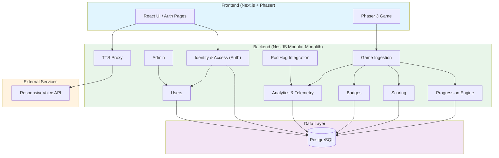

# Architecture Overview

This document outlines the architectural decisions, structural boundaries, and technology stack for the Gameplate project. It serves as the single source of truth for the system's technical design, replacing older structural drafts to reflect the current, modernized tooling and practical constraints of the project.

## Table of Contents

- [1. Context & Requirements](#1-context--requirements)
  - [Functional Requirements](#functional-requirements)
  - [Non-Functional Requirements](#non-functional-requirements)
- [2. Domain Architecture](#2-domain-architecture)
  - [Domain Modules](#domain-modules)
- [3. Technology Stack](#3-technology-stack)
  - [Workspace & Tooling](#workspace--tooling)
  - [Frontend](#frontend)
  - [Backend](#backend)
- [4. Architectural Patterns & Boundaries](#4-architectural-patterns--boundaries)
  - [The Modular Monolith Approach](#the-modular-monolith-approach)
  - [Directory Structure](#directory-structure)
  - [Simplified Backend Strategy](#simplified-backend-strategy)
- [5. Resolved & Pending Architecture Decisions](#5-resolved--pending-architecture-decisions)
- [6. API Contracts](#6-api-contracts)
  - [Auth Module](#auth-module)
  - [Users Module](#users-module)
  - [Admin Module](#admin-module)
  - [Game Module](#game-module)
  - [Progression Module](#progression-module)
  - [Scoring Module](#scoring-module)
  - [Badges Module](#badges-module)
  - [Analytics Module](#analytics-module)
  - [PostHog Module](#posthog-module)
  - [TTS Module](#tts-module)
  - [Planned Modules](#planned-modules)
  - [Technical Notes](#technical-notes)

## 1. Context & Requirements

### Functional Requirements
The scope of the project is a web-based educational game. Core features include:
- **Free Public Access:** Barrier-free entry for general users.
- **Game Mechanics:** Quiz-based gameplay integrated with thematic content.
- **Progression System:** Levels, achievements, and badges.
- **Thematic Tracks:** Curated content paths focused on art and culture.
- **Role-Based Access:** Distinct areas and permissions for General Users, Educators/Institutions, and Administrators.
- **Institutional Dashboard:** Aggregated data visualization for educators to track player progress.

### Non-Functional Requirements
- **Accessibility:** Native compliance in UI and content design.
- **Performance:** Fast loading times on mobile networks and compatibility with modern browsers.
- **Privacy & Security:** Minimal personal data collection, strict LGPD compliance.
- **Scale:** Moderate complexity, targeting ~5,000 users in the first year without the immediate need for heavy distributed systems.
- **Open-Source Readiness:** The codebase structure must be clean and modular enough to support a future open-source release.

## 2. Domain Architecture

The system is designed around specific business domains. While physically structured as a monolith, logically, these domains remain isolated and communicate via events (Event-Driven Architecture) to prevent tight coupling:



### Domain Modules

1. **Identity & Access (Auth):** Passwordless magic-link authentication, JWT session management, refresh token rotation, and role-based access control.
2. **Users:** User profile management, roles (`player`, `institution`, `admin`), and account status.
3. **Game Ingestion:** Receives gameplay events (e.g., `LEVEL_COMPLETED`, `ITEM_COLLECTED`) from the frontend via HTTP.
4. **Progression Engine:** Tracks player level completion, stars, clues, and chapter status.
5. **Scoring:** Manages user scores, leaderboard data, and score history.
6. **Badges:** Badge definitions, user-badge associations, and achievement tracking.
7. **Analytics:** Stores raw game event logs (append-only) for funnel metrics and dashboards.
8. **PostHog Integration:** Server-side event forwarding to PostHog for product analytics and error tracking.
9. **Admin:** Admin-only endpoints for user management (list, role updates, status toggle).
10. **TTS:** Server-side proxy for ResponsiveVoice text-to-speech. Hides the API key from the client bundle. Accepts text and returns audio (`audio/mpeg`). Accessible to both authenticated users and guests via `@GuestPlay()`.

## 3. Technology Stack

### Workspace & Tooling
- **Package Manager & Runtime:** [Node.js](https://nodejs.org/) (v24+) with npm.
- **Monorepo Orchestration:** [Turborepo](https://turbo.build/) for task caching and parallel execution.
- **Linting & Formatting:** [Biome](https://biomejs.dev/) (replaces ESLint and Prettier for unified, fast code validation).
- **Testing:** [Jest](https://jestjs.io/) as the universal test runner across the workspace.

### Frontend (`/front`)
- **Framework:** Next.js with React.
- **Game Engine:** Phaser 3 (encapsulated entirely within `src/game`).
- **Styling:** Material UI (MUI) v9 with Emotion for CSS-in-JS.
- **State Management:** React hooks and Zustand for UI overlay and HUD state.
- **Analytics:** PostHog JS SDK with autocapture disabled, canvas recording enabled in production.
- **HTTP Client:** Axios with interceptors for auth token refresh and PostHog session headers.

### Backend (`/back`)
- **Framework:** NestJS with Express.
- **Database:** PostgreSQL.
- **ORM:** TypeORM with migrations managed via CLI.
- **Authentication:** Passport JWT strategy, custom magic-link service, opaque refresh tokens with SHA-256 hashing.
- **Rate Limiting:** `@nestjs/throttler` with per-email and per-IP throttling.
- **Observability:** PostHog Node SDK with custom exception interceptor.
- **Infrastructure:** Docker & Docker Compose for local environments; GitHub Actions for building/pushing to GitHub Container Registry (GHCR); Coolify for Deployment (CD).

## 4. Architectural Patterns & Boundaries

### The Modular Monolith Approach
The codebase is structured as a **Modular Monolith**.

- The repository is split top-level into `front/` and `back/`.
- Inside the backend (`/back/src`), features are grouped into logical, domain-driven folders (e.g., `users`, `health`, `database`).
- Inside the frontend (`/front/src`), the web UI and the Phaser game logic (`/game`) are strictly separated. The game communicates with the outer React shell, which in turn communicates with the backend.
- UI overlays (HUD and modal panels) are being centralized in React and synchronized with gameplay through a shared typed EventBus.

### Directory Structure

```text
gameplate/
├── front/
│   ├── src/
│   │   ├── app/              # Next.js App Router (UI, Auth Pages, Game Shell)
│   │   ├── components/       # React Components (UI outside the game)
│   │   ├── lib/                # Utilities, API clients, auth logic
│   │   └── game/             # Game Domain (Phaser 3)
│   │       ├── scenes/
│   │       ├── objects/
│   │       ├── mechanics/
│   │       └── constants/
│
└── back/
    ├── src/
    │   ├── core/             # Global configurations, Guards, Interceptors
    │   │   ├── config/
    │   │   ├── database/
    │   │   ├── email/
    │   │   ├── guards/
    │   │   ├── health/
    │   │   └── logger/
    │   │
    │   ├── modules/          # Bounded Contexts (Domains)
    │   │   ├── admin/        # Admin user management
    │   │   ├── analytics/    # Game event ingestion
    │   │   ├── auth/         # Authentication & Authorization
    │   │   ├── badges/       # Badge definitions & user badges
    │   │   ├── game/         # Gameplay event ingestion
    │   │   ├── posthog/      # PostHog server-side integration
    │   │   ├── progression/  # Player progression tracking
    │   │   ├── scoring/      # Score & leaderboard management
    │   │   ├── tts/          # Text-to-speech proxy
    │   │   └── users/        # User profiles & roles
    │   │
    │   ├── app.module.ts
    │   └── main.ts
    │
    └── package.json
```

### Simplified Backend Strategy (Current Pivot)
To accelerate development and reduce unnecessary complexity, **the Next.js frontend will handle the heavy lifting for the initial iterations of the game.** 
The NestJS backend will be heavily simplified for now. Its primary responsibilities will be restricted to:
1. Data persistence (TypeORM/PostgreSQL).
2. Analytics aggregation for the Educator/Admin dashboards.
3. Cross-cutting project scaffolding (global state validation that cannot be trusted to the client).

The gameplay itself will operate mostly as a client-side application (Next.js + Phaser) with periodic state synchronization to the backend.

## 5. Resolved & Pending Architecture Decisions

### Resolved

- **Authentication Module:** Implemented as passwordless magic-link authentication with JWT access tokens (15min expiry) and opaque refresh tokens (7-day rotation). See the auth implementation plan in `docs/authentication-authorization-implementation-plan.md`.
- **Observability & Analytics:** PostHog is integrated on both frontend (`posthog-js`) and backend (`posthog-node`) for product analytics, session replay, and error tracking. See `docs/posthog-implementation-plan.md`.
- **Chunk Selector UI Migration (Phase 7):** The photo restoration ChunkSelector panel is implemented in React overlay, wired through the shared EventBus, and preserves keyboard interaction parity (Arrow keys + WASD for navigation, Enter/Space for confirm, Esc for close). The panel layout was refined to better balance inventory/frame space and includes automatic inventory scroll-on-navigation to keep keyboard-selected items visible.
- **MapInfoBox & Map Progression (PR #517):** The `MapInfoBox` React panel exposes three UI states (available, completed, locked) driven by the `map:marker-changed` EventBus event. `MapIntroScene` dynamically computes marker availability from `progression.completedLevels`, so Phase N unlocks only after Phase N−1 is complete. The event payload (`MapMarkerChangedData`) includes `isCompleted?: boolean`, removing `MapInfoBox`'s need for a separate Zustand `progression` selector. To handle Turbopack module isolation and React mount-timing races (React overlay mounts after `StartGame()` returns), `MapIntroScene.emitMarkerChanged()` writes directly to the Zustand store via `useGameUIStore.getState().setActiveMapMarker()` in addition to emitting the EventBus event. A dev debug shortcut (`localStorage.setItem("gameplate:debug:completedLevels", ...)`) allows pre-seeding completion state without playing through levels.
- **Server-Side TTS Proxy:** The ResponsiveVoice API key was moved from `NEXT_PUBLIC_` (exposed in client JS bundle) to a server-only env var (`RESPONSIVEVOICE_API_KEY`). The backend proxies TTS requests via ResponsiveVoice v1 REST API, returning `StreamableFile` audio. Frontend calls `POST /tts/synthesize` and receives binary `audio/mpeg`. Guest users access via `@GuestPlay()` decorator (JWT optional). This eliminates domain whitelist concerns since Node.js `fetch()` sends no `Origin`/`Referer` headers.

### Pending

- **Shared Contracts:** How to share TypeScript types and interfaces between `/front` and `/back` (e.g., creating a `packages/shared` workspace in Turborepo vs. duplication) is yet to be established.
- **Quiz Module:** A final quiz validation module is planned but not yet implemented.
- **Institutional Dashboard:** Admin dashboards for educators to track player progress are planned but not yet implemented.

## 6. API Contracts

All backend endpoints are prefixed with `/api/v1`.

### Auth Module (`/auth`)

Passwordless magic-link authentication with JWT access tokens and opaque refresh tokens.

| Method | Path | Auth | Description |
|--------|------|------|-------------|
| `POST` | `/auth/register` | Public | Register new user. Returns generic 200 regardless of email existence. |
| `POST` | `/auth/login` | Public | Request magic link login email. Sets `login_attempt` cookie. |
| `POST` | `/auth/login/confirm` | Cookie | Consume magic link token, set auth cookies, return `{ redirectTo: "/" }`. |
| `POST` | `/auth/logout` | Cookie | Revoke refresh token, clear cookies, blacklist access token `jti`. |
| `POST` | `/auth/logout-all` | JWT | Revoke all refresh tokens for user, blacklist current access token. |
| `POST` | `/auth/refresh` | Cookie | Rotate refresh token. Returns `{ accessToken }`. |
| `GET` | `/auth/me` | JWT | Get current authenticated user. |
| `POST` | `/auth/verify-email/confirm` | Public | Consume verification token, activate account, set cookies. |
| `POST` | `/auth/resend-verification` | Public | Resend verification email. |

### Users Module (`/users`)

| Method | Path | Auth | Description |
|--------|------|------|-------------|
| `GET` | `/users/me` | JWT | Get current user profile (alias for `/auth/me`). |

### Admin Module (`/admin`)

Admin-only endpoints guarded by `RolesGuard`.

| Method | Path | Auth | Description |
|--------|------|------|-------------|
| `GET` | `/admin/users` | Admin | List users with pagination, search, role filter, status filter. |
| `GET` | `/admin/users/:id` | Admin | Get user details by ID. |
| `PATCH` | `/admin/users/:id/role` | Admin | Change user role. |
| `PATCH` | `/admin/users/:id/status` | Admin | Activate/deactivate user. |

### Game Module (`/game`)

| Method | Path | Auth | Description |
|--------|------|------|-------------|
| `POST` | `/game/events` | JWT | Ingest gameplay events from frontend. |

### Progression Module (`/progression`)

| Method | Path | Auth | Description |
|--------|------|------|-------------|
| `GET` | `/progression/state` | JWT | Get current player progression state. |
| `POST` | `/progression/level-complete` | JWT | Register level completion with stars and badges. |
| `GET` | `/progression/inventory` | JWT | Get collected clues and artwork info. |

### Scoring Module (`/scoring`)

| Method | Path | Auth | Description |
|--------|------|------|-------------|
| `GET` | `/scoring/leaderboard` | JWT | Get leaderboard data. |
| `GET` | `/scoring/user/:id` | JWT | Get user score history. |

### Badges Module (`/badges`)

| Method | Path | Auth | Description |
|--------|------|------|-------------|
| `GET` | `/badges` | Public | List all available badges. |
| `GET` | `/badges/user` | JWT | Get badges earned by current user. |

### Analytics Module (`/analytics`)

| Method | Path | Auth | Description |
|--------|------|------|-------------|
| `POST` | `/analytics/events` | JWT | Ingest raw analytics events. |

### PostHog Module (`/posthog`)

| Method | Path | Auth | Description |
|--------|------|------|-------------|
| `GET` | `/posthog/bootstrap` | JWT | Get PostHog feature flags and distinct ID for bootstrapping. |

### TTS Module (`/tts`)

Server-side proxy for ResponsiveVoice text-to-speech. The API key is stored server-only (`RESPONSIVEVOICE_API_KEY`). The backend calls ResponsiveVoice v1 REST API and streams audio back as `StreamableFile`. Guest access is allowed via `@GuestPlay()`.

| Method | Path | Auth | Description |
|--------|------|------|-------------|
| `POST` | `/tts/synthesize` | GuestPlay | Convert text to speech. Body: `{ text: string, voice?: string, rate?: number, pitch?: number }`. Returns binary `audio/mpeg`. |

### Planned Modules

| Module | Status | Description |
|--------|--------|-------------|
| Quiz Final | Not implemented | End-of-journey knowledge validation. |
| Institutional Dashboard | Not implemented | Educator-facing analytics dashboard. |

### Technical Notes

- **Persistence:** All data is stored in PostgreSQL via TypeORM.
- **Events:** The backend uses NestJS `EventEmitter` for internal event propagation after persistence.
- **Security:** Refresh tokens are opaque random strings (64 bytes) SHA-256 hashed in the database. Access tokens are JWTs with a `jti` claim and 15-minute expiry. An in-memory blocklist rejects revoked tokens immediately.
- **Rate Limiting:** Auth endpoints have per-email throttling (3/hr register, 5/hr login, 3/hr resend verification). Refresh is throttled at 30/min per IP.
- **Cookies:** `refresh_token` (httpOnly, Secure, SameSite=Strict), `auth_status` (non-httpOnly, SameSite=Lax), `login_attempt` (httpOnly, 15min expiry).
- **TTS API Key:** The `RESPONSIVEVOICE_API_KEY` is stored as a server-only environment variable (no `NEXT_PUBLIC_` prefix). The backend calls ResponsiveVoice v1 REST API (`text:synthesize` endpoint) with the key in query parameters. Audio is streamed back as `StreamableFile` to avoid NestJS `Buffer`-to-JSON serialization. The frontend falls back to native Web Speech API (`window.speechSynthesis`) on error.
