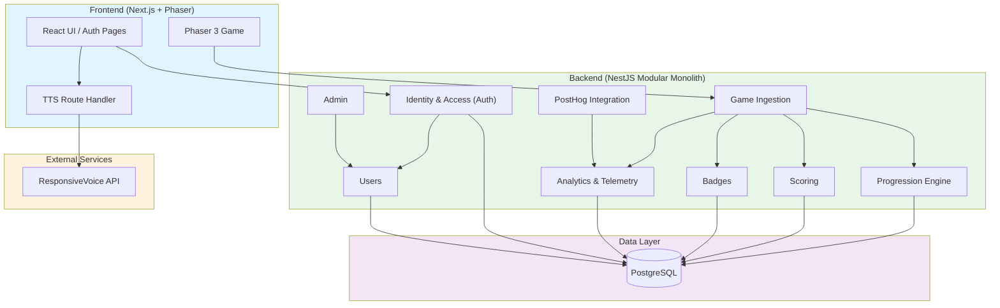

# Architecture Overview

This document outlines the architectural decisions, structural boundaries, and technology stack for the Gameplate project. It serves as the single source of truth for the system's technical design, replacing older structural drafts to reflect the current, modernized tooling and practical constraints of the project.

## Table of Contents

- [1. Context & Requirements](#1-context--requirements)
  - [Functional Requirements](#functional-requirements)
  - [Non-Functional Requirements](#non-functional-requirements)
- [2. Domain Architecture](#2-domain-architecture)
  - [Domain Modules](#domain-modules)
- [3. Technology Stack](#3-technology-stack)
  - [Workspace & Tooling](#workspace--tooling)
  - [Frontend](#frontend)
  - [Backend](#backend)
- [4. Architectural Patterns & Boundaries](#4-architectural-patterns--boundaries)
  - [The Modular Monolith Approach](#the-modular-monolith-approach)
  - [Directory Structure](#directory-structure)
  - [Simplified Backend Strategy](#simplified-backend-strategy)
- [5. Resolved & Pending Architecture Decisions](#5-resolved--pending-architecture-decisions)
- [6. API Contracts](#6-api-contracts)
  - [Auth Module](#auth-module)
  - [Users Module](#users-module)
  - [Admin Module](#admin-module)
  - [Game Module](#game-module)
  - [Progression Module](#progression-module)
  - [Scoring Module](#scoring-module)
  - [Badges Module](#badges-module)
  - [Analytics Module](#analytics-module)
  - [PostHog Module](#posthog-module)
  - [TTS Module](#tts-module)
  - [Planned Modules](#planned-modules)
  - [Technical Notes](#technical-notes)

## 1. Context & Requirements

### Functional Requirements
The scope of the project is a web-based educational game. Core features include:
- **Free Public Access:** Barrier-free entry for general users.
- **Game Mechanics:** Quiz-based gameplay integrated with thematic content.
- **Progression System:** Levels, achievements, and badges.
- **Contextual Assistance:** Inactivity-driven hints that keep players from getting blocked in a level without removing the sense of discovery.
- **Thematic Tracks:** Curated content paths focused on art and culture.
- **Role-Based Access:** Distinct areas and permissions for General Users, Educators/Institutions, and Administrators.
- **Institutional Dashboard:** Aggregated data visualization for educators to track player progress.

### Non-Functional Requirements
- **Accessibility:** Native compliance in UI and content design.
- **Performance:** Fast loading times on mobile networks and compatibility with modern browsers.
- **Privacy & Security:** Minimal personal data collection — an email address, gameplay progress and badge state. LGPD compliance is a design goal, not an audited or certified state; treat it as a requirement being worked towards rather than a claim the code already supports.
- **Scale:** Moderate complexity, targeting ~5,000 users in the first year without the immediate need for heavy distributed systems.
- **Open-Source Readiness:** The codebase structure must be clean and modular enough to support a future open-source release.

## 2. Domain Architecture

The system is designed around specific business domains. While physically structured as a monolith, logically, these domains remain isolated and communicate via events (Event-Driven Architecture) to prevent tight coupling:



### Domain Modules

1. **Identity & Access (Auth):** Passwordless magic-link authentication, JWT session management, refresh token rotation, and role-based access control.
2. **Users:** User profile management, roles (`player`, `institution`, `admin`), and account status.
3. **Game Ingestion:** Receives gameplay events (e.g., `LEVEL_COMPLETED`, `ITEM_COLLECTED`) from the frontend via HTTP.
4. **Progression Engine:** Tracks player level completion, stars, clues, and chapter status. Collected clues are displayed on the evidence board overlay (Pistas).
5. **Scoring:** Manages user scores, leaderboard data, and score history.
6. **Badges:** Badge definitions, user-badge associations, and achievement tracking.
7. **Analytics:** Stores raw game event logs (append-only) for funnel metrics and dashboards.
8. **PostHog Integration:** Server-side event forwarding to PostHog for product analytics and error tracking.
9. **Admin:** Admin-only endpoints for user management (list, role updates, status toggle).
10. **Dashboard:** Aggregated metrics for educators and administrators, restricted to the `institution` and `admin` roles.
11. **User Interested:** Public sign-up capturing interest in levels that do not exist yet.

## 3. Technology Stack

### Workspace & Tooling
- **Package Manager & Runtime:** [Node.js](https://nodejs.org/) (v24+) with npm.
- **Monorepo Orchestration:** [Turborepo](https://turbo.build/) for task caching and parallel execution.
- **Linting & Formatting:** [Biome](https://biomejs.dev/) (replaces ESLint and Prettier for unified, fast code validation).
- **Testing:** [Jest](https://jestjs.io/) as the universal test runner across the workspace.

### Frontend (`/front`)
- **Framework:** Next.js with React.
- **Game Engine:** Phaser 3 (encapsulated entirely within `src/game`).
- **Styling:** Material UI (MUI) v9 with Emotion for CSS-in-JS.
- **State Management:** React hooks and Zustand for UI overlay and HUD state.
- **Analytics:** PostHog JS SDK with autocapture disabled, canvas recording enabled in production.
- **HTTP Client:** Axios with interceptors for auth token refresh and PostHog session headers.

### Backend (`/back`)
- **Framework:** NestJS with Express.
- **Database:** PostgreSQL.
- **ORM:** TypeORM with migrations managed via CLI.
- **Authentication:** Passport JWT strategy, custom magic-link service, opaque refresh tokens with SHA-256 hashing.
- **Rate Limiting:** `@nestjs/throttler` with per-email and per-IP throttling.
- **Observability:** PostHog Node SDK with custom exception interceptor.
- **Infrastructure:** Docker & Docker Compose for local environments; GitHub Actions for building/pushing to GitHub Container Registry (GHCR); Coolify for Deployment (CD).

## 4. Architectural Patterns & Boundaries

### The Modular Monolith Approach
The codebase is structured as a **Modular Monolith**.

- The repository is split top-level into `front/` and `back/`.
- Inside the backend (`/back/src`), features are grouped into logical, domain-driven folders (e.g., `users`, `health`, `database`).
- Inside the frontend (`/front/src`), the web UI and the Phaser game logic (`/game`) are strictly separated. The game communicates with the outer React shell, which in turn communicates with the backend.
- UI overlays (HUD, evidence board, modal panels) are centralized in React and synchronized with gameplay through a shared typed EventBus. The evidence board (`EvidenceBoardOverlay`) loads collectibles across all levels and renders them as pinned cards with SVG connections.

### Directory Structure

```text
gameplate/
├── front/
│   ├── src/
│   │   ├── app/              # Next.js App Router (UI, Auth Pages, Game Shell, API routes)
│   │   ├── components/       # React Components (UI outside the game)
│   │   ├── ui/               # HUD, panels and overlays layered over the game canvas
│   │   ├── shared/           # Types and helpers used by both the game and the UI
│   │   ├── lib/              # Utilities, API clients, env parsing, audio services
│   │   ├── middleware.ts     # Route protection for authenticated pages
│   │   └── game/             # Game Domain (Phaser 3)
│   │       ├── scenes/
│   │       ├── objects/
│   │       ├── mechanics/
│   │       ├── systems/      # Cross-cutting gameplay systems (nudges, placeholders, spotlights)
│   │       ├── data/         # Level registry and static content wiring
│   │       └── constants/
│   │
│   └── public/assets/        # Game assets — separate licence, see ASSETS-LICENSE.md
│
└── back/
    ├── src/
    │   ├── core/             # Global configurations, Guards, Interceptors
    │   │   ├── config/
    │   │   ├── database/
    │   │   ├── email/
    │   │   ├── guards/
    │   │   ├── health/
    │   │   └── logger/
    │   │
    │   ├── modules/          # Bounded Contexts (Domains)
    │   │   ├── admin/        # Admin user management
    │   │   ├── analytics/    # Game event ingestion
    │   │   ├── auth/         # Authentication & Authorization
    │   │   ├── badges/       # Badge definitions & user badges
    │   │   ├── dashboard/    # Aggregated metrics for educators and admins
    │   │   ├── game/         # Gameplay event ingestion
    │   │   ├── posthog/      # PostHog server-side integration
    │   │   ├── progression/  # Player progression tracking
    │   │   ├── scoring/      # Score & leaderboard management
    │   │   ├── user-interested/ # Interest sign-up for upcoming levels
    │   │   └── users/        # User profiles & roles
    │   │
    │   ├── app.module.ts
    │   └── main.ts
    │
    └── package.json
```

### Simplified Backend Strategy (Current Pivot)
To accelerate development and reduce unnecessary complexity, **the Next.js frontend will handle the heavy lifting for the initial iterations of the game.** 
The NestJS backend will be heavily simplified for now. Its primary responsibilities will be restricted to:
1. Data persistence (TypeORM/PostgreSQL).
2. Analytics aggregation for the Educator/Admin dashboards.
3. Cross-cutting project scaffolding (global state validation that cannot be trusted to the client).

The gameplay itself will operate mostly as a client-side application (Next.js + Phaser) with periodic state synchronization to the backend.

### Game Error & Fallback Pages
Game-styled error screens apply only to player-facing routes: the landing (`/`) and `/game`, grouped under `front/src/app/(game)/` (the route group does not change URLs). `isGameRoute` (`front/src/lib/navigation/gameRoutes.ts`) defines that scope for the middleware and the API client. All screens share `ErrorPageLayout` (`front/src/components/errors/`) and report through `reportErrorPage` (`front/src/lib/errors/reportError.ts`), tagging PostHog events with `error_page_type`.

| Scenario | Route / trigger | `error_page_type` |
|----------|-----------------|-------------------|
| Unknown `/game/*` route | `app/(game)/game/[...slug]` calls `notFound()` → `app/(game)/game/not-found.tsx` | `not_found` |
| Uncaught render error on `/` or `/game` | `app/(game)/error.tsx` | `server_error` |
| Backend down on a game route | Network error or 502/503/504 plus a failed `GET /api/v1/health` check redirects to `/game/maintenance?next=…` | `maintenance` |
| Planned maintenance | `NEXT_PUBLIC_MAINTENANCE_MODE=true`: middleware rewrites `/` and `/game/*` to `/game/maintenance` with HTTP 503. Build-time: set in `.env` locally, passed as a Docker build arg by the CD workflows (GitHub variable). Redeploy to toggle | `maintenance` |
| Game init failure | `PhaserGame` shows `GameLoadErrorScreen` with retry | — (`game_load_failed`) |
| Single asset load error | Reported only; game keeps running | `asset_load` |

`next` params are sanitized by `getSafeRedirectPath`: control characters, whitespace and backslashes are rejected, and the value must resolve to the current origin.

The maintenance page knows why it is shown:
- **scheduled** (flag on): planned-maintenance copy; polls `GET /api/maintenance` (`{ active }`) and returns to the game once a redeploy turns the flag off. No reload loop while the flag stays on.
- **outage** (flag off): polls the backend health endpoint, checking immediately on load, so a direct visit while everything is healthy returns to the game.

Polling (`useMaintenanceRecovery`) backs off 30 s → 60 s → … up to 5 min with ±30 % jitter and pauses while the tab is hidden. The page is reported once per session per reason. When the player's own connection drops (`navigator.onLine === false`) there is no redirect; `OfflineNotice` shows a toast instead. The middleware reads the flag through `lib/maintenance.ts`, not the full env schema.

Auth pages keep the generic boundaries (`app/error.tsx`, `app/(auth)/error.tsx`, `app/global-error.tsx`); maintenance mode and outage redirects don't affect the dashboards or auth.

### Dashboard Error & Fallback Pages
The institutional (`/institution/*`) and public (`/public-dashboard/*`) dashboards use dashboard-styled screens from `front/src/components/errors/DashboardErrorPages.tsx`. Full-page screens share `DashboardErrorLayout` (dashboard theme, faded game logo, the shared `Footer` unless a layout already renders it); in-page states are rendered by `DashboardState` and never show raw error messages. Errors are sorted by `classifyError` (`front/src/lib/errors/classifyError.ts`) from the HTTP status or a fetch `TypeError`, and `useAsyncData` exposes the result as `errorKind`.

| Scenario | Route / trigger | Screen |
|----------|-----------------|--------|
| Unknown `/public-dashboard/*` URL | `public-dashboard/[...slug]/page.tsx` calls `notFound()` → `public-dashboard/not-found.tsx` | `DashboardNotFoundPage` |
| Unknown URL anywhere else, including `/institution/*` | `app/not-found.tsx` (site-wide, full page without the sidebar); `homeLinkFor` picks the dashboard or `/` for the button | `DashboardNotFoundPage` |
| Uncaught render error | `institution/error.tsx`, `public-dashboard/error.tsx` | `DashboardRouteErrorPage` (connection copy for network errors, 500 otherwise) |
| Session ended while on the dashboard | `InstitutionGuard` | `DashboardSessionExpiredPage` |
| Data request failed | `DashboardState` with `errorKind` | `DashboardInlineError` (network, session, not found, bad filter, server) |
| Loaded but nothing to show | `DashboardState` with `empty` | `DashboardEmptyState` |
| Rate with no denominator | `RateCard` | "—" / "Sem dados no período" |

Errors thrown by `institution/layout.tsx` itself fall through to `app/error.tsx`, which already uses the dashboard look and footer (`FullPageMessage`). Browser offline for any page is handled by `OfflineGate`.

The front container healthcheck targets `GET /api/health` (`front/src/app/api/health/route.ts`), not `/`. It only proves the Next.js server answers: it doesn't call the backend and sits outside the middleware, so maintenance mode (which answers game routes with 503) never marks the front unhealthy or keeps nginx from starting.

## 5. Resolved & Pending Architecture Decisions

### Resolved

- **Authentication Module:** Implemented as passwordless magic-link authentication with JWT access tokens (15min expiry) and opaque refresh tokens (7-day rotation). See the auth implementation plan in `docs/authentication-authorization-implementation-plan.md`.
- **Observability & Analytics:** PostHog is integrated on both frontend (`posthog-js`) and backend (`posthog-node`) for product analytics, session replay, and error tracking. See `docs/posthog-implementation-plan.md`.
- **Chunk Selector UI Migration (Phase 7):** The photo restoration ChunkSelector panel is implemented in React overlay, wired through the shared EventBus, and preserves keyboard interaction parity (Arrow keys + WASD for navigation, Enter/Space for confirm, Esc for close). The panel layout was refined to better balance inventory/frame space and includes automatic inventory scroll-on-navigation to keep keyboard-selected items visible.
- **MapInfoBox & Map Progression (PR #517):** The `MapInfoBox` React panel exposes three UI states (available, completed, locked) driven by the `map:marker-changed` EventBus event. `MapIntroScene` dynamically computes marker availability from `progression.completedLevels`, so Phase N unlocks only after Phase N−1 is complete. The event payload (`MapMarkerChangedData`) includes `isCompleted?: boolean`, removing `MapInfoBox`'s need for a separate Zustand `progression` selector. To handle Turbopack module isolation and React mount-timing races (React overlay mounts after `StartGame()` returns), `MapIntroScene.emitMarkerChanged()` writes directly to the Zustand store via `useGameUIStore.getState().setActiveMapMarker()` in addition to emitting the EventBus event. A dev debug shortcut (`localStorage.setItem("gameplate:debug:completedLevels", ...)`) allows pre-seeding completion state without playing through levels.
- **Server-Side TTS Proxy:** The ResponsiveVoice API key is stored as a server-only env var (`RESPONSIVEVOICE_API_KEY`) in the frontend deployment. A Next.js Route Handler (`/api/tts/synthesize`) proxies requests to ResponsiveVoice v1 REST API, returning `audio/mpeg`. This eliminates domain whitelist concerns since the proxy runs server-side. The frontend falls back to native Web Speech API (`window.speechSynthesis`) on error.
- **Contextual Nudge System (PR #733):** Anti-blocking assistance driven by player inactivity. Responsibility is split so the timing rules stay testable: `NudgeManager` (`front/src/game/systems/NudgeManager.ts`) owns *when* to nudge — a dependency-free class whose `evaluate(now, isPlayerBusy)` returns a boolean, governed by a 15s inactivity threshold, a 1s evaluation throttle, a global 5-minute cooldown, and a per-mission reset — while `Game.ts` owns *which kind* of nudge, chosen by proximity rather than by escalation (the delay is identical for both kinds). A pulse fires via `PlaceholderSystem.pulseNearestPlaceholder()` or `SpotlightSystem.pulseNearestSpotlight()` when an incomplete costume placeholder or spotlight sits within ~500px; otherwise the nearest artwork's `educational.hint` (from the level's `works.json`) is surfaced through the existing `ui:toast-show` EventBus event, so no bespoke overlay UI was introduced. Because `NudgeManager` has no imports, it is unit-tested in isolation (`NudgeManager.test.ts`, 11 cases covering threshold, busy suppression, timer reset, cooldown window and expiry, throttle, and per-mission reset); the `Game.ts` wiring is verified manually. Telemetry is emitted straight to PostHog as `nudge_pulse_shown_*` and `nudge_hint_shown_*`, with the firing rules documented in `EVENTS.md` (§ *Nudge — regras de disparo*).

### Pending

- **Shared Contracts:** How to share TypeScript types and interfaces between `/front` and `/back` (e.g., creating a `packages/shared` workspace in Turborepo vs. duplication) is yet to be established.
- **Quiz Module:** A final quiz validation module is planned but not yet implemented.
- **Institutional Dashboard:** Admin dashboards for educators to track player progress are planned but not yet implemented.

## 6. API Contracts

All backend endpoints are prefixed with `/api/v1`.

### Auth Module (`/auth`)

Passwordless magic-link authentication with JWT access tokens and opaque refresh tokens.

| Method | Path | Auth | Description |
|--------|------|------|-------------|
| `POST` | `/auth/register` | Public | Register new user. Returns generic 200 regardless of email existence. |
| `POST` | `/auth/login` | Public | Request magic link login email. Sets `login_attempt` cookie. |
| `POST` | `/auth/login/confirm` | Cookie | Consume magic link token, set auth cookies, return `{ redirectTo: "/" }`. |
| `POST` | `/auth/logout` | Cookie | Revoke refresh token, clear cookies, blacklist access token `jti`. |
| `POST` | `/auth/logout-all` | JWT | Revoke all refresh tokens for user, blacklist current access token. |
| `POST` | `/auth/refresh` | Cookie | Rotate refresh token. Returns `{ accessToken }`. |
| `GET` | `/auth/me` | JWT | Get current authenticated user. |
| `POST` | `/auth/verify-email/confirm` | Public | Consume verification token, activate account, set cookies. |
| `POST` | `/auth/resend-verification` | Public | Resend verification email. |

### Users Module (`/users`)

| Method | Path | Auth | Description |
|--------|------|------|-------------|
| `GET` | `/users/me` | JWT | Get current user profile (alias for `/auth/me`). |

### Admin Module (`/admin`)

Admin-only endpoints guarded by `RolesGuard`.

| Method | Path | Auth | Description |
|--------|------|------|-------------|
| `GET` | `/admin/users` | Admin | List users with pagination, search, role filter, status filter. |
| `GET` | `/admin/users/:id` | Admin | Get user details by ID. |
| `PATCH` | `/admin/users/:id/role` | Admin | Change user role. |
| `PATCH` | `/admin/users/:id/status` | Admin | Activate/deactivate user. |

### Game Module (`/game`)

| Method | Path | Auth | Description |
|--------|------|------|-------------|
| `POST` | `/game/events` | JWT | Ingest gameplay events from frontend. |

### Progression Module (`/progression`)

| Method | Path | Auth | Description |
|--------|------|------|-------------|
| `GET` | `/progression/state` | JWT | Get current player progression state. |
| `POST` | `/progression/level-complete` | JWT | Register level completion with stars and badges. |
| `GET` | `/progression/inventory` | JWT | Get collected clues and artwork info. Consumed by the evidence board overlay. |

### Scoring Module (`/scoring`)

| Method | Path | Auth | Description |
|--------|------|------|-------------|
| `GET` | `/scoring/leaderboard` | JWT | Get leaderboard data. |
| `GET` | `/scoring/user/:id` | JWT | Get user score history. |

### Badges Module (`/badges`)

| Method | Path | Auth | Description |
|--------|------|------|-------------|
| `GET` | `/badges` | Public | List all available badges. |
| `GET` | `/badges/user` | JWT | Get badges earned by current user. |

### Analytics Module (`/analytics`)

| Method | Path | Auth | Description |
|--------|------|------|-------------|
| `POST` | `/analytics/events` | JWT | Ingest raw analytics events. |

### PostHog Module (`/posthog`)

| Method | Path | Auth | Description |
|--------|------|------|-------------|
| `GET` | `/posthog/bootstrap` | JWT | Get PostHog feature flags and distinct ID for bootstrapping. |

### Dashboard Module (`/dashboard`, `/metrics`)

Restricted to the `institution` and `admin` roles. Both paths serve the same aggregated metrics; `/metrics` is an alias kept for the dashboard frontend.

| Method | Path | Auth | Description |
|--------|------|------|-------------|
| `GET` | `/dashboard/metrics` | JWT + role | Aggregated metrics for a date range. |
| `GET` | `/metrics` | JWT + role | Same payload, alias route. |

### User Interested Module (`/user-interested`)

| Method | Path | Auth | Description |
|--------|------|------|-------------|
| `POST` | `/user-interested` | Public | Register an email address as interested in levels that are not released yet. |

### TTS Route Handler (`/api/tts/synthesize`)

Server-side proxy for ResponsiveVoice text-to-speech, implemented as a Next.js Route Handler. The API key is stored server-only (`RESPONSIVEVOICE_API_KEY`), read from `process.env`, and never exposed to the browser.

**The key is optional.** ResponsiveVoice is a paid, NonCommercial service, so the game must run without it: with no key the route answers `503` with `code: "tts_unavailable"` and the client narrates with the browser's own `SpeechSynthesis` instead, remembering the answer so it stops re-requesting.

| Method | Path | Auth | Description |
|--------|------|------|-------------|
| `POST` | `/api/tts/synthesize` | Public | Convert text to speech. Body: `{ text: string, voice?: string, rate?: number, pitch?: number }`. Returns binary `audio/mpeg`, `503` when no key is configured, or `502` when the upstream service fails or times out. |

The key is optional, and an empty value counts as unset. Without it, the route answers `503` with `code: "tts_unavailable"`, and the client (`AudioAccessibilityService`) switches to the browser's `window.speechSynthesis` for the rest of the session. If ResponsiveVoice fails (invalid key, outage, 10s timeout), the route answers `502`, and the client uses the browser voice for that line only. The browser voice depends on the operating system and may need a speech engine installed or enabled (see [CONTRIBUTING.md](./CONTRIBUTING.md#narration-text-to-speech)).

### Planned Modules

| Module | Status | Description |
|--------|--------|-------------|
| Quiz Final | Not implemented | End-of-journey knowledge validation. |
| Institutional Dashboard | Partially implemented | The `dashboard` module serves aggregated metrics to the `institution` and `admin` roles; the educator-facing frontend is still in progress. |

### Technical Notes

- **Persistence:** All data is stored in PostgreSQL via TypeORM.
- **Events:** The backend uses NestJS `EventEmitter` for internal event propagation after persistence.
- **Security:** Refresh tokens are opaque random strings (64 bytes) SHA-256 hashed in the database. Access tokens are JWTs with a `jti` claim and 15-minute expiry. An in-memory blocklist rejects revoked tokens immediately.
- **Rate Limiting:** Auth endpoints have per-email throttling (3/hr register, 5/hr login, 3/hr resend verification). Refresh is throttled at 30/min per IP.
- **Cookies:** `refresh_token` (httpOnly, Secure, SameSite=Strict), `auth_status` (non-httpOnly, SameSite=Lax), `login_attempt` (httpOnly, 15min expiry).
- **TTS API Key:** The `RESPONSIVEVOICE_API_KEY` is stored as a server-only environment variable (no `NEXT_PUBLIC_` prefix) in the frontend deployment. The Next.js Route Handler (`/api/tts/synthesize`) calls ResponsiveVoice v1 REST API (`text:synthesize` endpoint) with the key in query parameters. Audio is returned directly as `audio/mpeg` with `Cache-Control: no-store`. The frontend falls back to native Web Speech API (`window.speechSynthesis`) on error.
