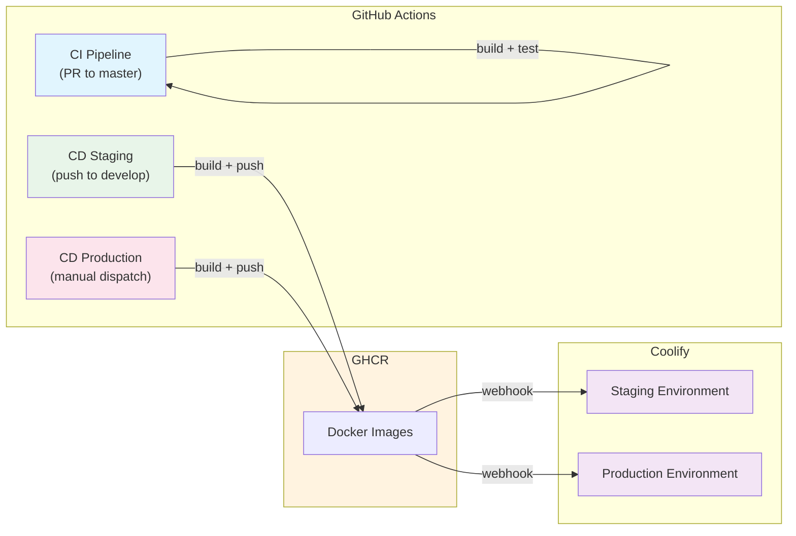

# Development Guide

This document describes the internal development workflow for team members working on this project.

For AI agent collaboration guidelines, see [AGENTS.md](../AGENTS.md).

## Table of Contents

- [Getting Started](#getting-started)
  - [Prerequisites](#prerequisites)
  - [Initial Setup](#initial-setup)
  - [Project Structure](#project-structure)
- [Development Workflow](#development-workflow)
  - [1. Branch Creation](#1-branch-creation)
  - [2. Making Changes](#2-making-changes)
  - [3. Commit Messages](#3-commit-messages)
  - [4. Pull Request Process](#4-pull-request-process)
  - [5. Post-Merge](#5-post-merge)
- [CI/CD Pipeline](#cicd-pipeline)
  - [Continuous Integration (CI)](#continuous-integration-ci)
  - [Continuous Deployment (CD)](#continuous-deployment-cd)
  - [Git Hooks](#git-hooks)
- [Code Standards](#code-standards)
  - [Linting and Formatting](#linting-and-formatting)
  - [Testing](#testing)
  - [Type Safety](#type-safety)
- [Environment Variables](#environment-variables)
- [Troubleshooting](#troubleshooting)
  - [Docker Issues](#docker-issues)
  - [Port Conflicts](#port-conflicts)
  - [Dependency Issues](#dependency-issues)
- [Resources](#resources)
- [Questions?](#questions)

## Getting Started

### Prerequisites

Ensure you have the following installed:

- Node.js (v24+)
- Docker and Docker Compose
- Git

### Initial Setup

```bash
# Clone the repository
git clone <repository-url>
cd gameplate

# Install dependencies
npm ci

# Start development environment (Docker)
make up

# Or start front and back locally via Turbo (no Docker)
make local-all
```

The development stack includes:

- **Frontend** (Next.js): <http://localhost:3000>
- **Backend** (NestJS): <http://localhost:3001>
- **PostgreSQL**: localhost:5432

### Project Structure

```
.
├── front/                      # Next.js application
│   ├── src/
│   │   ├── app/                # App router (pages and layouts)
│   │   ├── components/         # React components
│   │   ├── lib/                # Utility functions and helpers
│   │   └── game/               # Phaser 3 game domain
│   ├── public/                 # Static assets (images, fonts)
│   └── package.json            # Frontend dependencies
├── back/                       # NestJS API
│   ├── src/                    # Source code
│   │   ├── core/               # Global config, database, health checks
│   │   ├── modules/            # Feature modules (auth, game, progression, ...)
│   │   └── main.ts             # Application entry point
│   └── package.json            # Backend dependencies
├── .github/workflows/          # CI/CD pipelines
│   ├── ci.yml                  # PR validation (typecheck, lint, build, test)
│   ├── cd-staging.yml          # Auto-deploy to staging on push to develop
│   └── cd-production.yml       # Manual production deployment
├── compose.development.yaml    # Local development stack
├── compose.staging.yaml        # Staging stack (Coolify)
├── compose.production.yaml     # Production stack (Coolify)
├── Makefile                    # Common development commands
├── nginx/                      # Reverse proxy configuration
│   ├── nginx.development.conf.template
│   ├── nginx.staging.conf.template
│   └── nginx.production.conf.template
├── AGENTS.md                   # AI agent collaboration guidelines
├── CONTRIBUTING.md             # Development workflow guide
├── ARCHITECTURE.md             # System architecture and API contracts
└── docs/                       # Additional documentation
```

## Development Workflow

### 1. Branch Creation

Create short-lived branches from `master` using descriptive names:

```bash
# Feature branch
git checkout -b feat/42-user-authentication

# Bug fix branch
git checkout -b fix/login-error-handling

# Documentation branch
git checkout -b docs/api-endpoints

# Chore/maintenance branch
git checkout -b chore/update-dependencies
```

Branch naming conventions:

- `feat/<id>-<description>` — New features
- `fix/<id>-<description>` — Bug fixes
- `docs/<description>` — Documentation updates
- `chore/<description>` — Maintenance tasks
- `refactor/<description>` — Code refactoring

### 2. Making Changes

- Keep changes atomic and focused on a single concern
- Follow existing code style and patterns
- Run `make lint` before committing
- Run `make test` to verify tests pass

### 3. Commit Messages

All commits must follow [Conventional Commits](https://www.conventionalcommits.org/):

```
<type>(<scope>): <description>

[optional body]

[optional footer]
```

**Types:**

- `feat` — New feature
- `fix` — Bug fix
- `docs` — Documentation changes
- `style` — Code style changes (formatting, semicolons, etc.)
- `refactor` — Code refactoring
- `test` — Adding or updating tests
- `chore` — Maintenance tasks

**Scopes:**

- `front` — Frontend changes
- `back` — Backend changes
- `infra` — Infrastructure/Docker changes
- `docs` — Documentation changes
- `ci` — CI/CD changes

**Examples:**

```
feat(front): add phaser game scene loader
fix(back): correct JWT token expiration handling
docs(readme): update environment setup instructions
refactor(front): extract game loop into separate hook
chore(ci): add test coverage reporting
```

### 4. Pull Request Process

1. Push your branch to the remote
2. Open a Pull Request to `master`
3. Ensure CI checks pass (lint, build, test)
4. Request review from team members
5. Address feedback and update PR
6. Merge using "Squash and merge" or "Rebase and merge"

### 5. Post-Merge

- Delete your branch after merging
- Verify deployment succeeds
- Monitor for any issues

## CI/CD Pipeline

This project uses GitHub Actions for continuous integration and Coolify for continuous deployment.

### Continuous Integration (CI)

Every Pull Request triggers the following checks via `.github/workflows/ci.yml`:

| Stage | Description |
|-------|-------------|
| **Typecheck** | Validate TypeScript types across the project (`npm run typecheck`) |
| **Lint** | Run Biome linting and formatting checks (`make lint`) |
| **Build** | Validate frontend and backend builds (`npm run build`) |
| **Test** | Execute test suites (`make test`) |

All checks must pass before merging.

### Continuous Deployment (CD)



**Staging Deployment:**
- Pushes to the `develop` branch automatically trigger `.github/workflows/cd-staging.yml`
- Builds frontend and backend Docker images and pushes to GHCR with `develop` tags
- Coolify staging environment is notified via webhook and pulls the new images

**Production Deployment:**
- Production deployment is **manual** via `workflow_dispatch` on `.github/workflows/cd-production.yml`
- Builds images from `master` with `master` tags
- Coolify production environment is notified via webhook
- Requires `COOLIFY_WEBHOOK_URL_PRODUCTION` and `COOLIFY_TOKEN` secrets to be configured

### Git Hooks

Git hooks are configured to ensure code quality at different stages:

**Pre-commit:**
- **typecheck**: Validates TypeScript types across the project
- **lint-staged**: Runs Biome only on staged files (faster than full-repo lint)

**Pre-push:**
- **test**: Runs the test suite before pushing to remote

**Commit message:**
- **commit-msg**: Validates commit message format using commitlint

To bypass hooks in emergencies (not recommended):

```bash
git commit --no-verify -m "your message"
```

## Code Standards

### Linting and Formatting

This project uses Biome for linting and formatting:

```bash
# Check linting
make lint

# Fix auto-fixable issues
npm run lint:fix
```

Pre-commit hooks run `npm run typecheck` followed by `lint-staged` (Biome on staged files only).

### Testing

```bash
# Run all tests
make test

# Run tests for a specific workspace
cd front && npm test
cd back && npm test
```

### Type Safety

- Use TypeScript strict mode
- Avoid `any` types
- Define interfaces for API contracts

## Environment Variables

Copy `.env.example` to `.env` for local development:

```bash
cp .env.example .env
```

Required variables for local development are pre-configured in `compose.development.yaml`.

## Troubleshooting

### Docker Issues

```bash
# Reset development environment
make clean
make up

# Full reset (removes images and volumes)
make deep-clean
make up
```

### Port Conflicts

If ports 3000, 3001, or 5432 are already in use:

1. Stop conflicting services, or
2. Modify port mappings in `compose.development.yaml`

### Dependency Issues

```bash
# Clean install
rm -rf node_modules front/node_modules back/node_modules
rm -rf package-lock.json front/package-lock.json back/package-lock.json
npm ci
```

### Narration (Text-to-Speech)

`RESPONSIVEVOICE_API_KEY` is optional. Leave it empty (`RESPONSIVEVOICE_API_KEY=`, as in `.env.example`) and `/api/tts/synthesize` answers `503`, so the game narrates with the browser's Web Speech API. Do not use a placeholder value: any non-empty value is treated as a real key and ResponsiveVoice rejects it, so the route answers `502` on every line.

The browser voice depends on the operating system and the browser, and it does not always work out of the box. Some systems, notably Linux, need a speech engine installed at the OS level, or the browser started with a specific flag or setting, before any voice is available. To check, run this in the browser console:

```js
speechSynthesis.getVoices();
```

An empty list means the browser has no voices and narration will be silent. Install or enable a speech engine for your system and browser, then reload the page.

## Resources

- [Next.js Documentation](https://nextjs.org/docs)
- [NestJS Documentation](https://docs.nestjs.com/)
- [Phaser 3 Documentation](https://phaser.io/docs/)
- [Node.js Documentation](https://nodejs.org/docs/)
- [Biome Documentation](https://biomejs.dev/)

## Questions?

Reach out to the team lead or check the [AGENTS.md](../AGENTS.md) for AI agent collaboration guidelines.
