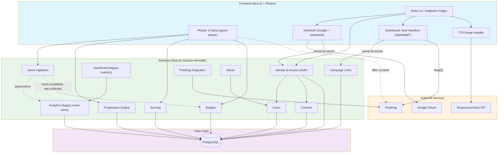
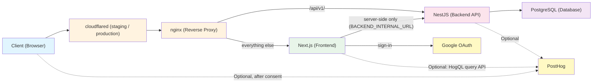

🌐 English | [Português (Brasil)](../pt-BR/ARCHITECTURE.md)

# Architecture Overview

This document outlines the architectural decisions, structural boundaries, and technology stack for Guardião da Cultura. It serves as the single source of truth for the system's technical design, replacing older structural drafts to reflect the current, modernized tooling and practical constraints of the project.

In short: a Next.js frontend with the game itself rendered by Phaser, a NestJS
API over PostgreSQL, and a React HUD layered over the game canvas. Players play
as guests, without an account; institutions sign in to their dashboard through
NextAuth.

## Table of Contents

- [1. Context & Requirements](#1-context--requirements)
  - [Functional Requirements](#functional-requirements)
  - [Non-Functional Requirements](#non-functional-requirements)
- [2. Domain Architecture](#2-domain-architecture)
  - [Domain Modules](#domain-modules)
- [3. Technology Stack](#3-technology-stack)
  - [Workspace & Tooling](#workspace--tooling)
  - [Frontend](#frontend-front)
  - [Backend](#backend-back)
  - [Optional Integrations](#optional-integrations)
- [4. Architectural Patterns & Boundaries](#4-architectural-patterns--boundaries)
  - [Deployment Topology](#deployment-topology)
  - [The Modular Monolith Approach](#the-modular-monolith-approach)
  - [Directory Structure](#directory-structure)
  - [Simplified Backend Strategy](#simplified-backend-strategy-current-pivot)
  - [Game Error & Fallback Pages](#game-error--fallback-pages)
  - [Dashboard Error & Fallback Pages](#dashboard-error--fallback-pages)
- [5. Resolved & Pending Architecture Decisions](#5-resolved--pending-architecture-decisions)
  - [Resolved](#resolved)
  - [Pending](#pending)
- [6. API Contracts](#6-api-contracts)
  - [Access Levels](#access-levels)
  - [Health Check](#health-check-health)
  - [Auth Module](#auth-module-auth)
  - [Admin Module](#admin-module-admin)
  - [Game Module](#game-module-events)
  - [Progression Module](#progression-module-progression)
  - [Scoring Module](#scoring-module-scores)
  - [Badges Module](#badges-module-badges)
  - [PostHog Module](#posthog-module-posthog)
  - [Campaign Links Module](#campaign-links-module-campaign-links)
  - [Dashboard Module](#dashboard-module-metrics)
  - [TTS Route Handler](#tts-route-handler-apittssynthesize)
  - [Planned Modules](#planned-modules)
  - [Technical Notes](#technical-notes)

## 1. Context & Requirements

### Functional Requirements
The scope of the project is a web-based educational game. Core features include:
- **Free Public Access:** Barrier-free entry for general users.
- **Game Mechanics:** Quiz-based gameplay integrated with thematic content.
- **Progression System:** Levels, achievements, and badges.
- **Contextual Assistance:** Inactivity-driven hints that keep players from getting blocked in a level without removing the sense of discovery.
- **Thematic Tracks:** Curated content paths focused on art and culture.
- **Role-Based Access:** Players are anonymous guests and have no account or role in practice. Institutions (educators) sign in to reach their dashboard. The backend also defines an `admin` role, but no sign-in path issues it today (see [Access Levels](#access-levels)).
- **Institutional Dashboard:** Aggregated data visualization for educators to track player progress. The edital dashboards (institutional and public) read PostHog through HogQL; the levels they report on — the 3 in `LEVEL_REGISTRY` plus the investigation (level 4), which isn't in the registry — and the event behind each per-level metric are listed in `DASHBOARD_LEVELS` (`front/src/lib/edital/server/levels.ts`). See `EVENTS.md` → "Métricas por fase dos dashboards".

### Non-Functional Requirements
- **Accessibility:** Native compliance in UI and content design.
- **Performance:** Fast loading times on mobile networks and compatibility with modern browsers.
- **Privacy & Security:** Minimal personal data collection. Players are identified only by a random guest id kept in `localStorage` (`front/src/lib/guestSession.ts`) and a random anonymous-player cookie, `gp_distinct_id` (set by the front middleware, read by the backend in `back/src/shared/edital/anonymous-player-cookie.ts`); their progress is kept in the browser. Gameplay events are only sent after the player accepts analytics. Institution accounts store an email address, a name, the institution name and slug, an argon2 password hash for password accounts (`back/src/modules/users/user.entity.ts`), and the record of their Terms of Use acceptance (`user_consent`). LGPD compliance is a design goal, not an audited or certified state; treat it as a requirement being worked towards rather than a claim the code already supports.
- **Scale:** Moderate complexity, targeting ~5,000 users in the first year without the immediate need for heavy distributed systems.
- **Open-Source Readiness:** The codebase is published as open source; its structure must stay clean and modular enough for outside contributors.

## 2. Domain Architecture

The system is designed around specific business domains. While physically structured as a monolith, logically, these domains remain isolated. Most of them are reached directly over HTTP; the Game module publishes each ingested event on the NestJS `EventEmitter`, and only the Analytics and Badges modules listen to it (`@OnEvent`):



### Domain Modules

1. **Identity & Access (Auth):** Institution accounts only. Email + password registration, email verification and password reset, plus server-to-server endpoints that the frontend's NextAuth uses to find or create an account after Google sign-in, finish onboarding, and record Terms of Use acceptance. Players never sign in; magic-link player login was removed in #738.
2. **Users:** The `user` table and its service: roles (`player`, `institution`, `admin`), account status, institution name and slug. It has no HTTP controller.
3. **Consent:** The `user_consent` table, recording which version of the institution Terms of Use an account accepted, and when.
4. **Game Ingestion:** Receives gameplay events from the frontend via HTTP. Event types are dotted strings such as `game.started`, `level.completed` and `star.collected` (`back/src/shared/events/game-events.ts`).
5. **Progression Engine:** Tracks player level completion, stars, clues, and chapter status. Collected clues are displayed on the evidence board overlay (Pistas).
6. **Scoring:** Manages per-level scores, score history and collected items.
7. **Badges:** Badge definitions, user-badge associations, and achievement tracking.
8. **Analytics:** Legacy Postgres store of game events, kept only as the fallback behind `GET /metrics` (see Dashboard Module). The dashboard itself reads PostHog.
9. **PostHog Integration:** Server-side event forwarding to PostHog for product analytics and error tracking, the `guest_play_enabled` kill switch, and the bootstrap endpoint for the browser SDK.
10. **Admin:** Admin-only endpoints for user management (list, role updates, status toggle).
11. **Dashboard:** The legacy `GET /metrics` endpoint for the `institution` and `admin` roles. The educator dashboard itself runs in the frontend and reads PostHog (see §5).
12. **Campaign Links:** Per-institution campaign links whose `source` label is emitted as `utm_source`, so the dashboard can group players by class or group.

## 3. Technology Stack

### Workspace & Tooling
- **Package Manager & Runtime:** [Node.js](https://nodejs.org/) with npm. The Docker images use `node:24.15.0-alpine`.
- **Versions:** `next`, `react` and `@nestjs/core` track `latest` in their `package.json`; Phaser is pinned (`4.2.1` in `front/package.json`); TypeORM is `^0.3.28` (`back/package.json`); PostgreSQL runs as `postgres:16-alpine` in every Compose stack.
- **Monorepo Orchestration:** [Turborepo](https://turbo.build/) for task caching and parallel execution.
- **Linting & Formatting:** [Biome](https://biomejs.dev/) (replaces ESLint and Prettier for unified, fast code validation).
- **Testing:** [Jest](https://jestjs.io/) as the universal test runner across the workspace.

### Frontend (`/front`)
- **Framework:** Next.js with React, using the App Router (file-based routing with React Server Components).
- **Game Engine:** Phaser 4 (encapsulated entirely within `src/game`).
- **Styling:** Material UI (MUI) v9 with Emotion for CSS-in-JS.
- **State Management:** React hooks and Zustand for UI overlay and HUD state.
- **Authentication:** NextAuth v5 (`next-auth`) with the JWT session strategy and no database adapter, for institution accounts only. Providers: Google, email + password, and email-verification links (`front/src/auth.ts`).
- **Analytics:** PostHog JS SDK, initialised only after the player accepts analytics (`front/src/components/PostHogProvider.tsx`), with autocapture off and session recording disabled (`disable_session_recording: true`, no canvas recording).
- **HTTP Client:** Axios (`front/src/lib/api/client.ts`). A request interceptor attaches the player's `x-guest-id` header and, once PostHog is loaded, the `X-PostHog-Session-ID` and `X-PostHog-Distinct-ID` headers. The client still carries a bearer-token refresh path from the removed player login; nothing sets an access token today, so it never runs.

### Backend (`/back`)
- **Framework:** NestJS with Express.
- **Database:** PostgreSQL.
- **ORM:** TypeORM with migrations managed via CLI.
- **API:** REST endpoints with DTO validation via `class-validator`. Swagger UI is served at `/api/v1/docs`.
- **Authentication:** argon2 password hashing for institution accounts; a shared-secret guard (`OAuthUpsertTokenGuard`) for the server-to-server calls from NextAuth; a global Passport JWT guard that understands `@Public()` and `@GuestPlay()` routes. See [Access Levels](#access-levels).
- **Rate Limiting:** `@nestjs/throttler`, applied per email on the auth endpoints (see [Technical Notes](#technical-notes)).
- **Observability:** PostHog Node SDK with custom exception interceptor.
- **Infrastructure:** Docker & Docker Compose for local environments; GitHub Actions for building/pushing to GitHub Container Registry (GHCR); Coolify for Deployment (CD).

### Optional Integrations

The game runs without any of these three integrations. ResponsiveVoice and PostHog ship empty in `.env.example`; the PostHog query API variables ship with placeholder values, so blank them to turn the dashboard data off.

| Integration | Variable | Without it |
|---|---|---|
| **ResponsiveVoice** (text-to-speech) | `RESPONSIVEVOICE_API_KEY` | `/api/tts/synthesize` reports itself unavailable and narration uses the browser's own `SpeechSynthesis`, in `pt-BR`. ResponsiveVoice is a paid, NonCommercial (CC BY-NC-ND) service, so the game deliberately does not depend on it. See [TTS Route Handler](#tts-route-handler-apittssynthesize). |
| **PostHog** (product analytics) | `NEXT_PUBLIC_POSTHOG_KEY`, `POSTHOG_API_KEY` | The frontend swaps in a console-logging stub and the backend skips event capture. No data leaves the machine. Outside `NODE_ENV=development`, though, the backend can no longer read the `guest_play_enabled` flag and treats it as off, so every `@GuestPlay()` route (events, progression, scores, badges) answers `401`. The game still loads: `PlayerGuard` lets the player in after a 5-second timeout when the flag is unknown. In development the flag is forced on. |
| **PostHog query API** (educator dashboard data) | `POSTHOG_PERSONAL_API_KEY`, `POSTHOG_PROJECT_ID` (`POSTHOG_QUERY_HOST` defaults to `https://us.posthog.com`) | The `/api/edital/*` route handlers raise `HogQLNotConfiguredError` and the educator dashboard has no data. The game itself is unaffected. Under `next dev`, `EDITAL_MOCK_DATA=true` (or `no-level-4`) serves canned dashboard data instead (`front/src/lib/env-server.ts`); it is ignored in any other build. |

## 4. Architectural Patterns & Boundaries

### Deployment Topology

Every request from the browser goes through nginx. In staging and production,
nginx sits behind a Cloudflare Tunnel (the `cloudflared` service in
`compose.staging.yaml` and `compose.production.yaml`); locally, nginx is exposed
directly. nginx sends `/api/v1/` to the backend and everything else to Next.js
(`nginx/nginx.production.conf.template`), so the browser's API calls reach NestJS
without passing through the Next.js server.

The Next.js server calls the backend only from server-side code — the NextAuth
callbacks, the onboarding and terms route handlers, and the campaign-link route
handlers — through `BACKEND_INTERNAL_URL` (the Compose service name), not
through nginx. PostHog is optional on both sides (see
[Optional Integrations](#optional-integrations)).



### The Modular Monolith Approach
The codebase is structured as a **Modular Monolith**.

- The repository is split top-level into `front/` and `back/`.
- Inside the backend (`/back/src`), features are grouped into domain-driven modules under `modules/` (e.g., `users`, `scoring`, `campaign-links`), while cross-cutting infrastructure such as `database` and `health` lives in `core/`.
- Inside the frontend (`/front/src`), the web UI and the Phaser game logic (`/game`) are strictly separated. The game communicates with the outer React shell, which in turn communicates with the backend.
- UI overlays (HUD, evidence board, modal panels) are centralized in React and synchronized with gameplay through a shared typed EventBus. The evidence board (`EvidenceBoardOverlay`) loads collectibles across all levels and renders them as pinned cards with SVG connections.

### Directory Structure

```text
guardiao-da-cultura/
├── front/
│   ├── src/
│   │   ├── app/              # Next.js App Router (game shell, dashboards, institution sign-in pages, API routes)
│   │   ├── components/       # React Components (UI outside the game)
│   │   ├── ui/               # HUD, panels and overlays layered over the game canvas
│   │   ├── shared/           # Typed EventBus and game events used by both the game and the UI
│   │   ├── lib/              # Utilities, API clients, env parsing, audio, consent, dashboard server code
│   │   ├── types/            # Type augmentations (NextAuth session and JWT)
│   │   ├── auth.ts           # NextAuth: Google + Credentials providers, backend callbacks
│   │   ├── auth.config.ts    # Edge-safe NextAuth config read by the middleware
│   │   ├── middleware.ts     # Maintenance rewrites, institution-only gating, anonymous-player cookie
│   │   └── game/             # Game Domain (Phaser 4)
│   │       ├── audio/
│   │       ├── constants/
│   │       ├── data/         # Level registry and static content wiring
│   │       ├── factories/    # Artwork object factories (painting, photo, poster, sculpture)
│   │       ├── mechanics/
│   │       ├── objects/
│   │       ├── scenes/
│   │       ├── systems/      # Cross-cutting gameplay systems (nudges, placeholders, spotlights)
│   │       ├── types/
│   │       └── utils/
│   │
│   └── public/assets/        # Game assets — separate licence, see ASSETS-LICENSE.md
│
└── back/
    ├── src/
    │   ├── common/           # Shared validators
    │   ├── core/             # Global configurations, Guards, Interceptors
    │   │   ├── config/
    │   │   ├── database/
    │   │   ├── email/
    │   │   ├── guards/
    │   │   ├── health/
    │   │   └── logger/
    │   │
    │   ├── shared/           # Helpers used across modules (consent and anonymous-player cookies, game event types)
    │   │
    │   ├── modules/          # Bounded Contexts (Domains)
    │   │   ├── admin/        # Admin user management
    │   │   ├── analytics/    # Game event storage & dashboard aggregates (no HTTP API)
    │   │   ├── auth/         # Institution authentication & authorization guards
    │   │   ├── badges/       # Badge definitions & user badges
    │   │   ├── campaign-links/ # Institution campaign links (utm_source)
    │   │   ├── consent/      # Terms of Use acceptance records (user_consent)
    │   │   ├── dashboard/    # Legacy aggregated metrics (/metrics)
    │   │   ├── game/         # Gameplay event ingestion
    │   │   ├── posthog/      # PostHog server-side integration
    │   │   ├── progression/  # Player progression tracking
    │   │   ├── scoring/      # Scores, score history & collected items
    │   │   └── users/        # User accounts & roles
    │   │
    │   ├── app.module.ts
    │   └── main.ts
    │
    └── package.json
```

### Simplified Backend Strategy (Current Pivot)
To accelerate development and reduce unnecessary complexity, **the Next.js frontend will handle the heavy lifting for the initial iterations of the game.** 
The NestJS backend will be heavily simplified for now. Its primary responsibilities will be restricted to:
1. Data persistence (TypeORM/PostgreSQL).
2. Institution scoping for the educator dashboard (campaign links). The dashboard's numbers come from PostHog.
3. Cross-cutting project scaffolding (global state validation that cannot be trusted to the client).

The gameplay itself will operate mostly as a client-side application (Next.js + Phaser) with periodic state synchronization to the backend. Guest progress is kept in the browser (`front/src/lib/persistence/gamePersistence.ts`); the backend answers guest writes to progression, scores and badges with a success stub and does not store them.

### Game Error & Fallback Pages
Game-styled error screens apply only to player-facing routes: the landing (`/`) and `/game`, grouped under `front/src/app/(game)/` (the route group does not change URLs). `isGameRoute` (`front/src/lib/navigation/gameRoutes.ts`) defines that scope for the middleware and the API client. All screens share `ErrorPageLayout` (`front/src/components/errors/`) and report through `reportErrorPage` (`front/src/lib/errors/reportError.ts`), tagging PostHog events with `error_page_type`.

| Scenario | Route / trigger | `error_page_type` |
|----------|-----------------|-------------------|
| Unknown `/game/*` route | `app/(game)/game/[...slug]` calls `notFound()` → `app/(game)/game/not-found.tsx` | `not_found` |
| Uncaught render error on `/` or `/game` | `app/(game)/error.tsx` | `server_error` |
| Backend down on a game route | Network error or 502/503/504 plus a failed `GET /api/v1/health` check redirects to `/game/maintenance?next=…` | `maintenance` |
| Planned maintenance | `NEXT_PUBLIC_MAINTENANCE_MODE=true`: middleware rewrites `/` and `/game/*` to `/game/maintenance` with HTTP 503. Build-time: set in `.env` locally, passed as a Docker build arg by the CD workflows (GitHub variable). Redeploy to toggle | `maintenance` |
| Game init failure | `PhaserGame` shows `GameLoadErrorScreen` with retry | — (`game_load_failed`) |
| Single asset load error | Reported only; game keeps running | `asset_load` |

`next` params are sanitized by `getSafeRedirectPath`: control characters, whitespace and backslashes are rejected, and the value must resolve to the current origin.

The maintenance page knows why it is shown:
- **scheduled** (flag on): planned-maintenance copy; polls `GET /api/maintenance` (`{ active }`) and returns to the game once a redeploy turns the flag off. No reload loop while the flag stays on.
- **outage** (flag off): polls the backend health endpoint, checking immediately on load, so a direct visit while everything is healthy returns to the game.

Polling (`useMaintenanceRecovery`) backs off 30 s → 60 s → … up to 5 min with ±30 % jitter and pauses while the tab is hidden. The page is reported once per session per reason. When the player's own connection drops (`navigator.onLine === false`) there is no redirect; `OfflineNotice` shows a toast instead. The middleware reads the flag through `lib/maintenance.ts`, not the full env schema.

The institution sign-in pages (`/login`, `/register`, `/confirm-verification`, `/reset-institution-password`) keep the generic boundaries (`app/error.tsx`, `app/global-error.tsx`); maintenance mode and outage redirects don't affect the dashboards or sign-in.

### Dashboard Error & Fallback Pages
The institutional (`/institution/*`) and public (`/public-dashboard/*`) dashboards use dashboard-styled screens from `front/src/components/errors/DashboardErrorPages.tsx`. Full-page screens share `DashboardErrorLayout` (dashboard theme, faded game logo, the shared `Footer` unless a layout already renders it); in-page states are rendered by `DashboardState` and never show raw error messages. Errors are sorted by `classifyError` (`front/src/lib/errors/classifyError.ts`) from the HTTP status or a fetch `TypeError`, and `useAsyncData` exposes the result as `errorKind`.

| Scenario | Route / trigger | Screen |
|----------|-----------------|--------|
| Unknown `/public-dashboard/*` URL | `public-dashboard/[...slug]/page.tsx` calls `notFound()` → `public-dashboard/not-found.tsx` | `DashboardNotFoundPage` |
| Unknown URL anywhere else, including `/institution/*` | `app/not-found.tsx` (site-wide, full page without the sidebar); `homeLinkFor` picks the dashboard or `/` for the button | `DashboardNotFoundPage` |
| Uncaught render error | `institution/error.tsx`, `public-dashboard/error.tsx` | `DashboardRouteErrorPage` (connection copy for network errors, 500 otherwise) |
| Session ended while on the dashboard | `InstitutionGuard` | `DashboardSessionExpiredPage` |
| Data request failed | `DashboardState` with `errorKind` | `DashboardInlineError` (network, session, not found, bad filter, server) |
| Loaded but nothing to show | `DashboardState` with `empty` | `DashboardEmptyState` |
| Rate with no denominator | `RateCard` | "—" / "Sem dados no período" |

Errors thrown by `institution/layout.tsx` itself fall through to `app/error.tsx`, which already uses the dashboard look and footer (`FullPageMessage`). Browser offline for any page is handled by `OfflineGate`.

The front container healthcheck targets `GET /api/health` (`front/src/app/api/health/route.ts`), not `/`. It only proves the Next.js server answers: it doesn't call the backend and sits outside the middleware, so maintenance mode (which answers game routes with 503) never marks the front unhealthy or keeps nginx from starting.

## 5. Resolved & Pending Architecture Decisions

### Resolved

- **Authentication Module:** Players play as guests and never sign in; the magic-link player login was removed in #738. Institutions sign in through NextAuth on the frontend, with Google (#744) or email + password (#747). Both paths call the backend server-to-server, and the resulting session is a signed NextAuth JWT cookie read by the middleware. The middleware also holds an institution out of the dashboard until it has onboarded (institution name and slug) and accepted the current Terms of Use (#338).
- **Observability & Analytics:** PostHog is integrated on both frontend (`posthog-js`) and backend (`posthog-node`) for product analytics and error tracking. Session recording is disabled, and nothing is sent before the player accepts analytics: the browser SDK is not initialised until then, and the backend checks the consent cookie before capturing. See #602 and #864.
- **Chunk Selector UI Migration (Phase 7):** The photo restoration ChunkSelector panel is implemented in React overlay, wired through the shared EventBus, and preserves keyboard interaction parity (Arrow keys + WASD for navigation, Enter/Space for confirm, Esc for close). The panel layout was refined to better balance inventory/frame space and includes automatic inventory scroll-on-navigation to keep keyboard-selected items visible.
- **MapInfoBox & Map Progression (PR #517):** The `MapInfoBox` React panel exposes three UI states (available, completed, locked) driven by the `map:marker-changed` EventBus event. `MapIntroScene` dynamically computes marker availability from `progression.completedLevels`, so Phase N unlocks only after Phase N−1 is complete. The event payload (`MapMarkerChangedData`) includes `isCompleted?: boolean`, removing `MapInfoBox`'s need for a separate Zustand `progression` selector. To handle Turbopack module isolation and React mount-timing races (React overlay mounts after `StartGame()` returns), `MapIntroScene.emitMarkerChanged()` writes directly to the Zustand store via `useGameUIStore.getState().setActiveMapMarker()` in addition to emitting the EventBus event. A dev debug shortcut (`localStorage.setItem("gameplate:debug:completedLevels", ...)`) allows pre-seeding completion state without playing through levels.
- **Server-Side TTS Proxy:** The ResponsiveVoice API key is stored as a server-only env var (`RESPONSIVEVOICE_API_KEY`) in the frontend deployment. A Next.js Route Handler (`/api/tts/synthesize`) proxies requests to ResponsiveVoice v1 REST API, returning `audio/mpeg`. This eliminates domain whitelist concerns since the proxy runs server-side. The frontend falls back to native Web Speech API (`window.speechSynthesis`) on error.
- **Contextual Nudge System (PR #733):** Anti-blocking assistance driven by player inactivity. Responsibility is split so the timing rules stay testable: `NudgeManager` (`front/src/game/systems/NudgeManager.ts`) owns *when* to nudge — a dependency-free class whose `evaluate(now, isSuppressed)` returns a boolean, governed by a 15s inactivity threshold, a 1s evaluation throttle, a global 5-minute cooldown, and a per-mission reset — while `Game.ts` owns *which kind* of nudge, chosen by proximity rather than by escalation (the delay is identical for both kinds). A pulse fires via `PlaceholderSystem.pulseNearestPlaceholder()` or `SpotlightSystem.pulseNearestSpotlight()` when an incomplete costume placeholder or spotlight sits within ~500px; otherwise the nearest artwork's `educational.hint` (from the level's `works.json`) is surfaced through the existing `ui:toast-show` EventBus event, so no bespoke overlay UI was introduced. Because `NudgeManager` has no imports, it is unit-tested in isolation (`NudgeManager.test.ts`, 15 cases covering threshold, busy suppression, activity and interaction timer resets, failed attempts, cooldown window and expiry, throttle, and per-mission reset); the `Game.ts` wiring is verified manually. Telemetry is emitted straight to PostHog as `nudge_pulse_shown_*` and `nudge_hint_shown_*`, with the firing rules documented in `EVENTS.md` (§ *Nudge — regras de disparo*).

- **Institutional Dashboard:** The educator-facing frontend lives under `/institution/*`, with a public view under `/public-dashboard/*`. Its data comes from PostHog: the frontend's `/api/edital/*` and `/api/public/dashboard` route handlers run HogQL queries server-side (`front/src/lib/edital/server/`). The backend `dashboard` module's `GET /metrics` is a legacy Postgres fallback that the dashboard does not call.

### Pending

- **Shared Contracts:** How to share TypeScript types and interfaces between `/front` and `/back` (e.g., creating a `packages/shared` workspace in Turborepo vs. duplication) is yet to be established.
- **Quiz Module:** A final quiz validation module is planned but not yet implemented.

## 6. API Contracts

All backend endpoints are prefixed with `/api/v1`. Swagger UI for the running backend is at `/api/v1/docs`.

### Access Levels

Two guards run on every route as global `APP_GUARD`s (`back/src/app.module.ts`): `JwtAuthGuard` (`back/src/modules/auth/guards/jwt-auth.guard.ts`) and `RolesGuard`. The **Auth** column in the tables below uses these levels:

| Level | Meaning |
|-------|---------|
| Public | `@Public()`: no credentials needed. |
| GuestPlay | `@GuestPlay()`: a valid bearer JWT is accepted; without one, the request passes only if the PostHog flag `guest_play_enabled` is on. The flag is read for a fixed server id and cached for 30 s (`back/src/modules/posthog/posthog.service.ts`). If PostHog is not configured or cannot answer, the guard fails closed (`401`); in `NODE_ENV=development` the flag is always on. |
| Upsert token | `@Public()` to the JWT guard, plus `OAuthUpsertTokenGuard`: the `x-oauth-upsert-token` header must match `AUTH_OAUTH_UPSERT_TOKEN` (constant-time compare; every request is refused if the variable is unset). Only the Next.js server sends it. |
| JWT + role | A valid bearer JWT whose `role` is in the route's `@Roles(...)`. |

The backend still has the code to sign access tokens (`TokenService.generateAccessToken`), but no route calls it, so no access tokens are issued today. The "JWT + role" routes (Admin and `/metrics`) are therefore unreachable in practice.

### Health Check (`/health`)

| Method | Path | Auth | Description |
|--------|------|------|-------------|
| `GET` | `/health` | Public | Returns `{ status: "ok" }`. Used by the game's outage detection and the maintenance page. |

### Auth Module (`/auth`)

Institution accounts only; players have no account. Password login and email verification are called by NextAuth's Credentials providers from the Next.js server, which carries the returned identity into its own session. Registration and password reset are called from the browser. The `/auth/oauth/*` routes are called only by the Next.js server.

| Method | Path | Auth | Description |
|--------|------|------|-------------|
| `POST` | `/auth/password/register` | Public | Register an institution account (email, password, nickname, institution, Terms of Use acceptance) and send a verification email. Returns a generic message whether or not the email is already in use. |
| `POST` | `/auth/password/login` | Public | Email + password login, institution accounts only. Returns `{ redirectTo, user }`; any other account, or an unverified one, gets a generic `401`. |
| `POST` | `/auth/password/verify-email/confirm` | Public | Consume the verification link token, verify the account and return the institution's identity. |
| `POST` | `/auth/password/reset/request` | Public | Send a password reset link if the account exists. |
| `POST` | `/auth/password/reset/confirm` | Public | Set a new password with a reset token. |
| `POST` | `/auth/oauth/upsert` | Upsert token | Find or create an institution account by email after Google sign-in. Returns `409` if the email belongs to a non-institution account. |
| `POST` | `/auth/oauth/onboarding` | Upsert token | Set the institution name once; the slug is derived on the server. Also records Terms of Use acceptance. |
| `POST` | `/auth/oauth/consent` | Upsert token | Record acceptance of the current Terms of Use for an existing institution account. |

### Admin Module (`/admin`)

`@Roles(Role.Admin)`. Currently dormant (see [Access Levels](#access-levels)).

| Method | Path | Auth | Description |
|--------|------|------|-------------|
| `GET` | `/admin/users` | JWT + `admin` | List users with pagination, search, role filter, status filter. |
| `GET` | `/admin/users/:id` | JWT + `admin` | Get user details by ID. |
| `PATCH` | `/admin/users/:id/role` | JWT + `admin` | Change user role. |
| `PATCH` | `/admin/users/:id/status` | JWT + `admin` | Activate/deactivate user. |

### Game Module (`/events`)

| Method | Path | Auth | Description |
|--------|------|------|-------------|
| `POST` | `/events` | GuestPlay | Ingest a gameplay event. The player is identified by the JWT user, else the `x-guest-id` header, else the `gp_distinct_id` cookie. Without the analytics consent cookie the event is acknowledged and discarded. |

### Progression Module (`/progression`)

| Method | Path | Auth | Description |
|--------|------|------|-------------|
| `GET` | `/progression/:userId` | GuestPlay | Get a player's progression state. |
| `PUT` | `/progression/:userId` | GuestPlay | Save a player's progression. Requests with `x-guest-id` get `{ success: true, guest: true }` and nothing is stored. |

### Scoring Module (`/scores`)

| Method | Path | Auth | Description |
|--------|------|------|-------------|
| `POST` | `/scores` | GuestPlay | Submit a score. Requests with `x-guest-id` get a stub and nothing is stored. |
| `GET` | `/scores/:userId` | GuestPlay | Get a player's score history. |
| `GET` | `/scores/:userId/:levelId` | GuestPlay | Get a player's scores for one level. |
| `GET` | `/scores/:userId/collectibles` | GuestPlay | Get a player's collected items. |
| `POST` | `/scores/:userId/collectibles` | GuestPlay | Record collected items. Requests with `x-guest-id` are not stored. |

### Badges Module (`/badges`)

| Method | Path | Auth | Description |
|--------|------|------|-------------|
| `GET` | `/badges` | Public | List all available badges. |
| `GET` | `/badges/me` | GuestPlay | Badges earned by the authenticated user; an empty list for guests. |
| `GET` | `/badges/:userId` | GuestPlay | Badges earned by a given player. |
| `POST` | `/badges/unlock` | GuestPlay | Unlock a badge for the authenticated user; guests get a stub and nothing is stored. |

### PostHog Module (`/posthog`)

| Method | Path | Auth | Description |
|--------|------|------|-------------|
| `GET` | `/posthog/bootstrap` | Public | Feature flags and distinct ID for bootstrapping the browser SDK. Before analytics consent it returns `distinctId: ""` and only `guest_play_enabled` (left out when unknown); after consent, the distinct ID is the user id, the `gp_distinct_id` cookie, the `distinct_id` query parameter or a fresh UUID, in that order. |

### Campaign Links Module (`/campaign-links`)

Server-to-server only. The routes are `@Public()` to the JWT guard but require the upsert token (`OAuthUpsertTokenGuard`). They are called from the front's `/api/edital/links` route handlers, which derive `institutionSlug` from the caller's NextAuth session, and are never reachable directly from a browser.

| Method | Path | Auth | Description |
|--------|------|------|-------------|
| `GET` | `/campaign-links?institutionSlug=` | Upsert token | List an institution's campaign links. |
| `POST` | `/campaign-links` | Upsert token | Create a link. Body: `{ institutionSlug, source }`; `source` is the group label emitted as `utm_source`. |
| `DELETE` | `/campaign-links/:id?institutionSlug=` | Upsert token | Delete one of the institution's links. `404` if it does not exist, `403` if it belongs to another institution. |

### Dashboard Module (`/metrics`)

`@Roles(Role.Institution, Role.Admin)` (`back/src/modules/dashboard/metrics.controller.ts`). This is the legacy Postgres fallback, built on the Analytics module's stored events, and kept until the PostHog-backed dashboard (#745) runs a full cycle in production. The dashboard frontend does not call it, and it is currently dormant (see [Access Levels](#access-levels)).

| Method | Path | Auth | Description |
|--------|------|------|-------------|
| `GET` | `/metrics` | JWT + `institution` or `admin` | Aggregated metrics for a date range. |

### TTS Route Handler (`/api/tts/synthesize`)

Server-side proxy for ResponsiveVoice text-to-speech, implemented as a Next.js Route Handler. The API key is stored server-only (`RESPONSIVEVOICE_API_KEY`), read from `process.env`, and never exposed to the browser.

**The key is optional.** ResponsiveVoice is a paid, NonCommercial service, so the game must run without it: with no key the route answers `503` with `code: "tts_unavailable"` and the client narrates with the browser's own `SpeechSynthesis` instead, remembering the answer so it stops re-requesting.

| Method | Path | Auth | Description |
|--------|------|------|-------------|
| `POST` | `/api/tts/synthesize` | Public | Convert text to speech. Body: `{ text: string, voice?: string, rate?: number, pitch?: number }`. Returns binary `audio/mpeg`, `503` when no key is configured, or `502` when the upstream service fails or times out. |

The key is optional, and an empty value counts as unset. Without it, the route answers `503` with `code: "tts_unavailable"`, and the client (`AudioAccessibilityService`) switches to the browser's `window.speechSynthesis` for the rest of the session. If ResponsiveVoice fails (invalid key, outage, 10s timeout), the route answers `502`, and the client uses the browser voice for that line only. The browser voice depends on the operating system and may need a speech engine installed or enabled (see [CONTRIBUTING.md](./CONTRIBUTING.md#troubleshooting)).

### Planned Modules

| Module | Status | Description |
|--------|--------|-------------|
| Quiz Final | Not implemented | End-of-journey knowledge validation. |

### Technical Notes

- **Persistence:** All server-side data is stored in PostgreSQL via TypeORM. Guest progress stays in the browser.
- **Events:** After validating an event, the Game module emits it on the NestJS `EventEmitter` under its own type and as `game.event`. `AnalyticsService` stores every `game.event` in the `game_event` table; `BadgesService` reacts to `level.completed`, `star.collected` and `badge.earned`.
- **Sessions:** Institution sessions are NextAuth JWT cookies issued and read by the frontend; the backend never sees them. Server-side route handlers read the session and call the backend with the upsert token. The backend's own JWT access-token and refresh-rotation code is left from the removed player login and is not reachable from any route. Password login still stores a refresh token (64 random bytes, SHA-256 hashed in the database, 7-day expiry) and sets cookies on its response, but that response goes to the Next.js server, not the browser.
- **Rate Limiting:** Per-email throttling (falling back to the client IP when the body has no email) through `EmailThrottlerGuard`: register 3 per hour, login 5 per 15 minutes, reset request 3 per hour. `ThrottlerModule` also declares a default of 100 requests per minute, and the Admin controller declares 30 per minute, but no `ThrottlerGuard` is registered globally, so those limits are not enforced on routes outside the three above.
- **Cookies:** Set by the backend's password login: `refresh_token` (httpOnly, SameSite=Lax, path `/api/v1/auth`, Secure only in production, 7 days) and `auth_status` (not httpOnly, SameSite=Lax, path `/`). Set by the front middleware: `gp_distinct_id` (anonymous player id, SameSite=Lax). The player's analytics choice is kept in `gp_analytics_consent`, which the backend reads before storing events or capturing to PostHog.
- **TTS API Key:** The `RESPONSIVEVOICE_API_KEY` is stored as a server-only environment variable (no `NEXT_PUBLIC_` prefix) in the frontend deployment. The Next.js Route Handler (`/api/tts/synthesize`) calls ResponsiveVoice v1 REST API (`text:synthesize` endpoint) with the key in query parameters. Audio is returned directly as `audio/mpeg` with `Cache-Control: no-store`. The frontend falls back to native Web Speech API (`window.speechSynthesis`) on error.
