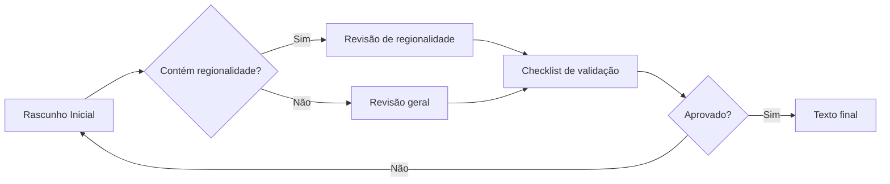

# Narrative guidelines

This document sets standards for writing the game's narratives, character lines and educational content, ensuring consistency, accessibility and respect for Brazil's cultural diversity.

---

## Goal

Ensure that all of the game's narratives follow standards of:
- **Consistency** in language and tone
- **Text accessibility** for intellectual inclusion
- **Respect for Brazil's** cultural diversity
- **Ease of production** with the help of artificial intelligence
---

## Game text types

All text must always be in Brazilian Portuguese.
The game has different categories of text, each with its own characteristics:

### 1. Inspetora Jarbas's lines
- **Source**: NPC "Inspetora Cremilda Jarbas" (the boss)
- **When it appears**: Whenever the player interacts with the NPC
- **Purpose**: Guide the player, set up context, give feedback, bring humor
- **Tone**: Professional, instructional, objective, slightly sarcastic, uses gender-neutral language (favors common-gender nouns and adjectives over masculine or feminine ones)
- **Regional flavor**: Strongly regional, adapted to the level's location, without offensive stereotypes (see the dedicated section)
- **Examples**: in Minas Gerais, using lines typical of the region's residents: "Boas-vindas ao Inhotim! Tá um trem doido aqui, tiraram os quadros do lugar, rasgaram as fotografias… Nó! Um crime!" (*"Welcome to Inhotim! Things are a crazy mess here, they moved the paintings, tore up the photographs… Gosh! A crime!"*; favors the gender-neutral "boas-vindas" over the masculine "bem-vindo"), "Uai, você arredou tudo? Demorou um tiquinho, quase criei raiz esperando…" (*"Well now, you moved it all? Took you a little bit, I nearly grew roots waiting…"*), "As pinturas, esculturas e até a fotografia estão no lugar. Milagre, porque cola você não tinha." (*"The paintings, sculptures and even the photograph are in place. A miracle, since you had no cheat sheet."*), "Podemos iniciar o teste?" (*"Shall we start the test?"*; favors the gender-neutral "podemos iniciar" over the masculine "pronto para iniciar")
- - **Expected output example**: 
```markdown
- *contextualizar em que situação dentro do jogo as falas a seguir apareceriam*
“Fala que faz sentido nesse contexto, entre aspas, incluindo regionalismo, patuá.”
“Outra string para esse contexto, dando continuidade à anterior.” [entre colchetes, descreva algum evento dentro do jogo, como a câmera focando num objeto, apenas se necessário]

- *Ao interagir com a primeira escultura, câmera acompanha o chefe andando até o jogador (entrando off-camera):*
“Entendo sua confusão, mas essa obra é assim mesmo, uma escultura sem cabeça. Não é obra de nenhum vândalo.”
“Parece que ele não danificou as obras aqui do Inhotim, apenas tirou tudo do lugar. Observe as plaquinhas informativas.” [câmera se move até uma plaquinha]
“Cada uma fala sobre uma obra em exposição. Leia sobre as obras em questão, encontre-as e leve-as até seus respectivo lugares.”

- *Começo da fase, jogador e chefe entram juntos na fase, na bilheteria do teatro:*
“O dever nos chama de novo, detetive. O pano de boca do Teatro Amazonas foi roubado.”
“Essa invasão lembra muito a que vimos no Inhotim.”
“Vamos investigar e preparar o espetáculo ao mesmo tempo.”
“Cada detalhe deste teatro conta uma história. Fique de olho no que parecer estranho.”
```

### 2. artwork labels
- **Source**: interface
- **When it appears**: Whenever the player interacts with a label
- **Purpose**: Present educational information about artworks and their artists
- **Tone**: Informative, objective, accessible
- **Regional flavor**: Contextual, neutral, following the regional-flavor rules
- **Structure**: 1 artwork title (real name and popular name) + 1 name of the creating artist (artistic names only; if there is more than one artist, separate them with a comma and a space) + 1 period (year, decade, century or "circa") + 1 description (at most 144 characters, describing the artwork and, if possible, a fact about the artist) + 1 detective opinion (see text type 3, detective impressions) + 1 error feedback (see text type 6, wrong-answer feedback)
- **Examples**: "O machado vermelho representa Xangô, justiça e poder.\n\nEssa obra homenageia um amigo que lutou com Abdias Nascimento contra o racismo.", "Pássaro livre no céu.\n\nAbdias e Gerardo foram perseguidos na ditadura. Abdias também foi poeta, professor e político indicado ao Nobel da Paz.", "Retrata em cores vibrantes Oxum, deusa das águas doces.\n\nAbdias Nascimento fundou o Teatro Experimental do Negro e o Museu da Arte Negra.", "Foto preto e branco dum curumim numa casa comunitária.\n\nClaudia retratou o cotidiano dos yanomamis. Nos anos 70, tentaram invadir suas terras."
- **Expected output example**:
```json
"abdiasn_invocacao_noturna_oxossi": {
      "id": "abdiasn_invocacao_noturna_oxossi",
      "type": "Painting",
      "metadata": {
        "title": "Invocação noturna ao poeta Gerardo Mello Mourão: Oxóssi",
        "author": "Abdias Nascimento",
        "year": "1972",
        "period": "Contemporâneo",
        "place": "Búfalo, Nova Iorque, EUA"
      },
      "educational": {
        "description": "Pássaro livre no céu.\n\nAbdias e Gerardo foram perseguidos na ditadura. Abdias também foi poeta, professor e político indicado ao Nobel da Paz.",
        "dimensions": "152 x 102 cm",
        "medium": "Acrílica sobre tela",
        "opinion": "Vejo o céu em muitos tons de azul e um pássaro voando livremente. No chão tem um arco e flecha apontando para cima.",
        "feedbackError": "Aqui deve ter algo relacionado a um pássaro no céu azul.",
        "hint": "XXXXX"
      },
      "assets": {
        "sprite": "abdiasn_invocacao_noturna_oxossi"
      }
```

### 3. detective impressions
- **Source**: protagonist
- **When it appears**: Whenever the player interacts with an artwork
- **Purpose**: Provide descriptive insights about what they find in the level (artworks and clues)
- **Tone**: Opinionated, analytical, investigative, engaging, objective, tries to be funny when possible
- **Regional flavor**: Neutral, focused on the narrative
- **Examples**: "Essa é uma foto muito legal! A luz do sol invade a oca comunitária e ilumina uma criança.", "Uma foto rasgada! Está em preto e branco e parece ser o teto de algum lugar.", "Que pintura colorida! Mostra uma linda moça coroada, com os olhos cobertos e estrelas multicor em seu peito.", "Parece muito a bandeira do Brasil com uma flecha, mas tem poucas estrelas. Está escrito “okê” várias vezes.", "Um vermelho muito forte. Me lembra uma máscara negra com uma coroa de prata, dividida por um grande machado.", "Uma escultura de uma pessoa totalmente curvada. Parece que olha para seu próprio corpo."

### 4. clues
- **Source**: protagonist
- **When it appears**: Whenever the player interacts with a clue left by the vandal
- **Purpose**: Guide the player during the game
- **Tone**: Descriptive, opinionated, direct, clear, leads toward a line of reasoning
- **Regional flavor**: Neutral, no regional flavor
- **Examples**: "Um cachimbo bem fedorento, com restos de plantas queimadas. Parece que foi usado há pouco tempo, não deve ser um item do museu.", "Já vi um negócio desses, mas não lembro onde. Com certeza não foi aqui em Minas Gerais."

### 5. correct-answer feedback
- **Source**: protagonist
- **When it appears**: Whenever the player places an artwork in the right position
- **Purpose**: Give the player immediate feedback when they get it right
- **Tone**: Celebratory, encouraging
- **Regional flavor**: Neutral, no regional flavor
- **Examples**: "Pronto! Essa é posição original da escultura. Bate com o que diz na plaquinha.", "Pronto! Essa pintura fica aqui mesmo. Bate com o que diz na plaquinha.", "As coisas já estão começando a parecer com o que era antes.", "Vou explorar mais!"

### 6. wrong-answer feedback
- **Source**: protagonist
- **When it appears**: Whenever the player places an artwork in the wrong position
- **Purpose**: Give the player immediate feedback when they get it wrong
- **Tone**: Opinionated, educational, respectful
- **Regional flavor**: Neutral, no regional flavor
- **Examples**: "Aqui deve ter algo mostrando um corpo que faz força.", "Aqui deve ter algo vermelho e relacionado a Xangô.", "Aqui deve ter algo relacionado às cores da nossa bandeira.", "Ops! A descrição da placa não bate com essa pintura.", "Melhor continuar investigando."

### 7. intro comic captions
- **Source**: interface
- **When it appears**: Whenever a level starts
- **Purpose**: Before each level begins, a comic-strip introduction with at most 4 panels appears.
- **Tone**: Narrative, contextual, objective
- **Regional flavor**: Neutral, no regional flavor
- **Structure**: 1 short title (at most 25 characters, uppercase) + 1 caption (at most 80 characters) per panel
- **Examples**: "VANDALISMO TOTAL", "Na madrugada de ontem, vândalos invadiram o Inhotim e atacaram as obras.", "A INVESTIGAÇÃO COMEÇA", "A polícia chamou detetives da região para ajudar a investigar.", "MISSÃO: BUSCAR PISTAS", "A inspetora-chefe pediu que você a acompanhasse no caso.", "DISFARCE PERFEITO", "Com roupas de zelador, sua missão é procurar pistas enquanto organiza o lugar."
- **Expected output example**:
```json
    {
      "imageSuggestion: "uma gangue de cinco encapuzados invadindo um museu na calada da noite, pixando paredes e destruindo pinturas",
      "title": "VANDALISMO TOTAL",
      "caption": "Na madrugada de ontem, vândalos invadiram o Inhotim e atacaram as obras."
    },
    {
      "imageSuggestion: "uma mão pega uma mensagem sendo impressa num aparelho de fax, com vários carimbos de confidencial, SOS, urgente",
      "title": "A INVESTIGAÇÃO COMEÇA",
      "caption": "A polícia chamou detetives da região para ajudar a investigar."
    },
    {
      "imageSuggestion: "um fusca preto avança numa estrada de terra, passando por uma placa onde se lê Inhotim, duas silhuetas são vistas dentro do carro",
      "title": "MISSÃO: BUSCAR PISTAS",
      "caption": "A inspetora-chefe pediu que você a acompanhasse no caso."
    },
    {
      "imageSuggestion: "a inspetora, classuda, cabelos brancos e vestida de roxo, observa o detetive disfarçar-se calçando luvas de limpeza dentro de uma sala de zelador, com vários objetos de faxina ao redor",
      "title": "DISFARCE PERFEITO",
      "caption": "Com roupas de zelador, sua missão é procurar pistas enquanto organiza o lugar."
    }
```

### 8. quiz questions and answers
- **Source**: interface
- **When it appears**: Whenever a challenge is completed, the player takes a short knowledge quiz
- **Purpose**: Check whether the player actually understood something about the artworks they just interacted with
- **Tone**: Educational, direct, mildly challenging, contextual, thought-provoking
- **Regional flavor**: Neutral, no regional flavor
- **Structure**: 1 question (at most 144 characters, difficulty level 1 to 3, explained below) + 4 options (at most four words each)
- **Difficulty levels**: 1 - easy: basic general knowledge that any citizen should have; 2 - medium: knowledge the player can gain by reading the labels and interacting with the game; 3 - hard: requires the player to reason and connect what they saw in the game with outside knowledge
- **Examples**: "As pinturas de Abdias Nascimento têm forte influência de qual religião?", ["umbanda", "protestantismo", "islamismo", "budismo"], "Qual fotógrafa foi ativa na luta pela demarcação das terras yanomamis?", ["Luisa Dörr", "Nair Benedicto", "Bárbara Wagner", "Claudia Andujar"]
- **Expected output example**:
```json
    {
      "id": "q2",
      "category": "Inhotim Pintura",
      "question": "As pinturas de Abdias Nascimento têm forte influência de qual religião?",
      "options": ["umbanda", "protestantismo", "islamismo", "budismo"],
      "correctOptionIndex": 0,
      "explanation": "XXXXX",
      "hint": [
        "As divindades dessa religião são chamadas orixás.",
        "Uma religião de origem africana criada no Brasil."
      ],
      "tags": ["pintura", "religiao", "abdiasn"],
      "difficulty": "easy"
    },
    {
      "id": "q4",
      "category": "Inhotim Fotografia",
      "question": "Qual fotógrafa foi ativa na luta pela demarcação das terras yanomamis?",
      "options": [
        "Luisa Dörr",
        "Nair Benedicto",
        "Bárbara Wagner",
        "Claudia Andujar"
      ],
      "correctOptionIndex": 3,
      "explanation": "XXXXX",
      "hints": [
        "Ela teve boa parte da família morta no holocausto judeu e imigrou para o Brasil ainda criança.",
        "Nasceu na cidade de Neuchâtel, na Suíça."
      ],
      "tags": ["biografia", "candujar"],
      "difficulty": "medium"
    },
```

---

## Detective (protagonist, player): base text personality

### Constant traits
The detective, the game's protagonist and the character the player controls, is a young man at the start of his career. He disguises himself as a janitor, a stagehand or a country bumpkin so he can move around without raising suspicion, but he does not use jargon because he doesn't know it. He always says what he thinks and what he sees, as a way of communicating with the player who controls him:

- **Instructional**: says whether things seem right or wrong
- **Investigative**: considers possibilities, tries to understand motives
- **Opinionated**: always makes clear what he thinks at each interaction
- **Curious**: shows genuine interest in the place and the artworks

See text type 3, "detective impressions", if needed.

### Tone of voice
- Clear, direct sentences
- Accessible, youthful vocabulary
- Tries to be funny and make puns
- Does not use technical jargon

**Examples:**
- "Vejo o céu em muitos tons de azul e um pássaro voando livremente. No chão tem um arco e flecha apontando para cima."
- "Uma escultura de uma pessoa totalmente curvada. Parece que olha para seu próprio corpo."
- "Parece muito a bandeira do Brasil com uma flecha, mas tem poucas estrelas. Está escrito “okê” várias vezes, mas “okê” isso significa?" (*pun: "okê" sounds like "o que é", "what is"*)
- "Uma foto rasgada! Está em preto e branco e parece ser o teto de algum lugar."
- "Essa é uma foto muito legal! A luz do sol invade a oca comunitária e ilumina uma criança."
- "Legal! Uma réplica da obra que vi lá fora! Opa! O que tem nesse papel aqui embaixo?"
- "O que é isso? É de metal e consigo ver meu rosto nele, como um espelho. Tem um papel aqui embaixo."
- "Um cachimbo bem fedorento, com restos de plantas queimadas. Parece que foi usado há pouco tempo, não deve ser um item do museu."
- "Já vi um negócio desses, mas não lembro onde. Com certeza não foi aqui em Minas Gerais."

---

## Inspetora Cremilda Jarbas: base text personality

### Constant traits
Inspetora Jarbas keeps her personality across all levels. She always speaks in a gender-neutral way (she avoids masculine or feminine terms as much as possible, even though the main character is a male detective and she is a woman):

- **Professional**: competent, organized, methodical
- **Instructional**: welcomes the player, says what needs to be done
- **Regionalist**: changes her way of speaking at each level, varying with the location

See text type 1, "Inspetora Jarbas's lines", if needed.

### Tone of voice
- Clear, direct sentences
- Accessible, senior vocabulary
- Encouraging tone
- Does not use technical jargon
- Uses gender-neutral language
- Keeps an appropriate professional distance

**Examples:** (level 1 in Minas Gerais, speaking as a local from Minas)
- "Boas-vindas ao Inhotim! Tá um trem doido aqui, tiraram os quadros do lugar, rasgaram as fotografias… Nó! Um crime!"
- "Já que se disfarçou de zelador, procure pistas sem chamar atenção, já basta essa bagunça que fizeram."
- "Leia as placas e coloque as obras no lugar certo."
- "Uai, você arredou tudo? Demorou um tiquinho, quase criei raiz esperando…"
- "As pinturas, esculturas e até a fotografia estão no lugar. Milagre, porque cola você não tinha."
- "Agora vem o teste. Vamos ver se você prestou atenção ou se foi só no chute. Não que eu duvide de você."
- "Uai, você sabe bastante. Merece palmas, mas sem exagero."
- "Já vimos tudo por aqui. Tomara que não aconteça outro ataque."
- "Hmm… Você se embolou nos detalhes igual um zé dend'água." (*"Hmm… You got tangled up in the details like a clueless fool."*)
- "Veja as obras, leia as placas. Tô aqui quando quiser tentar de novo."

---

## Regional flavor in dialogue

### Core principles

#### 1. Respect
Local culture must be presented with appreciation and genuine curiosity.

**Never** use derogatory terms or terms that reinforce historical prejudice.

#### 2. Naturalness
The inspector slightly adapts her way of speaking to the setting, but **does not "turn into a regional character"**. Her personality stays constant throughout the game.

#### 3. Understanding
Every line must be easy to understand for players from **any region of Brazil**. If a little-known regional word is used, its meaning must be inferable from context.

#### 4. Moderation
Regional flavor is **a seasoning, not the main course**. One or two subtle references are enough to characterize the setting.

---

### ✅ Allowed regional flavor

#### Occasional vocabulary
Occasionally use words typical of the region when they are widely recognized or easy to understand.

**Examples:**
- "Vamos conhecer melhor este trem." (not referring to a literal train; in Minas Gerais "trem" means "thing")
- "Calma aí, meu rei!" (not referring to a literal king; in Bahia "meu rei" is an affectionate "buddy")

#### Cultural references
She may mention **real** elements of local culture:
- slang
- architecture
- cuisine
- music
- popular festivities
- artists
- artworks
- traditions

**These references must come up in context.** It is not enough to say she is going to make a tacacá (a hot Amazonian broth); the player needs to understand that it is a food. Especially when the word has other meanings.

**Examples:**
- "Vou preparar um tacacá para comer." (*"I'm going to make a tacacá to eat."*)
- "Estou com fome. Vou preparar um tacacá." (*"I'm hungry. I'm going to make a tacacá."*)
- "Vou à cozinha preparar um tacacá." (*"I'm going to the kitchen to make a tacacá."*)

#### Friendly expressions
The inspector may adapt short lines:

**Examples:**
- "Te apruma para investigar, guri!" (*"Get ready to investigate, kid!"*, southern)
- "Partiu?" (*"Shall we go?"*)
- "Oxente! Quem fez isso?" (*"Oh my! Who did this?"*, northeastern)
- "Não sei, uai!" (*"I don't know, gee!"*, from Minas)
- "Que confusão, tchê!" (*"What a mess, man!"*, southern)

**Note:** There is no need to use regionalisms in every sentence.

---

### ❌ Disallowed regional flavor

#### Heavy written accent
**Avoid** spellings that try to reproduce pronunciation.

**Do not write:**
- "muié" (*for "mulher", "woman"*)
- "num vô" (*for "não vou", "I won't"*)
- "ocê" (*for "você", "you"*)

Even when these forms exist in speech, they reduce readability and tend toward caricature.

#### Intentional grammar mistakes
**Do not** bend standard written grammar to represent a way of speaking.

**Inadequate example:**
> "Nós vai resolver isso." (*"We's gonna solve this."*)

#### Cultural generalizations
**Avoid** statements that reduce a region to a single trait.

**Inadequate examples:**
> "Todo nordestino…" (*"Every northeasterner…"*)
> "O pessoal daqui sempre…" (*"People around here always…"*)
> "No Sul todo mundo…" (*"In the South everybody…"*)

**Brazil is enormously diverse.**

#### Jokes about regional identity
**Never** use regional identity as a source of humor.
The character's humor must come from the investigative situation, not from the local culture.

#### Piling up regionalisms
**Avoid** packing several regional expressions into the same line.
Even correct expressions can sound artificial when overused.

#### Stereotyped associations
**Do not** associate regions with personality or behavior traits.

**Inadequate example:**
> "Baianos são…" (*"People from Bahia are…"*)

---

### Recommended frequency

As a general rule:
- **At most two regional expressions per line**
- **Local cultural references only when they add to the narrative**
- **If an expression could cause confusion, favor a clearer alternative**

The player should sense that the inspector **knows the region and its people**.

---

## ♿ Text accessibility

### Plain language principles

All text must always be in Brazilian Portuguese.

Whenever possible:
- ✅ short sentences
- ✅ words of three syllables or fewer
- ✅ active voice
- ✅ direct word order
- ✅ one main idea per sentence
- ✅ common vocabulary
- ✅ gender-neutral language (favoring expressions, nouns and adjectives that apply to any gender over masculine or feminine forms, such as "boas-vindas" instead of "bem-vindo", "estudante" instead of "aluna")

**Avoid:**
- ❌ complex metaphors
- ❌ long, many-syllable words
- ❌ extremely local expressions
- ❌ ambiguous constructions
- ❌ technical jargon
- ❌ more than 144 characters
- ❌ artificial neutral forms ("todes", "menine", "inspetore", etc) (*coined neutral endings for "todos", "menino/menina", "inspetor/inspetora"*)

### Sentence structure
- **Subject + verb + complement** (direct order)
- **At most 20 words per sentence** (ideal)
- **Avoid complex subordinate clauses**
- **Prefer concrete, specific verbs**

---

## Practical examples

### ✅ Good examples

#### Example 1: Describing a setting
> "Boas-vindas ao Inhotim! Tá um trem doido aqui, tiraram os quadros do lugar, rasgaram as fotografias… Nó! Um crime!"

**Characteristics:**
- Welcoming tone
- Contextual information
- Accessible vocabulary
- Regional flavor applied without overdoing it
- Under 144 characters

#### Example 2: an artwork label
> "A bandeira do Brasil com símbolos da umbanda.\n\nOkê é saudação a Oxóssi, deus da mata. O ofá (arco e flecha) aponta para cima, passa firmeza."

**Characteristics:**
- Cultural information
- Accessible vocabulary
- Puts the visual artwork into words
- Under 144 characters

#### Example 2: an artwork label
> "Um vermelho muito forte. Me lembra uma máscara negra com uma coroa de prata, dividida por um grande machado."

**Characteristics:**
- Puts the visual artwork into words
- Accessible vocabulary
- Under 144 characters

---

### ❌ Bad examples

#### Example 1: Too many regionalisms
> "Oxente, visse? Aqui é tudo arretado demais! Bora simbora que esse povo sabe fazer teatro que só!"

**Problems:**
- Too many regionalisms
- Written accent
- Caricature
- Reduces local culture to clichés

#### Example 2: Generalization
> "Esse povo daqui sabe mesmo fazer festa." (*"The folks around here really know how to party."*)

**Problems:**
- Cultural generalization
- Reinforces stereotypes

#### Example 3: Written accent
> "Ocê num vai acreditá no que nóis achô." (*roughly "Ya ain't gonna believe what we done found."*)

**Problems:**
- Portuguese grammar mistakes
- Written accent
- Loss of readability
- Poor accessibility

---

## Writing and review process

### Workflow



### Mandatory human review

Every line with regional flavor must go through human review before approval.

**The review must check:**
- cultural accuracy
- absence of stereotypes
- clarity
- accessibility
- consistency with Inspetora Jarbas's personality

---

## ✅ Validation checklist

Before approval, answer the following questions:

### Educational content
- [ ] Does the text contribute to the educational context?
- [ ] Does the main part of the content come first?
- [ ] Does it use easy-to-grasp words?

### Personality and consistency
- [ ] Does the inspector's personality stay consistent?
- [ ] Is the tone of voice appropriate?

### Regional flavor (if applicable)
- [ ] Is the regional flavor subtle?
- [ ] Is there any cultural stereotype?
- [ ] Are there too many regionalisms?
- [ ] Is the cultural reference true and in context?

### Accessibility
- [ ] Can the line be understood in any region of Brazil?
- [ ] Is the language still simple and accessible?
- [ ] Are the sentences short and direct?

### Overall quality
- [ ] Is the text free of grammar mistakes?
- [ ] Is the vocabulary suitable for the target audience?
- [ ] Is the message clear and objective?

**If any answer is negative, the text must be revised.**

---

## Using Artificial Intelligence

### Guidelines for generating text

When generating lines with AI, you **must** take into account:

#### Preserving personality
- Keep the characters' constant traits
- Ensure consistency of tone and voice
- Respect the player

#### Regional flavor
- Prioritize clarity
- Use regional flavor only when it adds context
- **Avoid caricatures**
- **Avoid written accents**
- **Avoid generalizations**

#### Accessibility
- Stick to plain language
- Keep the educational focus
- Ensure universal understanding

### Base prompt for AI

```
Você é responsável por criar textos para um jogo educativo sobre arte e cultura brasileira. O público-alvo do jogo são adultos de 18 a 30 anos, incluindo pessoas com deficiência intelectual. Ao gerar qualquer texto, siga esta ordem de prioridade:

1. As regras específicas desta tarefa.
2. As diretrizes do narrative-guidelines.md.
3. Os exemplos fornecidos.
4. Seu conhecimento geral.

CONTEXTO:
- Fase [nível], no [local]
- [adicionar mais contexto, se preciso]

TAREFA:
Criar [tipo de texto] (tipo do texto [índice numérico]) para [contexto específico].

OBJETIVO PEDAGÓGICO:
[qual conhecimento o jogador deve aprender ou reforçar]

DIRETRIZES:
- Texto sempre em português brasileiro
- Usar linguagem simples e acessível
- Vocabulário comum e compreensível
- Frases curtas e diretas (antes de responder, verifique se nenhum texto ultrapassa 144 caracteres)
- Manter tom correspondente ao tipo de texto
- Caso já existam textos semelhantes no projeto, preserve o mesmo padrão de vocabulário, estrutura e nível de detalhamento (porém evite repetir exatamente a mesma estrutura ou palavras entre textos do mesmo tipo, salvo quando necessário para manter consistência)
- [Incluir/evitar] regionalidade [de tal lugar]
- Nunca invente fatos históricos, biográficos ou artísticos (caso a referência não contenha informação suficiente, sinalize a ausência de informação ou mantenha o texto genérico)
- Considere as referências fornecidas abaixo como fonte principal das informações (use conhecimento externo apenas quando não contradisser as referências e for necessário para compreender o contexto)
- Responda apenas com o conteúdo solicitado (não explique seu raciocínio nem descreva como produziu o texto)

EXEMPLO DE REFERÊNCIA:
[exemplo de texto adequado]

SAÍDA ESPERADA:
Texto em português brasileiro.
[descrição do formato de saída]

Antes de finalizar, confirme mentalmente que:

- o texto segue o tipo solicitado;
- respeita o limite de tamanho;
- usa linguagem simples;
- não contradiz as referências;
- mantém o tom definido.
```

### Reviewing AI-generated content

**AI-generated output must never be published without human review.**

**Check:**
1. **Correctness**: Is the text grammatically correct?
2. **Fit**: Does it follow the guidelines in this document?
3. **Authenticity**: Does it sound natural and genuine?
4. **Respect**: Does it avoid stereotypes and generalizations?
5. **Accessibility**: Is it understandable for the target audience?

---

## References and resources

### Game levels
1. **Level 1**: Inhotim (MG) - Baseline reference
2. **Level 2**: Teatro Amazonas (AM) - In development
3. **Level 3**: São João de Campina Grande (PB) - Narrative in development
4. **Level 4**: Teatro Guaíra (PR) - In ideation
5. **Level 5**: Palácio Itamaraty (DF) - In ideation

### Narrative and teaching goals

1. **Level 1**: present the artistic diversity of Inhotim and of Brazil in its contemporary form. It features a gay artist whose art deals with the body and transformation, a Black artist whose work celebrates and teaches about African heritage, and a foreign-born artist who became a naturalized Brazilian and whose art portrays Indigenous peoples and culture.
2. **Level 2**: explore the cultural richness of the people and heritage of Amazonas. It features local works and themes such as historical figures, playwrights and artists from the region, but also from other regions of Brazil and even other countries.
3. **Level 3**: celebrate the most widely celebrated festivity in Brazil, the festas juninas (the June festivals).
4. **Level 4**: to be defined
5. **Level 5**: to be defined

### Related documents
- [CONTRIBUTING.md](./CONTRIBUTING.md) - Development standards
- [ARCHITECTURE.md](./ARCHITECTURE.md) - System architecture
- [AGENTS.md](../../AGENTS.md) - Guidelines for AI agents

### External resources
- [Plain language (Linguagem simples)](https://www.linguagemsimples.com.br/)
- [Wikipedia style manual](https://pt.wikipedia.org/wiki/Wikipédia:Manual_de_estilo)
- [Digital accessibility guide](https://www.w3.org/WAI/)
- [MVP accessibility report](https://drive.google.com/file/d/1Hve9UIU57rbzffHo8T151RGWUC9bL8Az/view?usp=drive_link)

---

## Quality metrics

### Success indicators
- **Understanding**: Texts approved in user testing
- **Consistency**: Standardization across levels
- **Accessibility**: Compliance with plain language guidelines
- **Cultural respect**: No complaints or negative feedback

### Validation process
1. **Internal review** by the narrative team
2. **User testing** with people representative of the target audience
3. **Validation by an accessibility** specialist
4. **Final approval** by the Product Owner

---

## Maintenance and updates

This document must be updated when:
- New levels are added
- User feedback points to a need for adjustments
- New accessibility guidelines are published
- Inspetora Jarbas's personality evolves

**Maintainer**: César Augusto do Nascimento

**Last updated**: 29-06-2026

**Next review**: After level 2 is validated

