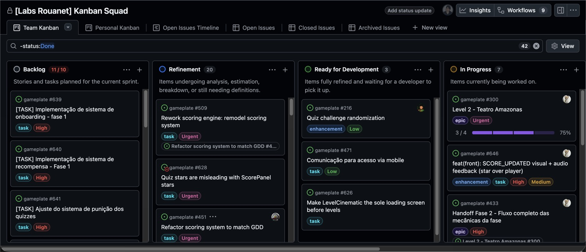

# Sessão de 30 minutos

Este é o caminho mais curto entre não conhecer o projeto e conseguir abrir a
primeira Pull Request. Siga na ordem. Cada bloco termina com uma verificação
objetiva: se ela falhar, resolva antes de seguir.

Você precisa de Node 24 ou superior, Docker, Git e a CLI `gh` instalados.

---

## 0 a 5 minutos: entender o que é isto

O projeto se chama **Labs de Games**. É um jogo educativo 2D sobre arte e
cultura brasileira, incentivado pela Lei Rouanet.

O código vive no repositório **gameplate**, um monorepo com duas partes:

| Pasta | O que é | Tecnologia |
|---|---|---|
| `front/` | O jogo e o site | Next.js, React, Phaser 3 |
| `back/` | API e banco | NestJS, TypeORM, PostgreSQL |

As duas partes são independentes e conversam por HTTP. O Turborepo orquestra os
comandos das duas.

O ponto mais importante para quem chega: **a lógica do jogo roda no navegador**.
O backend guarda progresso, agrega dados de analytics e valida o que não pode
ser confiado ao cliente. Se você for implementar mecânica de jogo, o lugar
provável é `front/src/game/`.

**Verificação:** você consegue dizer em uma frase o que roda no front e o que
roda no back.

---

## 5 a 12 minutos: rodar na sua máquina

```bash
git clone git@github.com:Labs-de-Games/gameplate.git
cd gameplate
npm ci
cp .env.example .env
make up
make db-migrate
```

Os valores padrão do `.env.example` já funcionam para desenvolvimento local.
Nenhum segredo real é necessário.

| Serviço | Endereço |
|---|---|
| Jogo | http://localhost:3000 |
| API | http://localhost:3001 |
| Banco | localhost:5432 |

Se algo falhar, o caminho de recuperação é sempre o mesmo:

```bash
make clean && make up      # reinicia containers e volumes
make deep-clean && make up # reinicia tudo, incluindo imagens
make sync                  # reinstala node_modules
```

**Verificação:** o jogo carrega em http://localhost:3000 e você consegue começar
uma partida.

---

## 12 a 18 minutos: fazer uma mudança e abrir a PR

Existem duas branches permanentes. **`develop` é onde o trabalho se acumula.**
`master` guarda o que está em produção.

Toda branch nova sai de `develop`, e toda Pull Request aponta para `develop`.

```bash
git checkout develop && git pull
git checkout -b fix/123-descricao-curta
```

Faça a mudança. Antes de commitar, rode a verificação completa:

```bash
make check
```

Commite seguindo Conventional Commits. O formato é validado automaticamente e o
commit é recusado se estiver fora do padrão:

```bash
git commit -m "fix(front): corrige ordem dos marcadores do mapa"
```

Os tipos aceitos são `feat`, `fix`, `docs`, `style`, `refactor`, `test` e
`chore`. Os escopos usados são `front`, `back`, `infra`, `docs` e `ci`.

Se a sua branch ficar para trás enquanto outras PRs entram, atualize em relação
a `develop` antes de pedir revisão:

```bash
git fetch origin
git rebase origin/develop
```

Faça o push e abra a Pull Request contra `develop`. Enquanto estiver em
rascunho, o CI não roda. Marque como pronta para revisão quando quiser a
validação.

Na descrição da PR, três coisas não são opcionais:

1. Uma seção explicando **por que** a mudança existe.
2. `Closes #N` apontando para a issue. É isso que move o card no board sozinho.
3. Vídeo ou prints de antes e depois, se a mudança for visual.

**Verificação:** o CI ficou verde e o card da issue se moveu para `In Code Review`
sem você arrastar nada.

---

## 18 a 24 minutos: entender o board

O board é o GitHub Projects v2 da organização, chamado
**[Labs Rouanet] Kanban Squad**.



As colunas são estas:

| Coluna | Significa |
|---|---|
| Backlog | Item criado, ainda não analisado |
| Refinement | Em detalhamento, definições incompletas |
| Ready for Development | Pronto para alguém pegar |
| In Progress | Alguém está codando |
| Product & Design Review | Mudança visual esperando aprovação de design |
| In Code Review | PR aberta e vinculada |
| Done | PR mergeada |

Cada item tem dois campos obrigatórios: `Priority`, que vai de `Urgent` a `Low`,
e `Effort`, que vai de `High` a `Low`.

O que você move na mão vai só até `In Progress`. Do `In Code Review` em diante,
as automações do board cuidam sozinhas, desde que a PR tenha `Closes #N`.

**Verificação:** você sabe dizer quem move o card em cada etapa, você ou a
automação.

---

## 24 a 30 minutos: como o código chega em produção

O trabalho se acumula em `develop`. A cada PR mergeada, `develop` recebe um push
e o ambiente de staging sobe sozinho.

Quando o time decide fechar uma versão, abre uma Pull Request de release que
mergeia `develop` em `master`. O título segue o padrão
`release: merge develop into master (vX.Y.Z)`.

Com `master` atualizado, o deploy de produção é disparado à mão. Alguém abre a
aba Actions, escolhe o workflow **CD Production** e clica em **Run workflow**
contra `master`.


Pela linha de comando, o equivalente é:

```bash
gh workflow run cd-production.yml --ref master
```

O workflow constrói as imagens, publica no GHCR e chama o Coolify, que faz o
deploy.

Antes de disparar, confira duas coisas. A primeira é a janela de release:
segunda das 13h às 15h, terça e quinta das 13h às 19h. A segunda é que não se
sobe nada em sexta-feira nem em véspera de feriado.

O gatilho de rollback é objetivo: taxa de erro acima de 5 por cento após o
deploy, indisponibilidade sem diagnóstico rápido, ou falha em fluxo crítico.
Reverter significa apontar o Coolify para a tag da imagem anterior.

**Verificação:** você sabe dizer o que precisa acontecer entre a sua PR ser
mergeada e a mudança chegar em produção. São dois passos, a release e o disparo
manual.

---

## Terminou. E agora?

| Se você precisa de | Vá para |
|---|---|
| Detalhe da arquitetura e do stack | [O projeto](01-o-projeto.md) |
| Problemas para rodar localmente | [Rodar local](02-rodar-local.md) |
| Padrão de commit, PR e revisão | [Fazer uma mudança](03-fazer-uma-mudanca.md) |
| Criar uma task do jeito certo | [Tarefas e board](04-tarefas-e-board.md) |
| Deploy, rollback e incidente | [Deploy](05-deploy.md) |
| Canais do Discord e notificações | [Comunicação](06-comunicacao.md) |
| O que é regra e não sugestão | [Regras](07-regras.md) |
| Comandos e links | [Referência rápida](08-referencia-rapida.md) |
