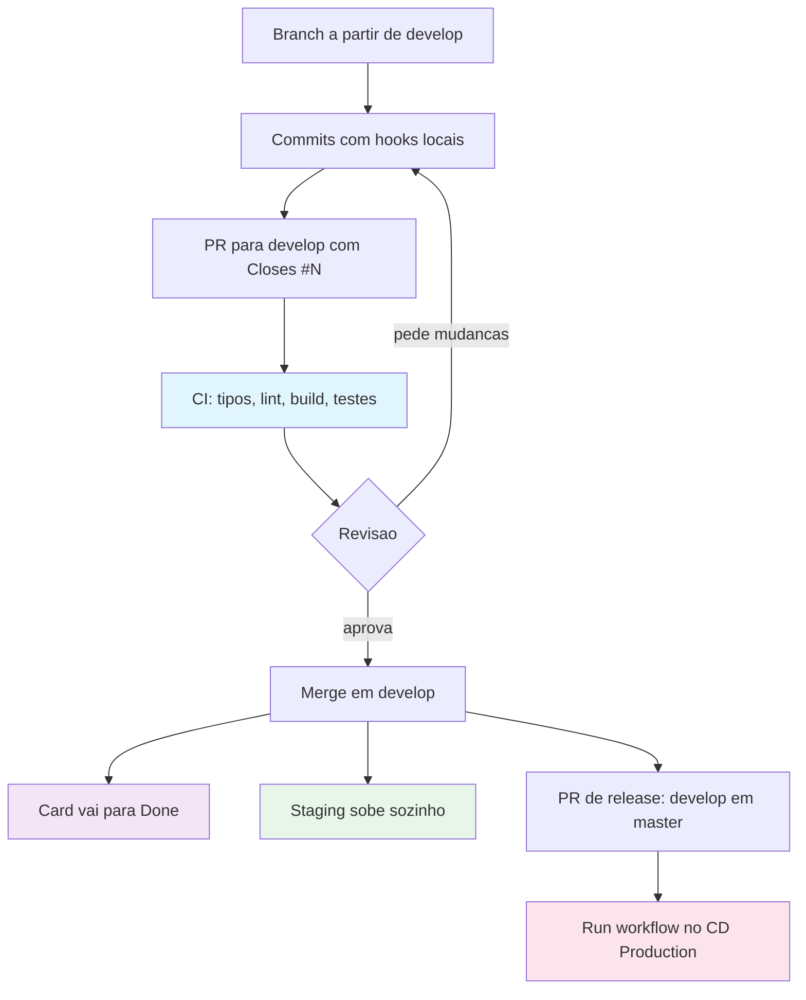
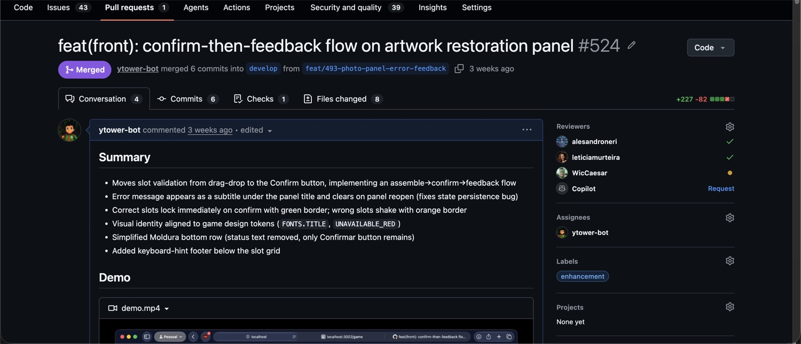
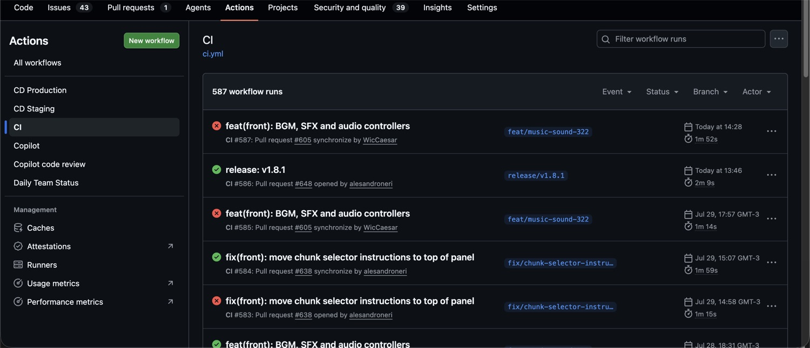

# Fazer uma mudança

## As duas branches permanentes

**`develop` é a branch de integração.** Todo trabalho novo sai dela e volta para
ela. É onde as mudanças se acumulam entre uma versão e outra.

**`master` guarda o que está em produção.** Ela só recebe conteúdo por uma Pull
Request de release, que mergeia `develop` inteira de uma vez.

## O ciclo inteiro



## Branch

Sempre a partir de `develop`:

```bash
git checkout develop && git pull
git checkout -b feat/643-sistema-de-travamento
```

| Padrão | Uso |
|---|---|
| `feat/<id>-<descrição>` | funcionalidade nova |
| `fix/<id>-<descrição>` | correção |
| `docs/<descrição>` | documentação |
| `chore/<descrição>` | manutenção |
| `refactor/<descrição>` | refatoração |

Branches são de vida curta. Delete depois do merge.

Enquanto a sua PR está aberta, outras entram em `develop`. Mantenha a sua branch
atualizada em relação a `develop` antes de pedir revisão:

```bash
git fetch origin
git rebase origin/develop
```

## Commits

Formato obrigatório, validado no hook `commit-msg`:

```
<tipo>(<escopo>): <descrição>
```

Tipos: `feat`, `fix`, `docs`, `style`, `refactor`, `test`, `chore`.
Escopos: `front`, `back`, `infra`, `docs`, `ci`.

A descrição vai em inglês, minúscula, no imperativo, sem ponto final.

```
feat(front): add phaser game scene loader
fix(back): correct JWT token expiration handling
docs(readme): update environment setup instructions
```

Um commit é uma mudança coerente. Não misture refatoração com funcionalidade
nova só porque tocou nos mesmos arquivos.

Commits não mencionam IA. Sem `Co-Authored-By`, sem referência a ferramenta. O
commit fica como se você tivesse escrito, porque a responsabilidade é sua de
qualquer forma.

## Pull Request

Abra contra `develop`. Em rascunho o CI não roda, então marque como pronta para
revisão quando quiser a validação.

O título segue o mesmo formato do commit. O corpo segue o modelo abaixo, que é o
que o time usa.

````markdown
## Summary

- Um item por mudança observável
- Comportamento, não implementação linha a linha

## Demo

Vídeo curto ou prints de antes e depois. Obrigatório para mudança visual.

## Changed files

| File | What changed |
|---|---|
| `caminho/do/arquivo.ts` | Descrição objetiva da mudança |

## Test plan

- [x] Passo concreto verificado
- [x] Caso de borda testado

## Related Issues

Closes #599
````

Escreva a PR em inglês. O histórico do repositório é em inglês mesmo com o time
falando português no dia a dia. Comentários de revisão podem ser em português.

**`Closes #N` não é opcional.** É ele que move o card do board para
`In Code Review` e depois para `Done`.

A PR 524 é a referência. Ela tem resumo por comportamento, demonstração em
vídeo, tabela de arquivos alterados e plano de teste com os itens verificados
marcados.



## Antes de pedir revisão

- `make check` passou localmente
- A branch está atualizada em relação a `develop`
- Você leu o seu próprio diff inteiro
- A PR faz uma coisa só
- Tem `Closes #N`
- Se é visual, tem demonstração

## O CI

O CI roda em quatro etapas sequenciais: verificação de tipos, lint, build e
testes. Falhou na primeira, não roda o resto. Se o seu CI quebrou logo no
começo, é verificação de tipos.



PRs em rascunho não disparam o CI. Se ele não rodou, esse é o motivo mais
provável.

## Revisão

Toda PR precisa de pelo menos uma aprovação. Mudança visual precisa de duas: uma
técnica e uma de design ou produto.

A validação é acordo de time. O repositório não tem trava automática que impeça
um merge sem revisão, então quem clica no botão é quem responde por isso.

O revisor lê a descrição antes do diff. Sem entender o problema, não dá para
avaliar a solução.

Depois, na ordem: escopo, correção, testes, padrões do projeto, execução local e
por fim performance e segurança.

| Situação | Ação |
|---|---|
| Está certo, no máximo tem detalhe de estilo | Aprovar, marcando o detalhe como não bloqueante |
| Dúvida real que muda a avaliação | Comentar e perguntar antes de julgar |
| Bug, caso não tratado, teste faltando | Pedir mudanças |
| O autor não entende o próprio código | Fechar a PR e explicar o porquê |

Comentário útil aponta arquivo e linha e descreve o problema. Em vez de "isso
parece estranho", escreva algo como: em `MapIntroScene.ts:132` o `levelId` está
fixo em `level_01`, então quem vier do nível 2 vai ter a progressão reiniciada.

Responda a uma revisão em até um dia útil. Se não vai conseguir, diga isso na PR
e passe para outra pessoa. Silêncio trava o board.

## Merge

Use "Squash and merge" para branches com histórico bagunçado, ou "Rebase and
merge" para commits limpos e atômicos. Não use merge commit. Delete a branch
depois.

## Release

Quando o time decide fechar uma versão, abre uma Pull Request que leva `develop`
inteira para `master`. O título segue o padrão
`release: merge develop into master (vX.Y.Z)`.

Essa PR agrega commits que já passaram por revisão individual, então ela não
recebe revisão linha a linha. O que se confere nela é o changelog e o escopo do
que está indo.

Depois do merge em `master`, o deploy de produção é disparado à mão. Ver
[Deploy](05-deploy.md).
