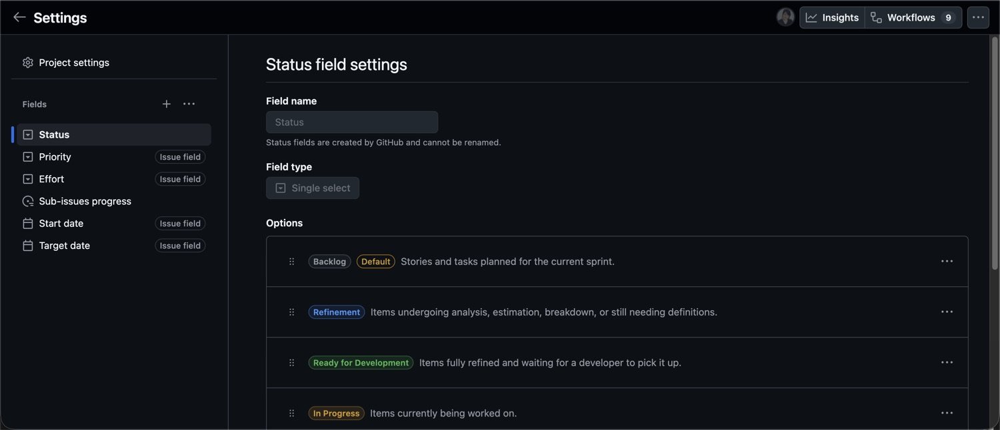
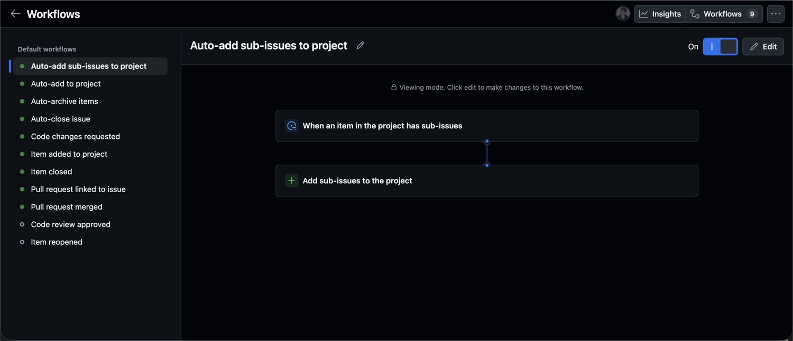
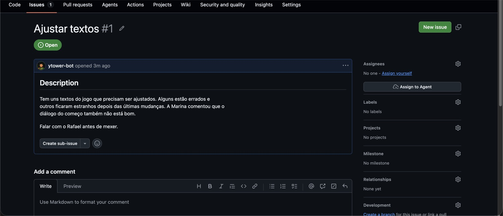

# Tarefas e board

O board é o GitHub Projects v2 da organização, projeto número 1, chamado
**[Labs Rouanet] Kanban Squad**. O repositório padrão dele é
`Labs-de-Games/gameplate`.


## Colunas

| Coluna | Significa |
|---|---|
| Backlog | Item criado, ainda não analisado. É o padrão |
| Refinement | Em detalhamento, definições incompletas |
| Ready for Development | Refinado, esperando alguém pegar |
| In Progress | Alguém está codando |
| Product & Design Review | Mudança visual esperando aprovação de design |
| In Code Review | PR aberta e vinculada |
| Done | Concluído, revisado e mergeado |

A visão principal, `Team Kanban`, esconde a coluna `Done` por um filtro. Se um
card sumiu, ele provavelmente foi concluído.

Existem ainda as visões `Personal Kanban`, `Open Issues Timeline`, `Open Issues`,
`Closed Issues` e `Archived Issues`.

## Campos

| Campo | Valores | Escopo |
|---|---|---|
| `Status` | as sete colunas acima | do projeto |
| `Priority` | Urgent, High, Medium, Low | da organização |
| `Effort` | High, Medium, Low | da organização |
| `Sub-issues progress` | calculado automaticamente | automático |
| `Start date` | data | da organização |
| `Target date` | data | da organização |



`Priority` e `Effort` pertencem à organização, não ao projeto. Só um
administrador da organização consegue mudar as opções disponíveis.

## Automações

Nove automações estão ativas. Elas mudam bastante o que você precisa fazer na
mão.



| Gatilho | Efeito |
|---|---|
| Item adicionado ao projeto | vai para `Backlog` |
| Item tem sub-issues | as sub-issues entram no board |
| PR vinculada a issue | vai para `In Code Review` |
| Revisão pedindo mudanças | volta para `In Progress` |
| PR mergeada | vai para `Done` |
| Issue fechada | vai para `Done` |
| Status vira `Done` | a issue é fechada |
| Fechado e parado há 2 semanas | é arquivado |

Duas automações estão desligadas, e as consequências importam:

**"Code review approved" está desligada.** Aprovar não move o card. Ele só sai
de `In Code Review` quando a PR for mergeada.

**"Item reopened" está desligada.** Reabrir uma issue não tira o card de `Done`.
Se reabrir algo, mova o status na mão. Este é o caso mais fácil de esquecer.

## Quem move o quê

As automações cobrem do `In Code Review` em diante. Antes disso é você.

| Momento | O que você faz |
|---|---|
| Criou a issue | Ela cai em `Backlog` sozinha. Preencha `Priority` e `Effort` |
| Começou a detalhar | Mova para `Refinement` |
| Definições completas | Mova para `Ready for Development` |
| Vai começar a codar | Atribua a si mesmo e mova para `In Progress` |
| Mudança visual pronta | Mova para `Product & Design Review` |
| Abriu a PR com `Closes #N` | Nada. A automação assume |

## Criar uma task

### Busque antes

```bash
gh issue list --search "loading screen" --state all --repo Labs-de-Games/gameplate
```

Duplicata custa mais caro que trinta segundos de busca.

### Escolha o template

Vá em Issues e depois em New issue. Existem oito templates. Blank issue aparece
apenas para mantenedores.


| Template | Prefixo | Label | Use quando |
|---|---|---|---|
| Task | `[TASK]` | task | Unidade de trabalho definida. O caso mais comum |
| Bug Report | `[BUG]` | bug | Algo está quebrado |
| Feature Request | `[FEATURE]` | enhancement | Funcionalidade nova |
| Epic | `[EPIC]` | epic | Trabalho grande que se divide em tasks |
| Refactor | `[REFACTOR]` | refactor | Melhoria que preserva comportamento |
| Performance | `[PERF]` | performance | FPS, carregamento, memória |
| Spike | `[SPIKE]` | spike | Investigação para embasar decisão |
| Discussion | `[DISCUSSION]` | discussion | Precisa de input do time |

O template já aplica a label e o prefixo do título. Não apague o prefixo.

### Escreva o título

O título diz **o que muda**, não a área onde se mexe.

| Ruim | Bom |
|---|---|
| Ajustar textos | Padronizar as falas dos NPCs do nível 2 |
| Atualizar marcadores | Corrigir ordem e nomes dos marcadores do mapa |
| Quiz do nível 2 | Implementar o quiz final do nível 2 com 5 perguntas |

### Escreva o critério de aceite

É o que separa uma task de um lembrete. Cada item precisa ser verificável.

| Não verificável | Verificável |
|---|---|
| A interface está melhor | Os marcadores aparecem na ordem 1 a 5 com o nome completo do local |
| Corrigir os textos | Nenhuma fala passa de 180 caracteres e nenhuma fica cortada no painel |
| Performance melhorada | FPS médio no nível 2 sobe de 45 para 60 no Chrome |

Se a task é visual, anexe referência: mockup, print do estado atual ou
referência de outro jogo.

### Preencha o resto

Adicione ao projeto `[Labs Rouanet] Kanban Squad`, defina `Priority` e `Effort`,
e coloque milestone se houver prazo. As milestones ativas são `MVP - pronto`,
`QA`, `V1 - pronta` e `V1 - publicação`.

**Sem `Priority` e `Effort`, a task não sai de `Refinement`.**

## Relacionamentos entre tasks

### Sub-issue, o mecanismo principal

É o único relacionamento estruturado de verdade. Abra a issue pai e use
"Create sub-issue" ou "Add existing issue".

Você ganha três coisas automaticamente: barra de progresso no card do epic, a
sub-issue entrando no board sozinha, e o card da sub-issue exibindo o pai.

A issue 423 é o exemplo. É um epic que divide o trabalho em três fases, cada uma
sendo uma sub-issue própria: 424, 425 e 426.


**Toda task que faz parte de um trabalho maior é sub-issue dele.** Sem isso, a
barra de progresso do epic mostra um número que não corresponde ao trabalho
real.

### Vínculo pela PR

`Closes #N` no corpo da Pull Request. É o que dispara as automações e fecha a
issue no merge. Para vincular sem fechar, escreva `Related to #N`.

### Menção no corpo da issue

Todos os templates têm uma seção `Issues related`. É texto livre e não automatiza
nada. Serve para dependência que não é hierarquia. O vocabulário combinado é:

| Termo | Significa |
|---|---|
| Blocked by | Esta task não avança até a outra ser resolvida |
| Blocking | Esta precisa ser resolvida antes da outra |
| Relates to | Contexto compartilhado, sem dependência dura |
| Duplicate of | Mesmo conteúdo de outra. Fechar esta |

Declare o bloqueio nos dois lados. O GitHub não faz isso sozinho.

Substitua os números de exemplo que vêm no template. Se `#1` e `#2` ficarem no
corpo, eles viram links para issues sem relação nenhuma com a sua.

O GitHub Projects não tem campo de dependência. Nada impede que uma task
bloqueada seja movida para `In Progress`, então o bloqueio existe por convenção.

## Como é uma task no padrão

A issue 571 é a referência de bug report.


O que ela tem:

- Descrição que nomeia o componente, a tela e a causa técnica
- Passos numerados para reproduzir
- Comportamento esperado e comportamento observado, separados
- Ambiente com sistema, navegadores e o commit exato
- Definition of Done com os itens já verificados marcados
- Vínculo com a issue relacionada

O critério é este: **o revisor consegue confirmar o problema sem falar com o
autor.**

## Como é uma task fora do padrão

Este é um exemplo construído para ilustrar o contraste.



O título é "Ajustar textos". A descrição inteira diz que alguns textos precisam
de ajuste, que outros ficaram estranhos, e que é para falar com alguém antes de
mexer. Não há label, projeto, milestone, responsável nem relacionamento.

O que falta:

- **Quais** textos, em que arquivos, em que telas
- **Qual** é o padrão a ser seguido
- Critério de aceite, então não dá para saber quando terminou
- Escopo fechado, então pode ser cinco strings ou quinhentas

O contexto que existe está em conversa, não na issue. Quem pegar vai ajustar o
que achar, o revisor vai discordar de metade, e a task volta para refinamento.

Os padrões de falha que se repetem:

| Padrão | Sinal |
|---|---|
| Título de área | O título nomeia um lugar do jogo, não uma mudança |
| Escopo aberto | "vários", "alguns", "uma série de" sem lista |
| Sem critério de aceite | Não dá para dizer objetivamente se está pronto |
| Template apagado | Alguém deletou as seções de definição |
| Órfã de epic | Faz parte de trabalho maior mas não é sub-issue |
| Decisão travestida de task | A decisão não foi tomada. Deveria ser discussion ou spike |
| Contexto só na conversa | A issue depende de alguém lembrar do que foi falado |

## Regras do board

**Não existe trabalho em andamento sem card em `In Progress` com responsável.**
Se você está codando e o card não está lá, ninguém sabe.

**Mova o card antes de começar, não depois de terminar.** Board atualizado no fim
do dia é relatório, não coordenação.

**Bloqueou, comente na issue no mesmo dia.** Não existe coluna de bloqueio. O
bloqueio se comunica por comentário e declaração de relacionamento.

**Atualize uma vez por dia útil o que estiver com você.** Card parado há dois
dias sem comentário nem commit é indistinguível de card abandonado.

**Card em `Done` não é revisitado.** Se o trabalho voltou, abra issue nova
referenciando a antiga.
