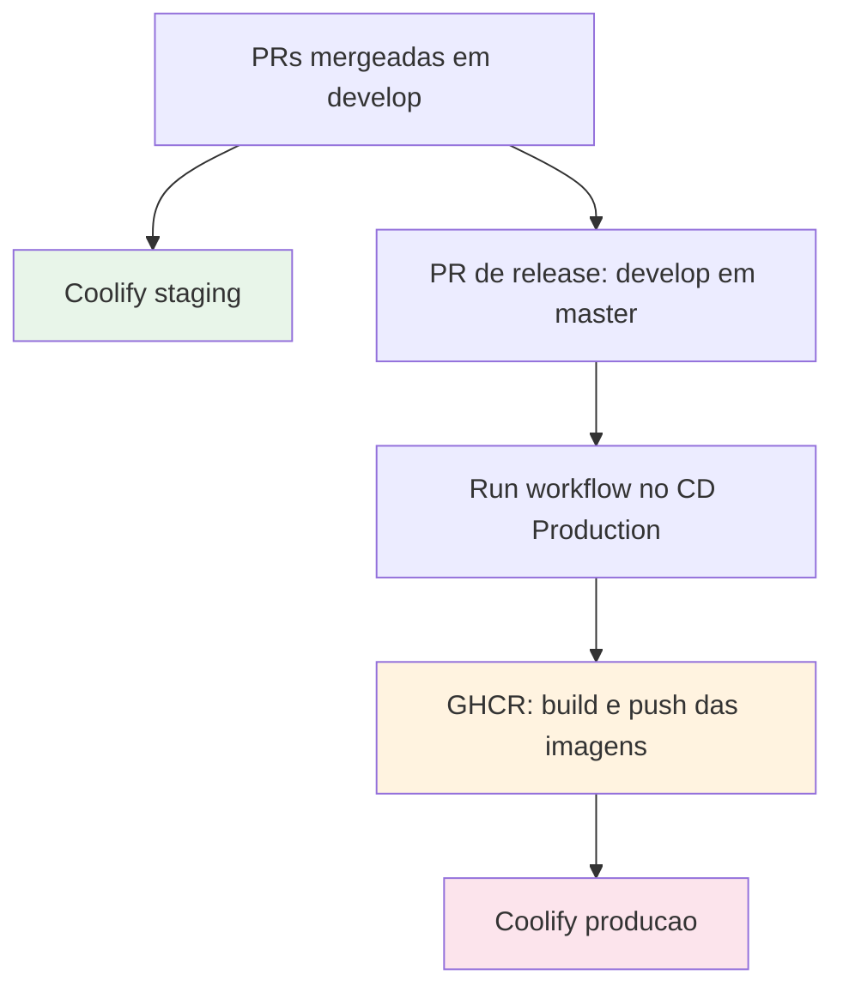
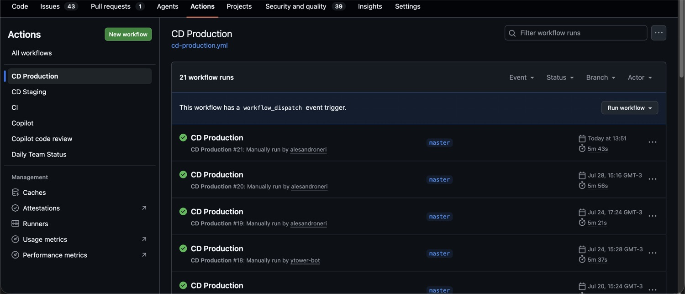

# Deploy

## Ambientes

| Ambiente | Como sobe | Imagens | Orquestrador |
|---|---|---|---|
| Local | `make up` | build local | Docker Compose |
| Staging | automático a cada merge em `develop` | GHCR `:develop` | Coolify |
| Produção | manual, pelo botão Run workflow | GHCR `:master` | Coolify |

O painel do Coolify fica em http://coolify.guardiaodacultura.42.rio/ e guarda o
histórico de versões.

Produção tem dois serviços a mais que staging: **nginx** como proxy reverso e
**cloudflared** para o túnel Cloudflare. O banco roda como serviço do compose em
todos os ambientes.

## Como funciona o pipeline



O trabalho se acumula em `develop`. Cada merge de PR é um push em `develop`, e
cada push em `develop` sobe o staging sozinho. Quando o time fecha uma versão,
uma Pull Request de release leva `develop` inteira para `master`. Só então
alguém dispara o deploy de produção.

## Imagens

As imagens vão para o GitHub Container Registry da organização:

```
ghcr.io/labs-de-games/gameplate-front
ghcr.io/labs-de-games/gameplate-back
```

Cada build gera uma tag imutável com o hash do commit e move uma tag flutuante.
Staging usa `:develop` e produção usa `:master`. É a tag imutável que você usa
para reverter.

## Deploy em staging

Automático. Cada merge em `develop` constrói as imagens, publica no GHCR e chama
o webhook do Coolify.

Não há aprovação nem janela. Staging é para quebrar.

## Deploy em produção

Manual, e só manual. O workflow `CD Production` tem `workflow_dispatch` como
único gatilho.

### Antes

- A PR de release já está mergeada em `master`
- Changelog da versão escrito em `docs/CHANGELOG.md`
- Você está dentro da janela de release
- Alguém do time disponível para acompanhar
- **Backup do banco feito**

### Janelas de release

| Tipo | Dias | Horário |
|---|---|---|
| Ordinária | Segunda | 13h às 15h |
| Ordinária | Terça e quinta | 13h às 19h |
| Nova versão maior | Quinta | 13h às 15h |
| Emergência | Qualquer dia, com aprovação | Após validação, evitando fim do dia |

Não se deploya em sexta-feira, em véspera de feriado, nem em período de alta
exposição pública.

### Disparar

Abra a aba **Actions**, escolha o workflow **CD Production** e clique em
**Run workflow** contra `master`.



Pela linha de comando, o equivalente é:

```bash
gh workflow run cd-production.yml --ref master
```

O workflow constrói as imagens do front e do back, publica no GHCR com as tags
`master-<hash>` e `master`, e chama o webhook do Coolify, que faz o deploy. A
execução leva por volta de seis minutos.

Acompanhe os logs em tempo real durante a troca. O Coolify App também publica o
status do deploy no canal de notificações do Discord. Ver
[Comunicação](06-comunicacao.md).

### Depois

- Testar as mecânicas principais e as jornadas do usuário
- Validar métricas de infraestrutura
- Conferir erros novos no PostHog
- Criar a tag e a release no GitHub

## Rollback

### Quando

Qualquer um destes basta:

- Indisponibilidade total sem diagnóstico rápido
- Falha crítica em fluxo importante
- **Taxa de erro acima de 5 por cento** nas requisições após o deploy

### Como

**1. Parar o tráfego para a versão nova.** No Coolify, fixe a variável
`IMAGE_TAG` na tag imutável do build anterior:

```
IMAGE_TAG=master-<hash-do-commit-anterior>
```

O histórico de hashes está no Coolify e nas execuções do workflow.

**2. Se houve migration, reverter.**

```bash
npm run migration:revert --workspace=back
```

O comando reverte uma migration por execução. Se o release aplicou mais de uma,
rode uma vez por migration, na ordem inversa. Confira antes se a reversão não
descarta dados criados desde o deploy.

**3. Notificar time e stakeholders.**

**4. Abrir post-mortem em até 24 horas.**

## Quando quebra em produção

1. **Confirme o escopo.** Está fora completamente ou é um fluxo específico? Use
   o PostHog para erros de front e os logs do Coolify para o back.

2. **Decida em até 10 minutos: corrigir ou reverter.** Sem diagnóstico claro
   nesse tempo, reverta. Diagnóstico se faz com o sistema no ar.

3. **Reverta** pelo procedimento acima.

4. **Comunique**, mesmo que o rollback tenha funcionado.

5. **Abra issue** com o template de Bug Report e o link do erro no PostHog.

6. **Post-mortem em 24 horas**, sem apontar culpado.

Para hotfix, a branch sai de `master` e a PR volta para `master`, porque a
correção precisa chegar em produção sem esperar o ciclo de release:

```bash
git checkout master && git pull
git checkout -b hotfix/v1.8.2
git push -u origin hotfix/v1.8.2
gh pr create --base master
```

Depois de mergear o hotfix em `master`, traga a correção de volta para `develop`
para que ela não se perca na próxima release.

Hotfix passa por PR e CI. A única exceção permitida é a revisão acontecer depois
do merge, em até 24 horas.

## Versionamento

O projeto usa SemVer. Toda release gera tag imutável e entrada no changelog. As
últimas foram v1.8.1, v1.8.0, v1.7.0, v1.6.1 e v1.6.0.

| Incremento | Quando |
|---|---|
| Maior | Mudança incompatível |
| Menor | Funcionalidade nova compatível |
| Correção | Correção compatível |

## Segredos

No GitHub, em Settings e depois Secrets and variables:

| Nome | Tipo |
|---|---|
| `COOLIFY_TOKEN` | segredo |
| `COOLIFY_WEBHOOK_URL_STAGING` | segredo |
| `COOLIFY_WEBHOOK_URL_PRODUCTION` | segredo |
| `NEXT_PUBLIC_POSTHOG_KEY` | variável |
| `NEXT_PUBLIC_POSTHOG_HOST` | variável |

As chaves do PostHog são variáveis e não segredos porque vão para o pacote do
navegador de qualquer forma.

No Coolify ficam os segredos de execução: `JWT_SECRET`, `MAGIC_LINK_SECRET`,
`DATABASE_URL`, credenciais do Postgres e do Gmail, `POSTHOG_API_KEY`,
`RESPONSIVEVOICE_API_KEY` e `CLOUDFLARE_TUNNEL_TOKEN`.

Duas armadilhas:

**`JWT_SECRET` e `MAGIC_LINK_SECRET` vêm com valor de exemplo.** Em staging e
produção eles precisam ser valores rotacionados de verdade.

**`RESPONSIVEVOICE_API_KEY` não é passada por nenhum workflow de CD.** Ela existe
apenas no ambiente de execução do Coolify. Se a narração parar em staging ou
produção, esse é o primeiro lugar para olhar.

## Quem dispara

Todos os dez colaboradores são administradores e podem disparar o deploy de
produção pelo botão Run workflow. Na prática o disparo fica com quem conduziu a
release.
