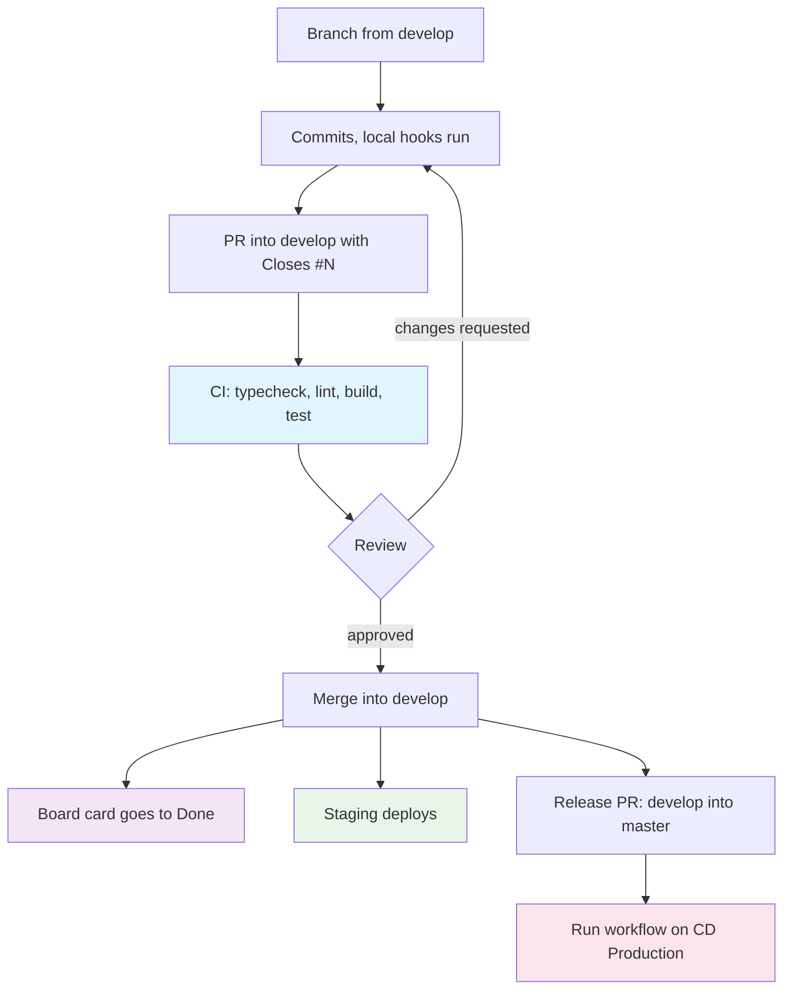

# Making a change

## Sequence



## Branch

Always from `develop`. `develop` is the integration branch; `master` only
receives the release PR.

```bash
git checkout develop && git pull
git checkout -b feat/123-floor-locking-system
```

| Pattern | Use |
|---|---|
| `feat/<id>-<description>` | New feature |
| `fix/<id>-<description>` | Bug fix |
| `docs/<description>` | Documentation |
| `chore/<description>` | Maintenance |
| `refactor/<description>` | Refactor |

Delete the branch after merge.

Other PRs land in `develop` while yours is open. Rebase before requesting
review:

```bash
git fetch origin && git rebase origin/develop
```

## Commits

```
<type>(<scope>): <description>
```

Validated by the `commit-msg` hook via commitlint.

Types: `feat`, `fix`, `docs`, `style`, `refactor`, `test`, `chore`.
Scopes: `front`, `back`, `infra`, `docs`, `ci`.

English, lowercase, imperative, no trailing period.

```
feat(front): add phaser game scene loader
fix(back): correct JWT token expiration handling
docs(readme): update environment setup instructions
```

One commit is one coherent change.

**Never add `Co-Authored-By` or any AI attribution.** The commit must read as
written by the human who owns it.

## Pull Request body

No `PULL_REQUEST_TEMPLATE.md` is versioned. Use this structure. PR 524 is the
reference implementation of it.

````markdown
## Why

The problem that existed before this PR. A reader who missed the discussion
must understand why this is needed.

## Summary

- One bullet per observable change
- Behavior, not line by line implementation

## How to Test

Concrete steps. If a constant must be flipped to test, show the diff:

```diff
-      export const LEVEL_02_ENABLED = false;
+      export const LEVEL_02_ENABLED = true;
```

## Demo

Short video or before and after screenshots. Mandatory for visual changes.

## Test plan

- [x] Typecheck passes
- [x] Test suite passes
- [ ] CI green

## Related Issues

Closes #599
````

Write PRs in English. Review comments may be in Portuguese.

`Closes #N` is mandatory. Without it, no board automation fires.

## CI

Triggered on `pull_request` for opened, synchronize, reopened and
ready_for_review. Skipped entirely while the PR is a draft.

Four sequential steps on `ubuntu-latest` with Node 24.15.0:

1. `npm ci`
2. `npm run typecheck`
3. `npm run lint`
4. `npm run build`
5. `npm run test`

A failure stops the rest. An early failure is almost always typecheck.

There is no coverage job, no Node version matrix, and no remote Turborepo cache.

## Review

| Requirement | Value |
|---|---|
| Minimum approvals | 1 |
| Visual change | 2, one technical and one design or product |
| Response time | 1 business day |
| Author self approval | Not allowed |

Review order: read the description, then scope, correctness, tests, project
conventions, local execution, then performance and security.

| Situation | Action |
|---|---|
| Correct, at most a style nit | Approve, mark the nit as non blocking |
| Real question that changes the assessment | Comment, ask before judging |
| Bug, unhandled case, missing test | Request changes |
| Author cannot explain their own code | Close the PR and say why |

Comments must cite file and line. Replace "this looks odd" with the concrete
failure, for example: `MapIntroScene.ts:132` hardcodes `levelId` to `level_01`,
so a player arriving from level 2 has their progression reset.

## Merge

Squash and merge for messy history, rebase and merge for clean atomic commits.
Never a merge commit. Delete the branch.

## Release

When the team closes a version, a Pull Request takes all of `develop` into
`master`, titled `release: merge develop into master (vX.Y.Z)`.

That PR aggregates commits already reviewed individually, so it is not reviewed
line by line. What is checked is the changelog and the scope of what ships.

After the release PR merges, production is dispatched manually. See
[Deploy](05-deploy.md).

## Agent constraint

Merges are a team agreement, not an automated gate. Never push to `develop` or
`master`, never merge, and never open a PR without explicit human confirmation.
