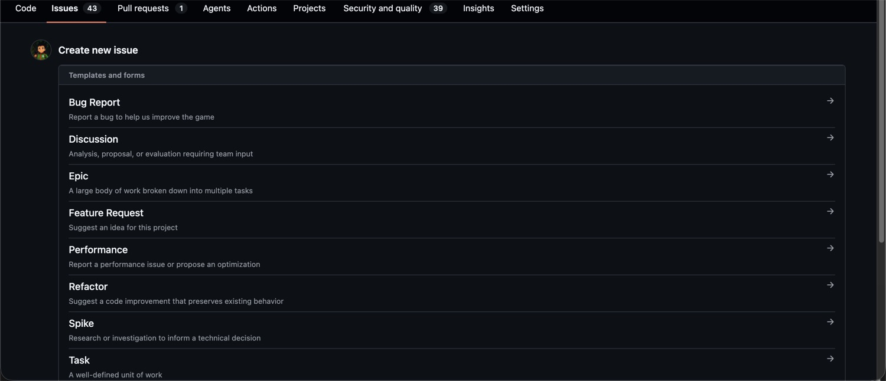
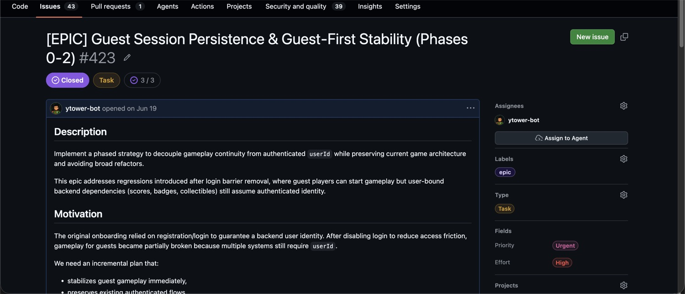
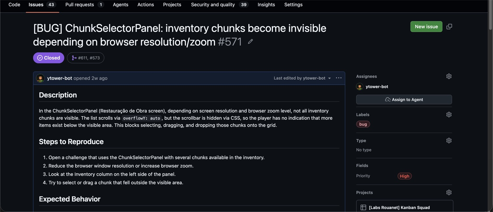

# Tasks and board

Board: GitHub Projects v2, organization `Labs-de-Games`, project 1,
`[Labs Rouanet] Kanban Squad`. Default repository `Labs-de-Games/gameplate`.


## Status values

| Status | Meaning |
|---|---|
| Backlog | Created, not analyzed. Default |
| Refinement | Being analyzed, definitions incomplete |
| Ready for Development | Refined, waiting to be picked up |
| In Progress | Being worked on |
| Product & Design Review | Visual change awaiting design approval |
| In Code Review | PR open and linked |
| Done | Completed, reviewed, merged |

The `Team Kanban` view filters `Done` out with `-status:Done`. A card that
disappeared was probably completed.

## Fields

| Field | Type | Values | Scope |
|---|---|---|---|
| `Status` | single select | the seven above | project |
| `Priority` | single select | Urgent, High, Medium, Low | organization |
| `Effort` | single select | High, Medium, Low | organization |
| `Sub-issues progress` | computed | `N/M` and percent | automatic |
| `Start date` | date | | organization |
| `Target date` | date | | organization |

`Priority` and `Effort` are organization level issue fields. Only an org admin
can change their options. Do not attempt to add new values through the board.

## Active automations

| Trigger | Effect |
|---|---|
| Item added to project | Status becomes `Backlog` |
| Item has sub-issues | Sub-issues are added to the project |
| PR linked to issue | Status becomes `In Code Review` |
| Review requests changes | Status becomes `In Progress` |
| PR merged | Status becomes `Done` |
| Item closed | Status becomes `Done` |
| Status set to `Done` | Issue is closed |
| Closed and untouched 2 weeks | Item is archived |

Two automations are **disabled**:

- **Code review approved.** Approving does not move the card. Only merging does.
- **Item reopened.** Reopening an issue does not pull the card out of `Done`.
  Move `Status` manually.

## Ownership of transitions

Automations cover `In Code Review` onward. Everything before is manual.

| Moment | Manual action |
|---|---|
| Issue created | Lands in `Backlog`. Set `Priority` and `Effort` |
| Analysis starts | Move to `Refinement` |
| Definitions complete | Move to `Ready for Development` |
| Work starts | Self assign and move to `In Progress` |
| Visual change ready | Move to `Product & Design Review` |
| PR opened with `Closes #N` | Nothing. Automation takes over |

## Creating an issue

Search first:

```bash
gh issue list --search "<term>" --state all --repo Labs-de-Games/gameplate
```

Eight templates exist. Blank issue is visible to maintainers only.



| Template | Title prefix | Label |
|---|---|---|
| Task | `[TASK]` | task |
| Bug Report | `[BUG]` | bug |
| Feature Request | `[FEATURE]` | enhancement |
| Epic | `[EPIC]` | epic |
| Refactor | `[REFACTOR]` | refactor |
| Performance | `[PERF]` | performance |
| Spike | `[SPIKE]` | spike |
| Discussion | `[DISCUSSION]` | discussion |

Rules for the issue body:

- Keep the title prefix the template inserts.
- Title states what changes, not the area touched.
- Acceptance criteria are mandatory and must be verifiable. Replace "UI is
  better" with "markers appear in order 1 to 5 with the full location name".
- Replace the template placeholder issue numbers. Leaving `#1` and `#2` links to
  unrelated issues.
- Set `Priority` and `Effort` before leaving `Refinement`.

Creating from the CLI skips the template, so paste the body:

```bash
gh issue create --repo Labs-de-Games/gameplate \
  --title "[TASK] ..." --label task --body-file body.md
```

Setting Projects v2 fields requires `gh api graphql` and the `project` scope:

```bash
gh auth refresh -s read:project -s project
```

## Relationships

### Sub-issues

The only structured relationship. Open the parent and use "Create sub-issue" or
"Add existing issue".



Gives you: progress bar on the epic card, automatic board insertion for the
sub-issue, and parent display on the child card. Nesting works: an epic can
itself be a sub-issue of a larger one.

Issue 423 is the reference: an epic split into three phases, each one its own
sub-issue, numbers 424, 425 and 426.

Any task that is part of larger work must be a sub-issue of it. Otherwise the
epic progress bar reports a number that does not match the real work.

### PR linkage

`Closes #N` in the PR body. Also accepts `Fixes` and `Resolves`. Use
`Related to #N` to link without closing.

### Free text

Every template has an `Issues related` section. It automates nothing. Agreed
vocabulary: `Blocked by`, `Blocking`, `Relates to`, `Duplicate of`. Declare
blocks on both issues, GitHub does not mirror them.

GitHub Projects has no dependency field. Nothing prevents moving a blocked task
to `In Progress`.

## Reference issues

| Issue | Why |
|---|---|
| 571 | Bug report: names the component and the technical cause, numbered repro steps, expected versus actual, environment with the exact commit |
| 423 | Epic split into three phases, each one a sub-issue, with acceptance criteria at the epic level |



Failure patterns to detect and reject:

| Pattern | Signal |
|---|---|
| Area title | Title names a place in the game, not a change |
| Open scope | "several", "some", "a number of" with no list |
| No acceptance criteria | Cannot objectively say it is done |
| Template deleted | Definition sections removed |
| Orphan of an epic | Part of larger work, not a sub-issue |
| Decision disguised as a task | Should be a discussion or spike |
