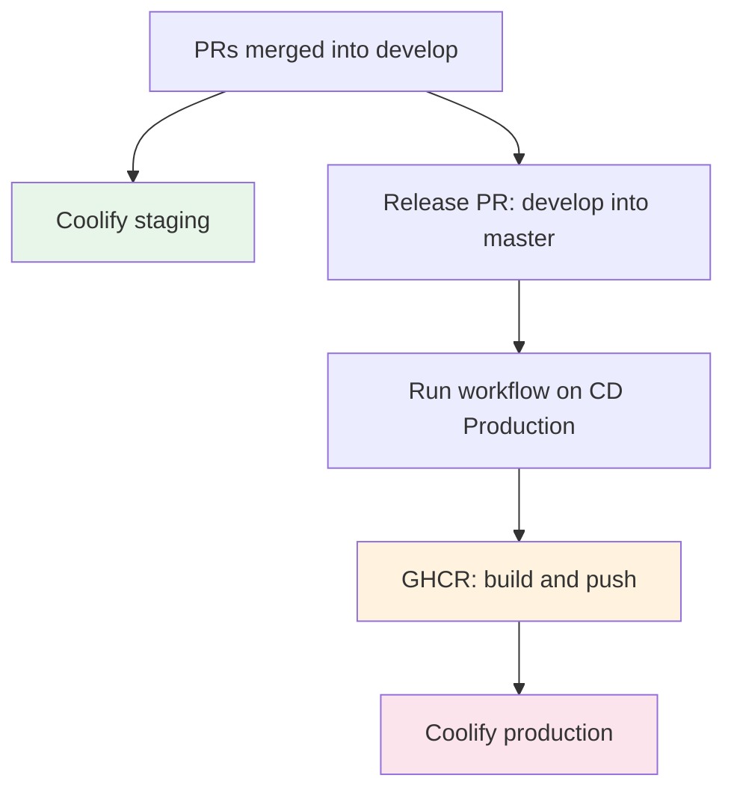

# Deploy

## Environments

| Environment | Trigger | Images | Orchestrator |
|---|---|---|---|
| Local | `make up` | local build | Docker Compose |
| Staging | every merge into `develop`, automatic | GHCR `:develop` | Coolify |
| Production | manual, Run workflow on CD Production | GHCR `:master` | Coolify |

Coolify dashboard: http://coolify.guardiaodacultura.42.rio/

Production adds two services over staging: nginx as reverse proxy and
cloudflared for the Cloudflare tunnel. PostgreSQL runs as a compose service in
every environment.

## Pipeline



Work accumulates in `develop`. Every merged PR is a push to `develop`, and every
push to `develop` deploys staging. When the team closes a version, a release PR
takes all of `develop` into `master`. Only then does someone dispatch
production.

## Images

```
ghcr.io/labs-de-games/gameplate-front
ghcr.io/labs-de-games/gameplate-back
```

Each build produces an immutable tag with the short commit SHA plus a floating
tag. Compose files default to the floating tag:

```yaml
image: ghcr.io/labs-de-games/gameplate-front:${IMAGE_TAG:-master}
```

Both Dockerfiles are four stage builds using `turbo prune` to isolate the
workspace. Base image `node:24.15.0-alpine`. The build context is the monorepo
root, not the workspace directory.

## Production deploy

Manual only. `cd-production.yml` has `workflow_dispatch` as its only trigger.

### Before

- The release PR is already merged into `master`
- Changelog written in `docs/CHANGELOG.md`
- Inside a release window
- Someone available to watch
- Database backup taken

### Release windows

| Type | Days | Hours |
|---|---|---|
| Ordinary | Monday | 13:00 to 15:00 |
| Ordinary | Tuesday, Thursday | 13:00 to 19:00 |
| Major version | Thursday | 13:00 to 15:00 |
| Emergency | Any day, with approval | After validation, avoid end of day |

Never Friday. Never the day before a holiday. Never during high public exposure.

### Dispatch

Open the Actions tab, pick the **CD Production** workflow and click
**Run workflow** against `master`. The CLI equivalent:

```bash
gh workflow run cd-production.yml --ref master
```

The workflow builds both images, pushes them to GHCR tagged `master-<sha>` and
`master`, then calls the Coolify webhook. A run takes around six minutes.

The Coolify App also posts deploy status to the Discord notifications channel.
See [Communication](06-communication.md).

### After

- Exercise the main mechanics and user journeys
- Check infrastructure metrics
- Check PostHog for new errors
- Create the tag and GitHub release

## Rollback

Triggers, any one is enough:

- Total outage without fast diagnosis
- Critical flow failure
- Error rate above 5 percent after deploy

Procedure:

1. Pin `IMAGE_TAG` in Coolify to the previous immutable tag:
   `IMAGE_TAG=master-<previous-sha>`
2. If migrations ran, revert them:
   `npm run migration:revert --workspace=back`
   This reverts one migration per invocation. Run it once per migration in
   reverse order. Verify the revert does not drop data created since the deploy.
3. Notify team and stakeholders
4. Open a post mortem within 24 hours

## Incident response

1. Scope it. PostHog for frontend errors, Coolify logs for the backend.
2. Decide within 10 minutes: fix forward or roll back. Without a clear
   diagnosis, roll back. Diagnose with the system up.
3. Roll back using the procedure above.
4. Communicate even if the rollback worked.
5. Open an issue with the Bug Report template and the PostHog error link.
6. Post mortem within 24 hours, blameless.

Hotfix branches come from `master` and target `master`, because the fix must
reach production without waiting for the release cycle:

```bash
git checkout master && git pull
git checkout -b hotfix/v1.8.2
git push -u origin hotfix/v1.8.2
gh pr create --base master
```

After merging a hotfix into `master`, port the fix back into `develop` so it is
not lost in the next release.

Hotfixes still go through PR and CI. The only permitted exception is review
happening after merge, within 24 hours.

## Secrets

GitHub Actions, under Settings then Secrets and variables:

| Name | Kind |
|---|---|
| `COOLIFY_TOKEN` | secret |
| `COOLIFY_WEBHOOK_URL_STAGING` | secret |
| `COOLIFY_WEBHOOK_URL_PRODUCTION` | secret |
| `NEXT_PUBLIC_POSTHOG_KEY` | variable |
| `NEXT_PUBLIC_POSTHOG_HOST` | variable |

PostHog keys are variables, not secrets, because they ship in the browser bundle
regardless.

Coolify runtime holds `JWT_SECRET`, `MAGIC_LINK_SECRET`, `DATABASE_URL`,
Postgres and Gmail credentials, `POSTHOG_API_KEY`, `RESPONSIVEVOICE_API_KEY`,
`CLOUDFLARE_TUNNEL_TOKEN`, `POSTHOG_PERSONAL_API_KEY`, `POSTHOG_PROJECT_ID`,
`POSTHOG_QUERY_HOST`, `POSTHOG_QUERY_CACHE_TTL_MS`, `AUTH_SECRET`,
`AUTH_TRUST_HOST`, `AUTH_GOOGLE_ID`, `AUTH_GOOGLE_SECRET` and
`AUTH_OAUTH_UPSERT_TOKEN`.

`JWT_SECRET` and `MAGIC_LINK_SECRET` ship as `change-me-in-production` in
`.env.example`. They must be rotated values in staging and production.

`RESPONSIVEVOICE_API_KEY` is not passed by any CD workflow. It exists only in
the Coolify runtime. Check there first when text to speech fails.

`POSTHOG_PERSONAL_API_KEY` is a personal `phx_` PostHog key (Query API, not the
ingestion `phc_` write key above) used only by the `/institution` edital
dashboard's Next.js route handlers — server-only, never `NEXT_PUBLIC_*`. It is
a front-service runtime secret, same shape as `RESPONSIVEVOICE_API_KEY`: not
passed by any CD workflow, exists only in the Coolify runtime.
`POSTHOG_PROJECT_ID` and `POSTHOG_QUERY_HOST` are its non-secret companions
(project id, and the Query API host — **not** the same as `POSTHOG_HOST`
above, which is the ingestion host and doesn't serve `/api/projects/*`).
`POSTHOG_QUERY_CACHE_TTL_MS` calibrates the edital dashboard's per-instance
cache; see the open question below about replica count before tuning it.

`AUTH_SECRET` and `AUTH_TRUST_HOST` are NextAuth.js requirements for the same
dashboard; `AUTH_TRUST_HOST` must be set because the app runs behind the
nginx reverse proxy — this project uses `AUTH_TRUST_HOST` instead of setting
`AUTH_URL` explicitly, since NextAuth v5 derives the canonical URL from the
proxy's forwarded headers once trusted. `AUTH_GOOGLE_ID`/`AUTH_GOOGLE_SECRET`
are the Google OAuth client credentials for institution sign-in.
`AUTH_OAUTH_UPSERT_TOKEN` is a shared secret **required on both the front and
back services** for the institution-account upsert endpoint — the front
sends it, the back verifies it with a constant-time compare. See
`docs/specs/dashboard-edital-implementation-plan.md` step 1 for the full
rationale.

**Open question, not yet answered:** how many front replicas does Coolify run
in production? The edital dashboard's query cache is per Next.js instance
(see #742), so replica count directly multiplies upstream PostHog query
volume and should inform `POSTHOG_QUERY_CACHE_TTL_MS`. Check the Coolify
service configuration and record the answer here.

## Who dispatches

All ten collaborators are admins and can dispatch a production deploy. In
practice the dispatch belongs to whoever ran the release.
