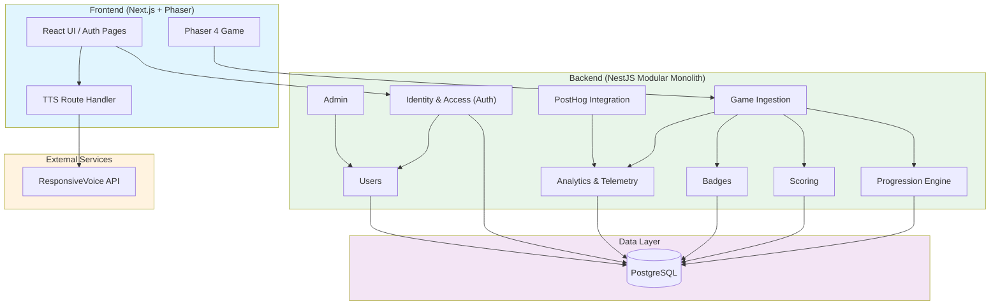
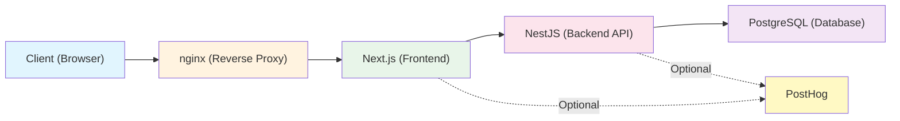

# Visão geral da arquitetura

Este documento descreve as decisões de arquitetura, os limites estruturais e a stack tecnológica do projeto Gameplate. Ele é a fonte única de verdade para o design técnico do sistema e substitui rascunhos estruturais mais antigos, refletindo o ferramental atual e modernizado e as restrições práticas do projeto.

Em resumo: um frontend Next.js com o jogo em si renderizado pelo Phaser, uma API
NestJS sobre PostgreSQL e um HUD em React sobreposto ao canvas do jogo.

## Sumário

- [1. Contexto e requisitos](#1-contexto-e-requisitos)
  - [Requisitos funcionais](#requisitos-funcionais)
  - [Requisitos não funcionais](#requisitos-não-funcionais)
- [2. Arquitetura de domínio](#2-arquitetura-de-domínio)
  - [Módulos de domínio](#módulos-de-domínio)
- [3. Stack tecnológica](#3-stack-tecnológica)
  - [Workspace e ferramentas](#workspace-e-ferramentas)
  - [Frontend](#frontend-front)
  - [Backend](#backend-back)
  - [Integrações opcionais](#integrações-opcionais)
- [4. Padrões arquiteturais e limites](#4-padrões-arquiteturais-e-limites)
  - [Topologia de deploy](#topologia-de-deploy)
  - [A abordagem de monólito modular](#a-abordagem-de-monólito-modular)
  - [Estrutura de diretórios](#estrutura-de-diretórios)
  - [Estratégia simplificada de backend](#estratégia-simplificada-de-backend-pivô-atual)
- [5. Decisões de arquitetura resolvidas e pendentes](#5-decisões-de-arquitetura-resolvidas-e-pendentes)
- [6. Contratos de API](#6-contratos-de-api)
  - [Módulo Auth](#módulo-auth-auth)
  - [Módulo Users](#módulo-users-users)
  - [Módulo Admin](#módulo-admin-admin)
  - [Módulo Game](#módulo-game-game)
  - [Módulo Progression](#módulo-progression-progression)
  - [Módulo Scoring](#módulo-scoring-scoring)
  - [Módulo Badges](#módulo-badges-badges)
  - [Módulo PostHog](#módulo-posthog-posthog)
  - [Módulo Campaign Links](#módulo-campaign-links-campaign-links)
  - [Módulo TTS](#route-handler-de-tts-apittssynthesize)
  - [Módulos planejados](#módulos-planejados)
  - [Notas técnicas](#notas-técnicas)

## 1. Contexto e requisitos

### Requisitos funcionais
O escopo do projeto é um jogo educativo para a web. As funcionalidades principais incluem:
- **Acesso público e gratuito:** entrada sem barreiras para o público em geral.
- **Mecânicas de jogo:** gameplay baseado em quizzes, integrado a conteúdo temático.
- **Sistema de progressão:** fases, conquistas e badges.
- **Assistência contextual:** dicas acionadas por inatividade que evitam que o jogador fique travado em uma fase sem tirar a sensação de descoberta.
- **Trilhas temáticas:** caminhos de conteúdo com curadoria, focados em arte e cultura.
- **Acesso baseado em papéis:** áreas e permissões distintas para Usuários em geral, Educadores/Instituições e Administradores.
- **Dashboard institucional:** visualização de dados agregados para que educadores acompanhem o progresso dos jogadores. Os dashboards do edital (institucional e público) leem o PostHog via HogQL; as fases que eles reportam — as 3 do `LEVEL_REGISTRY` mais a investigação (fase 4), que não está no registry — e o evento por trás de cada métrica por fase estão listados em `DASHBOARD_LEVELS` (`front/src/lib/edital/server/levels.ts`). Veja `EVENTS.md` → "Métricas por fase dos dashboards".

### Requisitos não funcionais
- **Acessibilidade:** conformidade nativa no design da UI e do conteúdo.
- **Performance:** carregamento rápido em redes móveis e compatibilidade com navegadores modernos.
- **Privacidade e segurança:** coleta mínima de dados pessoais — um endereço de email, o progresso no jogo e o estado dos badges. A conformidade com a LGPD é um objetivo de design, não um estado auditado ou certificado; trate-a como um requisito em andamento, e não como algo que o código já garante.
- **Escala:** complexidade moderada, mirando ~5.000 usuários no primeiro ano sem necessidade imediata de sistemas distribuídos pesados.
- **Preparação para open source:** a estrutura do código precisa ser limpa e modular o bastante para permitir uma futura liberação como open source.

## 2. Arquitetura de domínio

O sistema é projetado em torno de domínios de negócio específicos. Embora fisicamente estruturados como um monólito, logicamente esses domínios permanecem isolados e se comunicam por eventos (Event-Driven Architecture) para evitar acoplamento forte:



### Módulos de domínio

1. **Identidade e acesso (Auth):** autenticação passwordless por magic link, gerenciamento de sessão com JWT, rotação de refresh token e controle de acesso baseado em papéis.
2. **Users:** gerenciamento de perfil de usuário, papéis (`player`, `institution`, `admin`) e status da conta.
3. **Ingestão do jogo (Game Ingestion):** recebe eventos de gameplay (por exemplo, `LEVEL_COMPLETED`, `ITEM_COLLECTED`) do frontend via HTTP.
4. **Motor de progressão (Progression Engine):** acompanha a conclusão de fases do jogador, estrelas, pistas e o status dos capítulos. As pistas coletadas são exibidas no overlay do quadro de evidências (Pistas).
5. **Scoring:** gerencia as pontuações dos usuários, os dados do ranking e o histórico de pontuação.
6. **Badges:** definições de badges, associações entre usuários e badges e acompanhamento de conquistas.
7. **Analytics:** armazenamento legado em Postgres dos eventos do jogo, mantido apenas como fallback por trás de `GET /metrics` (veja o módulo Dashboard). O dashboard em si lê o PostHog.
8. **Integração com o PostHog:** encaminhamento de eventos do lado do servidor para o PostHog, para product analytics e rastreamento de erros.
9. **Admin:** endpoints exclusivos de admin para gerenciamento de usuários (listagem, alteração de papel, ativação/desativação).
10. **Dashboard:** métricas agregadas para educadores, restritas ao papel `institution`. Os dados vêm do PostHog (veja o §5).
11. **User Interested:** cadastro público que registra interesse em fases que ainda não existem.
12. **Campaign Links:** links de campanha por instituição cujo rótulo `source` é emitido como `utm_source`, para que o dashboard possa agrupar os jogadores por turma ou grupo.

## 3. Stack tecnológica

### Workspace e ferramentas
- **Gerenciador de pacotes e runtime:** [Node.js](https://nodejs.org/) (v24+) com npm.
- **Versões:** `next`, `react` e `@nestjs/core` seguem `latest` nos respectivos `package.json`; o Phaser é fixado (`4.2.1` em `front/package.json`); o PostgreSQL roda como `postgres:16-alpine` em todas as stacks do Compose.
- **Orquestração do monorepo:** [Turborepo](https://turbo.build/) para cache de tarefas e execução em paralelo.
- **Lint e formatação:** [Biome](https://biomejs.dev/) (substitui ESLint e Prettier com uma validação de código unificada e rápida).
- **Testes:** [Jest](https://jestjs.io/) como test runner universal em todo o workspace.

### Frontend (`/front`)
- **Framework:** Next.js com React, usando o App Router (roteamento baseado em arquivos com React Server Components).
- **Game engine:** Phaser 4 (encapsulado inteiramente em `src/game`).
- **Estilização:** Material UI (MUI) v9 com Emotion para CSS-in-JS.
- **Gerenciamento de estado:** hooks do React e Zustand para o estado dos overlays de UI e do HUD.
- **Analytics:** SDK JS do PostHog com autocapture desativado e gravação de canvas ativada em produção.
- **Cliente HTTP:** Axios com interceptors para refresh do token de autenticação e headers de sessão do PostHog.

### Backend (`/back`)
- **Framework:** NestJS com Express.
- **Banco de dados:** PostgreSQL.
- **ORM:** TypeORM com migrations gerenciadas via CLI.
- **API:** endpoints REST com validação de DTO via `class-validator`.
- **Autenticação:** estratégia JWT do Passport, serviço próprio de magic link e refresh tokens opacos com hash SHA-256.
- **Rate limiting:** `@nestjs/throttler` com throttling por email e por IP.
- **Observabilidade:** SDK Node do PostHog com um interceptor de exceções próprio.
- **Infraestrutura:** Docker e Docker Compose para ambientes locais; GitHub Actions para build e push para o GitHub Container Registry (GHCR); Coolify para o deploy (CD).

### Integrações opcionais

Ambas vêm desativadas por padrão no `.env.example`, e o jogo roda completo sem elas.

| Integração | Variável | Sem ela |
|---|---|---|
| **ResponsiveVoice** (text-to-speech) | `RESPONSIVEVOICE_API_KEY` | `/api/tts/synthesize` se declara indisponível e a narração usa o próprio `SpeechSynthesis` do navegador, em `pt-BR`. O ResponsiveVoice é um serviço pago e NonCommercial (CC BY-NC-ND), então o jogo deliberadamente não depende dele. Veja [Route Handler de TTS](#route-handler-de-tts-apittssynthesize). |
| **PostHog** (product analytics) | `NEXT_PUBLIC_POSTHOG_KEY`, `POSTHOG_API_KEY` | O frontend passa a usar um stub que só loga no console e o backend pula a captura de eventos. Nenhum dado sai da máquina. |
| **API de consultas do PostHog** (dados do dashboard do educador) | `POSTHOG_PERSONAL_API_KEY`, `POSTHOG_PROJECT_ID`, `POSTHOG_QUERY_HOST` | Os route handlers `/api/edital/*` lançam `HogQLNotConfiguredError` e o dashboard do educador fica sem dados. O jogo em si não é afetado. |

## 4. Padrões arquiteturais e limites

### Topologia de deploy

Toda requisição do navegador passa pelo nginx. O PostHog é opcional dos dois
lados (veja [Integrações opcionais](#integrações-opcionais)).



### A abordagem de monólito modular
O código é estruturado como um **monólito modular**.

- No nível mais alto, o repositório é dividido em `front/` e `back/`.
- Dentro do backend (`/back/src`), as funcionalidades são agrupadas em pastas lógicas orientadas a domínio (por exemplo, `users`, `health`, `database`).
- Dentro do frontend (`/front/src`), a UI web e a lógica do jogo em Phaser (`/game`) são estritamente separadas. O jogo se comunica com o shell React externo, que por sua vez se comunica com o backend.
- Os overlays de UI (HUD, quadro de evidências, painéis modais) são centralizados no React e sincronizados com o gameplay por meio de um EventBus tipado compartilhado. O quadro de evidências (`EvidenceBoardOverlay`) carrega os colecionáveis de todas as fases e os renderiza como cartões fixados com conexões em SVG.

### Estrutura de diretórios

```text
gameplate/
├── front/
│   ├── src/
│   │   ├── app/              # Next.js App Router (UI, Auth Pages, Game Shell, API routes)
│   │   ├── components/       # React Components (UI outside the game)
│   │   ├── ui/               # HUD, panels and overlays layered over the game canvas
│   │   ├── shared/           # Types and helpers used by both the game and the UI
│   │   ├── lib/              # Utilities, API clients, env parsing, audio services
│   │   ├── middleware.ts     # Route protection for authenticated pages
│   │   └── game/             # Game Domain (Phaser 4)
│   │       ├── scenes/
│   │       ├── objects/
│   │       ├── mechanics/
│   │       ├── systems/      # Cross-cutting gameplay systems (nudges, placeholders, spotlights)
│   │       ├── data/         # Level registry and static content wiring
│   │       └── constants/
│   │
│   └── public/assets/        # Game assets — separate licence, see ASSETS-LICENSE.md
│
└── back/
    ├── src/
    │   ├── core/             # Global configurations, Guards, Interceptors
    │   │   ├── config/
    │   │   ├── database/
    │   │   ├── email/
    │   │   ├── guards/
    │   │   ├── health/
    │   │   └── logger/
    │   │
    │   ├── modules/          # Bounded Contexts (Domains)
    │   │   ├── admin/        # Admin user management
    │   │   ├── analytics/    # Game event storage & dashboard aggregates (no HTTP API)
    │   │   ├── auth/         # Authentication & Authorization
    │   │   ├── badges/       # Badge definitions & user badges
    │   │   ├── campaign-links/ # Institution campaign links (utm_source)
    │   │   ├── dashboard/    # Aggregated metrics for educators
    │   │   ├── game/         # Gameplay event ingestion
    │   │   ├── posthog/      # PostHog server-side integration
    │   │   ├── progression/  # Player progression tracking
    │   │   ├── scoring/      # Score & leaderboard management
    │   │   ├── user-interested/ # Interest sign-up for upcoming levels
    │   │   └── users/        # User profiles & roles
    │   │
    │   ├── app.module.ts
    │   └── main.ts
    │
    └── package.json
```

### Estratégia simplificada de backend (pivô atual)
Para acelerar o desenvolvimento e reduzir complexidade desnecessária, **o frontend Next.js vai fazer o trabalho pesado nas primeiras iterações do jogo.** 
Por enquanto, o backend NestJS será bastante simplificado. Suas responsabilidades principais ficarão restritas a:
1. Persistência de dados (TypeORM/PostgreSQL).
2. Escopo por instituição para o dashboard do educador (campaign links). Os números do dashboard vêm do PostHog.
3. Estrutura transversal do projeto (validação de estado global que não pode ser confiada ao cliente).

O gameplay em si vai funcionar majoritariamente como uma aplicação client-side (Next.js + Phaser), com sincronização periódica de estado com o backend.

### Páginas de erro e fallback do jogo
As telas de erro no estilo do jogo se aplicam só às rotas voltadas ao jogador: a landing (`/`) e `/game`, agrupadas em `front/src/app/(game)/` (o route group não altera as URLs). `isGameRoute` (`front/src/lib/navigation/gameRoutes.ts`) define esse escopo para o middleware e para o cliente da API. Todas as telas compartilham `ErrorPageLayout` (`front/src/components/errors/`) e reportam via `reportErrorPage` (`front/src/lib/errors/reportError.ts`), marcando os eventos do PostHog com `error_page_type`.

| Cenário | Rota / gatilho | `error_page_type` |
|----------|-----------------|-------------------|
| Rota `/game/*` desconhecida | `app/(game)/game/[...slug]` chama `notFound()` → `app/(game)/game/not-found.tsx` | `not_found` |
| Erro de renderização não tratado em `/` ou `/game` | `app/(game)/error.tsx` | `server_error` |
| Backend fora do ar em uma rota do jogo | Erro de rede ou 502/503/504 somado a uma verificação de `GET /api/v1/health` que falha redireciona para `/game/maintenance?next=…` | `maintenance` |
| Manutenção programada | `NEXT_PUBLIC_MAINTENANCE_MODE=true`: o middleware reescreve `/` e `/game/*` para `/game/maintenance` com HTTP 503. Definido em tempo de build: no `.env` localmente, passado como build arg do Docker pelos workflows de CD (variável do GitHub). Faça um novo deploy para alternar | `maintenance` |
| Falha na inicialização do jogo | `PhaserGame` mostra `GameLoadErrorScreen` com opção de tentar de novo | — (`game_load_failed`) |
| Erro ao carregar um único asset | Apenas reportado; o jogo continua rodando | `asset_load` |

Os parâmetros `next` são sanitizados por `getSafeRedirectPath`: caracteres de controle, espaços em branco e barras invertidas são rejeitados, e o valor precisa resolver para a origem atual.

A página de manutenção sabe por que está sendo exibida:
- **scheduled** (flag ligada): texto de manutenção programada; faz polling em `GET /api/maintenance` (`{ active }`) e volta para o jogo assim que um novo deploy desliga a flag. Não há loop de reload enquanto a flag continua ligada.
- **outage** (flag desligada): faz polling no endpoint de health do backend, verificando logo no carregamento, então uma visita direta com tudo saudável volta para o jogo.

O polling (`useMaintenanceRecovery`) aplica backoff de 30 s → 60 s → … até 5 min, com jitter de ±30 %, e pausa enquanto a aba está oculta. A página é reportada uma vez por sessão para cada motivo. Quando a conexão do próprio jogador cai (`navigator.onLine === false`), não há redirecionamento; em vez disso, `OfflineNotice` mostra um toast. O middleware lê a flag via `lib/maintenance.ts`, e não pelo schema completo de env.

As páginas de autenticação mantêm os boundaries genéricos (`app/error.tsx`, `app/(auth)/error.tsx`, `app/global-error.tsx`); o modo de manutenção e os redirecionamentos por indisponibilidade não afetam os dashboards nem a autenticação.

### Páginas de erro e fallback do dashboard
Os dashboards institucional (`/institution/*`) e público (`/public-dashboard/*`) usam telas no estilo do dashboard, de `front/src/components/errors/DashboardErrorPages.tsx`. As telas de página inteira compartilham `DashboardErrorLayout` (tema do dashboard, logo do jogo esmaecido, o `Footer` compartilhado, a menos que um layout já o renderize); os estados dentro da página são renderizados por `DashboardState` e nunca mostram mensagens de erro cruas. Os erros são classificados por `classifyError` (`front/src/lib/errors/classifyError.ts`) a partir do status HTTP ou de um `TypeError` do fetch, e `useAsyncData` expõe o resultado como `errorKind`.

| Cenário | Rota / gatilho | Tela |
|----------|-----------------|--------|
| URL `/public-dashboard/*` desconhecida | `public-dashboard/[...slug]/page.tsx` chama `notFound()` → `public-dashboard/not-found.tsx` | `DashboardNotFoundPage` |
| URL desconhecida em qualquer outro lugar, inclusive `/institution/*` | `app/not-found.tsx` (para o site inteiro, página inteira sem a sidebar); `homeLinkFor` escolhe o dashboard ou `/` para o botão | `DashboardNotFoundPage` |
| Erro de renderização não tratado | `institution/error.tsx`, `public-dashboard/error.tsx` | `DashboardRouteErrorPage` (texto de conexão para erros de rede, 500 nos demais casos) |
| Sessão encerrada enquanto está no dashboard | `InstitutionGuard` | `DashboardSessionExpiredPage` |
| Requisição de dados falhou | `DashboardState` com `errorKind` | `DashboardInlineError` (rede, sessão, não encontrado, filtro inválido, servidor) |
| Carregou, mas não há nada para mostrar | `DashboardState` com `empty` | `DashboardEmptyState` |
| Taxa sem denominador | `RateCard` | "—" / "Sem dados no período" |

Erros lançados pelo próprio `institution/layout.tsx` caem em `app/error.tsx`, que já usa o visual e o footer do dashboard (`FullPageMessage`). O navegador offline em qualquer página é tratado pelo `OfflineGate`.

O healthcheck do container do front aponta para `GET /api/health` (`front/src/app/api/health/route.ts`), e não para `/`. Ele só prova que o servidor Next.js responde: não chama o backend e fica fora do middleware, então o modo de manutenção (que responde às rotas do jogo com 503) nunca marca o front como unhealthy nem impede o nginx de subir.

## 5. Decisões de arquitetura resolvidas e pendentes

### Resolvidas

- **Módulo de autenticação:** implementado como autenticação passwordless por magic link, com access tokens JWT (expiração de 15min) e refresh tokens opacos (rotação de 7 dias). Veja o plano de implementação da autenticação em [`docs/en/specs/auth-implementation-plan.md`](../en/specs/auth-implementation-plan.md).
- **Observabilidade e analytics:** o PostHog está integrado tanto no frontend (`posthog-js`) quanto no backend (`posthog-node`) para product analytics, session replay e rastreamento de erros. Veja [`docs/en/specs/posthog-implementation-plan.md`](../en/specs/posthog-implementation-plan.md).
- **Migração da UI do Chunk Selector (Fase 7):** o painel ChunkSelector da restauração de fotos está implementado como overlay em React, conectado pelo EventBus compartilhado, e mantém paridade na interação por teclado (setas + WASD para navegar, Enter/Espaço para confirmar, Esc para fechar). O layout do painel foi refinado para equilibrar melhor o espaço do inventário e da moldura, e inclui scroll automático do inventário durante a navegação para manter visíveis os itens selecionados pelo teclado.
- **MapInfoBox e progressão no mapa (PR #517):** o painel React `MapInfoBox` expõe três estados de UI (disponível, concluída, bloqueada) controlados pelo evento `map:marker-changed` do EventBus. `MapIntroScene` calcula dinamicamente a disponibilidade dos marcadores a partir de `progression.completedLevels`, de modo que a Fase N só é desbloqueada depois que a Fase N−1 é concluída. O payload do evento (`MapMarkerChangedData`) inclui `isCompleted?: boolean`, o que elimina a necessidade de o `MapInfoBox` ter um seletor Zustand `progression` separado. Para lidar com o isolamento de módulos do Turbopack e com race conditions no timing de montagem do React (o overlay React é montado depois que `StartGame()` retorna), `MapIntroScene.emitMarkerChanged()` escreve diretamente no store do Zustand via `useGameUIStore.getState().setActiveMapMarker()`, além de emitir o evento no EventBus. Um atalho de debug para dev (`localStorage.setItem("gameplate:debug:completedLevels", ...)`) permite pré-popular o estado de conclusão sem precisar jogar as fases.
- **Proxy de TTS no servidor:** a API key do ResponsiveVoice é armazenada como uma env var exclusiva do servidor (`RESPONSIVEVOICE_API_KEY`) no deploy do frontend. Um Route Handler do Next.js (`/api/tts/synthesize`) faz proxy das requisições para a API REST v1 do ResponsiveVoice e retorna `audio/mpeg`. Isso elimina as preocupações com whitelist de domínios, já que o proxy roda no servidor. Em caso de erro, o frontend cai para a Web Speech API nativa (`window.speechSynthesis`).
- **Sistema de nudges contextuais (PR #733):** assistência anti-travamento acionada pela inatividade do jogador. A responsabilidade é dividida para que as regras de timing continuem testáveis: `NudgeManager` (`front/src/game/systems/NudgeManager.ts`) decide *quando* dar o nudge — uma classe sem dependências cujo `evaluate(now, isPlayerBusy)` retorna um boolean, regida por um limite de inatividade de 15s, um throttle de avaliação de 1s, um cooldown global de 5 minutos e um reset por missão —, enquanto `Game.ts` decide *qual tipo* de nudge, escolhido pela proximidade e não por escalonamento (o atraso é idêntico para os dois tipos). Um pulso é disparado via `PlaceholderSystem.pulseNearestPlaceholder()` ou `SpotlightSystem.pulseNearestSpotlight()` quando um placeholder de figurino ou um spotlight incompleto está a até ~500px; caso contrário, o `educational.hint` da obra mais próxima (do `works.json` da fase) é exibido pelo evento `ui:toast-show` já existente no EventBus, sem introduzir nenhuma UI de overlay específica. Como o `NudgeManager` não tem imports, ele é testado unitariamente de forma isolada (`NudgeManager.test.ts`, 11 casos cobrindo limite, supressão quando ocupado, reset do timer, janela e expiração do cooldown, throttle e reset por missão); a integração em `Game.ts` é verificada manualmente. A telemetria é enviada direto para o PostHog como `nudge_pulse_shown_*` e `nudge_hint_shown_*`, com as regras de disparo documentadas em `EVENTS.md` (§ *Nudge — regras de disparo*).

- **Dashboard institucional:** o módulo `dashboard` serve métricas agregadas ao papel `institution`, e o frontend voltado ao educador fica em `/institution/*`, com uma visão pública em `/public-dashboard/*`. Os dados vêm do PostHog: os route handlers `/api/edital/*` e `/api/public/dashboard` do frontend executam consultas HogQL no servidor (`front/src/lib/edital/server/`).

### Pendentes

- **Contratos compartilhados:** ainda não foi definido como compartilhar tipos e interfaces TypeScript entre `/front` e `/back` (por exemplo, criar um workspace `packages/shared` no Turborepo vs. duplicação).
- **Módulo de quiz:** um módulo de validação com quiz final está planejado, mas ainda não foi implementado.

## 6. Contratos de API

Todos os endpoints do backend têm o prefixo `/api/v1`.

### Módulo Auth (`/auth`)

Autenticação passwordless por magic link, com access tokens JWT e refresh tokens opacos.

| Método | Caminho | Auth | Descrição |
|--------|------|------|-------------|
| `POST` | `/auth/register` | Público | Cadastra um novo usuário. Retorna um 200 genérico, exista ou não o email. |
| `POST` | `/auth/login` | Público | Solicita o email de login com magic link. Define o cookie `login_attempt`. |
| `POST` | `/auth/login/confirm` | Cookie | Consome o token do magic link, define os cookies de autenticação e retorna `{ redirectTo: "/" }`. |
| `POST` | `/auth/logout` | Cookie | Revoga o refresh token, limpa os cookies e coloca o `jti` do access token na blacklist. |
| `POST` | `/auth/logout-all` | JWT | Revoga todos os refresh tokens do usuário e coloca o access token atual na blacklist. |
| `POST` | `/auth/refresh` | Cookie | Rotaciona o refresh token. Retorna `{ accessToken }`. |
| `GET` | `/auth/me` | JWT | Retorna o usuário autenticado atual. |
| `POST` | `/auth/verify-email/confirm` | Público | Consome o token de verificação, ativa a conta e define os cookies. |
| `POST` | `/auth/resend-verification` | Público | Reenvia o email de verificação. |

### Módulo Users (`/users`)

| Método | Caminho | Auth | Descrição |
|--------|------|------|-------------|
| `GET` | `/users/me` | JWT | Retorna o perfil do usuário atual (alias de `/auth/me`). |

### Módulo Admin (`/admin`)

Endpoints exclusivos de admin, protegidos pelo `RolesGuard`.

| Método | Caminho | Auth | Descrição |
|--------|------|------|-------------|
| `GET` | `/admin/users` | Admin | Lista usuários com paginação, busca, filtro por papel e filtro por status. |
| `GET` | `/admin/users/:id` | Admin | Retorna os detalhes de um usuário pelo ID. |
| `PATCH` | `/admin/users/:id/role` | Admin | Altera o papel do usuário. |
| `PATCH` | `/admin/users/:id/status` | Admin | Ativa/desativa o usuário. |

### Módulo Game (`/game`)

| Método | Caminho | Auth | Descrição |
|--------|------|------|-------------|
| `POST` | `/game/events` | JWT | Ingere eventos de gameplay vindos do frontend. |

### Módulo Progression (`/progression`)

| Método | Caminho | Auth | Descrição |
|--------|------|------|-------------|
| `GET` | `/progression/state` | JWT | Retorna o estado atual de progressão do jogador. |
| `POST` | `/progression/level-complete` | JWT | Registra a conclusão de uma fase com estrelas e badges. |
| `GET` | `/progression/inventory` | JWT | Retorna as pistas coletadas e as informações das obras. Consumido pelo overlay do quadro de evidências. |

### Módulo Scoring (`/scoring`)

| Método | Caminho | Auth | Descrição |
|--------|------|------|-------------|
| `GET` | `/scoring/leaderboard` | JWT | Retorna os dados do ranking. |
| `GET` | `/scoring/user/:id` | JWT | Retorna o histórico de pontuação do usuário. |

### Módulo Badges (`/badges`)

| Método | Caminho | Auth | Descrição |
|--------|------|------|-------------|
| `GET` | `/badges` | Público | Lista todos os badges disponíveis. |
| `GET` | `/badges/user` | JWT | Retorna os badges conquistados pelo usuário atual. |

### Módulo PostHog (`/posthog`)

| Método | Caminho | Auth | Descrição |
|--------|------|------|-------------|
| `GET` | `/posthog/bootstrap` | JWT | Retorna as feature flags e o distinct ID do PostHog para o bootstrap. |

### Módulo Campaign Links (`/campaign-links`)

Apenas servidor a servidor. As rotas são `@Public()` para o guard de JWT, mas exigem o upsert token (`OAuthUpsertTokenGuard`). Elas são chamadas pelos route handlers `/api/edital/links` do front, que derivam o `institutionSlug` da sessão NextAuth de quem faz a chamada, e nunca podem ser acessadas diretamente a partir de um navegador.

| Método | Caminho | Auth | Descrição |
|--------|------|------|-------------|
| `GET` | `/campaign-links?institutionSlug=` | Upsert token | Lista os links de campanha de uma instituição. |
| `POST` | `/campaign-links` | Upsert token | Cria um link. Body: `{ institutionSlug, source }`; `source` é o rótulo do grupo emitido como `utm_source`. |
| `DELETE` | `/campaign-links/:id?institutionSlug=` | Upsert token | Remove um dos links da instituição. `404` se ele não existir, `403` se pertencer a outra instituição. |

### Módulo Dashboard (`/metrics`)

Restrito ao papel `institution`. Este é o fallback legado em Postgres, construído sobre os eventos armazenados pelo módulo Analytics e mantido até que o dashboard baseado no PostHog (#745) rode um ciclo completo em produção. O frontend do dashboard não o chama.

| Método | Caminho | Auth | Descrição |
|--------|------|------|-------------|
| `GET` | `/metrics` | JWT + papel | Métricas agregadas para um intervalo de datas. |

### Módulo User Interested (`/user-interested`)

| Método | Caminho | Auth | Descrição |
|--------|------|------|-------------|
| `POST` | `/user-interested` | Público | Registra um endereço de email como interessado em fases que ainda não foram lançadas. |

### Route Handler de TTS (`/api/tts/synthesize`)

Proxy no servidor para o text-to-speech do ResponsiveVoice, implementado como um Route Handler do Next.js. A API key é armazenada apenas no servidor (`RESPONSIVEVOICE_API_KEY`), lida de `process.env`, e nunca é exposta ao navegador.

**A key é opcional.** O ResponsiveVoice é um serviço pago e NonCommercial, então o jogo precisa rodar sem ele: sem key, a rota responde `503` com `code: "tts_unavailable"` e o cliente narra com o próprio `SpeechSynthesis` do navegador, guardando essa resposta para parar de repetir a requisição.

| Método | Caminho | Auth | Descrição |
|--------|------|------|-------------|
| `POST` | `/api/tts/synthesize` | Público | Converte texto em fala. Body: `{ text: string, voice?: string, rate?: number, pitch?: number }`. Retorna `audio/mpeg` binário, `503` quando nenhuma key está configurada ou `502` quando o serviço upstream falha ou estoura o timeout. |

A key é opcional, e um valor vazio conta como não definido. Sem ela, a rota responde `503` com `code: "tts_unavailable"`, e o cliente (`AudioAccessibilityService`) passa a usar o `window.speechSynthesis` do navegador pelo resto da sessão. Se o ResponsiveVoice falhar (key inválida, indisponibilidade, timeout de 10s), a rota responde `502`, e o cliente usa a voz do navegador só para aquela fala. A voz do navegador depende do sistema operacional e pode exigir que um motor de fala esteja instalado ou habilitado (veja [CONTRIBUTING.md](./CONTRIBUTING.md#solução-de-problemas)).

### Módulos planejados

| Módulo | Status | Descrição |
|--------|--------|-------------|
| Quiz Final | Não implementado | Validação de conhecimento ao fim da jornada. |

### Notas técnicas

- **Persistência:** todos os dados são armazenados no PostgreSQL via TypeORM.
- **Eventos:** o backend usa o `EventEmitter` do NestJS para propagar eventos internos após a persistência.
- **Segurança:** os refresh tokens são strings aleatórias opacas (64 bytes) armazenadas no banco com hash SHA-256. Os access tokens são JWTs com uma claim `jti` e expiração de 15 minutos. Uma blocklist em memória rejeita imediatamente os tokens revogados.
- **Rate limiting:** os endpoints de autenticação têm throttling por email (3/h no cadastro, 5/h no login, 3/h no reenvio da verificação). O refresh tem throttling de 30/min por IP.
- **Cookies:** `refresh_token` (httpOnly, Secure, SameSite=Strict), `auth_status` (não httpOnly, SameSite=Lax), `login_attempt` (httpOnly, expiração de 15min).
- **API key do TTS:** a `RESPONSIVEVOICE_API_KEY` é armazenada como uma variável de ambiente exclusiva do servidor (sem o prefixo `NEXT_PUBLIC_`) no deploy do frontend. O Route Handler do Next.js (`/api/tts/synthesize`) chama a API REST v1 do ResponsiveVoice (endpoint `text:synthesize`) com a key nos query parameters. O áudio é retornado diretamente como `audio/mpeg` com `Cache-Control: no-store`. Em caso de erro, o frontend cai para a Web Speech API nativa (`window.speechSynthesis`).
