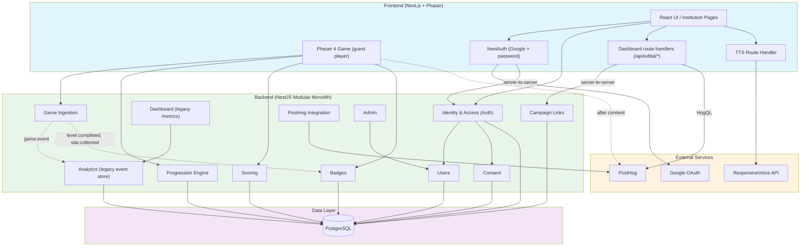
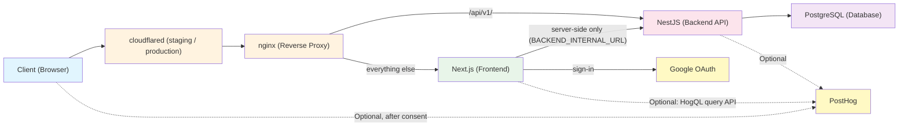

🌐 [English](../en/ARCHITECTURE.md) | Português (Brasil)

# Visão geral da arquitetura

Este documento descreve as decisões de arquitetura, os limites estruturais e a stack tecnológica do Guardião da Cultura. Ele é a fonte única de verdade para o design técnico do sistema e substitui rascunhos estruturais mais antigos, refletindo o ferramental atual e modernizado e as restrições práticas do projeto.

Em resumo: um frontend Next.js com o jogo em si renderizado pelo Phaser, uma API
NestJS sobre PostgreSQL e um HUD em React sobreposto ao canvas do jogo. Os
jogadores jogam como convidados, sem conta; as instituições entram no dashboard
pelo NextAuth.

## Sumário

- [1. Contexto e requisitos](#1-contexto-e-requisitos)
  - [Requisitos funcionais](#requisitos-funcionais)
  - [Requisitos não funcionais](#requisitos-não-funcionais)
- [2. Arquitetura de domínio](#2-arquitetura-de-domínio)
  - [Módulos de domínio](#módulos-de-domínio)
- [3. Stack tecnológica](#3-stack-tecnológica)
  - [Workspace e ferramentas](#workspace-e-ferramentas)
  - [Frontend](#frontend-front)
  - [Backend](#backend-back)
  - [Integrações opcionais](#integrações-opcionais)
- [4. Padrões arquiteturais e limites](#4-padrões-arquiteturais-e-limites)
  - [Topologia de deploy](#topologia-de-deploy)
  - [A abordagem de monólito modular](#a-abordagem-de-monólito-modular)
  - [Estrutura de diretórios](#estrutura-de-diretórios)
  - [Estratégia simplificada de backend](#estratégia-simplificada-de-backend-pivô-atual)
  - [Páginas de erro e fallback do jogo](#páginas-de-erro-e-fallback-do-jogo)
  - [Páginas de erro e fallback do dashboard](#páginas-de-erro-e-fallback-do-dashboard)
- [5. Decisões de arquitetura resolvidas e pendentes](#5-decisões-de-arquitetura-resolvidas-e-pendentes)
  - [Resolvidas](#resolvidas)
  - [Pendentes](#pendentes)
- [6. Contratos de API](#6-contratos-de-api)
  - [Níveis de acesso](#níveis-de-acesso)
  - [Health check](#health-check-health)
  - [Módulo Auth](#módulo-auth-auth)
  - [Módulo Admin](#módulo-admin-admin)
  - [Módulo Game](#módulo-game-events)
  - [Módulo Progression](#módulo-progression-progression)
  - [Módulo Scoring](#módulo-scoring-scores)
  - [Módulo Badges](#módulo-badges-badges)
  - [Módulo PostHog](#módulo-posthog-posthog)
  - [Módulo Campaign Links](#módulo-campaign-links-campaign-links)
  - [Módulo Dashboard](#módulo-dashboard-metrics)
  - [Route Handler de TTS](#route-handler-de-tts-apittssynthesize)
  - [Módulos planejados](#módulos-planejados)
  - [Notas técnicas](#notas-técnicas)

## 1. Contexto e requisitos

### Requisitos funcionais
O escopo do projeto é um jogo educativo para a web. As funcionalidades principais incluem:
- **Acesso público e gratuito:** entrada sem barreiras para o público em geral.
- **Mecânicas de jogo:** gameplay baseado em quizzes, integrado a conteúdo temático.
- **Sistema de progressão:** fases, conquistas e badges.
- **Assistência contextual:** dicas acionadas por inatividade que evitam que o jogador fique travado em uma fase sem tirar a sensação de descoberta.
- **Trilhas temáticas:** caminhos de conteúdo com curadoria, focados em arte e cultura.
- **Acesso baseado em papéis:** os jogadores são convidados anônimos e, na prática, não têm conta nem papel. As instituições (educadores) fazem login para acessar o dashboard. O backend também define um papel `admin`, mas hoje nenhum caminho de login o concede (veja [Níveis de acesso](#níveis-de-acesso)).
- **Dashboard institucional:** visualização de dados agregados para que educadores acompanhem o progresso dos jogadores. Os dashboards do edital (institucional e público) leem o PostHog via HogQL; as fases que eles reportam — as 3 do `LEVEL_REGISTRY` mais a investigação (fase 4), que não está no registry — e o evento por trás de cada métrica por fase estão listados em `DASHBOARD_LEVELS` (`front/src/lib/edital/server/levels.ts`). Veja `EVENTS.md` → "Métricas por fase dos dashboards".

### Requisitos não funcionais
- **Acessibilidade:** conformidade nativa no design da UI e do conteúdo.
- **Performance:** carregamento rápido em redes móveis e compatibilidade com navegadores modernos.
- **Privacidade e segurança:** coleta mínima de dados pessoais. Os jogadores são identificados apenas por um id de convidado aleatório guardado no `localStorage` (`front/src/lib/guestSession.ts`) e por um cookie aleatório de jogador anônimo, `gp_distinct_id` (definido pelo middleware do front e lido pelo backend em `back/src/shared/edital/anonymous-player-cookie.ts`); o progresso deles fica no navegador. Os eventos de gameplay só são enviados depois que o jogador aceita o analytics. As contas de instituição armazenam um endereço de email, um nome, o nome e o slug da instituição, um hash argon2 da senha para contas com senha (`back/src/modules/users/user.entity.ts`) e o registro do aceite dos Termos de Uso (`user_consent`). A conformidade com a LGPD é um objetivo de design, não um estado auditado ou certificado; trate-a como um requisito em andamento, e não como algo que o código já garante.
- **Escala:** complexidade moderada, mirando ~5.000 usuários no primeiro ano sem necessidade imediata de sistemas distribuídos pesados.
- **Preparação para open source:** o código é publicado como open source; sua estrutura precisa continuar limpa e modular o bastante para contribuidores externos.

## 2. Arquitetura de domínio

O sistema é projetado em torno de domínios de negócio específicos. Embora fisicamente estruturados como um monólito, logicamente esses domínios permanecem isolados. A maioria deles é acessada diretamente via HTTP; o módulo Game publica cada evento ingerido no `EventEmitter` do NestJS, e só os módulos Analytics e Badges o escutam (`@OnEvent`):



### Módulos de domínio

1. **Identidade e acesso (Auth):** apenas contas de instituição. Cadastro com email e senha, verificação de email e redefinição de senha, além de endpoints servidor a servidor que o NextAuth do frontend usa para encontrar ou criar uma conta depois do login com Google, concluir o onboarding e registrar o aceite dos Termos de Uso. Os jogadores nunca fazem login; o login de jogador por magic link foi removido na #738.
2. **Users:** a tabela `user` e o seu service: papéis (`player`, `institution`, `admin`), status da conta, nome e slug da instituição. Não tem controller HTTP.
3. **Consent:** a tabela `user_consent`, que registra qual versão dos Termos de Uso da instituição uma conta aceitou, e quando.
4. **Ingestão do jogo (Game Ingestion):** recebe eventos de gameplay do frontend via HTTP. Os tipos de evento são strings com pontos, como `game.started`, `level.completed` e `star.collected` (`back/src/shared/events/game-events.ts`).
5. **Motor de progressão (Progression Engine):** acompanha a conclusão de fases do jogador, estrelas, pistas e o status dos capítulos. As pistas coletadas são exibidas no overlay do quadro de evidências (Pistas).
6. **Scoring:** gerencia as pontuações por fase, o histórico de pontuação e os itens coletados.
7. **Badges:** definições de badges, associações entre usuários e badges e acompanhamento de conquistas.
8. **Analytics:** armazenamento legado em Postgres dos eventos do jogo, mantido apenas como fallback por trás de `GET /metrics` (veja o módulo Dashboard). O dashboard em si lê o PostHog.
9. **Integração com o PostHog:** encaminhamento de eventos do lado do servidor para o PostHog, para product analytics e rastreamento de erros, o kill switch `guest_play_enabled` e o endpoint de bootstrap do SDK do navegador.
10. **Admin:** endpoints exclusivos de admin para gerenciamento de usuários (listagem, alteração de papel, ativação/desativação).
11. **Dashboard:** o endpoint legado `GET /metrics`, para os papéis `institution` e `admin`. O dashboard do educador em si roda no frontend e lê o PostHog (veja o §5).
12. **Campaign Links:** links de campanha por instituição cujo rótulo `source` é emitido como `utm_source`, para que o dashboard possa agrupar os jogadores por turma ou grupo.

## 3. Stack tecnológica

### Workspace e ferramentas
- **Gerenciador de pacotes e runtime:** [Node.js](https://nodejs.org/) com npm. As imagens Docker usam `node:24.15.0-alpine`.
- **Versões:** `next`, `react` e `@nestjs/core` seguem `latest` nos respectivos `package.json`; o Phaser é fixado (`4.2.1` em `front/package.json`); o TypeORM está em `^0.3.28` (`back/package.json`); o PostgreSQL roda como `postgres:16-alpine` em todas as stacks do Compose.
- **Orquestração do monorepo:** [Turborepo](https://turbo.build/) para cache de tarefas e execução em paralelo.
- **Lint e formatação:** [Biome](https://biomejs.dev/) (substitui ESLint e Prettier com uma validação de código unificada e rápida).
- **Testes:** [Jest](https://jestjs.io/) como test runner universal em todo o workspace.

### Frontend (`/front`)
- **Framework:** Next.js com React, usando o App Router (roteamento baseado em arquivos com React Server Components).
- **Game engine:** Phaser 4 (encapsulado inteiramente em `src/game`).
- **Estilização:** Material UI (MUI) v9 com Emotion para CSS-in-JS.
- **Gerenciamento de estado:** hooks do React e Zustand para o estado dos overlays de UI e do HUD.
- **Autenticação:** NextAuth v5 (`next-auth`) com a estratégia de sessão JWT e sem adapter de banco, apenas para contas de instituição. Providers: Google, email e senha, e links de verificação de email (`front/src/auth.ts`).
- **Analytics:** SDK JS do PostHog, inicializado só depois que o jogador aceita o analytics (`front/src/components/PostHogProvider.tsx`), com autocapture desligado e gravação de sessão desativada (`disable_session_recording: true`, sem gravação de canvas).
- **Cliente HTTP:** Axios (`front/src/lib/api/client.ts`). Um interceptor de requisição anexa o header `x-guest-id` do jogador e, quando o PostHog está carregado, os headers `X-PostHog-Session-ID` e `X-PostHog-Distinct-ID`. O cliente ainda carrega um fluxo de refresh do bearer token herdado do login de jogador removido; hoje nada define um access token, então ele nunca é executado.

### Backend (`/back`)
- **Framework:** NestJS com Express.
- **Banco de dados:** PostgreSQL.
- **ORM:** TypeORM com migrations gerenciadas via CLI.
- **API:** endpoints REST com validação de DTO via `class-validator`. A Swagger UI é servida em `/api/v1/docs`.
- **Autenticação:** hash de senha com argon2 para contas de instituição; um guard com segredo compartilhado (`OAuthUpsertTokenGuard`) para as chamadas servidor a servidor vindas do NextAuth; um guard JWT global do Passport que entende as rotas `@Public()` e `@GuestPlay()`. Veja [Níveis de acesso](#níveis-de-acesso).
- **Rate limiting:** `@nestjs/throttler`, aplicado por email nos endpoints de autenticação (veja [Notas técnicas](#notas-técnicas)).
- **Observabilidade:** SDK Node do PostHog com um interceptor de exceções próprio.
- **Infraestrutura:** Docker e Docker Compose para ambientes locais; GitHub Actions para build e push para o GitHub Container Registry (GHCR); Coolify para o deploy (CD).

### Integrações opcionais

O jogo roda sem nenhuma destas três integrações. O ResponsiveVoice e o PostHog vêm vazios no `.env.example`; as variáveis da API de consultas do PostHog vêm com valores de exemplo, então deixe-as em branco para desligar os dados do dashboard.

| Integração | Variável | Sem ela |
|---|---|---|
| **ResponsiveVoice** (text-to-speech) | `RESPONSIVEVOICE_API_KEY` | `/api/tts/synthesize` se declara indisponível e a narração usa o próprio `SpeechSynthesis` do navegador, em `pt-BR`. O ResponsiveVoice é um serviço pago e NonCommercial (CC BY-NC-ND), então o jogo deliberadamente não depende dele. Veja [Route Handler de TTS](#route-handler-de-tts-apittssynthesize). |
| **PostHog** (product analytics) | `NEXT_PUBLIC_POSTHOG_KEY`, `POSTHOG_API_KEY` | O frontend passa a usar um stub que só loga no console e o backend pula a captura de eventos. Nenhum dado sai da máquina. Fora de `NODE_ENV=development`, porém, o backend não consegue mais ler a flag `guest_play_enabled` e a trata como desligada, então toda rota `@GuestPlay()` (eventos, progressão, pontuações, badges) responde `401`. O jogo continua carregando: o `PlayerGuard` deixa o jogador entrar após um timeout de 5 segundos quando a flag é desconhecida. Em desenvolvimento, a flag é forçada como ligada. |
| **API de consultas do PostHog** (dados do dashboard do educador) | `POSTHOG_PERSONAL_API_KEY`, `POSTHOG_PROJECT_ID` (`POSTHOG_QUERY_HOST` tem como padrão `https://us.posthog.com`) | Os route handlers `/api/edital/*` lançam `HogQLNotConfiguredError` e o dashboard do educador fica sem dados. O jogo em si não é afetado. Com `next dev`, `EDITAL_MOCK_DATA=true` (ou `no-level-4`) serve dados fictícios no dashboard (`front/src/lib/env-server.ts`); a variável é ignorada em qualquer outro build. |

## 4. Padrões arquiteturais e limites

### Topologia de deploy

Toda requisição do navegador passa pelo nginx. Em staging e produção, o nginx
fica atrás de um Cloudflare Tunnel (o serviço `cloudflared` em
`compose.staging.yaml` e `compose.production.yaml`); localmente, o nginx é
exposto diretamente. O nginx envia `/api/v1/` para o backend e todo o resto para
o Next.js (`nginx/nginx.production.conf.template`), então as chamadas de API do
navegador chegam ao NestJS sem passar pelo servidor Next.js.

O servidor Next.js só chama o backend a partir de código do lado do servidor —
os callbacks do NextAuth, os route handlers de onboarding e de termos e os route
handlers de campaign links — por meio de `BACKEND_INTERNAL_URL` (o nome do
serviço no Compose), e não pelo nginx. O PostHog é opcional dos dois lados (veja
[Integrações opcionais](#integrações-opcionais)).



### A abordagem de monólito modular
O código é estruturado como um **monólito modular**.

- No nível mais alto, o repositório é dividido em `front/` e `back/`.
- Dentro do backend (`/back/src`), as funcionalidades são agrupadas em módulos orientados a domínio dentro de `modules/` (por exemplo, `users`, `scoring`, `campaign-links`), enquanto a infraestrutura transversal, como `database` e `health`, fica em `core/`.
- Dentro do frontend (`/front/src`), a UI web e a lógica do jogo em Phaser (`/game`) são estritamente separadas. O jogo se comunica com o shell React externo, que por sua vez se comunica com o backend.
- Os overlays de UI (HUD, quadro de evidências, painéis modais) são centralizados no React e sincronizados com o gameplay por meio de um EventBus tipado compartilhado. O quadro de evidências (`EvidenceBoardOverlay`) carrega os colecionáveis de todas as fases e os renderiza como cartões fixados com conexões em SVG.

### Estrutura de diretórios

```text
guardiao-da-cultura/
├── front/
│   ├── src/
│   │   ├── app/              # Next.js App Router (game shell, dashboards, institution sign-in pages, API routes)
│   │   ├── components/       # React Components (UI outside the game)
│   │   ├── ui/               # HUD, panels and overlays layered over the game canvas
│   │   ├── shared/           # Typed EventBus and game events used by both the game and the UI
│   │   ├── lib/              # Utilities, API clients, env parsing, audio, consent, dashboard server code
│   │   ├── types/            # Type augmentations (NextAuth session and JWT)
│   │   ├── auth.ts           # NextAuth: Google + Credentials providers, backend callbacks
│   │   ├── auth.config.ts    # Edge-safe NextAuth config read by the middleware
│   │   ├── middleware.ts     # Maintenance rewrites, institution-only gating, anonymous-player cookie
│   │   └── game/             # Game Domain (Phaser 4)
│   │       ├── audio/
│   │       ├── constants/
│   │       ├── data/         # Level registry and static content wiring
│   │       ├── factories/    # Artwork object factories (painting, photo, poster, sculpture)
│   │       ├── mechanics/
│   │       ├── objects/
│   │       ├── scenes/
│   │       ├── systems/      # Cross-cutting gameplay systems (nudges, placeholders, spotlights)
│   │       ├── types/
│   │       └── utils/
│   │
│   └── public/assets/        # Game assets — separate licence, see ASSETS-LICENSE.md
│
└── back/
    ├── src/
    │   ├── common/           # Shared validators
    │   ├── core/             # Global configurations, Guards, Interceptors
    │   │   ├── config/
    │   │   ├── database/
    │   │   ├── email/
    │   │   ├── guards/
    │   │   ├── health/
    │   │   └── logger/
    │   │
    │   ├── shared/           # Helpers used across modules (consent and anonymous-player cookies, game event types)
    │   │
    │   ├── modules/          # Bounded Contexts (Domains)
    │   │   ├── admin/        # Admin user management
    │   │   ├── analytics/    # Game event storage & dashboard aggregates (no HTTP API)
    │   │   ├── auth/         # Institution authentication & authorization guards
    │   │   ├── badges/       # Badge definitions & user badges
    │   │   ├── campaign-links/ # Institution campaign links (utm_source)
    │   │   ├── consent/      # Terms of Use acceptance records (user_consent)
    │   │   ├── dashboard/    # Legacy aggregated metrics (/metrics)
    │   │   ├── game/         # Gameplay event ingestion
    │   │   ├── posthog/      # PostHog server-side integration
    │   │   ├── progression/  # Player progression tracking
    │   │   ├── scoring/      # Scores, score history & collected items
    │   │   └── users/        # User accounts & roles
    │   │
    │   ├── app.module.ts
    │   └── main.ts
    │
    └── package.json
```

### Estratégia simplificada de backend (pivô atual)
Para acelerar o desenvolvimento e reduzir complexidade desnecessária, **o frontend Next.js vai fazer o trabalho pesado nas primeiras iterações do jogo.** 
Por enquanto, o backend NestJS será bastante simplificado. Suas responsabilidades principais ficarão restritas a:
1. Persistência de dados (TypeORM/PostgreSQL).
2. Escopo por instituição para o dashboard do educador (campaign links). Os números do dashboard vêm do PostHog.
3. Estrutura transversal do projeto (validação de estado global que não pode ser confiada ao cliente).

O gameplay em si vai funcionar majoritariamente como uma aplicação client-side (Next.js + Phaser), com sincronização periódica de estado com o backend. O progresso do convidado fica no navegador (`front/src/lib/persistence/gamePersistence.ts`); o backend responde às gravações de progressão, pontuação e badges feitas por convidados com um stub de sucesso e não as armazena.

### Páginas de erro e fallback do jogo
As telas de erro no estilo do jogo se aplicam só às rotas voltadas ao jogador: a landing (`/`) e `/game`, agrupadas em `front/src/app/(game)/` (o route group não altera as URLs). `isGameRoute` (`front/src/lib/navigation/gameRoutes.ts`) define esse escopo para o middleware e para o cliente da API. Todas as telas compartilham `ErrorPageLayout` (`front/src/components/errors/`) e reportam via `reportErrorPage` (`front/src/lib/errors/reportError.ts`), marcando os eventos do PostHog com `error_page_type`.

| Cenário | Rota / gatilho | `error_page_type` |
|----------|-----------------|-------------------|
| Rota `/game/*` desconhecida | `app/(game)/game/[...slug]` chama `notFound()` → `app/(game)/game/not-found.tsx` | `not_found` |
| Erro de renderização não tratado em `/` ou `/game` | `app/(game)/error.tsx` | `server_error` |
| Backend fora do ar em uma rota do jogo | Erro de rede ou 502/503/504 somado a uma verificação de `GET /api/v1/health` que falha redireciona para `/game/maintenance?next=…` | `maintenance` |
| Manutenção programada | `NEXT_PUBLIC_MAINTENANCE_MODE=true`: o middleware reescreve `/` e `/game/*` para `/game/maintenance` com HTTP 503. Definido em tempo de build: no `.env` localmente, passado como build arg do Docker pelos workflows de CD (variável do GitHub). Faça um novo deploy para alternar | `maintenance` |
| Falha na inicialização do jogo | `PhaserGame` mostra `GameLoadErrorScreen` com opção de tentar de novo | — (`game_load_failed`) |
| Erro ao carregar um único asset | Apenas reportado; o jogo continua rodando | `asset_load` |

Os parâmetros `next` são sanitizados por `getSafeRedirectPath`: caracteres de controle, espaços em branco e barras invertidas são rejeitados, e o valor precisa resolver para a origem atual.

A página de manutenção sabe por que está sendo exibida:
- **scheduled** (flag ligada): texto de manutenção programada; faz polling em `GET /api/maintenance` (`{ active }`) e volta para o jogo assim que um novo deploy desliga a flag. Não há loop de reload enquanto a flag continua ligada.
- **outage** (flag desligada): faz polling no endpoint de health do backend, verificando logo no carregamento, então uma visita direta com tudo saudável volta para o jogo.

O polling (`useMaintenanceRecovery`) aplica backoff de 30 s → 60 s → … até 5 min, com jitter de ±30 %, e pausa enquanto a aba está oculta. A página é reportada uma vez por sessão para cada motivo. Quando a conexão do próprio jogador cai (`navigator.onLine === false`), não há redirecionamento; em vez disso, `OfflineNotice` mostra um toast. O middleware lê a flag via `lib/maintenance.ts`, e não pelo schema completo de env.

As páginas de login da instituição (`/login`, `/register`, `/confirm-verification`, `/reset-institution-password`) mantêm os boundaries genéricos (`app/error.tsx`, `app/global-error.tsx`); o modo de manutenção e os redirecionamentos por indisponibilidade não afetam os dashboards nem o login.

### Páginas de erro e fallback do dashboard
Os dashboards institucional (`/institution/*`) e público (`/public-dashboard/*`) usam telas no estilo do dashboard, de `front/src/components/errors/DashboardErrorPages.tsx`. As telas de página inteira compartilham `DashboardErrorLayout` (tema do dashboard, logo do jogo esmaecido, o `Footer` compartilhado, a menos que um layout já o renderize); os estados dentro da página são renderizados por `DashboardState` e nunca mostram mensagens de erro cruas. Os erros são classificados por `classifyError` (`front/src/lib/errors/classifyError.ts`) a partir do status HTTP ou de um `TypeError` do fetch, e `useAsyncData` expõe o resultado como `errorKind`.

| Cenário | Rota / gatilho | Tela |
|----------|-----------------|--------|
| URL `/public-dashboard/*` desconhecida | `public-dashboard/[...slug]/page.tsx` chama `notFound()` → `public-dashboard/not-found.tsx` | `DashboardNotFoundPage` |
| URL desconhecida em qualquer outro lugar, inclusive `/institution/*` | `app/not-found.tsx` (para o site inteiro, página inteira sem a sidebar); `homeLinkFor` escolhe o dashboard ou `/` para o botão | `DashboardNotFoundPage` |
| Erro de renderização não tratado | `institution/error.tsx`, `public-dashboard/error.tsx` | `DashboardRouteErrorPage` (texto de conexão para erros de rede, 500 nos demais casos) |
| Sessão encerrada enquanto está no dashboard | `InstitutionGuard` | `DashboardSessionExpiredPage` |
| Requisição de dados falhou | `DashboardState` com `errorKind` | `DashboardInlineError` (rede, sessão, não encontrado, filtro inválido, servidor) |
| Carregou, mas não há nada para mostrar | `DashboardState` com `empty` | `DashboardEmptyState` |
| Taxa sem denominador | `RateCard` | "—" / "Sem dados no período" |

Erros lançados pelo próprio `institution/layout.tsx` caem em `app/error.tsx`, que já usa o visual e o footer do dashboard (`FullPageMessage`). O navegador offline em qualquer página é tratado pelo `OfflineGate`.

O healthcheck do container do front aponta para `GET /api/health` (`front/src/app/api/health/route.ts`), e não para `/`. Ele só prova que o servidor Next.js responde: não chama o backend e fica fora do middleware, então o modo de manutenção (que responde às rotas do jogo com 503) nunca marca o front como unhealthy nem impede o nginx de subir.

## 5. Decisões de arquitetura resolvidas e pendentes

### Resolvidas

- **Módulo de autenticação:** os jogadores jogam como convidados e nunca fazem login; o login de jogador por magic link foi removido na #738. As instituições fazem login pelo NextAuth no frontend, com Google (#744) ou email e senha (#747). Os dois caminhos chamam o backend servidor a servidor, e a sessão resultante é um cookie JWT assinado do NextAuth, lido pelo middleware. O middleware também mantém a instituição fora do dashboard até que ela conclua o onboarding (nome e slug da instituição) e aceite a versão atual dos Termos de Uso (#338).
- **Observabilidade e analytics:** o PostHog está integrado tanto no frontend (`posthog-js`) quanto no backend (`posthog-node`) para product analytics e rastreamento de erros. A gravação de sessão está desativada, e nada é enviado antes de o jogador aceitar o analytics: o SDK do navegador só é inicializado depois disso, e o backend confere o cookie de consentimento antes de capturar. Veja #602 e #864.
- **Migração da UI do Chunk Selector (Fase 7):** o painel ChunkSelector da restauração de fotos está implementado como overlay em React, conectado pelo EventBus compartilhado, e mantém paridade na interação por teclado (setas + WASD para navegar, Enter/Espaço para confirmar, Esc para fechar). O layout do painel foi refinado para equilibrar melhor o espaço do inventário e da moldura, e inclui scroll automático do inventário durante a navegação para manter visíveis os itens selecionados pelo teclado.
- **MapInfoBox e progressão no mapa (PR #517):** o painel React `MapInfoBox` expõe três estados de UI (disponível, concluída, bloqueada) controlados pelo evento `map:marker-changed` do EventBus. `MapIntroScene` calcula dinamicamente a disponibilidade dos marcadores a partir de `progression.completedLevels`, de modo que a Fase N só é desbloqueada depois que a Fase N−1 é concluída. O payload do evento (`MapMarkerChangedData`) inclui `isCompleted?: boolean`, o que elimina a necessidade de o `MapInfoBox` ter um seletor Zustand `progression` separado. Para lidar com o isolamento de módulos do Turbopack e com race conditions no timing de montagem do React (o overlay React é montado depois que `StartGame()` retorna), `MapIntroScene.emitMarkerChanged()` escreve diretamente no store do Zustand via `useGameUIStore.getState().setActiveMapMarker()`, além de emitir o evento no EventBus. Um atalho de debug para dev (`localStorage.setItem("gameplate:debug:completedLevels", ...)`) permite pré-popular o estado de conclusão sem precisar jogar as fases.
- **Proxy de TTS no servidor:** a API key do ResponsiveVoice é armazenada como uma env var exclusiva do servidor (`RESPONSIVEVOICE_API_KEY`) no deploy do frontend. Um Route Handler do Next.js (`/api/tts/synthesize`) faz proxy das requisições para a API REST v1 do ResponsiveVoice e retorna `audio/mpeg`. Isso elimina as preocupações com whitelist de domínios, já que o proxy roda no servidor. Em caso de erro, o frontend cai para a Web Speech API nativa (`window.speechSynthesis`).
- **Sistema de nudges contextuais (PR #733):** assistência anti-travamento acionada pela inatividade do jogador. A responsabilidade é dividida para que as regras de timing continuem testáveis: `NudgeManager` (`front/src/game/systems/NudgeManager.ts`) decide *quando* dar o nudge — uma classe sem dependências cujo `evaluate(now, isSuppressed)` retorna um boolean, regida por um limite de inatividade de 15s, um throttle de avaliação de 1s, um cooldown global de 5 minutos e um reset por missão —, enquanto `Game.ts` decide *qual tipo* de nudge, escolhido pela proximidade e não por escalonamento (o atraso é idêntico para os dois tipos). Um pulso é disparado via `PlaceholderSystem.pulseNearestPlaceholder()` ou `SpotlightSystem.pulseNearestSpotlight()` quando um placeholder de figurino ou um spotlight incompleto está a até ~500px; caso contrário, o `educational.hint` da obra mais próxima (do `works.json` da fase) é exibido pelo evento `ui:toast-show` já existente no EventBus, sem introduzir nenhuma UI de overlay específica. Como o `NudgeManager` não tem imports, ele é testado unitariamente de forma isolada (`NudgeManager.test.ts`, 15 casos cobrindo limite, supressão quando ocupado, reset do timer por atividade e por interação, tentativas que falharam, janela e expiração do cooldown, throttle e reset por missão); a integração em `Game.ts` é verificada manualmente. A telemetria é enviada direto para o PostHog como `nudge_pulse_shown_*` e `nudge_hint_shown_*`, com as regras de disparo documentadas em `EVENTS.md` (§ *Nudge — regras de disparo*).

- **Dashboard institucional:** o frontend voltado ao educador fica em `/institution/*`, com uma visão pública em `/public-dashboard/*`. Os dados vêm do PostHog: os route handlers `/api/edital/*` e `/api/public/dashboard` do frontend executam consultas HogQL no servidor (`front/src/lib/edital/server/`). O `GET /metrics` do módulo `dashboard` do backend é um fallback legado em Postgres que o dashboard não chama.

### Pendentes

- **Contratos compartilhados:** ainda não foi definido como compartilhar tipos e interfaces TypeScript entre `/front` e `/back` (por exemplo, criar um workspace `packages/shared` no Turborepo vs. duplicação).
- **Módulo de quiz:** um módulo de validação com quiz final está planejado, mas ainda não foi implementado.

## 6. Contratos de API

Todos os endpoints do backend têm o prefixo `/api/v1`. A Swagger UI do backend em execução fica em `/api/v1/docs`.

### Níveis de acesso

Dois guards rodam em todas as rotas como `APP_GUARD`s globais (`back/src/app.module.ts`): `JwtAuthGuard` (`back/src/modules/auth/guards/jwt-auth.guard.ts`) e `RolesGuard`. A coluna **Auth** das tabelas abaixo usa estes níveis:

| Nível | Significado |
|-------|-------------|
| Público | `@Public()`: não exige credenciais. |
| GuestPlay | `@GuestPlay()`: um bearer JWT válido é aceito; sem ele, a requisição só passa se a flag `guest_play_enabled` do PostHog estiver ligada. A flag é lida para um id fixo do servidor e fica em cache por 30 s (`back/src/modules/posthog/posthog.service.ts`). Se o PostHog não estiver configurado ou não conseguir responder, o guard falha fechado (`401`); com `NODE_ENV=development`, a flag está sempre ligada. |
| Upsert token | `@Public()` para o guard de JWT, mais o `OAuthUpsertTokenGuard`: o header `x-oauth-upsert-token` precisa bater com `AUTH_OAUTH_UPSERT_TOKEN` (comparação em tempo constante; toda requisição é recusada se a variável não estiver definida). Só o servidor Next.js o envia. |
| JWT + papel | Um bearer JWT válido cujo `role` esteja no `@Roles(...)` da rota. |

O backend ainda tem o código para assinar access tokens (`TokenService.generateAccessToken`), mas nenhuma rota o chama, então hoje nenhum access token é emitido. Por isso, as rotas "JWT + papel" (Admin e `/metrics`) são, na prática, inacessíveis.

### Health check (`/health`)

| Método | Caminho | Auth | Descrição |
|--------|------|------|-------------|
| `GET` | `/health` | Público | Retorna `{ status: "ok" }`. Usado pela detecção de indisponibilidade do jogo e pela página de manutenção. |

### Módulo Auth (`/auth`)

Apenas contas de instituição; os jogadores não têm conta. O login com senha e a verificação de email são chamados pelos providers Credentials do NextAuth a partir do servidor Next.js, que leva a identidade retornada para a própria sessão. O cadastro e a redefinição de senha são chamados a partir do navegador. As rotas `/auth/oauth/*` são chamadas só pelo servidor Next.js.

| Método | Caminho | Auth | Descrição |
|--------|------|------|-------------|
| `POST` | `/auth/password/register` | Público | Cadastra uma conta de instituição (email, senha, apelido, instituição, aceite dos Termos de Uso) e envia um email de verificação. Retorna uma mensagem genérica, esteja o email em uso ou não. |
| `POST` | `/auth/password/login` | Público | Login com email e senha, apenas para contas de instituição. Retorna `{ redirectTo, user }`; qualquer outra conta, ou uma não verificada, recebe um `401` genérico. |
| `POST` | `/auth/password/verify-email/confirm` | Público | Consome o token do link de verificação, verifica a conta e retorna a identidade da instituição. |
| `POST` | `/auth/password/reset/request` | Público | Envia um link de redefinição de senha, se a conta existir. |
| `POST` | `/auth/password/reset/confirm` | Público | Define uma nova senha com um token de redefinição. |
| `POST` | `/auth/oauth/upsert` | Upsert token | Encontra ou cria uma conta de instituição pelo email depois do login com Google. Retorna `409` se o email pertencer a uma conta que não é de instituição. |
| `POST` | `/auth/oauth/onboarding` | Upsert token | Define o nome da instituição uma única vez; o slug é derivado no servidor. Também registra o aceite dos Termos de Uso. |
| `POST` | `/auth/oauth/consent` | Upsert token | Registra o aceite da versão atual dos Termos de Uso para uma conta de instituição existente. |

### Módulo Admin (`/admin`)

`@Roles(Role.Admin)`. Atualmente inativo (veja [Níveis de acesso](#níveis-de-acesso)).

| Método | Caminho | Auth | Descrição |
|--------|------|------|-------------|
| `GET` | `/admin/users` | JWT + `admin` | Lista usuários com paginação, busca, filtro por papel e filtro por status. |
| `GET` | `/admin/users/:id` | JWT + `admin` | Retorna os detalhes de um usuário pelo ID. |
| `PATCH` | `/admin/users/:id/role` | JWT + `admin` | Altera o papel do usuário. |
| `PATCH` | `/admin/users/:id/status` | JWT + `admin` | Ativa/desativa o usuário. |

### Módulo Game (`/events`)

| Método | Caminho | Auth | Descrição |
|--------|------|------|-------------|
| `POST` | `/events` | GuestPlay | Ingere um evento de gameplay. O jogador é identificado pelo usuário do JWT, senão pelo header `x-guest-id`, senão pelo cookie `gp_distinct_id`. Sem o cookie de consentimento de analytics, o evento é confirmado e descartado. |

### Módulo Progression (`/progression`)

| Método | Caminho | Auth | Descrição |
|--------|------|------|-------------|
| `GET` | `/progression/:userId` | GuestPlay | Retorna o estado de progressão de um jogador. |
| `PUT` | `/progression/:userId` | GuestPlay | Salva a progressão de um jogador. Requisições com `x-guest-id` recebem `{ success: true, guest: true }` e nada é armazenado. |

### Módulo Scoring (`/scores`)

| Método | Caminho | Auth | Descrição |
|--------|------|------|-------------|
| `POST` | `/scores` | GuestPlay | Envia uma pontuação. Requisições com `x-guest-id` recebem um stub e nada é armazenado. |
| `GET` | `/scores/:userId` | GuestPlay | Retorna o histórico de pontuação de um jogador. |
| `GET` | `/scores/:userId/:levelId` | GuestPlay | Retorna as pontuações de um jogador em uma fase. |
| `GET` | `/scores/:userId/collectibles` | GuestPlay | Retorna os itens coletados por um jogador. |
| `POST` | `/scores/:userId/collectibles` | GuestPlay | Registra itens coletados. Requisições com `x-guest-id` não são armazenadas. |

### Módulo Badges (`/badges`)

| Método | Caminho | Auth | Descrição |
|--------|------|------|-------------|
| `GET` | `/badges` | Público | Lista todos os badges disponíveis. |
| `GET` | `/badges/me` | GuestPlay | Badges conquistados pelo usuário autenticado; uma lista vazia para convidados. |
| `GET` | `/badges/:userId` | GuestPlay | Badges conquistados por um determinado jogador. |
| `POST` | `/badges/unlock` | GuestPlay | Desbloqueia um badge para o usuário autenticado; convidados recebem um stub e nada é armazenado. |

### Módulo PostHog (`/posthog`)

| Método | Caminho | Auth | Descrição |
|--------|------|------|-------------|
| `GET` | `/posthog/bootstrap` | Público | Feature flags e distinct ID para o bootstrap do SDK do navegador. Antes do consentimento de analytics, retorna `distinctId: ""` e apenas `guest_play_enabled` (omitida quando desconhecida); depois do consentimento, o distinct ID é o id do usuário, o cookie `gp_distinct_id`, o query parameter `distinct_id` ou um UUID novo, nessa ordem. |

### Módulo Campaign Links (`/campaign-links`)

Apenas servidor a servidor. As rotas são `@Public()` para o guard de JWT, mas exigem o upsert token (`OAuthUpsertTokenGuard`). Elas são chamadas pelos route handlers `/api/edital/links` do front, que derivam o `institutionSlug` da sessão NextAuth de quem faz a chamada, e nunca podem ser acessadas diretamente a partir de um navegador.

| Método | Caminho | Auth | Descrição |
|--------|------|------|-------------|
| `GET` | `/campaign-links?institutionSlug=` | Upsert token | Lista os links de campanha de uma instituição. |
| `POST` | `/campaign-links` | Upsert token | Cria um link. Body: `{ institutionSlug, source }`; `source` é o rótulo do grupo emitido como `utm_source`. |
| `DELETE` | `/campaign-links/:id?institutionSlug=` | Upsert token | Remove um dos links da instituição. `404` se ele não existir, `403` se pertencer a outra instituição. |

### Módulo Dashboard (`/metrics`)

`@Roles(Role.Institution, Role.Admin)` (`back/src/modules/dashboard/metrics.controller.ts`). Este é o fallback legado em Postgres, construído sobre os eventos armazenados pelo módulo Analytics e mantido até que o dashboard baseado no PostHog (#745) rode um ciclo completo em produção. O frontend do dashboard não o chama, e ele está atualmente inativo (veja [Níveis de acesso](#níveis-de-acesso)).

| Método | Caminho | Auth | Descrição |
|--------|------|------|-------------|
| `GET` | `/metrics` | JWT + `institution` ou `admin` | Métricas agregadas para um intervalo de datas. |

### Route Handler de TTS (`/api/tts/synthesize`)

Proxy no servidor para o text-to-speech do ResponsiveVoice, implementado como um Route Handler do Next.js. A API key é armazenada apenas no servidor (`RESPONSIVEVOICE_API_KEY`), lida de `process.env`, e nunca é exposta ao navegador.

**A key é opcional.** O ResponsiveVoice é um serviço pago e NonCommercial, então o jogo precisa rodar sem ele: sem key, a rota responde `503` com `code: "tts_unavailable"` e o cliente narra com o próprio `SpeechSynthesis` do navegador, guardando essa resposta para parar de repetir a requisição.

| Método | Caminho | Auth | Descrição |
|--------|------|------|-------------|
| `POST` | `/api/tts/synthesize` | Público | Converte texto em fala. Body: `{ text: string, voice?: string, rate?: number, pitch?: number }`. Retorna `audio/mpeg` binário, `503` quando nenhuma key está configurada ou `502` quando o serviço upstream falha ou estoura o timeout. |

A key é opcional, e um valor vazio conta como não definido. Sem ela, a rota responde `503` com `code: "tts_unavailable"`, e o cliente (`AudioAccessibilityService`) passa a usar o `window.speechSynthesis` do navegador pelo resto da sessão. Se o ResponsiveVoice falhar (key inválida, indisponibilidade, timeout de 10s), a rota responde `502`, e o cliente usa a voz do navegador só para aquela fala. A voz do navegador depende do sistema operacional e pode exigir que um motor de fala esteja instalado ou habilitado (veja [CONTRIBUTING.md](./CONTRIBUTING.md#solução-de-problemas)).

### Módulos planejados

| Módulo | Status | Descrição |
|--------|--------|-------------|
| Quiz Final | Não implementado | Validação de conhecimento ao fim da jornada. |

### Notas técnicas

- **Persistência:** todos os dados do lado do servidor são armazenados no PostgreSQL via TypeORM. O progresso do convidado fica no navegador.
- **Eventos:** depois de validar um evento, o módulo Game o emite no `EventEmitter` do NestJS com o seu próprio tipo e também como `game.event`. O `AnalyticsService` armazena todo `game.event` na tabela `game_event`; o `BadgesService` reage a `level.completed`, `star.collected` e `badge.earned`.
- **Sessões:** as sessões de instituição são cookies JWT do NextAuth, emitidos e lidos pelo frontend; o backend nunca os vê. Os route handlers do lado do servidor leem a sessão e chamam o backend com o upsert token. O código de access token JWT e de rotação de refresh token do próprio backend sobrou do login de jogador removido e não é alcançável por nenhuma rota. O login com senha ainda armazena um refresh token (64 bytes aleatórios, com hash SHA-256 no banco, expiração de 7 dias) e define cookies na resposta, mas essa resposta vai para o servidor Next.js, e não para o navegador.
- **Rate limiting:** throttling por email (com fallback para o IP do cliente quando o body não tem email) pelo `EmailThrottlerGuard`: cadastro 3 por hora, login 5 a cada 15 minutos, pedido de redefinição 3 por hora. O `ThrottlerModule` também declara um padrão de 100 requisições por minuto, e o controller de Admin declara 30 por minuto, mas nenhum `ThrottlerGuard` é registrado globalmente, então esses limites não são aplicados fora das três rotas acima.
- **Cookies:** definidos pelo login com senha do backend: `refresh_token` (httpOnly, SameSite=Lax, path `/api/v1/auth`, Secure só em produção, 7 dias) e `auth_status` (não httpOnly, SameSite=Lax, path `/`). Definido pelo middleware do front: `gp_distinct_id` (id do jogador anônimo, SameSite=Lax). A escolha de analytics do jogador fica em `gp_analytics_consent`, que o backend lê antes de armazenar eventos ou capturar para o PostHog.
- **API key do TTS:** a `RESPONSIVEVOICE_API_KEY` é armazenada como uma variável de ambiente exclusiva do servidor (sem o prefixo `NEXT_PUBLIC_`) no deploy do frontend. O Route Handler do Next.js (`/api/tts/synthesize`) chama a API REST v1 do ResponsiveVoice (endpoint `text:synthesize`) com a key nos query parameters. O áudio é retornado diretamente como `audio/mpeg` com `Cache-Control: no-store`. Em caso de erro, o frontend cai para a Web Speech API nativa (`window.speechSynthesis`).
