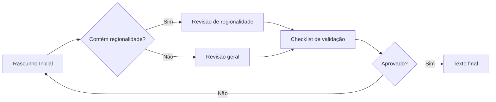

# Diretrizes de narrativa

Este documento estabelece padrões para criação de narrativas, falas de personagens e conteúdos educativos do jogo, garantindo consistência, acessibilidade e respeito à diversidade cultural brasileira.

---

## Objetivo

Garantir que todas as narrativas do jogo sigam padrões de:
- **Consistência** de linguagem e tom
- **Acessibilidade textual** para inclusão intelectual
- **Respeito à diversidade** cultural brasileira
- **Facilidade de produção** com apoio de inteligência artificial
---

## Tipos de texto do jogo

Todos os textos devem estar sempre em português brasileiro.
O jogo possui diferentes categorias de texto, cada uma com características específicas:

### 1. falas da inspetora Jarbas
- **Origem**: NPC "inspetora Cremilda Jarbas" (chefe)
- **Surgimento**: Sempre que o jogador interagir com a NPC
- **Função**: Guiar o jogador, apresentar contextos, dar feedback, trazer humor
- **Tom**: Profissional, instrucional, objetivo, levemente sarcástico, usa linguagem neutra de gênero (prioriza substantivos e adjetivos comuns de dois gêneros a substantivos e adjetivos no masculino ou feminino)
- **Regionalidade**: Bastante regionalista, adaptável ao local da fase, sem usar de estereótipos ofensivos (ver seção específica)
- **Exemplos**: em Minas Gerais, usando falas típicas dos moradores da região: "Boas-vindas ao Inhotim! Tá um trem doido aqui, tiraram os quadros do lugar, rasgaram as fotografias… Nó! Um crime!" (prioriza "boas-vindas" neutro em gênero em vez de "bem-vindo" no masculino), "Uai, você arredou tudo? Demorou um tiquinho, quase criei raiz esperando…", "As pinturas, esculturas e até a fotografia estão no lugar. Milagre, porque cola você não tinha.", "Podemos iniciar o teste?" (prioriza "podemos iniciar" neutro em gênero em vez de "pronto para iniciar" no masculino)
- - **Exemplo de output esperado**: 
```markdown
- *contextualizar em que situação dentro do jogo as falas a seguir apareceriam*
“Fala que faz sentido nesse contexto, entre aspas, incluindo regionalismo, patuá.”
“Outra string para esse contexto, dando continuidade à anterior.” [entre colchetes, descreva algum evento dentro do jogo, como a câmera focando num objeto, apenas se necessário]

- *Ao interagir com a primeira escultura, câmera acompanha o chefe andando até o jogador (entrando off-camera):*
“Entendo sua confusão, mas essa obra é assim mesmo, uma escultura sem cabeça. Não é obra de nenhum vândalo.”
“Parece que ele não danificou as obras aqui do Inhotim, apenas tirou tudo do lugar. Observe as plaquinhas informativas.” [câmera se move até uma plaquinha]
“Cada uma fala sobre uma obra em exposição. Leia sobre as obras em questão, encontre-as e leve-as até seus respectivo lugares.”

- *Começo da fase, jogador e chefe entram juntos na fase, na bilheteria do teatro:*
“O dever nos chama de novo, detetive. O pano de boca do Teatro Amazonas foi roubado.”
“Essa invasão lembra muito a que vimos no Inhotim.”
“Vamos investigar e preparar o espetáculo ao mesmo tempo.”
“Cada detalhe deste teatro conta uma história. Fique de olho no que parecer estranho.”
```

### 2. etiquetas de obras
- **Origem**: interface
- **Surgimento**: Sempre que o jogador interagir com uma etiqueta
- **Função**: Apresentar informações educativas sobre obras de arte e seus artistas
- **Tom**: Informativo, objetivo, acessível
- **Regionalidade**: Contextual, neutro, respeitando as regras de regionalidade
- **Estrutura**: 1 título da obra (nome real e nome popular) + 1 nome do artista criador (apenas nomes artísticos, se for mais de um artista, separar com vírgula e espaço) + 1 período (ano, década, século ou "circa") + 1 descrição (no máximo 144 caracteres, descrever a obra e, se possível, um fato sobre o artista) + 1 opinião do detetive (consultar tipo de texto 3, impressões do detetive) + 1 feedback de erro (consultar tipo de texto 6, retornos de erro)
- **Exemplos**: "O machado vermelho representa Xangô, justiça e poder.\n\nEssa obra homenageia um amigo que lutou com Abdias Nascimento contra o racismo.", "Pássaro livre no céu.\n\nAbdias e Gerardo foram perseguidos na ditadura. Abdias também foi poeta, professor e político indicado ao Nobel da Paz.", "Retrata em cores vibrantes Oxum, deusa das águas doces.\n\nAbdias Nascimento fundou o Teatro Experimental do Negro e o Museu da Arte Negra.", "Foto preto e branco dum curumim numa casa comunitária.\n\nClaudia retratou o cotidiano dos yanomamis. Nos anos 70, tentaram invadir suas terras."
- **Exemplo de output esperado**:
```json
"abdiasn_invocacao_noturna_oxossi": {
      "id": "abdiasn_invocacao_noturna_oxossi",
      "type": "Painting",
      "metadata": {
        "title": "Invocação noturna ao poeta Gerardo Mello Mourão: Oxóssi",
        "author": "Abdias Nascimento",
        "year": "1972",
        "period": "Contemporâneo",
        "place": "Búfalo, Nova Iorque, EUA"
      },
      "educational": {
        "description": "Pássaro livre no céu.\n\nAbdias e Gerardo foram perseguidos na ditadura. Abdias também foi poeta, professor e político indicado ao Nobel da Paz.",
        "dimensions": "152 x 102 cm",
        "medium": "Acrílica sobre tela",
        "opinion": "Vejo o céu em muitos tons de azul e um pássaro voando livremente. No chão tem um arco e flecha apontando para cima.",
        "feedbackError": "Aqui deve ter algo relacionado a um pássaro no céu azul.",
        "hint": "XXXXX"
      },
      "assets": {
        "sprite": "abdiasn_invocacao_noturna_oxossi"
      }
```

### 3. impressões do detetive
- **Origem**: protagonista
- **Surgimento**: Sempre que o jogador interagir com uma obra de arte
- **Função**: Fornecer insights descritivos sobre o que encontra na fase (obras de arte e pistas)
- **Tom**: Opinativo, analítico, investigativo, engajante, objetivo, tenta ser engraçado quando dá
- **Regionalidade**: Neutro, focado na narrativa
- **Exemplos**: "Essa é uma foto muito legal! A luz do sol invade a oca comunitária e ilumina uma criança.", "Uma foto rasgada! Está em preto e branco e parece ser o teto de algum lugar.", "Que pintura colorida! Mostra uma linda moça coroada, com os olhos cobertos e estrelas multicor em seu peito.", "Parece muito a bandeira do Brasil com uma flecha, mas tem poucas estrelas. Está escrito “okê” várias vezes.", "Um vermelho muito forte. Me lembra uma máscara negra com uma coroa de prata, dividida por um grande machado.", "Uma escultura de uma pessoa totalmente curvada. Parece que olha para seu próprio corpo."

### 4. pistas
- **Origem**: protagonista
- **Surgimento**: Sempre que o jogador interagir com uma pista do vândalo
- **Função**: Orientar o jogador durante o jogo
- **Tom**: Descritivo, opinativo, direto, claro, induz a uma linha de raciocínio
- **Regionalidade**: Neutro, sem regionalidade
- **Exemplos**: "Um cachimbo bem fedorento, com restos de plantas queimadas. Parece que foi usado há pouco tempo, não deve ser um item do museu.", "Já vi um negócio desses, mas não lembro onde. Com certeza não foi aqui em Minas Gerais."

### 5. retornos de acerto
- **Origem**: protagonista
- **Surgimento**: Sempre que o jogador acertar a posição de uma obra
- **Função**: Dar retorno imediato ao jogador quando acertar
- **Tom**: Celebratório, incentivante
- **Regionalidade**: Neutro, sem regionalidade
- **Exemplos**: "Pronto! Essa é posição original da escultura. Bate com o que diz na plaquinha.", "Pronto! Essa pintura fica aqui mesmo. Bate com o que diz na plaquinha.", "As coisas já estão começando a parecer com o que era antes.", "Vou explorar mais!"

### 6. retornos de erro
- **Origem**: protagonista
- **Surgimento**: Sempre que o jogador errar a posição de uma obra
- **Função**: Dar retorno imediato ao jogador quando errar
- **Tom**: Opinativo, educativo, respeitoso
- **Regionalidade**: Neutro, sem regionalidade
- **Exemplos**: "Aqui deve ter algo mostrando um corpo que faz força.", "Aqui deve ter algo vermelho e relacionado a Xangô.", "Aqui deve ter algo relacionado às cores da nossa bandeira.", "Ops! A descrição da placa não bate com essa pintura.", "Melhor continuar investigando."

### 7. legendas dos quadrinhos introdutórios
- **Origem**: interface
- **Surgimento**: Sempre que uma fase for iniciada
- **Função**: Antes de cada fase começar, surge uma introdução em quadrinhos com no máximo 4 painéis.
- **Tom**: Narrativo, contextual, objetivo
- **Regionalidade**: Neutro, sem regionalidade
- **Estrutura**: 1 título curto (no máximo 25 caracteres, caixa alta) + 1 legenda (no máximo 80 caracteres) por painel
- **Exemplos**: "VANDALISMO TOTAL", "Na madrugada de ontem, vândalos invadiram o Inhotim e atacaram as obras.", "A INVESTIGAÇÃO COMEÇA", "A polícia chamou detetives da região para ajudar a investigar.", "MISSÃO: BUSCAR PISTAS", "A inspetora-chefe pediu que você a acompanhasse no caso.", "DISFARCE PERFEITO", "Com roupas de zelador, sua missão é procurar pistas enquanto organiza o lugar."
- **Exemplo de output esperado**:
```json
    {
      "imageSuggestion: "uma gangue de cinco encapuzados invadindo um museu na calada da noite, pixando paredes e destruindo pinturas",
      "title": "VANDALISMO TOTAL",
      "caption": "Na madrugada de ontem, vândalos invadiram o Inhotim e atacaram as obras."
    },
    {
      "imageSuggestion: "uma mão pega uma mensagem sendo impressa num aparelho de fax, com vários carimbos de confidencial, SOS, urgente",
      "title": "A INVESTIGAÇÃO COMEÇA",
      "caption": "A polícia chamou detetives da região para ajudar a investigar."
    },
    {
      "imageSuggestion: "um fusca preto avança numa estrada de terra, passando por uma placa onde se lê Inhotim, duas silhuetas são vistas dentro do carro",
      "title": "MISSÃO: BUSCAR PISTAS",
      "caption": "A inspetora-chefe pediu que você a acompanhasse no caso."
    },
    {
      "imageSuggestion: "a inspetora, classuda, cabelos brancos e vestida de roxo, observa o detetive disfarçar-se calçando luvas de limpeza dentro de uma sala de zelador, com vários objetos de faxina ao redor",
      "title": "DISFARCE PERFEITO",
      "caption": "Com roupas de zelador, sua missão é procurar pistas enquanto organiza o lugar."
    }
```

### 8. perguntas e respostas do teste
- **Origem**: interface
- **Surgimento**: Sempre que um desafio for concluído, o jogador participa dum pequeno teste de conhecimento
- **Função**: Validar se o jogador de fato entendeu algo sobre as obras com as quais acaba de interagir
- **Tom**: Educativo, direto, minimamente desafiador, contextual, instigante
- **Regionalidade**: Neutro, sem regionalidade
- **Estrutura**: 1 pergunta (no máximo 144 caracteres, nível de dificuldade de 1 a 3, explicados abaixo) + 4 alternativas (no máximo quatro palavras cada)
- **Níveis de dificuldade**: 1 - easy: conhecimento geral básico, qualquer cidadão deve conhecer; 2 - medium: conhecimento que o jogador pode adquirir lendo as etiquetas e interagindo com o jogo; 3 - hard: exige que o jogador raciocine e tente assimilar o que viu no jogo com conhecimento externo
- **Exemplos**: "As pinturas de Abdias Nascimento têm forte influência de qual religião?", ["umbanda", "protestantismo", "islamismo", "budismo"], "Qual fotógrafa foi ativa na luta pela demarcação das terras yanomamis?", ["Luisa Dörr", "Nair Benedicto", "Bárbara Wagner", "Claudia Andujar"]
- **Exemplo de output esperado**:
```json
    {
      "id": "q2",
      "category": "Inhotim Pintura",
      "question": "As pinturas de Abdias Nascimento têm forte influência de qual religião?",
      "options": ["umbanda", "protestantismo", "islamismo", "budismo"],
      "correctOptionIndex": 0,
      "explanation": "XXXXX",
      "hint": [
        "As divindades dessa religião são chamadas orixás.",
        "Uma religião de origem africana criada no Brasil."
      ],
      "tags": ["pintura", "religiao", "abdiasn"],
      "difficulty": "easy"
    },
    {
      "id": "q4",
      "category": "Inhotim Fotografia",
      "question": "Qual fotógrafa foi ativa na luta pela demarcação das terras yanomamis?",
      "options": [
        "Luisa Dörr",
        "Nair Benedicto",
        "Bárbara Wagner",
        "Claudia Andujar"
      ],
      "correctOptionIndex": 3,
      "explanation": "XXXXX",
      "hints": [
        "Ela teve boa parte da família morta no holocausto judeu e imigrou para o Brasil ainda criança.",
        "Nasceu na cidade de Neuchâtel, na Suíça."
      ],
      "tags": ["biografia", "candujar"],
      "difficulty": "medium"
    },
```

---

## Detetive (protagonista, jogador): personalidade textual base

### Características constantes
O detetive, protagonista do jogo, que é quem o jogador controla, é um jovem em início de carreira. Ele se disfaça de zelador, contrarregra, caipira para poder andar pelos lugares sem levantar suspeitas, mas não usa jargões porque os desconhece. Sempre diz o que pensa e o que vê, como uma forma de se comunicar com o jogador que o controla:

- **Instrucional**: diz se as coisas parecem estar certas ou erradas
- **Investigativo**: considera possibilidades, busca entender motivos
- **Opinativo**: sempre deixa claro o que pensa a cada interação
- **Curioso**: demonstra interesse genuíno pelo local e obras

Consultar o tipo de texto 3, "impressões do detetive", se necessário.

### Tom de voz
- Frases claras e diretas
- Vocabulário acessível e jovial
- Busca ser engraçado e fazer trocadilhos
- Não usa jargão técnico

**Exemplos:**
- "Vejo o céu em muitos tons de azul e um pássaro voando livremente. No chão tem um arco e flecha apontando para cima."
- "Uma escultura de uma pessoa totalmente curvada. Parece que olha para seu próprio corpo."
- "Parece muito a bandeira do Brasil com uma flecha, mas tem poucas estrelas. Está escrito “okê” várias vezes, mas “okê” isso significa?"
- "Uma foto rasgada! Está em preto e branco e parece ser o teto de algum lugar."
- "Essa é uma foto muito legal! A luz do sol invade a oca comunitária e ilumina uma criança."
- "Legal! Uma réplica da obra que vi lá fora! Opa! O que tem nesse papel aqui embaixo?"
- "O que é isso? É de metal e consigo ver meu rosto nele, como um espelho. Tem um papel aqui embaixo."
- "Um cachimbo bem fedorento, com restos de plantas queimadas. Parece que foi usado há pouco tempo, não deve ser um item do museu."
- "Já vi um negócio desses, mas não lembro onde. Com certeza não foi aqui em Minas Gerais."

---

## Inspetora Cremilda Jarbas: personalidade textual base

### Características constantes
A Inspetora Jarbas mantém sua personalidade em todos os níveis. Ela sempre fala com neutralidade de gênero (evita ao máximo usar termos no masculino ou no feminino, mesmo que a personagem principal seja um detetivo homem e ela uma mulher):

- **Profissional**: competente, organizada, metódica
- **Instrucional**: recebe o jogador, diz o que precisa ser feito
- **Regionalista**: troca de linguajar a cada fase, variando conforme o lugar

Consultar o tipo de texto 1, "falas da inspetora Jarbas", se necessário.

### Tom de voz
- Frases claras e diretas
- Vocabulário acessível e sênior
- Tom encorajador
- Não usa jargão técnico
- Usa linguagem neutra em gênero
- Mantém distância profissional adequada

**Exemplos:** (fase 1 em Minas Gerais, falando como cidadã mineira)
- "Boas-vindas ao Inhotim! Tá um trem doido aqui, tiraram os quadros do lugar, rasgaram as fotografias… Nó! Um crime!"
- "Já que se disfarçou de zelador, procure pistas sem chamar atenção, já basta essa bagunça que fizeram."
- "Leia as placas e coloque as obras no lugar certo."
- "Uai, você arredou tudo? Demorou um tiquinho, quase criei raiz esperando…"
- "As pinturas, esculturas e até a fotografia estão no lugar. Milagre, porque cola você não tinha."
- "Agora vem o teste. Vamos ver se você prestou atenção ou se foi só no chute. Não que eu duvide de você."
- "Uai, você sabe bastante. Merece palmas, mas sem exagero."
- "Já vimos tudo por aqui. Tomara que não aconteça outro ataque."
- "Hmm… Você se embolou nos detalhes igual um zé dend'água."
- "Veja as obras, leia as placas. Tô aqui quando quiser tentar de novo."

---

## Regionalidade nas falas

### Princípios fundamentais

#### 1. Respeito
A cultura local deve ser apresentada com valorização e curiosidade genuína.

**Nunca** utilizar termos depreciativos ou que reforcem preconceitos históricos.

#### 2. Naturalidade
A inspetora adapta levemente sua forma de falar ao ambiente, mas **não "vira uma personagem regional"**. Sua personalidade permanece constante durante todo o jogo.

#### 3. Compreensão
Toda fala deve ser facilmente compreendida por jogadores de **qualquer região do Brasil**. Caso seja utilizada uma palavra regional pouco conhecida, seu significado deve ser inferido pelo contexto.

#### 4. Moderação
Regionalidade é um **tempero, não o prato principal**. Uma ou duas referências discretas são suficientes para caracterizar o ambiente.

---

### ✅ Regionalidade permitida

#### Vocabulário pontual
Utilizar ocasionalmente palavras típicas da região quando forem amplamente reconhecidas ou facilmente compreendidas.

**Exemplos:**
- "Vamos conhecer melhor este trem." (não se referindo a um trem literal)
- "Calma aí, meu rei!" (não se referindo a um rei literal)

#### Referências culturais
Pode mencionar elementos **reais** da cultura local:
- gírias
- arquitetura
- culinária
- música
- manifestações populares
- artistas
- obras
- tradições

**Essas referências devem surgir de forma contextualizada.** Não basta dizer que vai preparar um tacacá, o jogador precisa entender que se trata de uma comida. Sobretudo quando a palavra tem outros significados.

**Exemplos:**
- "Vou preparar um tacacá para comer."
- "Estou com fome. Vou preparar um tacacá."
- "Vou à cozinha preparar um tacacá."

#### Formas de acolhimento
A inspetora pode adaptar pequenas falas:

**Exemplos:**
- "Te apruma para investigar, guri!"
- "Partiu?"
- "Oxente! Quem fez isso?"
- "Não sei, uai!"
- "Que confusão, tchê!"

**Nota:** Não é necessário usar regionalismos em toda frase.

---

### ❌ Regionalidade não permitida

#### Excesso de sotaque escrito
**Evitar** grafias que tentem reproduzir pronúncias.

**Não escrever:**
- "muié"
- "num vô"
- "ocê"

Mesmo quando essas formas existem na oralidade, elas reduzem a legibilidade e tendem à caricatura.

#### Erros gramaticais intencionais
**Não** alterar a norma escrita para representar um modo de falar.

**Exemplo inadequado:**
> "Nós vai resolver isso."

#### Generalizações culturais
**Evitar** afirmações que reduzam uma região a um único traço.

**Exemplos inadequados:**
> "Todo nordestino…"
> "O pessoal daqui sempre…"
> "No Sul todo mundo…"

**O Brasil possui enorme diversidade.**

#### Piadas sobre identidade regional
**Nunca** utilizar a regionalidade como recurso humorístico.
O humor da personagem deve surgir da situação investigativa, não da cultura local.

#### Acúmulo de regionalismos
**Evitar** inserir diversas expressões regionais na mesma fala.
Mesmo expressões corretas podem se tornar artificiais quando usadas em excesso.

#### Associações estereotipadas
**Não** associar regiões a características de personalidade ou comportamento.

**Exemplo inadequado:**
> "Baianos são…"

---

### Frequência recomendada

Como regra geral:
- **No máximo duas expressões regionais por fala**
- **Referências culturais locais apenas quando contribuírem para a narrativa**
- **Se a expressão puder gerar dúvida, priorizar alternativa mais clara**

O jogador deve perceber que a inspetora **conhece a região e seus habitantes**.

---

## ♿ Acessibilidade textual

### Princípios de linguagem simples

Todos os textos devem estar sempre em português brasileiro.

Sempre que possível:
- ✅ frases curtas
- ✅ palavras de três sílabas ou menos
- ✅ voz ativa
- ✅ ordem direta
- ✅ uma ideia principal por frase
- ✅ vocabulário comum
- ✅ linguagem neutra em gênero (priorizando expressões, substantivos e adjetivos aplicáveis a qualquer gênero em vez de declinados no masculino ou feminino, como boas-vindas em vez de bem-vindo, estudante em vez de aluna)

**Evitar:**
- ❌ metáforas complexas
- ❌ polissílabos
- ❌ expressões extremamente locais
- ❌ construções ambíguas
- ❌ jargão técnico
- ❌ mais de 144 caracteres
- ❌ neutralidade artificial ("todes", "menine", "inspetore", etc)

### Estrutura de frases
- **Sujeito + verbo + complemento** (ordem direta)
- **Máximo de 20 palavras por frase** (ideal)
- **Evitar orações subordinadas complexas**
- **Preferir verbos concretos e específicos**

---

## Exemplos práticos

### ✅ Exemplos adequados

#### Exemplo 1: Descrição de um ambiente
> "Boas-vindas ao Inhotim! Tá um trem doido aqui, tiraram os quadros do lugar, rasgaram as fotografias… Nó! Um crime!"

**Características:**
- Tom acolhedor
- Informação contextual
- Vocabulário acessível
- Regionalismo aplicado sem exagero
- Menos de 144 caracteres

#### Exemplo 2: etiqueta de uma obra de arte
> "A bandeira do Brasil com símbolos da umbanda.\n\nOkê é saudação a Oxóssi, deus da mata. O ofá (arco e flecha) aponta para cima, passa firmeza."

**Características:**
- Informação cultural
- Vocabulário acessível
- Traduz em palavras a obra visual
- Menos de 144 caracteres

#### Exemplo 2: etiqueta de uma obra de arte
> "Um vermelho muito forte. Me lembra uma máscara negra com uma coroa de prata, dividida por um grande machado."

**Características:**
- Traduz em palavras a obra visual
- Vocabulário acessível
- Menos de 144 caracteres

---

### ❌ Exemplos inadequados

#### Exemplo 1: Excesso de regionalismos
> "Oxente, visse? Aqui é tudo arretado demais! Bora simbora que esse povo sabe fazer teatro que só!"

**Problemas:**
- Excesso de regionalismos
- Sotaque escrito
- Caricatura
- Redução da cultura local a clichês

#### Exemplo 2: Generalização
> "Esse povo daqui sabe mesmo fazer festa."

**Problemas:**
- Generalização cultural
- Reforço de estereótipos

#### Exemplo 3: Sotaque escrito
> "Ocê num vai acreditá no que nóis achô."

**Problemas:**
- Erros de português
- Sotaque escrito
- Perda de legibilidade
- Baixa acessibilidade

---

## Processo de criação e revisão

### Fluxo de trabalho



### Revisão humana obrigatória

Toda fala regionalizada deve passar por revisão humana antes de ser aprovada.

**A revisão deve verificar:**
- fidelidade cultural
- ausência de estereótipos
- clareza
- acessibilidade
- consistência com a personalidade da inspetora Jarbas

---

## ✅ Checklist de validação

Antes da aprovação, responder às seguintes perguntas:

### Conteúdo educacional
- [ ] O texto contribui para o contexto educativo?
- [ ] A parte principal do conteúdo aparece primeiro?
- [ ] Usa palavras de fácil assimilação?

### Personalidade e consistência
- [ ] A personalidade da inspetora permanece consistente?
- [ ] O tom de voz está adequado?

### Regionalidade (se aplicável)
- [ ] A regionalidade é discreta?
- [ ] Existe algum estereótipo cultural?
- [ ] Há excesso de regionalismos?
- [ ] A referência cultural é verdadeira e contextualizada?

### Acessibilidade
- [ ] A fala pode ser compreendida em qualquer região do Brasil?
- [ ] A linguagem continua simples e acessível?
- [ ] As frases são curtas e diretas?

### Qualidade geral
- [ ] O texto está livre de erros gramaticais?
- [ ] O vocabulário é adequado ao público-alvo?
- [ ] A mensagem é clara e objetiva?

**Caso qualquer resposta seja negativa, o texto deve ser revisado.**

---

## Uso com Inteligência Artificial

### Diretrizes para geração de textos

Ao gerar falas utilizando IA, considerar **obrigatoriamente**:

#### Preservação da personalidade
- Manter características constantes das personagens
- Garantir consistência de tom e voz
- Respeitar o jogador

#### Regionalidade
- Priorizar clareza
- Utilizar regionalidade apenas quando agregar contexto
- **Evitar caricaturas**
- **Evitar sotaque escrito**
- **Evitar generalizações**

#### Acessibilidade
- Respeitar linguagem simples
- Manter foco educativo
- Garantir compreensão universal

### Prompt base para IA

```
Você é responsável por criar textos para um jogo educativo sobre arte e cultura brasileira. O público-alvo do jogo são adultos de 18 a 30 anos, incluindo pessoas com deficiência intelectual. Ao gerar qualquer texto, siga esta ordem de prioridade:

1. As regras específicas desta tarefa.
2. As diretrizes do narrative-guidelines.md.
3. Os exemplos fornecidos.
4. Seu conhecimento geral.

CONTEXTO:
- Fase [nível], no [local]
- [adicionar mais contexto, se preciso]

TAREFA:
Criar [tipo de texto] (tipo do texto [índice numérico]) para [contexto específico].

OBJETIVO PEDAGÓGICO:
[qual conhecimento o jogador deve aprender ou reforçar]

DIRETRIZES:
- Texto sempre em português brasileiro
- Usar linguagem simples e acessível
- Vocabulário comum e compreensível
- Frases curtas e diretas (antes de responder, verifique se nenhum texto ultrapassa 144 caracteres)
- Manter tom correspondente ao tipo de texto
- Caso já existam textos semelhantes no projeto, preserve o mesmo padrão de vocabulário, estrutura e nível de detalhamento (porém evite repetir exatamente a mesma estrutura ou palavras entre textos do mesmo tipo, salvo quando necessário para manter consistência)
- [Incluir/evitar] regionalidade [de tal lugar]
- Nunca invente fatos históricos, biográficos ou artísticos (caso a referência não contenha informação suficiente, sinalize a ausência de informação ou mantenha o texto genérico)
- Considere as referências fornecidas abaixo como fonte principal das informações (use conhecimento externo apenas quando não contradisser as referências e for necessário para compreender o contexto)
- Responda apenas com o conteúdo solicitado (não explique seu raciocínio nem descreva como produziu o texto)

EXEMPLO DE REFERÊNCIA:
[exemplo de texto adequado]

SAÍDA ESPERADA:
Texto em português brasileiro.
[descrição do formato de saída]

Antes de finalizar, confirme mentalmente que:

- o texto segue o tipo solicitado;
- respeita o limite de tamanho;
- usa linguagem simples;
- não contradiz as referências;
- mantém o tom definido.
```

### Revisão de conteúdo gerado por IA

**A saída gerada por IA nunca deve ser publicada sem revisão humana.**

**Verificar:**
1. **Corretude**: O texto está gramaticalmente correto?
2. **Adequação**: Segue as diretrizes deste documento?
3. **Autenticidade**: Soa natural e genuíno?
4. **Respeito**: Evita estereótipos e generalizações?
5. **Acessibilidade**: É compreensível para o público-alvo?

---

## Referências e recursos

### Níveis do jogo
1. **Fase 1**: Inhotim (MG) - Referência inicial
2. **Fase 2**: Teatro Amazonas (AM) - Em desenvolvimento
3. **Fase 3**: São João de Campina Grande (PB) - Em desenvolvimento narrativo
4. **Fase 4**: Teatro Guaíra (PR) - Em ideação
5. **Fase 5**: Palácio Itamaraty (DF) - Em ideação

### Objetivos narrativos e pedagógicos

1. **Fase 1**: apresentar a diversidade artística do Inhotim e do Brasil, em sua contemporaneidade. Apresenta um artista gay cuja arte aborda questões do corpo e transformações, um artista negro cujo trabalho enaltece e educa a matriz africana e uma artista estrangeira que se naturalizou brasileira cuja arte retrata o povo e a cultura autóctone.
2. **Fase 2**: abordar a riqueza cultural do povo e patrimônio amazonenses.Apresenta obras e temas locais como personagens históricas, dramaturgos e artistas da região, mas também doutras regiões do Brasil e até doutros países.
3. **Fase 3**: valorizar a festa mais celebrada no Brasil, as festas juninas.
4. **Fase 4**: a definir
5. **Fase 5**: a definir

### Documentos relacionados
- [CONTRIBUTING.md](../en/CONTRIBUTING.md) - Padrões de desenvolvimento
- [ARCHITECTURE.md](../en/ARCHITECTURE.md) - Arquitetura do sistema
- [AGENTS.md](../../AGENTS.md) - Diretrizes para agentes de IA

### Recursos externos
- [Linguagem simples](https://www.linguagemsimples.com.br/)
- [Manual de estilo da Wikipédia](https://pt.wikipedia.org/wiki/Wikipédia:Manual_de_estilo)
- [Guia de acessibilidade digital](https://www.w3.org/WAI/)
- [Relatório de acessibilidade do MVP](https://drive.google.com/file/d/1Hve9UIU57rbzffHo8T151RGWUC9bL8Az/view?usp=drive_link)

---

## Métricas de qualidade

### Indicadores de sucesso
- **Compreensão**: Textos aprovados em teste com usuários
- **Consistência**: Padronização entre níveis
- **Acessibilidade**: Conformidade com diretrizes de linguagem simples
- **Respeito cultural**: Ausência de reclamações ou feedbacks negativos

### Processo de validação
1. **Revisão interna** pela equipe de narrativa
2. **Teste com usuários** representativos do público-alvo
3. **Validação por especialista** em acessibilidade
4. **Aprovação final** pela Product Owner

---

## Manutenção e atualização

Este documento deve ser atualizado quando:
- Novos níveis forem adicionados
- Feedback de usuários indicar necessidade de ajustes
- Novas diretrizes de acessibilidade forem publicadas
- A personalidade da Inspetora Jarbas evoluir

**Responsável pela manutenção**: César Augusto do Nascimento

**Última atualização**: 29-06-2026

**Próxima revisão**: Após validação do nível 2

