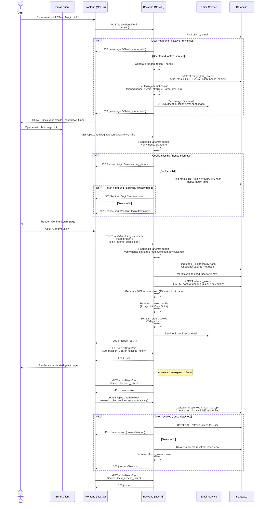
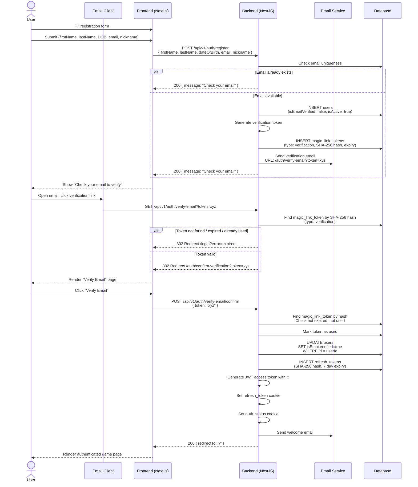
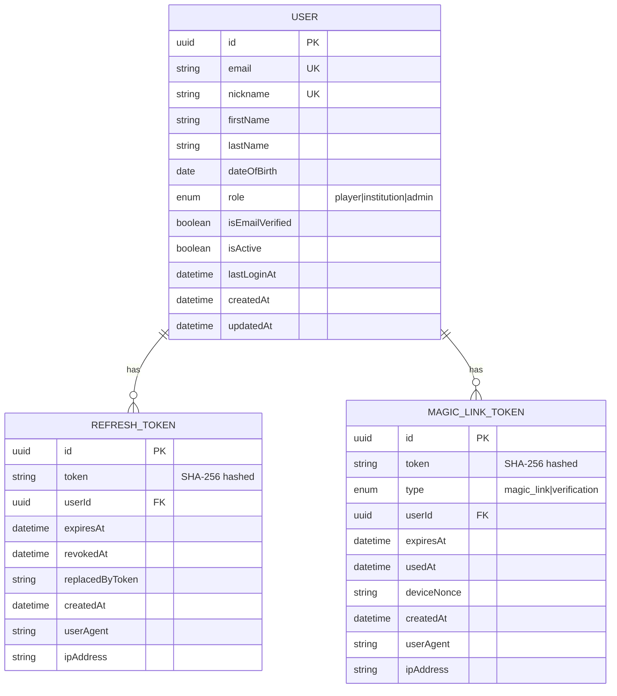
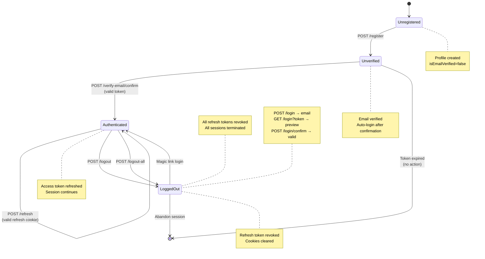
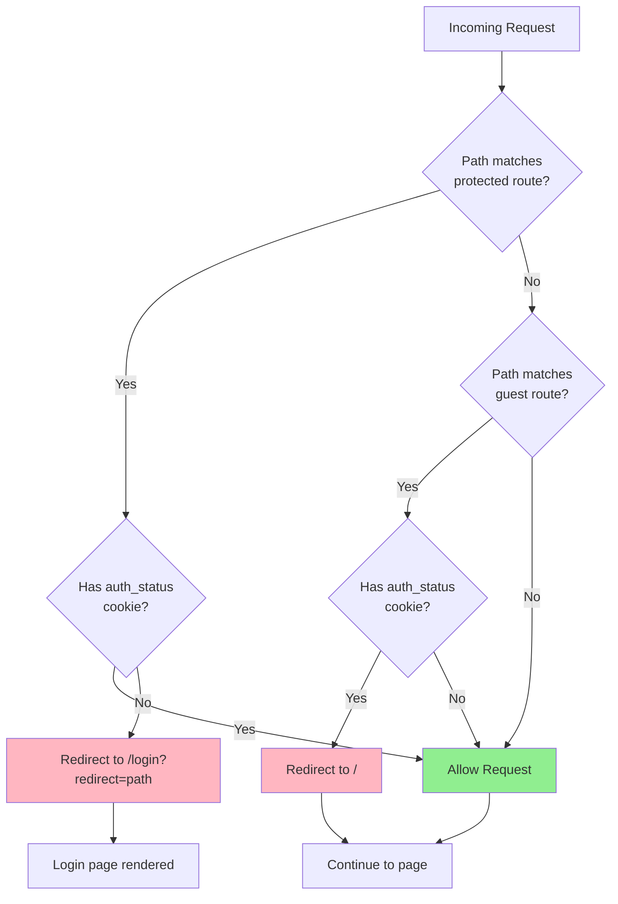

# Plano de Implementação de Autenticação e Autorização

## Índice

- [Visão Geral da Arquitetura](#visão-geral-da-arquitetura)
- [Diagramas](#diagramas)
  - [Fluxo de Login com Magic Link (Sequência)](#1-fluxo-de-login-com-magic-link-sequência)
  - [Fluxo de Cadastro (Sequência)](#2-fluxo-de-cadastro-sequência)
  - [Schema do Banco de Dados (Diagrama ER)](#3-schema-do-banco-de-dados-diagrama-er)
  - [Máquina de Estados de Autenticação do Usuário](#4-máquina-de-estados-de-autenticação-do-usuário)
  - [Proteção de Rotas pelo Middleware do Next.js (Fluxograma)](#5-proteção-de-rotas-pelo-middleware-do-nextjs-fluxograma)
- [Fase 1: Backend — Dependências e Configuração](#fase-1-backend--dependências-e-configuração)
- [Fase 2: Backend — Schema do Banco de Dados e Migrations](#fase-2-backend--schema-do-banco-de-dados-e-migrations)
- [Fase 3: Backend — Módulo de Auth](#fase-3-backend--módulo-de-auth)
- [Fase 4: Backend — Módulo Admin](#fase-4-backend--módulo-admin)
- [Fase 5: Backend — Integração](#fase-5-backend--integração)
- [Fase 6: Frontend — Dependências e Configuração](#fase-6-frontend--dependências-e-configuração)
- [Fase 7: Frontend — Tipos e Validação de Auth](#fase-7-frontend--tipos-e-validação-de-auth)
- [Fase 8: Frontend — API Client e Auth Context](#fase-8-frontend--api-client-e-auth-context)
- [Fase 9: Frontend — Páginas de Auth (MUI)](#fase-9-frontend--páginas-de-auth-mui)
- [Fase 10: Frontend — Middleware e Proteção de Rotas](#fase-10-frontend--middleware-e-proteção-de-rotas)
- [Fase 11: Testes](#fase-11-testes)
- [Ordem de Implementação](#ordem-de-implementação)
- [Verificação](#verificação)
- [Arquitetura e Trade-offs](#arquitetura-e-trade-offs)
  - [Magic Link sem Senha vs. Autenticação Baseada em Senha](#1-magic-link-sem-senha-vs-autenticação-baseada-em-senha)
  - [Confirmação do Magic Link em Duas Etapas](#2-confirmação-do-magic-link-em-duas-etapas)
  - [Magic Links Vinculados ao Dispositivo vs. Magic Links Universais](#3-magic-links-vinculados-ao-dispositivo-vs-magic-links-universais)
  - [Auto-Login pelo Link de Verificação vs. Redirecionamento para a Página de Login](#4-auto-login-pelo-link-de-verificação-vs-redirecionamento-para-a-página-de-login)
  - [Access Token em Memória vs. localStorage](#5-access-token-em-memória-vs-localstorage)
  - [Cookie `auth_status` vs. Access Token no Middleware](#6-cookie-auth_status-vs-access-token-no-middleware)
  - [Blocklist de Tokens em Memória vs. Redis](#7-blocklist-de-tokens-em-memória-vs-redis)
  - [Refresh Tokens Opacos vs. Refresh Tokens JWT](#8-refresh-tokens-opacos-vs-refresh-tokens-jwt)
  - [Detecção de Reuso de Refresh Token](#9-detecção-de-reuso-de-refresh-token)
  - [Tabela `magic_link_tokens` Separada vs. Estender `refresh_tokens`](#10-tabela-magic_link_tokens-separada-vs-estender-refresh_tokens)
  - [Rate Limiting por Email](#11-rate-limiting-por-email)
  - [Perfil Imutável vs. Perfis Editáveis](#12-perfil-imutável-vs-perfis-editáveis)
  - [Sem Fluxo de Redefinição de Senha](#13-sem-fluxo-de-redefinição-de-senha)
  - [Estratégia de SameSite dos Cookies](#14-estratégia-de-samesite-dos-cookies)
  - [Email como Identificador Imutável](#15-email-como-identificador-imutável)
  - [Logout de Todos os Dispositivos](#16-logout-de-todos-os-dispositivos)
  - [Sem Verificação de Idade](#17-sem-verificação-de-idade)
  - [Sem Log de Auditoria de Admin](#18-sem-log-de-auditoria-de-admin)
  - [Hashing de Tokens com SHA-256](#19-hashing-de-tokens-com-sha-256)
  - [Security Headers Adiados](#20-security-headers-adiados)
  - [Resumo do Modelo de Ameaças](#21-resumo-do-modelo-de-ameaças)
- [Principais Decisões de Design](#principais-decisões-de-design)

---

## Visão Geral da Arquitetura

**Estratégia de tokens:** Access token (JWT, 15min) armazenado na memória do JS, com uma claim `jti` única. Refresh token (string aleatória opaca, 7d) armazenado em um cookie httpOnly/Secure/SameSite=Strict e rotacionado a cada uso. Um cookie leve `auth_status` (não httpOnly, SameSite=Lax) permite a proteção de rotas pelo middleware do Next.js.

**Fluxo de auth (Magic Link):**
1. O usuário informa o email na página de login → o frontend chama `POST /auth/login`
2. O backend gera um token de magic link de uso único (expira em 15min), guarda o hash SHA-256 em `magic_link_tokens` e o envia por email
3. O backend define um cookie `login_attempt` de curta duração (15min, httpOnly, Secure, SameSite=Lax) contendo um nonce assinado
4. A URL do magic link inclui o token e o nonce: `GET /auth/login?token=xyz&nonce=abc`
5. O usuário clica no link do email → o backend valida o token (checagem de preview), verifica se o nonce bate com o cookie `login_attempt` e redireciona para a página de confirmação do frontend
6. O frontend renderiza a página "Confirmar Login"; o usuário clica no botão → `POST /auth/login/confirm` (cookie enviado automaticamente)
7. O backend valida o token de novo, marca como usado, define os cookies `refresh_token` e `auth_status`, emite um novo access token e redireciona para `/`
8. Em caso de falha do token (expirado, dispositivo errado, já usado, não verificado) → redireciona para `/login?error=<reason>`
9. O interceptor do Axios anexa o Bearer token a todas as requisições da API
10. Em caso de 401 → o interceptor chama `POST /auth/refresh` (cookie enviado automaticamente) → novo access token
11. Em caso de falha no refresh (incluindo detecção de reuso) → limpa o estado, remove o cookie `auth_status` e redireciona para `/login`
12. O middleware do Next.js lê o cookie `auth_status` para proteger as rotas (nenhum dado sensível nesse cookie)

**Fluxo de cadastro:**
1. O usuário preenche o formulário de cadastro (firstName, lastName, dateOfBirth, email, nickname) → `POST /auth/register`
2. O backend cria o usuário com `isEmailVerified = false`, gera um token de verificação e o guarda em `magic_link_tokens`
3. O backend envia o email de verificação com o link: `GET /auth/verify-email?token=xyz`
4. O usuário clica no link de verificação do email → o backend valida o token (preview) e redireciona para a página de confirmação do frontend
5. O usuário clica em "Verificar Email" → `POST /auth/verify-email/confirm` → o backend marca o email como verificado, ativa a conta, define os cookies de auth, envia o email de boas-vindas e redireciona para `/`
6. Se o email já existir → retorna uma resposta genérica idêntica (sem vazamento por enumeração, sem email de aviso)

**Fluxo de logout:**
1. `POST /auth/logout` lê o cookie `refresh_token` (não exige JWT). Revoga o refresh token no banco de dados e limpa todos os cookies de auth. Se houver um header `Authorization` com um access token, o token entra na blacklist pelo seu `jti`.
2. `POST /auth/logout-all` exige um JWT válido. Revoga TODOS os refresh tokens do usuário autenticado e coloca na blacklist o `jti` do access token atual.

---

## Diagramas

### 1. Fluxo de Login com Magic Link (Sequência)



### 2. Fluxo de Cadastro (Sequência)



### 3. Schema do Banco de Dados (Diagrama ER)



### 4. Máquina de Estados de Autenticação do Usuário



### 5. Proteção de Rotas pelo Middleware do Next.js (Fluxograma)



---

**Carregamento da página / restauração de sessão:**
1. O AuthProvider é montado → verifica se existe o cookie `auth_status`
2. Se existir → chama `GET /auth/me` com qualquer access token armazenado
3. Se `/me` retornar 401 → tenta `POST /auth/refresh` (cookie enviado automaticamente)
4. Se o refresh der certo → armazena o novo access token e define o estado do usuário
5. Se o refresh falhar (incluindo detecção de reuso) → limpa todo o estado, remove o cookie `auth_status` e redireciona para `/login`

**Auth no jogo:** O jogo em Phaser se comunica com o backend através do shell React. O interceptor do Axios do shell React cuida dos headers de auth. O Phaser dispara eventos → o shell React faz as chamadas de API → devolve os dados para o Phaser.

---

## Fase 1: Backend — Dependências e Configuração

### Instalar dependências
```bash
cd back && npm add @nestjs/passport @nestjs/jwt @nestjs/throttler passport passport-jwt cookie-parser && npm add -D @types/passport-jwt
```

> Observação: `bcryptjs` e `@types/bcryptjs` foram **removidos** — auth sem senha não precisa de hashing de senha. O hashing de tokens usa SHA-256 (`crypto` nativo do Node.js).

### Arquivos a criar/modificar

| Arquivo | Finalidade |
|------|---------|
| `back/src/core/config/config.service.ts` | Adicionar ao schema Zod: `JWT_SECRET`, `JWT_EXPIRATION` (padrão "15m"), `JWT_ISSUER` (padrão "gameplate"), `MAGIC_LINK_EXPIRATION_MIN` (padrão 15), `MAGIC_LINK_SECRET` (para assinar o nonce do cookie) |
| `back/.env.example` | Adicionar todas as novas env vars com valores padrão |
| `back/src/core/email/email.module.ts` | Módulo de email com provider mock |
| `back/src/core/email/interfaces/email-service.interface.ts` | Interface `IEmailService`: `sendMagicLinkEmail()`, `sendVerificationEmail()`, `sendWelcomeEmail()`, `sendLoginNotificationEmail()` |
| `back/src/core/email/services/mock-email.service.ts` | Implementação de IEmailService com console.log |
| `back/src/core/email/email.constants.ts` | Token de DI `EMAIL_SERVICE` |

### Variáveis de ambiente a adicionar
```
JWT_SECRET=change-me-in-production
JWT_EXPIRATION=15m
JWT_ISSUER=gameplate
MAGIC_LINK_SECRET=change-me-in-production
MAGIC_LINK_EXPIRATION_MIN=15
```

> **Env vars removidas:** `REFRESH_SECRET`, `REFRESH_EXPIRATION` — refresh tokens são strings aleatórias opacas, não JWTs. A expiração é controlada pela coluna `expiresAt` do banco de dados (padrão de 7 dias).

---

## Fase 2: Backend — Schema do Banco de Dados e Migrations

> **Premissa:** Este é um banco de dados novo, sem usuários existentes baseados em senha. Veja [Principais Decisões de Design](#principais-decisões-de-design) para a decisão documentada.

### Configuração do TypeORM CLI

| Arquivo | Finalidade |
|------|---------|
| `back/src/database/data-source.ts` | Configuração do DataSource do TypeORM para o CLI (usada pelos comandos de migration) |
| `back/package.json` | Adicionar scripts: `migration:generate`, `migration:run`, `migration:revert` |

### Entidades

| Arquivo | Finalidade |
|------|---------|
| `back/src/modules/users/enums/role.enum.ts` | Enum `Role`: `Player = 'player'`, `Institution = 'institution'`, `Admin = 'admin'` |
| `back/src/modules/auth/enums/magic-link-token-type.enum.ts` | Enum `MagicLinkTokenType`: `MagicLink = 'magic_link'`, `Verification = 'verification'` |
| `back/src/modules/auth/enums/jwt-token-type.enum.ts` | Enum `JwtTokenType`: `Access = 'access'` |
| `back/src/modules/users/user.entity.ts` | **MODIFICAR O EXISTENTE.** Adicionar colunas: `firstName` (string), `lastName` (string), `nickname` (string, unique), `dateOfBirth` (Date), `role` (enum Role, padrão Player), `isEmailVerified` (boolean, padrão false), `isActive` (boolean, padrão true), `lastLoginAt` (Date, nullable). **Remover colunas:** `password`, `emailVerificationToken`, `emailVerificationTokenExpires`, `passwordResetToken`, `passwordResetTokenExpires`, `failedLoginAttempts`, `lockedUntil` |
| `back/src/modules/auth/entities/refresh-token.entity.ts` | Nova entidade: `id` (uuid), `token` (string, hash SHA-256), `user` (ManyToOne → User), `expiresAt` (Date), `revokedAt` (Date, nullable), `replacedByToken` (string, nullable), `createdAt` (Date), `userAgent` (string, nullable), `ipAddress` (string, nullable) |
| `back/src/modules/auth/entities/magic-link-token.entity.ts` | Nova entidade: `id` (uuid), `token` (string, hash SHA-256), `type` (enum MagicLinkTokenType), `user` (ManyToOne → User), `expiresAt` (Date), `usedAt` (Date, nullable), `deviceNonce` (string, nullable), `createdAt` (Date), `userAgent` (string, nullable), `ipAddress` (string, nullable) |

### Migrations

| Arquivo | Finalidade |
|------|---------|
| `back/src/database/migrations/<timestamp>_AddProfileFieldsToUser.ts` | Adicionar `firstName`, `lastName`, `nickname` (unique), `dateOfBirth`, `role`, `isEmailVerified`, `isActive`, `lastLoginAt`. Remover as colunas relacionadas a senha. |
| `back/src/database/migrations/<timestamp>_CreateRefreshTokensTable.ts` | Criar a tabela `refresh_tokens` com FK para `users`. Índice em `token` (com hash) e `userId`. |
| `back/src/database/migrations/<timestamp>_CreateMagicLinkTokensTable.ts` | Criar a tabela `magic_link_tokens` com FK para `users`. Índice em `token` (com hash) e `type`. |

### Atualização do módulo

| Arquivo | Finalidade |
|------|---------|
| `back/src/modules/users/users.module.ts` | **MODIFICAR O EXISTENTE.** Adicionar o provider `UserService` e exportá-lo junto com o repositório de User |

---

## Fase 3: Backend — Módulo de Auth

### DTOs

| Arquivo | Finalidade |
|------|---------|
| `back/src/modules/auth/dto/register.dto.ts` | `firstName` (string), `lastName` (string), `dateOfBirth` (data ISO), `email` (formato de email), `nickname` (string, 3-30 caracteres, alfanumérico + underscore) |
| `back/src/modules/auth/dto/login.dto.ts` | `email` (formato de email) |
| `back/src/modules/auth/dto/login-confirm.dto.ts` | `token` (string) — usado por `POST /auth/login/confirm` |
| `back/src/modules/auth/dto/verify-email-confirm.dto.ts` | `token` (string) — usado por `POST /auth/verify-email/confirm` |
| `back/src/modules/auth/dto/resend-verification.dto.ts` | `email` (formato de email) |
| `back/src/modules/auth/dto/auth-response.dto.ts` | `accessToken` (string), `user` ({ id, email, nickname, firstName, lastName, role, isEmailVerified }) |

> **DTOs removidos:** `forgot-password.dto.ts`, `reset-password.dto.ts`, `verify-email.dto.ts` (substituído pelos DTOs de confirmação) — não são necessários para auth sem senha.

### Interfaces

| Arquivo | Finalidade |
|------|---------|
| `back/src/modules/auth/interfaces/jwt-payload.interface.ts` | `sub` (userId), `email`, `role` (Role), `type` ('access'), `jti` (UUID), `iss`, `iat`, `exp` |
| `back/src/modules/auth/interfaces/request-with-user.interface.ts` | Request do Express + propriedade `user` |

### Services

| Arquivo | Finalidade |
|------|---------|
| `back/src/modules/auth/services/auth.service.ts` | `register()` → cria o usuário com `isEmailVerified=false`, gera o token de verificação e envia o email de verificação. Retorna 200 genérico em todos os casos. `login()` → valida se o email existe, está ativo e verificado, gera o token de magic link, define o cookie `login_attempt` com o nonce e envia o email com o magic link. Retorna 200 genérico em todos os casos. `confirmMagicLinkLogin()` → valida o token de magic link, verifica se o nonce do cookie `login_attempt` bate com o `deviceNonce` armazenado no token, marca o token como usado, define os cookies de auth e envia o email de notificação de login. `confirmVerifyEmail()` → valida o token de verificação, marca `isEmailVerified=true`, define os cookies de auth e envia o email de boas-vindas. `logout()` → lê o cookie `refresh_token`, revoga o refresh token, limpa os cookies e coloca o `jti` do access token na blacklist se houver header Authorization. `logoutAll()` → revoga todos os refresh tokens do usuário, coloca o `jti` do access token atual na blacklist e limpa os cookies de auth. `resendVerificationEmail()` → gera de novo o token de verificação + envia o email. |
| `back/src/modules/auth/services/token.service.ts` | `generateAccessToken()` → JWT com {sub, email, role, type:'access', jti, iss, iat, exp}. `generateRefreshToken()` → cria a entidade RefreshToken com o hash SHA-256 de um token opaco de 64 bytes criptograficamente aleatório. Retorna o token bruto para ser definido no cookie. `verifyAccessToken()` → valida a assinatura do JWT + checa a blocklist pelo `jti`. `rotateRefreshToken()` → valida o token opaco pelo hash SHA-256, checa se o usuário está com isActive e isEmailVerified, detecta reuso (se revogado → revoga todos do usuário), invalida o antigo + emite um novo. `revokeRefreshToken()` → marca como revogado. `revokeAllUserTokens()` → revoga todos os refresh tokens de um usuário. `addToBlacklist()` → adiciona o `jti` a um Map em memória com TTL. `isTokenBlacklisted()` → consulta o Map pelo `jti`. |
| `back/src/modules/auth/services/magic-link.service.ts` | `createMagicLink()` → gera uma string aleatória segura (64 bytes em base64 URL-safe), calcula o hash SHA-256 e armazena em `magic_link_tokens` com o tipo e o nonce. `validateTokenPreview()` → busca pelo hash, checa se não expirou, se não foi usado e se o tipo bate. Usado pelos endpoints GET (NÃO marca como usado). `validateTokenConsumption()` → igual ao preview, mas também marca `usedAt`. `revokeToken()` → marca como usado (impede replay). `cleanupExpired()` → remove tokens antigos expirados (job agendado ou sob demanda) |

> **Services removidos:** `password.service.ts` (sem senhas), `lockout.service.ts` (sem risco de brute-force de senha).

### Strategies e Guards

| Arquivo | Finalidade |
|------|---------|
| `back/src/modules/auth/strategies/jwt-access.strategy.ts` | Strategy JWT do Passport: extrai do header Authorization, valida o payload e checa a blocklist pelo `jti` |
| `back/src/modules/auth/guards/jwt-auth.guard.ts` | Guard que usa a strategy jwt-access |
| `back/src/modules/auth/guards/roles.guard.ts` | Guard de RBAC: compara os metadados de `@Roles()` com `user.role` |
| `back/src/modules/auth/guards/verified-email.guard.ts` | Checa `user.isEmailVerified`. **Existe, mas NÃO é aplicado globalmente — fica disponível para uso seletivo no futuro** |

> **Removidos:** `jwt-refresh.strategy.ts`, `jwt-refresh.guard.ts` — refresh tokens são opacos, não JWTs.

### Decorators

| Arquivo | Finalidade |
|------|---------|
| `back/src/modules/auth/decorators/current-user.decorator.ts` | `@CurrentUser()` — extrai o usuário da requisição |
| `back/src/modules/auth/decorators/roles.decorator.ts` | `@Roles(...roles: Role[])` — define os metadados de roles exigidas |
| `back/src/modules/auth/decorators/public.decorator.ts` | `@Public()` — ignora o guard de JWT |
| `back/src/modules/auth/decorators/verified-email.decorator.ts` | `@RequireVerifiedEmail()` — exige verificação de email em rotas específicas |

### Controller

| Arquivo | Finalidade |
|------|---------|
| `back/src/modules/auth/controllers/auth.controller.ts` | Todos os endpoints de auth (veja o contrato da API abaixo) |

### Módulo

| Arquivo | Finalidade |
|------|---------|
| `back/src/modules/auth/auth.module.ts` | Conecta todos os providers, controllers e imports (PassportModule, JwtModule, UsersModule, EmailModule, ThrottlerModule) |

### Endpoints da API (todos com prefixo `/api/v1/auth`)

| Método | Path | Auth | Rate Limit | Finalidade |
|--------|------|------|------------|---------|
| POST | /register | Public | 3/h por email | Cadastra um novo usuário e envia o email de verificação. Retorna 200 genérico independentemente de o email existir. |
| POST | /login | Public | 5/h por email | Solicita o email de login com magic link e define o cookie `login_attempt` |
| GET | /login | Public | — | Valida o preview do token de magic link e o nonce, e redireciona para a página de confirmação do frontend |
| POST | /login/confirm | Cookie | — | Consome o token de magic link, define os cookies e redireciona para `/` |
| POST | /logout | Cookie | — | Revoga o refresh token, limpa os cookies e coloca o `jti` do access token na blacklist, se houver |
| POST | /logout-all | JWT | — | Revoga todos os refresh tokens do usuário e coloca o `jti` do access token atual na blacklist |
| POST | /refresh | Cookie | 30/min por IP | Rotaciona o refresh token. Checa isActive e isEmailVerified do usuário. Detecta reuso. |
| GET | /me | JWT | — | Retorna o usuário atual |
| GET | /verify-email | Public | — | Valida o preview do token de verificação e redireciona para a página de confirmação do frontend |
| POST | /verify-email/confirm | Public | — | Consome o token de verificação, ativa a conta, define os cookies e redireciona para `/` |
| POST | /resend-verification | Public | 3/h por email | Reenvia o email de verificação |

> **Endpoints removidos:** `/forgot-password`, `/reset-password` — não são necessários para auth sem senha.

### Configuração dos cookies

| Cookie | httpOnly | Secure | SameSite | Path | Max-Age | Finalidade |
|--------|----------|--------|----------|------|---------|---------|
| `refresh_token` | Sim | Sim | Strict | `/api/v1/auth` | 7 dias | Refresh token opaco (enviado para /refresh, /logout, /logout-all) |
| `auth_status` | Não | Sim | Lax | `/` | 7 dias | Flag booleana para a proteção de rotas pelo middleware |
| `login_attempt` | Sim | Sim | Lax | `/api/v1/auth` | 15 min | Nonce assinado para vincular o magic link ao dispositivo |

> **Mudança:** `login_attempt` mudou de `SameSite=Strict` para `SameSite=Lax` para garantir que o cookie seja enviado quando o usuário clica no magic link a partir de um cliente de email (navegação top-level cross-site). A fronteira de segurança da vinculação ao dispositivo é garantida pela verificação da assinatura do nonce, não pelo SameSite.

**Valor do cookie auth_status:** `authenticated` (string simples, não JSON — sem PII)

**Valor do cookie login_attempt:** JWT assinado ou HMAC contendo `{ nonce: string, email: string, iat, exp }`

### Payload do access token JWT

```json
{
  "sub": "uuid",
  "email": "user@example.com",
  "role": "player",
  "type": "access",
  "jti": "550e8400-e29b-41d4-a716-446655440000",
  "iss": "gameplate",
  "iat": 1234567890,
  "exp": 1234568790
}
```

> **Adição:** `jti` (JWT ID) é um UUIDv4 criptograficamente aleatório. Ele permite consultas O(1) sem ambiguidade na blocklist e evita colisões na emissão simultânea de tokens.

---

## Fase 4: Backend — Módulo Admin

> **Observação:** O log de auditoria de admin foi explicitamente adiado. Veja [Principais Decisões de Design](#principais-decisões-de-design).

| Arquivo | Finalidade |
|------|---------|
| `back/src/modules/admin/dto/list-users-query.dto.ts` | `page` (padrão 1), `limit` (padrão 20, máx. 100), `search` (opcional), `role` (filtro de Role opcional), `isActive` (boolean opcional) |
| `back/src/modules/admin/dto/update-role.dto.ts` | `role`: enum Role |
| `back/src/modules/admin/dto/toggle-user-status.dto.ts` | `isActive`: boolean |
| `back/src/modules/admin/services/admin.service.ts` | `listUsers()`, `getUserById()`, `updateUserRole()`, `toggleUserStatus()` |
| `back/src/modules/admin/controllers/admin.controller.ts` | Endpoints CRUD de admin, protegidos com `@Roles(Role.Admin)` |
| `back/src/modules/admin/admin.module.ts` | Montagem do módulo |

### Endpoints de admin (com prefixo `/api/v1/admin`)

| Método | Path | Auth | Finalidade |
|--------|------|------|---------|
| GET | /users | Admin | Lista usuários com paginação |
| GET | /users/:id | Admin | Retorna os detalhes do usuário |
| PATCH | /users/:id/role | Admin | Altera a role do usuário |
| PATCH | /users/:id/status | Admin | Ativa/desativa |

---

## Fase 5: Backend — Integração

| Arquivo | Finalidade |
|------|---------|
| `back/src/core/guards/global-jwt.guard.ts` | Guard global de JWT com suporte a bypass via `@Public()` |
| `back/src/core/filters/auth-exception.filter.ts` | Formata os erros de auth (401, 403) usando o formato padrão do NestJS |
| `back/src/modules/auth/config/cookie.config.ts` | Factory centralizada de opções de cookie (configurações diferentes para dev e prod) |
| `back/src/app.module.ts` | **MODIFICAR.** Importar AuthModule, AdminModule, ThrottlerModule |
| `back/src/main.ts` | **MODIFICAR.** Registrar o middleware cookie-parser, vincular os guards/filters globais e configurar o ThrottlerModule |

### Atualização do CORS

A configuração de CORS existente em `main.ts` já tem `credentials: true`. **Além disso**, o `origin` precisa ser definido explicitamente com o domínio do frontend (ex.: `https://gameplate.com`), e NÃO `*`. Os navegadores rejeitam cookies quando `Access-Control-Allow-Origin: *` e `credentials: true` são combinados.

### Configuração de rate limiting

Usando `@nestjs/throttler`:
- Padrão global: 100 req/min por IP
- Sobrescrita nos endpoints de auth:
  - `POST /auth/register`: 3 por email por hora (decorator de throttle customizado)
  - `POST /auth/login`: 5 por email por hora (decorator de throttle customizado)
  - `POST /auth/resend-verification`: 3 por email por hora (decorator de throttle customizado)
  - `POST /auth/refresh`: 30 por IP por minuto
- Endpoints de admin: 30 req/min por IP

> **Observação:** O throttling por email é implementado com um guard de Throttler customizado que usa o email do corpo da requisição como chave de rastreamento. O throttling por IP usa o IP da requisição.

### Security headers

> **Adiado:** `helmet` e os security headers (HSTS, CSP, X-Frame-Options) foram explicitamente adiados para uma tarefa futura de infraestrutura. Veja [Principais Decisões de Design](#principais-decisões-de-design).

---

## Fase 6: Frontend — Dependências e Configuração

### Instalar dependências
```bash
cd front && npm add @mui/material @emotion/react @emotion/styled @mui/icons-material axios js-cookie react-hook-form @hookform/resolvers && npm add -D @types/js-cookie
```

### Arquivos a criar/modificar

| Arquivo | Finalidade |
|------|---------|
| `front/src/lib/env.ts` | **MODIFICAR.** Adicionar `NEXT_PUBLIC_AUTH_STATUS_COOKIE_NAME` (padrão `"auth_status"`) |
| `front/src/lib/theme.ts` | Configuração do tema MUI com cores adequadas ao jogo |

---

## Fase 7: Frontend — Tipos e Validação de Auth

| Arquivo | Finalidade |
|------|---------|
| `front/src/lib/auth/types.ts` | `User` ({ id, email, nickname, firstName, lastName, role, isEmailVerified }), `AuthState`, `LoginCredentials`, `RegisterCredentials`, `ResendVerificationData`, `LoginConfirmData`, `VerifyEmailConfirmData` |
| `front/src/lib/auth/validation.ts` | Schemas Zod: `loginSchema` (só email), `registerSchema` (firstName, lastName, dateOfBirth, email, nickname, nickname com 3-30 caracteres alfanuméricos + underscore), `resendVerificationSchema`, `tokenConfirmSchema` |

> **Removidos:** `password-validation.ts`, `forgotPasswordSchema`, `resetPasswordSchema` — sem senhas.

---

## Fase 8: Frontend — API Client e Auth Context

| Arquivo | Finalidade |
|------|---------|
| `front/src/lib/api/client.ts` | Instância do Axios: baseURL vinda do env, `withCredentials: true`. Interceptor de request: anexa o Bearer token da memória. Interceptor de response: em caso de 401 → enfileira as requisições, chama `/auth/refresh` e refaz todas as enfileiradas. Em caso de falha no refresh (incluindo 401 por detecção de reuso) → limpa o estado e redireciona para `/login`. |
| `front/src/lib/api/auth.ts` | `login(email)` → solicita o magic link, `confirmLogin(token)` → POST /login/confirm, `register(data)` → cria a conta, `logout()`, `logoutAll()`, `refreshToken()`, `resendVerification(email)`, `me()`, `confirmVerifyEmail(token)` |
| `front/src/lib/api/errors.ts` | Classe base `AuthError`, `InvalidCredentialsError`, `TokenExpiredError`, `AccountNotVerifiedError`, `EmailExistsError`, `TokenReuseDetectedError` |
| `front/src/lib/auth/AuthContext.tsx` | `AuthProvider` + hook `useAuth`. Estado: user, isAuthenticated, isLoading, accessToken (em memória). Na montagem: checa o cookie auth_status → chama `/me`. Métodos: login, confirmLogin, register, logout, logoutAll. Integra a sincronização entre abas. |
| `front/src/lib/auth/cookies.ts` | `setAuthStatusCookie()`, `clearAuthStatusCookie()`, `hasAuthStatusCookie()`. Usa a biblioteca `js-cookie`. |
| `front/src/lib/auth/useAuth.ts` | Re-export de `useAuth` a partir do context, com checagem de segurança em runtime (lança erro se usado fora do provider) |
| `front/src/lib/auth/useRedirectIfAuth.ts` | Hook para rotas de visitante: redireciona para `/` se já estiver autenticado |
| `front/src/lib/auth/sync.ts` | Sincronização de auth entre abas baseada em `BroadcastChannel`. Eventos: LOGIN, LOGOUT, LOGOUT_ALL. Fallback: evento de `localStorage` para navegadores mais antigos. |

### Detalhes do interceptor do Axios

O interceptor precisa lidar com 401s simultâneos:
1. Primeiro 401 → inicia o refresh e enfileira todos os outros 401s
2. Refresh dá certo → refaz todas as requisições enfileiradas com o novo token
3. Refresh falha (incluindo detecção de reuso) → rejeita todas as requisições enfileiradas, limpa o estado de auth e redireciona para `/login`
4. Usar uma variável `Promise` para evitar chamadas de refresh duplicadas

---

## Fase 9: Frontend — Páginas de Auth (MUI)

| Arquivo | Finalidade |
|------|---------|
| `front/src/app/(auth)/layout.tsx` | Layout compartilhado de auth: card centralizado com logo/identidade visual do jogo, `Container` + `Paper` do MUI |
| `front/src/app/(auth)/login/page.tsx` | Página de login com `useRedirectIfAuth()`. Mostra o campo de email + botão de envio. Depois do envio → estado "Confira seu email" com um timer de contagem regressiva. |
| `front/src/components/auth/LoginForm.tsx` | Formulário MUI: email, botão de envio, estado de carregamento, alerta de erro, links para o cadastro. Sem campo de senha. Depois de um envio bem-sucedido → mostra "Confira seu email para ver o magic link" com contagem regressiva de 60 segundos antes de permitir o reenvio. |
| `front/src/app/(auth)/confirm-login/page.tsx` | Página de confirmação do magic link. Lê o `token` do query param. Mostra o botão "Confirmar Login". Chama `POST /auth/login/confirm` ao clicar. |
| `front/src/app/(auth)/register/page.tsx` | Página de cadastro com `useRedirectIfAuth()` |
| `front/src/components/auth/RegisterForm.tsx` | Formulário MUI: firstName, lastName, dateOfBirth (date picker), email, nickname (com checagem de unicidade), botão de envio, estado de carregamento, alerta de erro. Depois do envio → "Confira seu email para verificar sua conta." |
| `front/src/app/(auth)/confirm-verification/page.tsx` | Página de confirmação da verificação de email. Lê o `token` do query param. Mostra o botão "Verificar Email". Chama `POST /auth/verify-email/confirm` ao clicar. |
| `front/src/app/(auth)/verify-email/page.tsx` | Trata os erros de redirecionamento da verificação (`?error=expired`, `?error=already_used`). |
| `front/src/components/auth/AuthGuard.tsx` | Guard no client: mostra o `LoadingScreen` enquanto carrega, renderiza os children se autenticado e redireciona se não estiver |
| `front/src/components/LoadingScreen.tsx` | `CircularProgress` do MUI centralizado em tela cheia |
| `front/src/components/ToastProvider.tsx` | Provider com `Snackbar` + `Alert` do MUI para notificações de sucesso/erro |

> **Páginas/componentes removidos:** `forgot-password/page.tsx`, `reset-password/page.tsx`, `ForgotPasswordForm.tsx`, `ResetPasswordForm.tsx`, `PasswordStrengthIndicator.tsx` — sem senhas.

### Atualização do layout raiz

| Arquivo | Finalidade |
|------|---------|
| `front/src/app/layout.tsx` | **MODIFICAR.** Envolver os children com: `AppRouterCacheProvider` (MUI Next.js), `ThemeProvider`, `CssBaseline`, `AuthProvider`, `ToastProvider` |

### Atualização da página do jogo

| Arquivo | Finalidade |
|------|---------|
| `front/src/app/page.tsx` | **MODIFICAR.** Envolver o `PhaserGame` com `AuthGuard`. Passar as informações do usuário para o jogo via props/callbacks. |

---

## Fase 10: Frontend — Middleware e Proteção de Rotas

| Arquivo | Finalidade |
|------|---------|
| `front/src/middleware.ts` | Middleware do Next.js para proteção de rotas |

**Lógica do middleware:**
```
1. Check if request path matches protected route pattern (/ and future game routes)
2. If protected AND no auth_status cookie → redirect to /login?redirect=<original_path>
3. Check if request path matches guest route (/login, /register, /verify-email, /confirm-login, /confirm-verification)
4. If guest AND has auth_status cookie → redirect to /
5. All other routes (including /api/v1/*) → pass through
```

**Importante:** O cookie `auth_status` NÃO é httpOnly, então o middleware do Next.js (Edge runtime) consegue lê-lo via `request.cookies.get('auth_status')`. Ele não contém PII — só a string `"authenticated"`.

---

## Fase 11: Testes

### Testes do backend

| Arquivo | Escopo |
|------|-------|
| `back/src/modules/auth/services/auth.service.spec.ts` | Register (200 genérico, sem enumeração), login (solicita magic link, 200 genérico), confirmação do magic link (vinculação ao dispositivo, checagem do nonce), confirmação da verificação de email (ativação + auto-login), logout (baseado em cookie, sem exigir JWT), logout-all (revoga todos os tokens), reenvio da verificação |
| `back/src/modules/auth/services/token.service.spec.ts` | Gerar access token (com jti), verificar (com blocklist), rotacionar refresh token, detecção de reuso (revoga todos), revogar todos do usuário, blacklist por jti |
| `back/src/modules/auth/services/magic-link.service.spec.ts` | Criar, validar preview, validar consumo, marcar como usado, revogar, limpar tokens expirados |
| `back/src/modules/admin/services/admin.service.spec.ts` | Listar usuários, atualizar roles, alternar status |
| `back/test/auth.e2e-spec.ts` | Fluxo completo: cadastro → verificar email → auto-login → acessar rota protegida → refresh → logout → reuso de token falha → vinculação do magic link ao dispositivo falha em outro dispositivo → logout-all encerra a sessão |
| `back/test/admin.e2e-spec.ts` | Acesso de admin permitido, não-admin rejeitado, CRUD de usuários |
| `back/test/utils/test-database.ts` | Setup/teardown do banco de testes com TypeORM |
| `back/test/utils/auth-test-utils.ts` | `createTestUser()`, `getAccessToken()`, `getRefreshToken()`, `getMagicLinkToken()` |
| `back/test/factories/user.factory.ts` | Factory de dados de usuário de teste |

> **Testes removidos:** `password.service.spec.ts`, `lockout.service.spec.ts` — sem senhas nem bloqueio de conta. `jwt-refresh.strategy.spec.ts` — refresh tokens são opacos.

### Testes do frontend

| Arquivo | Escopo |
|------|-------|
| `front/src/lib/auth/AuthContext.test.tsx` | Estado de auth, login/logout/logoutAll, restauração de sessão, refresh de token, redirecionamento por detecção de reuso |
| `front/src/lib/api/client.test.ts` | Interceptors do Axios, fila de refresh em 401, requisições simultâneas, tratamento da detecção de reuso |
| `front/src/lib/auth/validation.test.ts` | Schema de cadastro (regras do nickname, formato da data de nascimento), schema de login |
| `front/src/components/auth/LoginForm.test.tsx` | Validação de email, envio, estado "confira seu email", contagem regressiva |
| `front/src/components/auth/RegisterForm.test.tsx` | Validação dos campos, formato do nickname, envio, estado de sucesso |
| `front/src/middleware.test.ts` | Proteção de rotas: rota protegida sem cookie → redireciona, rota de visitante com cookie → redireciona |

---

## Ordem de Implementação

| Passo | Fase | Descrição |
|------|-------|-------------|
| 1 | Backend F1 | Instalar deps, atualizar o ConfigService, criar o módulo de email |
| 2 | Backend F2 | Atualizar a entidade User (remover senha, adicionar campos de perfil), criar as entidades RefreshToken e MagicLinkToken, configurar o TypeORM CLI, gerar as migrations |
| 3 | Backend F3 | Criar todos os DTOs, interfaces, services (auth, token, magic-link), strategies, guards, decorators, controller e módulo de auth |
| 4 | Backend F4 | Criar o módulo admin |
| 5 | Backend F5 | Conectar os guards globais, filters e throttler, atualizar app.module e main.ts, configurar o origin do CORS |
| 6 | Backend F11 | Escrever os testes unitários do backend |
| 7 | Backend F11 | Escrever os testes E2E do backend |
| 8 | Frontend F6 | Instalar deps, atualizar o env, criar o tema MUI |
| 9 | Frontend F7 | Criar os tipos e os schemas de validação |
| 10 | Frontend F8 | Criar o API client, o auth context e os hooks |
| 11 | Frontend F9 | Criar as páginas e componentes de auth (login, cadastro, páginas de confirmação — sem formulários de senha) |
| 12 | Frontend F10 | Criar o middleware |
| 13 | Frontend F11 | Escrever os testes do frontend |

---

## Verificação

1. **Backend:** `cd back && npm test` — todos os testes unitários e E2E passam
2. **Frontend:** `cd front && npm test` — todos os testes de componentes e unitários passam
3. **Lint:** `make lint` — sem erros
4. **Typecheck:** `make typecheck` — sem erros
5. **Fluxo de auth manual:** Cadastro → verificar email → auto-login → acessar rota protegida → refresh do token → logout → verificar que o token foi revogado
6. **Fluxo manual de magic link:** Informar o email → receber o link → clicar no mesmo dispositivo → ver a página de confirmação → confirmar → logado. Clicar em outro dispositivo → erro.
7. **Teste manual de pre-fetch:** Colar o magic link no Slack/Discord (que gera o preview) → verificar que o token NÃO foi consumido → o usuário ainda consegue clicar e fazer login.
8. **Fluxo manual de admin:** Fazer login como admin → listar usuários → alterar role → desativar usuário
9. **Checagens de segurança:** Verificar que o cookie httpOnly é definido, que o access token nunca vai para o localStorage, que o middleware bloqueia acesso não autenticado, que o rate limiting funciona, que o uso único do magic link é garantido, que a vinculação ao dispositivo funciona e que o reuso de refresh token revoga todas as sessões
10. **Casos de borda:** Verificar que 401s simultâneos resultam em uma única chamada de refresh, que o logout entre abas funciona, que recarregar a página restaura a sessão, que um magic link expirado redireciona com erro e que o logout funciona com access token expirado

---

## Arquitetura e Trade-offs

### 1. Magic Link sem Senha vs. Autenticação Baseada em Senha

**Contexto:** O plano original usava a autenticação tradicional com email/senha, com hashing bcrypt, validação de força da senha, bloqueio de conta e fluxos de esqueci/redefinir senha.

**Decisão:** Substituir completamente as senhas por autenticação com magic link.

**Por quê:**
- Elimina vazamentos de senha, credential stuffing e ataques de brute-force
- Remove a necessidade de fluxos de redefinição de senha, reduzindo a complexidade da UI
- Usuários não podem esquecer senhas que não têm
- Está alinhado com as boas práticas modernas de segurança (FIDO Alliance, NIST SP 800-63B desencoraja autenticação baseada em conhecimento)

**Trade-offs:**

| Prós | Contras |
|------|------|
| Nenhum banco de senhas para vazar | Dependência forte da entregabilidade de email |
| Sem UI/fluxo de esqueci a senha | Login mais lento (exige abrir o cliente de email) |
| Não precisa de bloqueio de conta | Usuários sem acesso ao email ficam sem acesso |
| Superfície de ataque reduzida | Magic links podem ser interceptados se o email for comprometido |
| UX melhor para jogadores casuais | Custo maior de infraestrutura de email |

**Mitigações para os contras:**
- A vinculação ao dispositivo impede que magic links encaminhados funcionem
- O rate limiting evita abuso por spam de emails
- Emails de notificação de login alertam os usuários sobre acessos não autorizados
- A expiração curta (15min) limita a janela de ataque
- A confirmação em duas etapas impede que os pre-fetchers de email consumam os links

**Alternativa considerada:** Códigos de uso único (OTP) enviados por email. Rejeitada porque o magic link é login com um clique, contra o atrito de copiar e colar, e o formato de link suporta naturalmente o nosso modelo de segurança de vinculação ao dispositivo.

---

### 2. Confirmação do Magic Link em Duas Etapas

**Contexto:** Clientes de email (Gmail, Outlook, Slack, Discord) e scanners de segurança fazem pre-fetch de URLs para gerar preview de links e procurar malware. Um endpoint `GET` de etapa única, que consome o token e define os cookies imediatamente, quebra quando sofre pre-fetch.

**Decisão:** Converter os fluxos de magic link e de verificação em um processo de duas etapas: o `GET` valida um preview e redireciona para uma página de confirmação; o `POST` consome o token e estabelece a sessão.

**Por quê:** Pre-fetchers fazem requisições `GET`, não `POST`. O token continua válido até o usuário confirmar explicitamente.

**Trade-offs:**

| Prós | Contras |
|------|------|
| Neutraliza completamente os pre-fetchers | Adiciona um clique extra para o usuário |
| Funciona com todos os clientes de email | Frontend um pouco mais complexo (páginas de confirmação) |
| O token só é consumido por uma ação intencional do usuário | |

**Alternativa considerada:** Heurísticas de detecção de bots (filtro por User-Agent). Rejeitada porque não é confiável e cria uma corrida armamentista de falsos positivos.

---

### 3. Magic Links Vinculados ao Dispositivo vs. Magic Links Universais

**Contexto:** Magic links enviados por email poderiam, em teoria, ser clicados em qualquer dispositivo. Se um usuário encaminhar o email ou tiver a caixa de entrada comprometida, um atacante poderia fazer login.

**Decisão:** Vincular os tokens de login por magic link ao dispositivo que fez a solicitação, por meio de um cookie `login_attempt` contendo um nonce assinado. A URL do magic link inclui esse nonce, e o backend verifica, no clique, se ele bate com o cookie.

**Trade-offs:**

| Prós | Contras |
|------|------|
| Impede ataques por encaminhamento de email | O usuário não pode solicitar no celular e clicar no desktop |
| Impede que uma caixa de entrada comprometida leve ao sequestro da conta | Implementação um pouco mais complexa |
| Adiciona defesa em profundidade sem atrito para o usuário | O cookie precisa estar presente (o navegador precisa aceitar cookies) |

**Mitigação para os contras:**
- Os links de verificação (cadastro) intencionalmente NÃO são vinculados ao dispositivo, já que os usuários muitas vezes se cadastram em um dispositivo e checam o email em outro. O link de verificação faz o auto-login do usuário no dispositivo em que foi clicado, que então estabelece a sua própria sessão.
- Mensagem de erro clara: "Este link de login é inválido ou expirou. Solicite um novo."
- O cookie `login_attempt` usa `SameSite=Lax` (não Strict), para ser enviado nas navegações top-level vindas de clientes de email e, ainda assim, continuar ilegível para sites de terceiros.

**Alternativa considerada:** Vinculação por endereço IP. Rejeitada porque usuários de celular trocam de IP com frequência (alternando entre rede celular e WiFi), gerando falsos positivos.

---

### 4. Auto-Login pelo Link de Verificação vs. Redirecionamento para a Página de Login

**Contexto:** Depois que o usuário clica no link de verificação de email, ele poderia ser redirecionado para a página de login para solicitar um magic link manualmente, ou poderia ser logado automaticamente.

**Decisão:** Auto-login após a confirmação bem-sucedida da verificação. O backend define os cookies de auth e redireciona para `/`.

**Por quê:** Onboarding sem atrito — um clique do email até o jogo.

**Trade-offs:**

| Prós | Contras |
|------|------|
| Onboarding sem atrito — um clique do email até o jogo | O usuário pode não perceber que está logado |
| Reduz a desistência entre o cadastro e a primeira sessão | Se o link de verificação vazar, o atacante ganha uma sessão |

**Mitigação para os contras:**
- Os links de verificação são de uso único e de curta duração (15min)
- A confirmação em duas etapas impede o consumo por pre-fetch
- O email de boas-vindas enviado depois da verificação confirma a ativação da conta
- Nenhuma ação sensível (como funções de admin) fica disponível por padrão para usuários recém-cadastrados

**Alternativa considerada:** Redirecionar para `/login` depois da verificação. Rejeitada porque adiciona um passo desnecessário à jornada do usuário em um jogo em que o onboarding rápido é crítico.

---

### 5. Access Token em Memória vs. localStorage

**Contexto:** Os access tokens JWT precisam ficar armazenados em algum lugar acessível ao frontend para serem anexados às requisições da API.

**Decisão:** Armazenar os access tokens apenas no estado do React (memória do JavaScript). Nunca usar localStorage nem sessionStorage.

**Trade-offs:**

| Prós | Contras |
|------|------|
| Imune ao roubo de token via XSS | Token perdido ao recarregar a página (exige uma ida e volta com o refresh token) |
| Segue as recomendações da OWASP para SPAs | Não persiste entre sessões do navegador sem o cookie de refresh |

**Mitigação para os contras:**
- O refresh token (cookie httpOnly) restaura a sessão silenciosamente ao carregar a página
- O cookie `auth_status` permite que o middleware saiba que uma sessão *pode* existir antes de a chamada de refresh terminar

**Alternativa considerada:** localStorage para o access token. Rejeitada porque qualquer vulnerabilidade de XSS exporia o token indefinidamente. O jogo usa Phaser, que pode carregar assets de terceiros; o armazenamento só em memória é uma defesa crítica.

---

### 6. Cookie `auth_status` vs. Access Token no Middleware

**Contexto:** O middleware do Next.js roda no Edge runtime, que não tem acesso à memória do JavaScript onde fica o access token.

**Decisão:** Usar um cookie `auth_status` separado, não httpOnly, contendo apenas a string `"authenticated"`.

**Trade-offs:**

| Prós | Contras |
|------|------|
| Permite a proteção de rotas no servidor | O cookie pode ser lido por JavaScript (um XSS poderia adulterá-lo) |
| Nenhuma PII ou token no cookie | O middleware só sabe que o usuário está "provavelmente autenticado", não com certeza |
| Uma checagem booleana simples é rápida no Edge runtime | Falso positivo: o cookie existe, mas o refresh token expirou ou foi revogado |

**Mitigação para os contras:**
- O `auth_status` NÃO contém token nem dados do usuário — adulterá-lo só causa um redirecionamento inofensivo
- O `AuthGuard` no client faz a checagem definitiva de auth via chamada à API `/me`
- O cookie é SameSite=Lax (não Strict), então é enviado nas navegações top-level, permitindo que o middleware funcione no acesso direto pela URL

**Alternativa considerada:** Codificar um JWT no cookie `auth_status`. Rejeitada porque aumenta o tamanho do cookie, expõe as claims ao JavaScript e o Edge runtime não consegue verificar assinaturas sem o overhead de criptografia.

---

### 7. Blocklist de Tokens em Memória vs. Redis

**Contexto:** Quando um usuário faz logout, o access token dele continua válido até expirar naturalmente (15min). É preciso uma blocklist para rejeitar tokens revogados imediatamente.

**Decisão:** Usar um `Map` em memória com chave `jti` e TTL para o MVP. Planejar Redis para produção.

**Trade-offs:**

| Prós | Contras |
|------|------|
| Nenhuma dependência de infraestrutura | A blocklist se perde quando o servidor reinicia |
| Consultas extremamente rápidas (nanossegundos) | Não é compartilhada entre várias instâncias do servidor |
| Simples de implementar e testar | O uso de memória cresce com os usuários simultâneos |

**Mitigação para os contras:**
- Os access tokens expiram em 15min, então um restart do servidor só expõe uma janela pequena
- Para escala de produção, Redis é o caminho de evolução planejado (as interfaces `addToBlacklist` e `isTokenBlacklisted` são abstraídas para suportar isso)

**Alternativa considerada:** Sem blocklist, confiando apenas na rotação do refresh token. Rejeitada porque o logout imediato é uma expectativa do usuário e um requisito de segurança (ex.: a funcionalidade "sair de todos os dispositivos").

---

### 8. Refresh Tokens Opacos vs. Refresh Tokens JWT

**Contexto:** Refresh tokens podem ser implementados como JWTs (autovalidáveis, verificação stateless) ou como strings aleatórias opacas (exigem consulta ao banco de dados).

**Decisão:** Usar refresh tokens opacos: strings de 64 bytes criptograficamente aleatórias, armazenadas no banco com hash SHA-256.

**Por quê:** Tokens opacos suportam naturalmente rotação, revogação e detecção de reuso, sem a complexidade de rastrear o `jti` de um JWT. O cookie fica menor do que com um JWT. A consulta ao banco de dados já é necessária para as checagens de rotação/revogação.

**Trade-offs:**

| Prós | Contras |
|------|------|
| Encaixe natural com a tabela de rotação e revogação | Exige consulta ao banco a cada refresh (já exigida pela lógica de rotação) |
| Cookie menor do que um JWT | |
| Mais fácil de implementar a detecção de reuso | |
| Sem a complexidade da verificação de assinatura JWT | |

**Alternativa considerada:** Refresh tokens JWT com rastreamento do `jti` no banco de dados. Rejeitada porque combina as desvantagens das duas abordagens: cookies maiores, overhead de verificação de assinatura E ainda exige consultas ao banco para a revogação.

---

### 9. Detecção de Reuso de Refresh Token

**Contexto:** Se um atacante roubar um refresh token e o usuário legítimo fizer refresh depois (rotacionando o token), o atacante ainda consegue usar o token antigo roubado se estiver dentro da janela de 7 dias.

**Decisão:** Se um refresh token revogado/expirado for apresentado a `/auth/refresh`, **revogar imediatamente TODOS os refresh tokens daquele usuário** e retornar `401 Unauthorized`. Forçar o usuário a se autenticar de novo com um magic link.

**Por quê:** Isso é "rotação de refresh token com detecção de reuso". Ela detecta roubo de token porque a única forma de um token revogado reaparecer é alguém que não o client legítimo estar usando esse token.

**Trade-offs:**

| Prós | Contras |
|------|------|
| Detecta e contém automaticamente o roubo de refresh token | Falso positivo se o usuário tiver várias abas e ocorrer uma race condition (mitigado pelo enfileiramento de requisições no frontend) |
| Limita o raio de impacto de um refresh token roubado a um único uso | O usuário precisa se autenticar de novo com magic link (leve atrito de UX) |

**Mitigação para os contras:**
- O interceptor do Axios no frontend enfileira as requisições simultâneas, evitando race conditions que poderiam disparar uma detecção de reuso falsa.
- A reautenticação é um atrito pontual, no caso raro de um roubo detectado.

---

### 10. Tabela `magic_link_tokens` Separada vs. Estender `refresh_tokens`

**Contexto:** Tanto os tokens de magic link quanto os refresh tokens são segredos com hash, com prazo de validade e associados a usuários.

**Decisão:** Criar uma tabela `magic_link_tokens` dedicada, separada de `refresh_tokens`.

**Trade-offs:**

| Prós | Contras |
|------|------|
| Separação clara de responsabilidades (tokens de sessão vs. tokens de auth de uso único) | Uma tabela a mais para manter |
| Ciclos de vida diferentes: magic links são de 15min/uso único; refresh tokens são de 7 dias/rotacionados | Queries um pouco mais complexas |
| Suporta vários tipos de token (magic_link, verification) sem sobrecarregar a semântica do refresh token | |
| Mais fácil de auditar e depurar problemas com tokens | |

**Alternativa considerada:** Adicionar uma coluna `type` a `refresh_tokens` e guardar tudo lá. Rejeitada porque os refresh tokens têm propriedades (rotação, cadeias de substituição) que não se aplicam a magic links, o que levaria a colunas nullable e a uma semântica confusa.

---

### 11. Rate Limiting por Email

**Contexto:** O rate limiting pode ser aplicado por IP, por email ou pelos dois.

**Decisão:** Aplicar rate limit por email nos endpoints de auth (login: 5/h, register: 3/h, resend-verification: 3/h). Aplicar um limite por IP (30/min) no endpoint `/refresh`. Um padrão global (100 req/min por IP) serve como rede de segurança.

**Trade-offs:**

| Prós | Contras |
|------|------|
| Evita o abuso de um único endereço de email | Atacantes podem sondar muitos emails diferentes a partir de um IP |
| Sem falsos positivos em NAT compartilhado/redes corporativas | Sem proteção contra enumeração distribuída |
| Mais simples de implementar e de explicar aos usuários | |

**Mitigação para os contras:**
- Mensagens de erro genéricas não dão retorno útil para enumeração
- Os magic links são vinculados ao dispositivo, então, mesmo que um atacante sonde um email, ele não consegue usar o link
- O padrão global por IP (100 req/min) continua valendo como rede de segurança

**Alternativa considerada:** 3 por email + 10 por IP por hora. Rejeitada porque IPs compartilhados (escritórios, universidades) fariam usuários legítimos serem bloqueados.

---

### 12. Perfil Imutável vs. Perfis Editáveis

**Contexto:** Os usuários podem querer mudar o nickname, a data de nascimento ou o nome depois do cadastro.

**Decisão:** Os campos de perfil (firstName, lastName, dateOfBirth, nickname) são imutáveis depois do cadastro.

**Trade-offs:**

| Prós | Contras |
|------|------|
| Modelo de dados mais simples — não precisa de endpoints de atualização | Usuários não podem corrigir erros de digitação nem atualizar nomes |
| A unicidade do nickname é garantida no momento da criação | UX ruim se o usuário se arrepender do nickname |
| Impede a manipulação da idade (a data de nascimento não pode ser alterada para burlar restrições) | Carga de suporte com pedidos do tipo "eu errei" |

**Mitigação para os contras:**
- Mensagem clara durante o cadastro: "Estas informações não poderão ser alteradas depois."
- O admin pode atualizar os campos manualmente se necessário (o módulo admin oferece essa capacidade)

**Alternativa considerada:** Permitir edições com validação de unicidade. Rejeitada para manter o MVP simples e porque nickname/data de nascimento são atributos de identidade fundamentais para uma plataforma de jogos.

---

### 13. Sem Fluxo de Redefinição de Senha

**Contexto:** Sistemas tradicionais baseados em senha exigem fluxos de esqueci a senha e de redefinição de senha. Como somos sem senha, eles não se aplicam.

**Decisão:** Remover completamente o esqueci a senha e a redefinição de senha.

**Trade-offs:**

| Prós | Contras |
|------|------|
| Menor complexidade de UI (2 páginas e 2 formulários a menos) | Se o email for comprometido, o atacante pode solicitar magic links |
| Menor complexidade no backend (sem tokens de redefinição) | Sem recuperação de conta self-service se o email for perdido |

**Mitigação para os contras:**
- A vinculação ao dispositivo impede que os magic links funcionem no dispositivo do atacante
- Emails de notificação de login alertam o usuário legítimo sobre acessos não autorizados
- A conta pode ser desativada pelo admin se for comprometida

**Alternativa considerada:** Manter a redefinição de senha como fallback. Rejeitada porque reintroduz exatamente a superfície de ataque que estamos eliminando ao abandonar as senhas.

---

### 14. Estratégia de SameSite dos Cookies

**Contexto:** Cookies podem ter `SameSite=Strict`, `Lax` ou `None`. Isso afeta quando os cookies são enviados em contextos cross-site.

**Decisão:**
- `refresh_token`: `SameSite=Strict`, path `/api/v1/auth`
- `auth_status`: `SameSite=Lax`, path `/`
- `login_attempt`: `SameSite=Lax`, path `/api/v1/auth`

**Justificativa:**
- `refresh_token` é Strict porque só deve ser enviado quando o usuário está ativamente no nosso domínio. Ele nunca precisa ser enviado em navegação cross-site.
- `auth_status` é Lax porque o middleware do Next.js precisa lê-lo quando o usuário navega diretamente para uma URL protegida (ex.: favorito ou link externo). Um cookie Strict não seria enviado nessa primeira navegação.
- `login_attempt` é Lax (mudou de Strict) porque o callback do magic link é iniciado a partir de um cliente de email (navegação top-level cross-site). Um cookie Strict não seria enviado, quebrando a checagem de vinculação ao dispositivo. A fronteira de segurança é a assinatura do nonce, não o SameSite.

**Trade-off:** Com Lax, `auth_status` e `login_attempt` ficam um pouco mais vulneráveis a ataques no estilo CSRF, em que um site malicioso redireciona para o nosso. Porém, `auth_status` não contém token nem dados acionáveis, e `login_attempt` exige um nonce assinado válido.

---

### 15. Email como Identificador Imutável

**Contexto:** O email é usado como único identificador de login e fica armazenado no payload do JWT.

**Decisão:** O email não pode ser alterado depois do cadastro (implícito pela imutabilidade do perfil e pela ausência de endpoint de atualização de email).

**Trade-offs:**

| Prós | Contras |
|------|------|
| Identificador simples e estável | Usuários não podem atualizar o email se perderem o acesso a ele |
| Todos os tokens referenciam um `sub` estável (ID do usuário), não o email | Usuários que trocaram de email precisam criar novas contas |

**Mitigação para os contras:**
- O módulo admin pode atualizar o email se necessário (funcionalidade futura)
- O login via OAuth (futuro) pode vincular vários emails a uma conta

**Alternativa considerada:** Permitir a troca de email com invalidação de tokens. Rejeitada pela complexidade para o MVP.

---

### 16. Logout de Todos os Dispositivos

**Contexto:** Um usuário pode querer encerrar todas as sessões ativas em todos os dispositivos (ex.: depois de notar atividade suspeita).

**Decisão:** Oferecer `POST /auth/logout-all`, que exige um JWT válido, revoga todos os refresh tokens do usuário e coloca o `jti` do access token atual na blacklist.

**Trade-offs:**

| Prós | Contras |
|------|------|
| Dá aos usuários controle sobre todas as sessões ativas | Invalida imediatamente todas as sessões, incluindo a atual |
| Funcionalidade de segurança crítica para responder ao comprometimento da conta | Exige reautenticação em todos os dispositivos |

---

### 17. Sem Verificação de Idade

**Contexto:** O DTO de cadastro coleta `dateOfBirth`. Uma plataforma de jogos muitas vezes exige conformidade com a COPPA (13+) ou com a GDPR (16+).

**Decisão:** Nenhuma validação de idade no servidor é implementada no MVP.

**Trade-offs:**

| Prós | Contras |
|------|------|
| Formulário de cadastro e validação mais simples | Possível risco regulatório, dependendo da jurisdição |
| Sem falsos positivos por casos de borda no parsing de datas | Sem controle de conteúdo restrito por idade |

**Mitigação:** A validação de idade pode ser adicionada em uma fase futura, se exigida por requisitos legais ou da plataforma. O campo `dateOfBirth` continua sendo coletado e armazenado para uso futuro.

---

### 18. Sem Log de Auditoria de Admin

**Contexto:** O módulo admin permite ações privilegiadas (mudanças de role, desativação de conta) que deveriam ser auditáveis.

**Decisão:** As ações de admin não são registradas em uma tabela de auditoria no MVP.

**Trade-offs:**

| Prós | Contras |
|------|------|
| Implementação mais simples, sem tabela adicional | Sem trilha forense das ações de admin |
| Endpoints de admin mais rápidos | Não é possível detectar nem investigar atividade maliciosa de admin |

**Mitigação:** O log de auditoria de admin está planejado como uma melhoria futura. Enquanto isso, as ações de admin ficam restritas a pessoas de confiança.

---

### 19. Hashing de Tokens com SHA-256

**Contexto:** Os tokens de magic link e os refresh tokens precisam ser armazenados com hash antes da persistência. O bcrypt não é adequado para tokens que exigem busca determinística pelo hash.

**Decisão:** Usar **SHA-256** para gerar o hash dos tokens de magic link e dos refresh tokens antes de armazená-los no banco de dados.

**Por quê:** O SHA-256 é rápido e determinístico, permitindo buscas O(1) pelo hash. Os tokens são strings de 64 bytes criptograficamente aleatórias, então ataques com rainbow table são inviáveis. O salt do bcrypt impediria a busca determinística, que é necessária para validar o token.

**Trade-offs:**

| Prós | Contras |
|------|------|
| Buscas rápidas e determinísticas | Não é adequado para senhas criadas por humanos (mas os tokens são aleatórios) |
| Suporte nativo no Node.js (sem dependência extra) | |

---

### 20. Security Headers Adiados

**Contexto:** Security headers (HSTS, CSP, X-Frame-Options, X-Content-Type-Options) são um requisito básico para aplicações web.

**Decisão:** O middleware `helmet` e os security headers foram explicitamente adiados para uma tarefa futura de infraestrutura.

**Por quê:** A prioridade atual é a funcionalidade central de autenticação. Os security headers serão adicionados em uma rodada dedicada de hardening.

**Trade-offs:**

| Prós | Contras |
|------|------|
| Entrega mais rápida do MVP | Sem proteção contra clickjacking (X-Frame-Options) |
| Sem conflitos de CSP com o carregamento de assets do Phaser durante o desenvolvimento inicial | Sem proteção contra MIME-sniffing (X-Content-Type-Options) |
| | Sem aplicação de HSTS |

**Mitigação:** A aplicação roda sobre HTTPS em produção. Uma tarefa de follow-up vai configurar o `helmet` com uma CSP adequada ao Phaser e às origens de assets do jogo.

---

### 21. Resumo do Modelo de Ameaças

Os seguintes ataques foram considerados e mitigados:

| Ameaça | Mitigação |
|--------|------------|
| **Credential stuffing** | Eliminado — não existem senhas |
| **Brute force** | Rate limiting em todos os endpoints de auth |
| **Interceptação do magic link** | Vinculação ao dispositivo via cookie `login_attempt`; confirmação em duas etapas |
| **Replay de token** | Tokens de uso único marcados com `usedAt` na confirmação via POST |
| **Roubo de token via XSS** | Access token só em memória; refresh token httpOnly |
| **CSRF** | `SameSite=Strict` nos cookies sensíveis; JWT no header Authorization |
| **Enumeração de emails** | Resposta 200 e mensagem genéricas no cadastro/login |
| **Sequestro de sessão** | Rotação de refresh token com detecção de reuso; log de IP/userAgent para auditoria |
| **Falsificação de token** | Tokens de 64 bytes criptograficamente aleatórios, armazenados com hash SHA-256 |
| **Sequestro de conta via email comprometido** | Emails de notificação de login; vinculação ao dispositivo; confirmação em duas etapas |
| **Consumo por pre-fetch** | Endpoints GET só fazem preview; endpoints POST consomem |
| **Roubo de refresh token** | A detecção de reuso revoga todos os tokens do usuário |
| **Reuso de token na blacklist** | Blocklist de `jti` em memória com TTL |
| **Acesso de usuário desativado** | O endpoint de refresh checa `isActive` e `isEmailVerified` |

---

## Principais Decisões de Design

1. **Autenticação com magic link** — Sem senha. O usuário informa o email, recebe um link de uso único e clica para fazer login. Nenhuma senha para esquecer ou vazar.
2. **Confirmação em duas etapas** — Os endpoints GET fazem o preview do token e redirecionam para uma página de confirmação. Os endpoints POST consomem o token. Impede que os pre-fetchers de email quebrem o login.
3. **Magic links vinculados ao dispositivo** — O cookie `login_attempt` (15min, httpOnly, SameSite=Lax) contém um nonce assinado. A URL do magic link inclui esse nonce. O backend verifica o nonce tanto no GET (preview) quanto no POST (confirmação). Clicar em outro dispositivo falha.
4. **Refresh tokens opacos** — Os refresh tokens são strings de 64 bytes criptograficamente aleatórias, armazenadas no banco com hash SHA-256. Não são JWTs. São validados por busca pelo hash.
5. **Detecção de reuso de refresh token** — Apresentar um refresh token revogado dispara a revogação de TODOS os refresh tokens daquele usuário. Força a reautenticação.
6. **Links de verificação permissivos** — Os links de verificação do cadastro NÃO são vinculados ao dispositivo (sem checagem do cookie `login_attempt`). Eles provam a posse do email. A confirmação em duas etapas continua valendo.
7. **Auto-login na verificação** — Depois de clicar em "Verificar Email" na página de confirmação, o usuário é logado automaticamente e redirecionado para `/`.
8. **Cookie `auth_status`** — Não httpOnly, SameSite=Lax, valor=`"authenticated"`. Não contém PII nem tokens. Permite a proteção de rotas pelo middleware do Next.js, já que o access token fica na memória do JS (inacessível ao Edge runtime).
9. **Claim `jti` no access token** — Todo access token JWT inclui um `jti` UUIDv4 único. A blacklist é O(1) por `jti`.
10. **O cadastro não faz auto-login imediato** — O usuário precisa verificar o email primeiro. Depois de confirmar o link de verificação, ele é logado automaticamente.
11. **Proteção contra enumeração de emails** — No cadastro e no login, retornar uma resposta `200 OK` idêntica, exista o email ou não. Nenhum email de aviso "já cadastrado" é enviado.
12. **Logout via cookie de refresh** — `POST /logout` não exige um JWT válido. Ele lê o cookie `refresh_token`, revoga o token e limpa os cookies. Um header `Authorization` opcional permite colocar o `jti` do access token na blacklist.
13. **`POST /auth/logout-all`** — Revoga todos os refresh tokens do usuário autenticado e coloca o `jti` do access token atual dele na blacklist.
14. **Blocklist de tokens** — Map em memória com chave `jti` e TTL para o MVP. Pronto para Redis em produção.
15. **Rate limiting** — `@nestjs/throttler` com: login 5/h por email, register 3/h por email, reenvio de verificação 3/h por email, refresh 30/min por IP. Padrão global: 100 req/min por IP.
16. **Perfil imutável** — Nome, sobrenome, data de nascimento e nickname não podem ser alterados depois do cadastro. O nickname precisa ser único em toda a plataforma.
17. **Exigência de verificação de email** — O `VerifiedEmailGuard` existe, mas NÃO é aplicado globalmente. Fica disponível para uso seletivo no futuro. A verificação de email é exigida no momento do login (magic links rejeitados para contas não verificadas) e durante o refresh.
18. **Extensibilidade para OAuth** — O `OAuthService` é um stub. O futuro Google OAuth adiciona uma `GoogleStrategy` sem mexer na lógica central de auth.
19. **MUI em tudo** — Por preferência do usuário, o MUI é a biblioteca de UI em todo o frontend.
20. **Nomenclatura dos módulos** — Manter `modules/users/` (plural). O auth fica em `modules/auth/`.
21. **Formato de erro** — Apenas o formato padrão do NestJS: `{ statusCode, message, error }`. Sem códigos de erro customizados.
22. **Auth no jogo** — O Phaser se comunica com o backend através do shell React. O interceptor do Axios do React cuida dos headers de auth.
23. **Migrations do TypeORM** — Configuração completa do CLI com `data-source.ts`, scripts de migration no package.json e workflow documentado.
24. **Payload do JWT** — `{ sub, email, role, type, jti, iss, iat, exp }`. Nenhuma PII além do email.
25. **Restauração de sessão no frontend** — Ao carregar a página, checar o cookie `auth_status` → chamar `GET /me` → se der 401, tentar `POST /auth/refresh` → se isso falhar (incluindo detecção de reuso), limpar o estado.
26. **Emails de notificação de login** — Todo login bem-sucedido por magic link dispara um email de segurança para o usuário com o IP e o horário.
27. **Email de boas-vindas** — A primeira verificação de email dispara um email de boas-vindas confirmando que a conta está ativa.
28. **Hashing de tokens com SHA-256** — Os tokens de magic link e os refresh tokens opacos recebem hash SHA-256 antes de serem armazenados no banco de dados.
29. **Sem verificação de idade** — A validação de idade no servidor não é implementada no MVP.
30. **Sem log de auditoria de admin** — As ações de admin não são registradas em uma tabela de auditoria no MVP.
31. **Security headers adiados** — O `helmet` e os security headers (HSTS, CSP) foram adiados para uma tarefa futura de hardening.
32. **Premissa de banco de dados novo** — Este plano parte de um banco de dados novo, sem usuários existentes baseados em senha. Não há estratégia de migração para hashes de senha legados.
