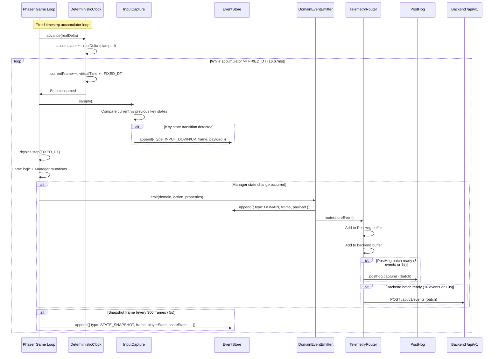
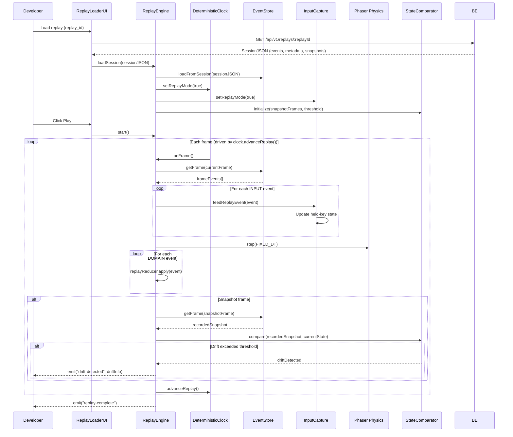
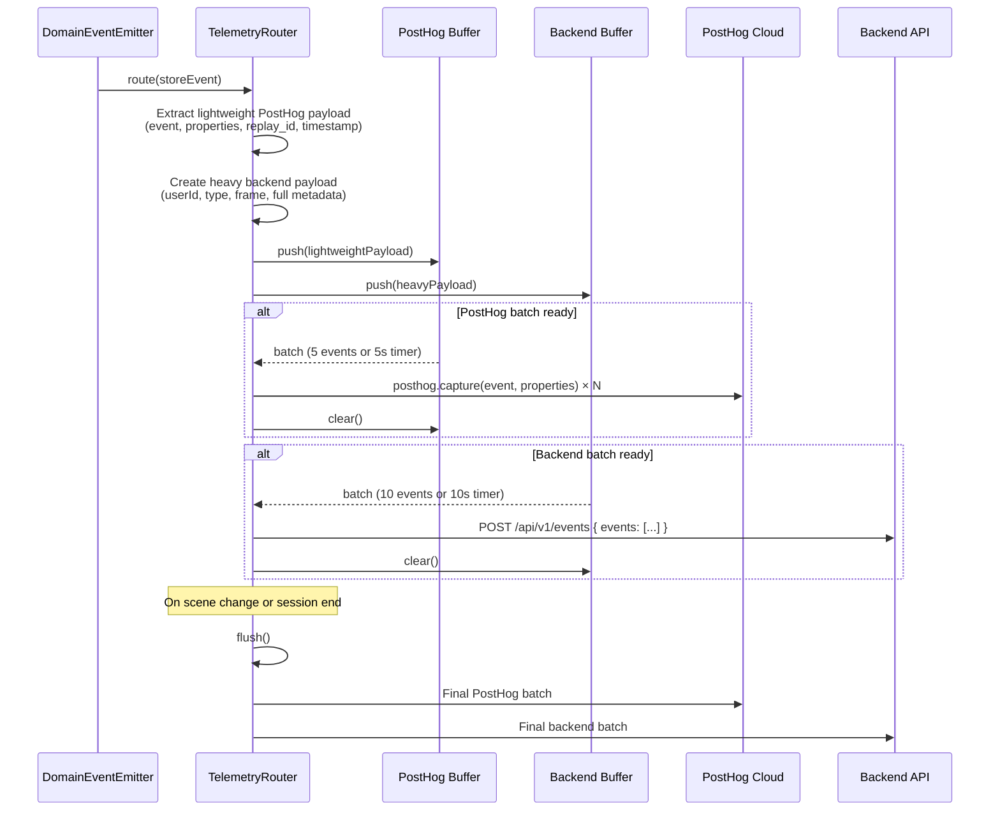
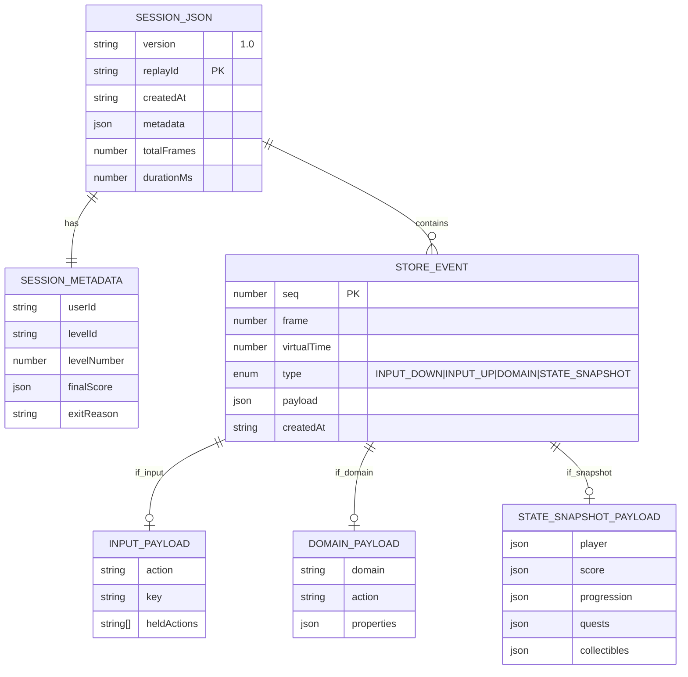
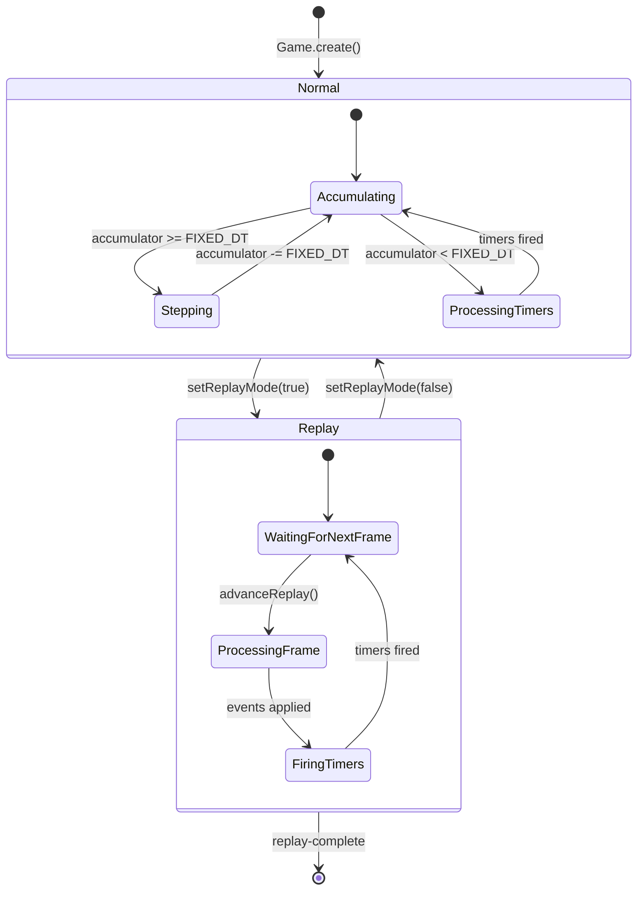
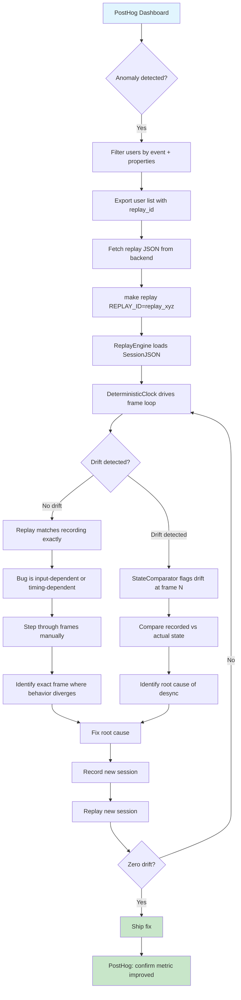

# Event Sourcing, Telemetry & Deterministic Replay — Architecture Specification

> **Status:** Approved (Phase 3 Spike Complete)
> **Date:** 2026-08-03
> **Scope:** Frontend (Phaser 3 + Next.js), Backend (NestJS + TypeORM)

---

## Table of Contents

1. [Executive Summary](#1-executive-summary)
2. [Architecture Overview](#2-architecture-overview)
3. [Diagrams](#3-diagrams)
   - 3.1 [Normal Mode Recording Flow (Sequence)](#31-normal-mode-recording-flow-sequence)
   - 3.2 [Replay Engine Flow (Sequence)](#32-replay-engine-flow-sequence)
   - 3.3 [Telemetry Router Dispatch (Sequence)](#33-telemetry-router-dispatch-sequence)
   - 3.4 [Event Store Data Model (ER)](#34-event-store-data-model-er)
   - 3.5 [DeterministicClock State Machine](#35-deterministicclock-state-machine)
   - 3.6 [Debugging Workflow (Flowchart)](#36-debugging-workflow-flowchart)
4. [Module Specifications](#4-module-specifications)
   - 4.1 [EventStore](#41-eventstore)
   - 4.2 [InputCapture](#42-inputcapture)
   - 4.3 [DomainEventEmitter](#43-domaineventemitter)
   - 4.4 [TelemetryRouter](#44-telemetryrouter)
   - 4.5 [DeterministicClock](#45-deterministicclock)
   - 4.6 [ReplayEngine](#46-replayengine)
   - 4.7 [ReplayLoaderUI / URLHandler](#47-replayloaderui--urlhandler)
5. [Event Mapping Table](#5-event-mapping-table)
6. [Phased Implementation Plan](#6-phased-implementation-plan)
7. [Implementation Order](#7-implementation-order)
8. [Verification](#8-verification)
9. [Architecture & Trade-offs](#9-architecture--trade-offs)
10. [Key Design Decisions](#10-key-design-decisions)

---

## 1. Executive Summary

### Objectives

Three interconnected pillars:

1. **Event Sourcing:** Record every game state change as an immutable, frame-tagged event. Replace mutable state managers with append-only event logs.

2. **Telemetry (PostHog at Scale):** Unify all analytics through a single `DomainEventEmitter → TelemetryRouter` pipeline. Route lightweight structured events to PostHog for mass aggregation across thousands of players, and route enriched events to the backend `/api/v1/events` for persistence. Remove all 25+ scattered `posthog.capture()` calls.

3. **Deterministic Replay:** Export the `EventStore` as a self-hosted JSON file (`/api/v1/replays`). Replay sessions frame-by-frame in a headless or visible Phaser instance, with drift detection against periodic state snapshots.

### Key Design Decisions

| Decision | Rationale |
|----------|-----------|
| Pixel-perfect replay fidelity | Accurate bug reproduction requires deterministic physics, seeded PRNG, and virtualized timers |
| Hybrid input sourcing | Record only input transitions + domain events + periodic snapshots (sparse, not every frame) |
| PostHog = lightweight aggregation only | PostHog receives ~200 byte events with `replay_id` metadata; heavy frame data stays on self-hosted backend |
| `replay_id` as the bridge | PostHog carries `replay_id` string; backend stores full session JSON keyed by same ID |
| All events derived from existing managers | No invented placeholder events — every PostHog event maps to a real state transition in existing managers |

### Scope — Internal Tooling Only

Replays are strictly an internal tool for Engineering, QA, and Product teams. They serve two purposes: **bug reproduction** (pixel-perfect frame-by-frame replay) and **gameplay analytics** (aggregated via PostHog with `replay_id` metadata).

- Replay recording and upload happen silently in the background on session end — no user interaction required
- The `/replay/[replayId]` route and Replay Engine UI are internal developer/QA tooling, accessed via `make replay` or direct URL
- No end-user facing replay export UI, modals, or controls are ever displayed inside the game canvas

---

## 2. Architecture Overview

### System Architecture

```
┌─────────────────────────────────────────────────────────────────────┐
│                        PHASER 3 GAME (Frontend)                      │
│                                                                      │
│  ┌──────────────┐    ┌──────────────┐    ┌───────────────────────┐  │
│  │ InputCapture │───▶│  EventStore  │◀───│  DomainEventEmitter   │  │
│  │              │    │  (ring buf)  │    │  (replaces 25+ calls) │  │
│  └──────────────┘    └──────┬───────┘    └───────────────────────┘  │
│                             │                                       │
│                             ▼                                       │
│                    ┌────────────────┐                               │
│                    │ TelemetryRouter│                               │
│                    └───────┬────────┘                               │
│              ┌─────────────┼─────────────┐                         │
│              ▼             ▼             ▼                          │
│         ┌────────┐  ┌──────────┐  ┌──────────────┐                │
│         │PostHog │  │Backend   │  │Replay Upload │                 │
│         │Buffer  │  │API Buffer│  │(silent, auto)│                 │
│         └────────┘  └──────────┘  └──────────────┘                │
│                                                                      │
│  ┌──────────────────────────────────────────────┐                   │
│  │         DeterministicClock (fixed step)       │                   │
│  │  • Fixed 16.67ms accumulator                  │                   │
│  │  • Virtualized time.delayedCall()             │                   │
│  │  • Seeded PRNG (replaces Math.random())       │                   │
│  └──────────────────────────────────────────────┘                   │
└─────────────────────────────────────────────────────────────────────┘
          │                          │
          ▼                          ▼
┌──────────────────┐    ┌──────────────────────────────────────┐
│ POSTHOG CLOUD    │    │         SELF-HOSTED BACKEND           │
│ (Mass Analytics) │    │                                      │
│ • Aggregated     │    │  POST /api/v1/events    (analytics)   │
│   funnels        │    │  POST /api/v1/replays   (replay JSON) │
│ • Drop-off       │    │  GET  /api/v1/replays/:id            │
│   graphs         │    │                                      │
│ • Error          │    │  AnalyticsService → PostgreSQL        │
│   aggregations   │    │  ReplayStore → PostgreSQL/S3          │
└──────────────────┘    └──────────────────────────────────────┘
```

### Data Flow — Normal Mode

```
1. Game frame arrives (real time)
2. DeterministicClock.advance(delta) → fixed step consumed
3. InputCapture.sample() → detects key transitions → EventStore.append()
4. Managers mutate state → DomainEventEmitter.emit() → EventStore.append()
5. DomainEventEmitter → TelemetryRouter.route()
6. TelemetryRouter → PostHog buffer (flush batch of 5 or every 5s)
7. TelemetryRouter → Backend /api/v1/events (flush batch of 10 or every 10s)
8. On session end (SHUTDOWN/beforeunload), TelemetryRouter.exportAndUploadReplay() exports EventStore → POSTs SessionJSON to /api/v1/replays
```

### Data Flow — Replay Mode

```
1. Developer loads session JSON from /api/v1/replays/:replayId
2. ReplayEngine.loadSession(sessionJSON) → initializes
3. DeterministicClock in replay mode (no real time)
4. ReplayEngine loop:
   a. Get events for current frame from EventStore
   b. Feed input events to InputCapture.feedReplayEvent()
   c. Step physics with fixed dt
   d. Apply domain events via StateReducer
   e. Compare state against STATE_SNAPSHOT (drift detection)
   f. clock.advanceReplay() → next frame
```

---

## 3. Diagrams

### 3.1 Normal Mode Recording Flow (Sequence)



### 3.2 Replay Engine Flow (Sequence)



### 3.3 Telemetry Router Dispatch (Sequence)



### 3.4 Event Store Data Model (ER)



### 3.5 DeterministicClock State Machine



### 3.6 Debugging Workflow (Flowchart)



---

## 4. Module Specifications

### 4.1 EventStore

**Purpose:** An append-only, frame-tagged ring buffer that records every game event during a session. Single source of truth for replay export and drift detection.

#### Public API Contract

```
class EventStore:

  constructor(config: { maxFrames: number, snapshotInterval: number })
    // maxFrames: ring buffer capacity (default 3600 = 1 min at 60fps)
    // snapshotInterval: frames between STATE_SNAPSHOT entries (default 300 = 5s)

  // Recording
  append(event: StoreEvent): void
    // Appends event to ring buffer, auto-assigns seq number
    // If buffer full, evicts oldest frame's events

  // Querying
  getFrameRange(fromFrame: number, toFrame: number): StoreEvent[]
    // Returns all events in frame range (for replay engine)

  getFrame(frame: number): StoreEvent[]
    // Returns all events for exact frame

  getLatestSnapshot(): StoreEvent | null
    // Returns most recent STATE_SNAPSHOT event

  // Export
  exportSession(metadata: SessionMetadata): SessionJSON
    // Exports full buffer as replay-ready JSON
    // Clears buffer after export

  // Lifecycle
  clear(): void
    // Resets buffer (called after export or on scene restart)

  getCurrentFrame(): number
    // Returns frame number of most recent appended event
```

#### Data Schema — StoreEvent

```
interface StoreEvent {
  seq: number              // Global monotonic sequence number
  frame: number            // Frame number from DeterministicClock
  virtualTime: number      // Milliseconds from DeterministicClock
  type: StoreEventType     // INPUT_DOWN | INPUT_UP | DOMAIN | STATE_SNAPSHOT
  payload: unknown         // Event-specific data
  createdAt: string        // ISO timestamp (for PostHog correlation)
}
```

#### Data Schema — Input Event Payloads

```
interface InputDownPayload {
  action: string           // e.g. "JUMP", "MOVE_LEFT", "INTERACT"
  key: string              // Raw key name, e.g. "SPACE", "A"
  heldActions: string[]    // All actions currently held after this press
}

interface InputUpPayload {
  action: string
  key: string
  heldActions: string[]    // All actions still held after release
}
```

#### Data Schema — Domain Event Payload

```
interface DomainEventPayload {
  domain: string           // "quest" | "score" | "progression" | "quiz" | "collectible" | "badge" | "gameplay"
  action: string           // Specific action within domain
  properties: Record<string, unknown>  // Domain-specific data
}
```

#### Data Schema — State Snapshot Payload

```
interface StateSnapshotPayload {
  player: {
    x: number
    y: number
    velocityX: number
    velocityY: number
    isOnGround: boolean
    isClimbing: boolean
    isGrabbing: boolean
    isCarrying: boolean
    currentAnim: string
  }
  score: {
    totalQuarters: number
    totalStars: number
    rating: string
    floorsCompleted: number
  }
  progression: {
    currentLevel: number
    totalStars: number
    completedLevelsCount: number
    cluesUnlockedCount: number
  }
  quests: Record<string, {
    status: string
    collectedCount: number
    requiredCount: number
  }>
  collectibles: {
    totalCollected: number
    totalAvailable: number
  }
}
```

#### Data Schema — Session Export JSON

```
interface SessionJSON {
  version: "1.0"
  replayId: string          // UUID, generated at export
  createdAt: string         // ISO timestamp
  metadata: SessionMetadata
  events: StoreEvent[]      // Full event sequence
  snapshotFrames: number[]  // Frame numbers where snapshots exist
}

interface SessionMetadata {
  userId: string
  levelId: string
  levelNumber: number
  totalFrames: number
  durationMs: number
  finalScore: {
    totalQuarters: number
    totalStars: number
    rating: string
  }
  exitReason: "level_completed" | "level_failed" | "browser_close" | "scene_shutdown"
}
```

#### Integration Touchpoints

| Existing File | How EventStore Connects |
|---------------|------------------------|
| `Game.ts` | `Game.create()` instantiates EventStore, passes to all systems. `Game.update()` calls `eventStore.append()` for state snapshots |
| `InputCapture` | `InputCapture.sample()` feeds `INPUT_DOWN`/`INPUT_UP` events to `eventStore.append()` |
| `DomainEventEmitter` | All domain events flow through `eventStore.append()` |
| `TelemetryRouter` | Reads `eventStore.exportSession()` for replay upload |
| Backend `/api/v1/replays` | `exportSession()` result POSTed to this endpoint |

---

### 4.2 InputCapture

**Purpose:** Wraps the existing `InputManager` to record input state transitions each frame. Fires callbacks for gameplay AND silently records transitions for the EventStore.

#### Public API Contract

```
class InputCapture:

  constructor(scene: Phaser.Scene, eventStore: EventStore)

  // Lifecycle
  init(): void
    // Captures all keys from DefaultKeymap
    // Registers scene SHUTDOWN cleanup

  sample(): void
    // Called once per fixed frame by DeterministicClock
    // Compares current key states to previous frame
    // Emits INPUT_DOWN / INPUT_UP events to EventStore for any transitions

  // Replay mode
  feedReplayEvent(event: StoreEvent): void
    // Called by ReplayEngine to inject synthetic input events
    // Updates internal held-key state without querying Phaser keyboard

  // State query (for gameplay callbacks)
  isActionDown(action: string): boolean
  isActionJustDown(action: string): boolean
  isActionJustUp(action: string): boolean

  // Cleanup
  destroy(): void
```

#### Internal State

```
private previousFrame: Map<string, boolean>   // action → isDown last frame
private currentFrame: Map<string, boolean>    // action → isDown this frame
private heldActions: Set<string>              // currently held actions
private actionCallbacks: Map<string, Set<() => void>>  // existing callback registry
```

#### Integration Touchpoints

| Existing File | How InputCapture Connects |
|---------------|--------------------------|
| `InputManager.ts` | `InputCapture` wraps `getKeys()` and `onKeyDown()`/`offKeyDown()`. Existing callback system stays intact — InputCapture adds recording layer on top |
| `Player.ts` | `Player.update()` reads `inputCapture.isActionDown()` instead of directly querying `this.keys.space.isDown`. This is the ONLY change in Player.ts |
| `Game.ts` | `Game.update()` calls `inputCapture.sample()` at start of each fixed step |
| `KeyBindings.ts` | `InputCapture` imports `DefaultKeymap` from here (no change to this file) |

#### Key Detail: Transition Detection

```
// Pseudocode for sample():
for each action in DefaultKeymap:
  currentIsDown = checkKeyState(action)
  previousIsDown = previousFrame.get(action)

  if currentIsDown AND NOT previousIsDown:
    eventStore.append({
      type: INPUT_DOWN,
      payload: { action, key: rawKeyName, heldActions: [...heldActions] }
    })

  if NOT currentIsDown AND previousIsDown:
    eventStore.append({
      type: INPUT_UP,
      payload: { action, key: rawKeyName, heldActions: [...heldActions] }
    })

  previousFrame.set(action, currentIsDown)
```

---

### 4.3 DomainEventEmitter

**Purpose:** Centralized emitter that replaces all 25+ scattered `posthog.capture()` calls and `AnalyticsSystem.track()` calls. Every meaningful state change flows through here.

#### Public API Contract

```
class DomainEventEmitter:

  constructor(eventStore: EventStore, clock: DeterministicClock)

  // Core emit method
  emit(domain: DomainName, action: string, properties: Record<string, unknown>): void
    // 1. Creates StoreEvent with DOMAIN type
    // 2. Appends to EventStore
    // 3. Forwards to TelemetryRouter for analytics dispatch

  // Typed convenience methods
  emitQuestEvent(action: QuestAction, props: QuestProperties): void
  emitScoreEvent(action: ScoreAction, props: ScoreProperties): void
  emitProgressionEvent(action: ProgressionAction, props: ProgressionProperties): void
  emitQuizEvent(action: QuizAction, props: QuizProperties): void
  emitCollectibleEvent(action: CollectibleAction, props: CollectibleProperties): void
  emitBadgeEvent(action: BadgeAction, props: BadgeProperties): void
  emitGameplayEvent(action: GameplayAction, props: GameplayProperties): void

  // Configuration
  setUserId(userId: string): void
  setLevelContext(levelId: string, levelNumber: number): void
```

#### Domain Event Type Mapping

| Current Call Site | Current Call | DomainEventEmitter Replacement |
|-------------------|-------------|-------------------------------|
| `QuestManager.collectInfo()` | `this.emit("info-collected", ...)` | `emitQuestEvent("info_collected", { missionId, infoKey, progressPct })` |
| `QuestManager.setStatus()` | `this.emit("status-changed", ...)` | `emitQuestEvent("status_changed", { missionId, oldStatus, newStatus })` |
| `ScoreManager.completeFloor()` | `this.emit(ScoringEvents.FLOOR_COMPLETED, ...)` | `emitScoreEvent("floor_completed", { floorIndex, errors, quartersEarned })` |
| `ScoreManager.recordQuizResult()` | `this.emit(ScoringEvents.QUIZ_COMPLETED, ...)` | `emitScoreEvent("quiz_result", { correct, total, accuracyPct })` |
| `ProgressionManager.recordLevelCompleted()` | `this.emit(ProgressionEvents.PROGRESSION_UPDATED, ...)` | `emitProgressionEvent("level_completed", { levelId, stars, score, totalStars })` |
| `ProgressionManager.recordClueUnlocked()` | direct state mutation | `emitProgressionEvent("clue_unlocked", { clueId, levelId })` |
| `CollectibleSystem` | `posthog.capture("star_collected", ...)` | `emitCollectibleEvent("item_collected", { collectibleId, type, totalCollected })` |
| `QuizManager.startQuiz()` | `posthog.capture("quiz_started", ...)` | `emitQuizEvent("started", { missionId, totalQuestions, attemptNumber })` |
| `QuizManager` (success) | `posthog.capture("level_completed", ...)` | `emitProgressionEvent("level_completed", ...)` |
| `QuizManager` (failure) | `posthog.capture("level_failed", ...)` | `emitProgressionEvent("level_failed", { missionId, score, totalQuestions })` |
| `QuizManager` (quiz done) | `posthog.capture("quiz_completed", ...)` | `emitQuizEvent("completed", { missionId, score, passed, accuracyPct })` |
| `QuizManager` (progress) | `posthog.capture("progress_updated", ...)` | `emitProgressionEvent("progress_updated", ...)` |
| `BadgeSystem` | `posthog.capture("badge_earned", ...)` | `emitBadgeEvent("earned", { badgeId, levelId })` |
| `InteractionComponent` | `posthog.capture("clue_used", ...)` | `emitGameplayEvent("clue_used", { clueId, levelId })` |
| `Game.ts` (start) | `posthog.capture("game_started", ...)` | `emitGameplayEvent("session_started", { levelId, levelNumber })` |
| `Game.ts` (minigame start) | `posthog.capture("minigame_started", ...)` | `emitGameplayEvent("minigame_started", { minigameNumber, levelId })` |
| `Game.ts` (minigame done) | `posthog.capture("minigame_completed", ...)` | `emitGameplayEvent("minigame_completed", { minigameNumber, errors, quartersEarned })` |
| `UIScene.ts` | `posthog.capture("settings_opened", ...)` | `emitGameplayEvent("settings_opened", {})` |
| `MapIntroScene.ts` (4 calls) | `posthog.capture("game_home_viewed", ...)` etc. | `emitGameplayEvent("home_viewed", ...)`, `emitGameplayEvent("pin_clicked", ...)`, etc. |
| `PhaserGame.tsx` | `posthog.capture("game_load_success", ...)` | KEEP as direct PostHog — React context, not Phaser game loop |
| `PlayLanding.tsx` (3 calls) | `posthog.capture("landing_page_viewed", ...)` | KEEP as direct PostHog — React context, not Phaser game loop |
| `LoginForm.tsx` / `RegisterForm.tsx` | `posthog.capture("button_clicked", ...)` | KEEP as direct PostHog — React context |
| `PostHogPageView.tsx` | `posthog.capture("$pageview", ...)` | KEEP — standard PostHog pageview |
| `app/error.tsx`, `global-error.tsx` | `posthog.captureException(error)` | KEEP — error boundary context |

#### Integration Touchpoints

| Existing File | Connection |
|---------------|------------|
| `Game.ts` | `this.domainEmitter = new DomainEventEmitter(eventStore, clock)`. Replaces `this.analyticsSystem`. Remove `AnalyticsSystem` instantiation |
| `QuestManager.ts` | Inject `DomainEventEmitter` via constructor. Replace `this.emit("info-collected", ...)` with `domainEmitter.emitQuestEvent(...)` |
| `ScoreManager.ts` | Inject `DomainEventEmitter` via constructor. Replace `this.emit(ScoringEvents.FLOOR_COMPLETED, ...)` with `domainEmitter.emitScoreEvent(...)` |
| `ProgressionManager.ts` | Inject `DomainEventEmitter` via constructor. Replace `this.emit(ProgressionEvents.PROGRESSION_UPDATED, ...)` with `domainEmitter.emitProgressionEvent(...)` |
| `QuizManager.ts` | Replace all `posthog.capture(...)` calls with `domainEmitter.emitQuizEvent(...)` / `emitProgressionEvent(...)` |
| `CollectibleSystem.ts` | Replace `posthog.capture("star_collected", ...)` with `domainEmitter.emitCollectibleEvent(...)` |
| `BadgeSystem.ts` | Replace `posthog.capture("badge_earned", ...)` with `domainEmitter.emitBadgeEvent(...)` |
| `AnalyticsSystem.ts` | **DELETE entirely** — absorbed into DomainEventEmitter + TelemetryRouter |

---

### 4.4 TelemetryRouter

**Purpose:** Buffered router that receives domain events and dispatches them to PostHog (lightweight) and backend API (heavy). Single import point for `posthog-js`.

#### Public API Contract

```
class TelemetryRouter:

  constructor(config: TelemetryRouterConfig)

  // Core routing
  route(event: StoreEvent): void
    // Called by DomainEventEmitter for every DOMAIN event
    // 1. Extracts lightweight PostHog payload
    // 2. Adds to PostHog buffer
    // 3. Adds to backend API buffer
    // 4. Flushes if batch size reached

  // Flush triggers
  flush(): void
    // Immediately flushes both buffers
    // Called on: scene change, session end, manual trigger

  // Session lifecycle
  setSessionContext(userId: string, replayId: string): void
    // Sets context for all subsequent events

  // Replay export (called on session end)
  async exportAndUploadReplay(exitReason: string): Promise<string | null>
    // 1. Builds SessionMetadata from level context + registry values
    // 2. Calls eventStore.exportSession(metadata) → SessionJSON
    // 3. POSTs SessionJSON to /api/v1/replays via apiClient
    // 4. Returns replayId on success, null on failure (guest 401, network error)
    // 5. Silently swallows errors (replay save is best-effort)

  // Cleanup
  destroy(): void
    // Flushes remaining, clears intervals
```

#### Configuration

```
interface TelemetryRouterConfig {
  posthogBatchSize: number        // Default: 5
  posthogFlushIntervalMs: number  // Default: 5000
  backendBatchSize: number        // Default: 10
  backendFlushIntervalMs: number  // Default: 10000
  backendApiUrl: string           // From env: "/api/v1/events"
  replayApiUrl: string            // From env: "/api/v1/replays"
  enabled: boolean                // Default: true (false in replay mode)
}
```

#### PostHog Payload Shape (Lightweight)

```
// What PostHog receives per event:
{
  "event": "quest.info_collected",        // domain.action format
  "properties": {
    "replay_id": "replay_abc123",         // Always present
    "level_id": "level_01",
    "level_number": 1,
    "mission_id": "mission_sculptures",
    "info_key": "pista_sculpture_1",
    "progress_pct": 0.5
    // ... only aggregation-relevant properties
  },
  "timestamp": "2026-08-03T14:30:00Z",
  "distinct_id": "user_xyz"
}
```

#### Backend API Payload Shape (Heavy)

```
// What POST /api/v1/events receives per event:
{
  "userId": "user_xyz",
  "type": "quest.info_collected",
  "replay_id": "replay_abc123",
  "timestamp": "2026-08-03T14:30:00Z",
  "metadata": {
    "mission_id": "mission_sculptures",
    "info_key": "pista_sculpture_1",
    "progress_pct": 0.5,
    "frame": 7200,
    "player_position": { "x": 1200, "y": 400 }
    // ... enriched metadata
  }
}
```

#### Batch Flush Mechanism

```
// Internal buffer state:
private posthogBuffer: Array<{ event, properties, timestamp, distinct_id }>
private backendBuffer: Array<GameEventPayload>

// On route():
posthogBuffer.push(lightweightPayload)
backendBuffer.push(heavyPayload)

if posthogBuffer.length >= posthogBatchSize:
  for each item in posthogBuffer:
    posthog.capture(item.event, { ...item.properties, timestamp: item.timestamp })
  posthogBuffer = []

if backendBuffer.length >= backendBatchSize:
  fetch(backendApiUrl, { method: "POST", body: JSON.stringify({ events: backendBuffer }) })
  backendBuffer = []

// Timer-based flush as fallback:
setInterval(() => flush(), max(posthogFlushIntervalMs, backendFlushIntervalMs))
```

#### Integration Touchpoints

| Existing File | Connection |
|---------------|------------|
| `lib/analyticsApi.ts` | `TelemetryRouter` replaces `sendGameEvent()`. This file becomes obsolete for game events (keep for non-game React analytics) |
| `lib/posthog/*` | `TelemetryRouter` is the ONLY file that imports `posthog-js` for game events. `PostHogProvider.tsx` stays for React-side PostHog init |
| `PostHogProvider.tsx` | No change — PostHog client init stays here. TelemetryRouter uses the initialized client |
| Backend `GameController` | `POST /api/v1/events` now receives batched events: `{ events: GameEventPayload[] }` instead of single event |
| Backend `GameService` | Needs minor update to handle batch array: `processEvent()` called in loop |
| Backend `/api/v1/replays` | **New endpoint** — receives `SessionJSON` from `TelemetryRouter.exportAndUploadReplay()` |
| `Game.ts` — SHUTDOWN/beforeunload | Calls `telemetryRouter.exportAndUploadReplay()` on session end |

---

### 4.5 DeterministicClock

**Purpose:** Replaces Phaser's variable `delta` with a fixed-step accumulator. Provides virtual time for replay mode and manages a queue for virtualized `time.delayedCall()`.

#### Public API Contract

```
class DeterministicClock:

  constructor(config: { fixedDt: number, maxAccumulator: number })

  // Properties (read-only)
  get currentFrame(): number       // Monotonic frame counter
  get virtualTime(): number        // Accumulated virtual time in ms
  get fixedDt(): number            // Fixed timestep (16.67ms = 1000/60)
  get isReplayMode(): boolean      // true when driven by ReplayEngine

  // Normal mode
  advance(realDelta: number): number
    // Adds realDelta to accumulator (clamped to maxAccumulator)
    // Returns number of fixed steps consumed
    // Advances currentFrame and virtualTime for each step
    // Fires any delayed callbacks whose time has arrived

  // Replay mode
  advanceReplay(): void
    // Advances exactly ONE fixed step
    // No real time involved
    // Fires delayed callbacks

  setReplayMode(enabled: boolean): void
    // Switches between normal and replay mode

  // Virtualized timers (replaces scene.time.delayedCall)
  delay(ms: number, callback: () => void): CancelToken
    // In normal mode: delegates to scene.time.delayedCall()
    // In replay mode: queues callback, fires when virtualTime reaches target
    // Returns cancel token for cleanup

  // Time query
  now(): number
    // Returns virtualTime (not Date.now())

  // Reset
  reset(): void
    // Resets frame counter, virtual time, and callback queue
```

#### Virtual Timer Queue (Internal)

```
// Priority queue sorted by fireTime
private timerQueue: Array<{
  fireTime: number      // virtualTime when callback should fire
  callback: () => void
  id: number            // unique ID for cancellation
}>

// On advance() or advanceReplay():
while (timerQueue.length > 0 AND timerQueue[0].fireTime <= virtualTime):
  const timer = timerQueue.shift()
  timer.callback()
```

#### Integration Touchpoints

| Existing File | Connection |
|---------------|------------|
| `Game.ts` — `update(_time, delta)` | Replace `delta` usage with `clock.advance(delta)`. Loop: `while (stepsRemaining--) { /* fixed step */ }` |
| `Player.ts` — `update(_ts, dt)` | Replace `dt` param with `clock.fixedDt`. Remove all `dt`-based calculations |
| `Game.ts` — camera lerp | Replace `1 - (1 - 0.2) ** (dtClamped / NOMINAL_DT)` with constant lerp factor |
| `time.delayedCall()` — 9 call sites | Replace `scene.time.delayedCall(ms, cb)` with `clock.delay(ms, cb)` in all 6 files |
| `time.addEvent()` — 3 call sites | Replace with `clock.delay()` in loop or custom virtual timer |
| `EffectsManager.ts` | `clock.delay()` instead of `scene.time.addEvent()` |
| `Enemy.ts` | `clock.delay()` instead of `scene.time.addEvent()` |
| `MapIntroScene.ts` | `clock.delay()` instead of `scene.time.addEvent()` |
| `InteractionComponent.ts` | `clock.delay()` instead of `scene.time.delayedCall()` |
| `Portal.ts` | `clock.delay()` instead of `scene.time.delayedCall()` |

---

### 4.6 ReplayEngine

**Purpose:** Reads a `SessionJSON` file and drives a Phaser instance frame-by-frame, reconstructing the exact game state from recorded events.

#### Public API Contract

```
class ReplayEngine:

  constructor(config: ReplayEngineConfig)

  // Lifecycle
  async loadSession(sessionJSON: SessionJSON): Promise<void>
    // Validates session format
    // Initializes DeterministicClock in replay mode
    // Initializes InputCapture in replay mode
    // Creates EventStore from session data
    // Sets up StateComparator with snapshot frames

  start(): void
    // Begins replay loop
    // Phaser game instance enters fixed-step loop driven by clock

  stop(): void
    // Pauses replay

  // Navigation
  seekToFrame(frame: number): void
    // Jumps to specific frame
    // Replays all events up to that frame from nearest snapshot

  seekToTime(ms: number): void
    // Jumps to virtual time

  // Inspection
  getCurrentState(): ReplayState
    // Returns current reconstructed state

  getProgress(): ReplayProgress
    // Returns { currentFrame, totalFrames, percentComplete }

  // Events
  on(event: "drift-detected", callback: (DriftInfo) => void): void
  on(event: "replay-complete", callback: () => void): void
  on(event: "frame-advanced", callback: (frame: number) => void): void
```

#### Configuration

```
interface ReplayEngineConfig {
  parentElement: HTMLElement       // DOM element for Phaser canvas
  width: number                    // Game width (1920)
  height: number                   // Game height (1080)
  showCanvas: boolean              // false = headless, true = visible
  driftThreshold: number           // Max allowed drift in pixels (default: 0.5)
  speed: number                    // Playback speed multiplier (0.5, 1, 2, 4)
}
```

#### Replay Loop (Internal)

```
// Driven by DeterministicClock.advanceReplay():
function onFrame():
  // 1. Get all events for current frame from EventStore
  const frameEvents = eventStore.getFrame(clock.currentFrame)

  // 2. Process input events (feed to InputCapture)
  for (const event of frameEvents.filter(e => e.type === INPUT)):
    inputCapture.feedReplayEvent(event)

  // 3. Step physics with fixed dt
  // Physics runs normally but deterministically

  // 4. Process domain events (apply state changes)
  for (const event of frameEvents.filter(e => e.type === DOMAIN)):
    replayReducer.apply(event)

  // 5. Check for snapshot frame
  if (clock.currentFrame in snapshotFrames):
    const recordedSnapshot = eventStore.getFrame(clock.currentFrame)
      .find(e => e.type === STATE_SNAPSHOT)
    const currentState = reconstructState()
    const drift = stateComparator.compare(recordedSnapshot, currentState)
    if (drift.exceeded):
      emit("drift-detected", drift)

  // 6. Advance clock
  clock.advanceReplay()
```

#### Integration Touchpoints

| Existing File | Connection |
|---------------|------------|
| `Game.ts` | ReplayEngine creates a minimal Game instance, bypassing `preload()` (assets pre-loaded or stubbed) |
| `Player.ts` | Player runs normally in replay mode — physics and animations work, just driven by virtual clock |
| All systems | All systems run normally — QuestManager, ScoreManager, etc. receive events and update state |
| Backend `/api/v1/replays` | `GET /api/v1/replays/:replayId` — fetches SessionJSON for replay |
| `ReplayLoaderUI` | UI component that triggers `loadSession()` and `start()` |

---

### 4.7 ReplayLoaderUI / URLHandler

**Purpose:** Internal developer/QA tool for replay playback. Provides controls for loading, playing, pausing, seeking, and inspecting replay sessions.

#### Public API Contract

```
class ReplayLoaderUI:

  constructor(container: HTMLElement)

  // UI Methods
  show(): void
    // Renders replay controls: play/pause, speed selector, frame scrubber

  hide(): void

  // State
  setEngine(engine: ReplayEngine): void
    // Connects UI to engine for control and progress updates

  // Note: No export dialog. Recording/upload is automatic and silent.
  // This UI is strictly internal tooling for replay playback.
```

#### URL Handler

```
class ReplayURLHandler {

  // URL format: /replay/:replayId?frame=:frameNumber&speed=:speed

  static parseReplayURL(url: string): ReplayURLParams | null
    // Extracts replayId, frame, speed from URL

  static buildReplayURL(replayId: string, frame?: number, speed?: number): string
    // Builds shareable URL

  static onReplayPage(): boolean
    // Returns true if current URL is a replay page
}
```

#### Integration Touchpoints

| Existing File | Connection |
|---------------|------------|
| `app/replay/[replayId]/page.tsx` | Next.js route — loads session JSON and mounts PhaserReplay |
| `PhaserReplay.tsx` | Dedicated component for replay mode (separate from `PhaserGame.tsx`) |
| Backend `/api/v1/replays` | `GET /api/v1/replays/:id` — fetches session JSON |

---

## 5. Event Mapping Table

### QuestManager → DomainEventEmitter

| State Transition | PostHog Event | Properties for Aggregation |
|------------------|---------------|---------------------------|
| `collectInfo()` emits `info-collected` | `quest.info_collected` | `mission_id`, `info_key`, `progress_pct`, `level_id` |
| `setStatus()` emits `status-changed` | `quest.status_changed` | `mission_id`, `old_status`, `new_status`, `level_id` |

### ScoreManager → DomainEventEmitter

| State Transition | PostHog Event | Properties for Aggregation |
|------------------|---------------|---------------------------|
| `completeFloor()` emits `FLOOR_COMPLETED` | `score.floor_completed` | `floor_index`, `errors`, `quarters_earned`, `level_id` |
| `recordFloorError()` emits `FLOOR_ERROR_RECORDED` | `score.floor_error` | `floor_index`, `error_count`, `level_id` |
| `recordQuizResult()` emits `QUIZ_COMPLETED` | `score.quiz_result` | `correct`, `total`, `accuracy_pct`, `level_id` |
| `recordIntermediateQuizResult()` emits `INTERMEDIATE_QUIZ_COMPLETED` | `score.intermediate_quiz_result` | `quiz_number`, `correct`, `total`, `level_id` |
| Any mutation emits `SCORE_UPDATED` | `score.updated` | `total_quarters`, `total_stars`, `rating`, `level_id` |

### ProgressionManager → DomainEventEmitter

| State Transition | PostHog Event | Properties for Aggregation |
|------------------|---------------|---------------------------|
| `recordLevelCompleted()` | `progression.level_completed` | `level_id`, `level_number`, `stars`, `total_stars`, `score` |
| `recordQuizResult()` | `progression.quiz_result` | `mission_id`, `passed`, `score`, `total_questions`, `accuracy_pct` |
| `recordIntermediateQuizResult()` | `progression.intermediate_quiz_result` | `info_key`, `passed`, `level_id` |
| `recordClueUnlocked()` | `progression.clue_unlocked` | `clue_id`, `level_id` |
| Any mutation emits `PROGRESSION_UPDATED` | `progression.updated` | `current_level`, `total_stars`, `completed_levels_count` |

### QuizManager → DomainEventEmitter

| State Transition | PostHog Event | Properties for Aggregation |
|------------------|---------------|---------------------------|
| `startQuiz()` confirmation accepted | `quiz.started` | `mission_id`, `total_questions`, `attempt_number`, `level_id` |
| Quiz callback (pass) | `quiz.completed` | `mission_id`, `score`, `total_questions`, `accuracy_pct`, `passed`, `time_spent_ms` |
| Quiz callback (fail) | `quiz.completed` (passed=false) | same as above |
| `startIntermediateQuiz()` | `quiz.intermediate_started` | `quiz_number`, `info_key`, `level_id` |
| Intermediate quiz callback | `quiz.intermediate_completed` | `quiz_number`, `score`, `total_questions`, `passed`, `level_id` |

### CollectibleSystem → DomainEventEmitter

| State Transition | PostHog Event | Properties for Aggregation |
|------------------|---------------|---------------------------|
| `handleCollectibleInteraction()` | `gameplay.item_collected` | `collectible_id`, `collectible_type`, `total_collected`, `total_available`, `level_id` |

### BadgeSystem → DomainEventEmitter

| State Transition | PostHog Event | Properties for Aggregation |
|------------------|---------------|---------------------------|
| `checkRequirements()` success | `badge.earned` | `badge_id`, `badge_name`, `level_id` |

### Game.ts Lifecycle → DomainEventEmitter

| State Transition | PostHog Event | Properties for Aggregation |
|------------------|---------------|---------------------------|
| `create()` — game starts | `gameplay.session_started` | `level_id`, `level_number` |
| `create()` — level started | `gameplay.level_started` | `level_id`, `level_number` |
| `SHUTDOWN` event | `gameplay.session_ended` | `reason`, `level_id`, `last_scene` |
| Minigame start (photo) | `gameplay.minigame_started` | `minigame_number` (3=photo), `level_id` |
| `completeFloor()` | `gameplay.minigame_completed` | `minigame_number`, `errors`, `quarters_earned`, `level_id` |

### InteractionComponent → DomainEventEmitter

| State Transition | PostHog Event | Properties for Aggregation |
|------------------|---------------|---------------------------|
| Clue/inspect interaction | `gameplay.clue_used` | `clue_id`, `level_id`, `object_type` |

### PersistenceBridge → DomainEventEmitter

| State Transition | PostHog Event | Properties for Aggregation |
|------------------|---------------|---------------------------|
| `submitScore()` | `session.score_saved` | `actor_type` (guest/auth), `level_id`, `total_quarters` |
| `saveProgress()` | `session.progress_saved` | `actor_type`, `level_id`, `current_level` |
| `saveCollectibles()` | `session.collectibles_saved` | `actor_type`, `level_id`, `collected_count` |

---

## 6. Phased Implementation Plan

### Phase 1: Backend — Replay Storage Entity & Migration

**Goal:** Enable backend to store and retrieve replay session JSON files.

**Files to create/modify:**
- `back/src/modules/replay/game-replay.entity.ts` — New entity
- `back/src/modules/replay/replay.module.ts` — New module
- `back/src/modules/replay/replay.service.ts` — New service
- `back/src/modules/replay/replay.controller.ts` — New controller
- `back/src/app.module.ts` — Register ReplayModule

**Entity schema:**
```typescript
@Entity("game_replays")
export class GameReplay {
  @PrimaryGeneratedColumn("uuid")
  id!: string;

  @Column({ type: "uuid" })
  playerId!: string;

  @Column({ type: "varchar", length: 255 })
  levelId!: string;

  @Column({ type: "int", default: 1 })
  levelNumber!: number;

  @Column({ type: "jsonb" })
  metadata!: Record<string, unknown>;

  @Column({ type: "jsonb" })
  events!: Record<string, unknown>[];

  @Column({ type: "jsonb", default: () => "'[]'" })
  snapshotFrames!: number[];

  @Column({ type: "varchar", length: 255, unique: true })
  replayId!: string;

  @Column({ type: "varchar", length: 50, default: "unknown" })
  exitReason!: string;

  @Column({ type: "int", default: 0 })
  totalFrames!: number;

  @Column({ type: "int", default: 0 })
  durationMs!: number;

  @CreateDateColumn()
  createdAt!: Date;

  @UpdateDateColumn()
  updatedAt!: Date;
}
```

> **Design note:** The original spec proposed a single `sessionData: SessionJSON` JSONB column. The implementation uses decomposed columns (`events`, `metadata`, `snapshotFrames`, etc.) for better queryability — enables filtering by `exitReason`, `replayId`, and `playerId` without parsing JSONB. The full `SessionJSON` is reconstructed at read time by the service layer.

**API endpoints:**
- `POST /api/v1/replays` — Store session (called by TelemetryRouter on session end)
- `GET /api/v1/replays/:id` — Retrieve session by replayId (called by replay page)
- `GET /api/v1/replays` — List replays for authenticated player (optional, for QA dashboards)

---

### Phase 2: Backend — Batch Events Endpoint

**Goal:** Update existing `/api/v1/events` to accept batched event arrays.

**Files to modify:**
- `back/src/modules/game/game.controller.ts` — Add batch endpoint
- `back/src/modules/game/game.service.ts` — Handle batch processing

**Changes:**
- Add `POST /api/v1/events/batch` accepting `{ events: GameEventPayload[] }`
- Keep existing single-event endpoint for backward compatibility
- Batch endpoint processes events in a transaction

---

### Phase 3: Frontend — DeterministicClock

**Goal:** Replace variable delta with fixed timestep accumulator.

**Files to create:**
- `front/src/game/systems/DeterministicClock.ts` — New file

**Files to modify:**
- `front/src/game/scenes/Game.ts` — Update `update()` method
- `front/src/game/objects/Player.ts` — Update `update()` method
- `front/src/game/objects/PlayerConfig.ts` — Add `FIXED_DT` constant

**Key changes:**
- `Game.update(_time, delta)` → `clock.advance(delta)` with fixed-step loop
- `Player.update(_ts, dt)` → use `clock.fixedDt` instead of `dt`
- Camera lerp: replace `1 - (1 - 0.2) ** (dtClamped / NOMINAL_DT)` with constant

**Dependencies:** None (can be developed in isolation)

---

### Phase 4: Frontend — Seeded PRNG & Virtual Timers

**Goal:** Replace `Math.random()` with deterministic seeded PRNG and virtualize `time.delayedCall()`.

**Files to create:**
- `front/src/game/utils/SeededRandom.ts` — New utility

**Files to modify:**
- `front/src/game/audio/AudioManager.ts` — Replace `Math.random()` (line 263)
- `front/src/game/objects/EffectsManager.ts` — Replace `Math.random()` (line 109)
- `front/src/game/systems/CollectibleSystem.ts` — Replace `scene.time.delayedCall()` (line 317)
- `front/src/game/mechanics/handlers/PosterMechanicHandler.ts` — Replace `time.delayedCall()` (line 61)
- `front/src/game/mechanics/handlers/PaintingMechanicHandler.ts` — Replace `time.delayedCall()` (line 64)
- `front/src/game/mechanics/handlers/PhotoMechanicHandler.ts` — Replace `time.delayedCall()` (line 128)
- `front/src/game/mechanics/handlers/SculptureMechanicHandler.ts` — Replace `time.delayedCall()` (line 61)
- `front/src/game/objects/EffectsManager.ts` — Replace `scene.time.addEvent()` (line 102)
- `front/src/game/objects/Enemy.ts` — Replace `scene.time.addEvent()` (line 62)
- `front/src/game/objects/InteractionComponent.ts` — Replace `scene.time.delayedCall()` (line 216)
- `front/src/game/objects/Portal.ts` — Replace `scene.time.delayedCall()` (line 103)
- `front/src/game/scenes/MapIntroScene.ts` — Replace `scene.time.addEvent()` (line 208)

**Dependencies:** Phase 3 (DeterministicClock)

---

### Phase 5: Frontend — EventStore

**Goal:** Implement the append-only ring buffer for recording all game events.

**Files to create:**
- `front/src/game/systems/EventStore.ts` — New file

**Key methods:**
- `append(event: StoreEvent)` — Add event to ring buffer
- `getFrame(frame: number)` — Query events for specific frame
- `exportSession(metadata: SessionMetadata)` — Export as SessionJSON

**Dependencies:** None (standalone module)

---

### Phase 6: Frontend — InputCapture

**Goal:** Wrap InputManager to record input state transitions per frame.

**Files to create:**
- `front/src/game/systems/InputCapture.ts` — New file

**Files to modify:**
- `front/src/game/scenes/Game.ts` — Instantiate InputCapture, call `sample()` each frame
- `front/src/game/objects/Player.ts` — Use `inputCapture.isActionDown()` instead of direct key queries

**Dependencies:** Phase 3 (DeterministicClock), Phase 5 (EventStore)

---

### Phase 7: Frontend — DomainEventEmitter

**Goal:** Create centralized emitter replacing all scattered `posthog.capture()` calls.

**Files to create:**
- `front/src/game/systems/DomainEventEmitter.ts` — New file

**Files to modify:**
- `front/src/game/scenes/Game.ts` — Instantiate DomainEventEmitter, replace `analyticsSystem`
- `front/src/game/objects/QuestManager.ts` — Inject emitter, replace `this.emit("info-collected", ...)`
- `front/src/game/objects/ScoreManager.ts` — Inject emitter, replace `this.emit(ScoringEvents.FLOOR_COMPLETED, ...)`
- `front/src/game/objects/ProgressionManager.ts` — Inject emitter, replace `this.emit(ProgressionEvents.PROGRESSION_UPDATED, ...)`
- `front/src/game/systems/QuizManager.ts` — Replace all `posthog.capture(...)` calls
- `front/src/game/systems/CollectibleSystem.ts` — Replace `posthog.capture("star_collected", ...)`
- `front/src/game/systems/BadgeSystem.ts` — Replace `posthog.capture("badge_earned", ...)`
- `front/src/game/objects/InteractionComponent.ts` — Replace `posthog.capture("clue_used", ...)`
- `front/src/game/scenes/MapIntroScene.ts` — Replace 4 `posthog.capture(...)` calls
- `front/src/game/scenes/UIScene.ts` — Replace `posthog.capture("settings_opened", ...)`

**Dependencies:** Phase 5 (EventStore)

---

### Phase 8: Frontend — TelemetryRouter

**Goal:** Buffered router dispatching events to PostHog and backend API.

**Files to create:**
- `front/src/game/systems/TelemetryRouter.ts` — New file

**Dependencies:** Phase 7 (DomainEventEmitter)

---

### Phase 9: Frontend — Remove Scattered Calls

**Goal:** Clean up all direct `posthog-js` imports from game files.

**Files to delete:**
- `front/src/game/systems/AnalyticsSystem.ts` — Absorbed into DomainEventEmitter + TelemetryRouter

**Files to modify:**
- Remove `import posthog from "posthog-js"` from 12+ files
- Update `front/src/lib/analyticsApi.ts` — Keep for non-game React analytics only

**Dependencies:** Phase 7, Phase 8

---

### Phase 10: Frontend — ReplayEngine

**Goal:** Offline replay from SessionJSON with drift detection.

**Files to create:**
- `front/src/game/replay/ReplayEngine.ts` — New file
- `front/src/game/replay/StateComparator.ts` — New file
- `front/src/game/replay/ReplayReducer.ts` — New file

**Dependencies:** Phase 3-9 (all foundation modules)

---

### Phase 11: Frontend — ReplayLoaderUI & URL Handler

**Goal:** UI for loading replays and URL-based deep linking.

**Files to create:**
- `front/src/game/replay/ReplayLoaderUI.ts` — New component
- `front/src/game/replay/ReplayURLHandler.ts` — URL parsing
- `front/src/app/replay/[replayId]/page.tsx` — Next.js route

**Files to modify:**
- `front/src/components/PhaserGame.tsx` — Conditional ReplayEngine vs normal Game
- `Makefile` — Add `replay` target

**Dependencies:** Phase 10 (ReplayEngine)

---

## 7. Implementation Order

| Step | Phase | Description | Dependencies |
|------|-------|-------------|--------------|
| 1 | P5 | EventStore — standalone ring buffer | None |
| 2 | P3 | DeterministicClock — fixed timestep | None |
| 3 | P4 | SeededRandom + virtual timers | P3 |
| 4 | P1 | Backend replay storage entity + migration | None |
| 5 | P2 | Backend batch events endpoint | None |
| 6 | P6 | InputCapture — wraps InputManager | P3, P5 |
| 7 | P7 | DomainEventEmitter — replaces scattered calls | P5 |
| 8 | P8 | TelemetryRouter — PostHog + backend dispatch | P7 |
| 9 | P9 | Remove AnalyticsSystem + posthog imports | P7, P8 |
| 10 | P10 | ReplayEngine — offline replay | P3-P9 |
| 11 | P11 | ReplayLoaderUI + URL handler + Makefile | P10 |

**Parallel opportunities:**
- P1 and P2 (backend) can run in parallel with P3-P9 (frontend)
- P5 (EventStore) and P3 (DeterministicClock) can run in parallel
- P10 and P11 are sequential (UI depends on engine)

---

## 8. Verification

1. **Unit tests:** All new modules (`DeterministicClock`, `EventStore`, `InputCapture`, `DomainEventEmitter`, `TelemetryRouter`, `ReplayEngine`) have unit tests
2. **Lint:** `make lint` passes
3. **Typecheck:** `make typecheck` passes
4. **Manual recording test:** Play a full level, verify `EventStore.exportSession()` produces valid SessionJSON
5. **Manual replay test:** Export session → load in ReplayEngine → verify visual match
6. **Drift detection test:** Inject intentional desync → verify StateComparator flags it
7. **PostHog verification:** Play game → verify events appear in PostHog Live Events with `replay_id` property
8. **Backend verification:** Verify `POST /api/v1/replays` stores JSON, `GET /api/v1/replays/:id` retrieves it
9. **Batch events verification:** Verify `POST /api/v1/events/batch` processes multiple events correctly
10. **Timer virtualization test:** Record session with delayed calls → replay → verify callbacks fire at correct virtual times
11. **PRNG determinism test:** Record same sequence twice → verify identical event sequences
12. **Cleanup verification:** Confirm `posthog-js` imported in exactly 1 game file (`TelemetryRouter.ts`)

---

## 9. Architecture & Trade-offs

### 1. Fixed Timestep vs. Variable Delta

**Context:** Phaser provides variable `delta` (ms since last frame) to `update()`. Physics and game logic currently use this directly.

**Decision:** Adopt fixed timestep accumulator (16.67ms = 60fps).

**Why:**
- Deterministic replay requires consistent physics steps
- Variable delta causes non-deterministic collision detection and movement
- Fixed timestep is standard practice for deterministic games

**Trade-offs:**

| Pros | Cons |
|------|------|
| Deterministic physics | Slower-than-60fps devices skip frames |
| Easier replay synchronization | Faster-than-60fps devices waste cycles |
| Standard pattern (Gaffer on Games) | Requires accumulator logic |
| Simplifies debugging | Camera lerp must use constant factor |

**Mitigations for cons:**
- Clamp accumulator to prevent spiral of death (max 3 skipped frames)
- Camera lerp uses constant factor instead of dt-based exponential

---

### 2. Ring Buffer vs. Unbounded Array

**Context:** EventStore must store frame-by-frame events for potential replay export.

**Decision:** Fixed-size ring buffer (default 3600 frames = 1 minute at 60fps).

**Why:**
- Bounded memory usage regardless of session length
- Prevents memory leaks on long sessions
- 1 minute is sufficient for bug reproduction

**Trade-offs:**

| Pros | Cons |
|------|------|
| Constant memory | Old events evicted |
| No garbage collection pressure | Cannot replay sessions > 1 minute |
| Predictable performance | Need to export before eviction |

**Mitigations for cons:**
- Export on scene shutdown (captures full session)
- Configurable buffer size for debugging (7200 = 2 minutes)
- For long sessions, export periodically and clear

---

### 3. Frame-Level Recording vs. Meaningful Events Only

**Context:** Two approaches to recording: capture every frame's full state, or capture only "meaningful" events.

**Decision:** Hybrid — record input transitions + domain events + periodic snapshots.

**Why:**
- Pure frame-level: too much data (50+ KB/s)
- Meaningful-only: may miss input timing, hard to replay
- Hybrid: sparse input transitions + domain events + snapshots every 5s

**Trade-offs:**

| Pros | Cons |
|------|------|
| Small JSON size (~100 KB/min) | Not pixel-perfect for every frame |
| Captures all meaningful state changes | Snapshots add overhead every 5s |
| Input transitions preserve timing | Must reconstruct held-key state |
| Snapshots enable drift detection | Snapshot comparison adds complexity |

**Mitigations for cons:**
- Input transitions are sparse (only on press/release)
- Snapshots are lightweight (player position + score + quests)
- Drift detection flags any reconstruction errors

---

### 4. Pixel-Perfect Replay vs. Approximate Replay

**Context:** Two fidelity levels for replay: exact state reconstruction or re-simulating inputs.

**Decision:** Pixel-perfect (exact state reconstruction from events).

**Why:**
- Bug reproduction requires exact state matching
- Approximate replay may not trigger the same bug
- Drift detection confirms fidelity

**Trade-offs:**

| Pros | Cons |
|------|------|
| Exact bug reproduction | More complex implementation |
| Drift detection catches errors | Requires deterministic everything |
| Trustworthy debugging | Seeded PRNG, virtual timers, fixed step |
| No ambiguity in replayed state | Cannot replay non-deterministic code |

**Mitigations for cons:**
- Stub async operations during replay
- Virtualize all timers
- Seeded PRNG for all random calls

---

### 5. PostHog Batch API vs. Individual capture()

**Context:** PostHog receives events from TelemetryRouter. Two options: call `posthog.capture()` per event, or batch.

**Decision:** Batch (5 events or 5s timer).

**Why:**
- Reduces network requests (5x fewer)
- Better PostHog performance under load
- PostHog SDK has built-in batching support

**Trade-offs:**

| Pros | Cons |
|------|------|
| Fewer HTTP requests | Slight delay before events visible |
| Better throughput | Buffer management complexity |
| Lower latency per batch | Need flush on scene change |

**Mitigations for cons:**
- Flush immediately on session end
- Flush on scene change
- PostHog SDK handles deduplication

---

### 6. Self-Hosted Replay JSON vs. PostHog Session Recording

**Context:** Two options for session replay: PostHog's built-in canvas recording, or self-hosted JSON replay.

**Decision:** Self-hosted JSON replay. PostHog carries only `replay_id` metadata.

**Why:**
- PostHog session recording is video-based, not state-based
- Cannot step through frames or inspect state
- Self-hosted enables deterministic replay with drift detection
- PostHog used for mass analytics, not individual replays

**Trade-offs:**

| Pros | Cons |
|------|------|
| Deterministic replay | Requires custom replay engine |
| Frame-by-frame inspection | More infrastructure to maintain |
| Drift detection | Cannot use PostHog's replay UI |
| Full state access | Larger storage requirements |

**Mitigations for cons:**
- PostHog remains for aggregate analytics
- Replay JSON is compressed
- Backend storage uses PostgreSQL JSONB (efficient)

---

### 7. Virtualized Timers vs. Real Timers in Replay

**Context:** 9 `time.delayedCall()` sites fire callbacks after real-time delays. In replay, time is virtual.

**Decision:** Virtualize all timers through `DeterministicClock.delay()`.

**Why:**
- Real timers fire at wall-clock time, not virtual time
- Replay must advance time manually, not in real-time
- Virtual timers fire at correct virtual time during replay

**Trade-offs:**

| Pros | Cons |
|------|------|
| Correct timer behavior in replay | Must wrap all 9 call sites |
| Consistent time source | Additional abstraction layer |
| Supports speed multiplier | Debugging virtual queue is harder |

**Mitigations for cons:**
- Normal mode: delegates to `scene.time.delayedCall()` (no behavior change)
- Replay mode: queues callbacks, fires when virtual time reaches target
- Cancel tokens for cleanup

---

### 8. State Snapshots Every N Frames vs. Every Frame

**Context:** Two approaches for snapshot frequency: capture full state every frame, or periodically.

**Decision:** Every 300 frames (5 seconds at 60fps).

**Why:**
- Every frame: too much data (50+ KB/s)
- Every 5s: sufficient for drift detection, small overhead
- Snapshots serve as sync points for replay validation

**Trade-offs:**

| Pros | Cons |
|------|------|
| Small overhead (1 snapshot/5s) | May miss drift between snapshots |
| Sufficient for drift detection | Cannot pinpoint exact drift frame |
| Predictable storage | Need to interpolate between snapshots |

**Mitigations for cons:**
- If drift detected, narrow down by binary-searching between snapshots
- Domain events provide fine-grained state changes between snapshots
- Snapshot includes all critical state (player, score, quests, collectibles)

---

### 9. Seeded PRNG vs. Recording Random Values

**Context:** `Math.random()` calls in AudioManager and EffectsManager cause non-determinism.

**Decision:** Replace with seeded PRNG.

**Why:**
- Recording random values requires extra storage per frame
- Seeded PRNG produces identical sequence given same seed
- Standard practice for deterministic games

**Trade-offs:**

| Pros | Cons |
|------|------|
| Deterministic without storage | Must replace all `Math.random()` calls |
| No extra data in event stream | Audio variation becomes predictable |
| Standard pattern | Seed must be consistent for replay |

**Mitigations for cons:**
- Seed derived from level ID + session start time
- Audio variation is cosmetic (not gameplay-affecting)
- Camera shake offset is visual only

---

### 10. Single TelemetryRouter vs. Separate Pipelines

**Context:** Two analytics paths exist: PostHog direct and backend API. Could keep them separate or unify.

**Decision:** Single TelemetryRouter dispatching to both.

**Why:**
- Single import point for `posthog-js` (1 file instead of 12+)
- Consistent event formatting
- Easier to add new destinations (e.g., Sentry, Mixpanel)

**Trade-offs:**

| Pros | Cons |
|------|------|
| Single import for posthog-js | Router is a potential bottleneck |
| Consistent event format | Must handle both PostHog and backend payloads |
| Easy to add destinations | More complex than direct calls |
| Centralized error handling | Single point of failure |

**Mitigations for cons:**
- Buffer with fallback (if flush fails, events are logged)
- Independent flush timers for PostHog and backend
- Router is stateless (events passed in, not stored)

---

## 10. Key Design Decisions

| # | Decision | Rationale |
|---|----------|-----------|
| 1 | Fixed timestep (16.67ms) | Deterministic physics for replay |
| 2 | Seeded PRNG | Replace `Math.random()` with deterministic sequence |
| 3 | Virtualized timers | `time.delayedCall()` must work in replay mode |
| 4 | Ring buffer (3600 frames) | Bounded memory, 1-minute recording |
| 5 | Hybrid input recording | Input transitions + domain events + snapshots |
| 6 | Pixel-perfect replay | Exact state reconstruction for bug reproduction |
| 7 | `replay_id` bridge | PostHog carries metadata, backend stores full JSON |
| 8 | Single TelemetryRouter | One import point for `posthog-js` AND one outbound pipeline for replay export. Game.ts calls `TelemetryRouter.exportAndUploadReplay()` — no direct EventStore → API calls from Game.ts |
| 9 | Batch flush (5/10 events) | Reduce network requests, better throughput |
| 10 | Self-hosted replay JSON | Deterministic replay, not PostHog video recording |
| 11 | Internal tooling only | Replays are for Engineering/QA/Product debugging, not player-facing features. No export UI in game canvas. Recording is silent and automatic |

---

> **Implementation:** See [Section 6: Phased Implementation Plan](#6-phased-implementation-plan) and [Section 7: Implementation Order](#7-implementation-order) above for detailed task breakdown.
